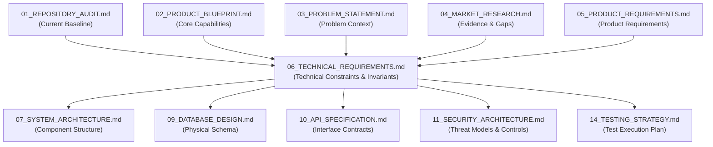
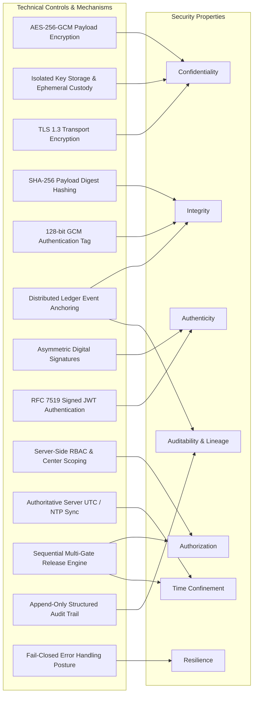
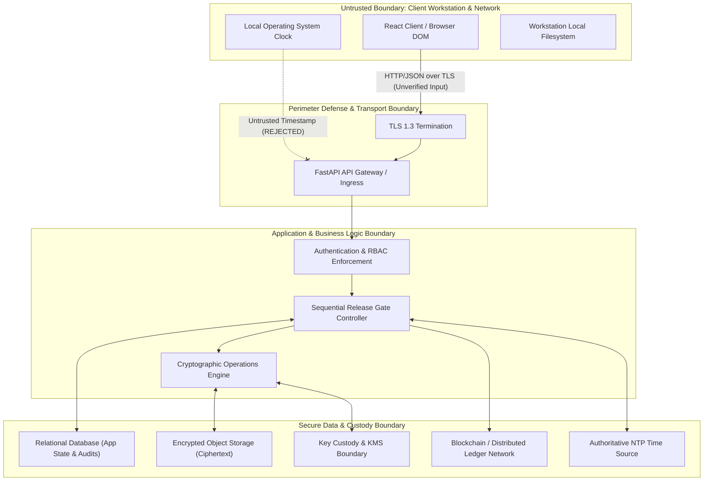
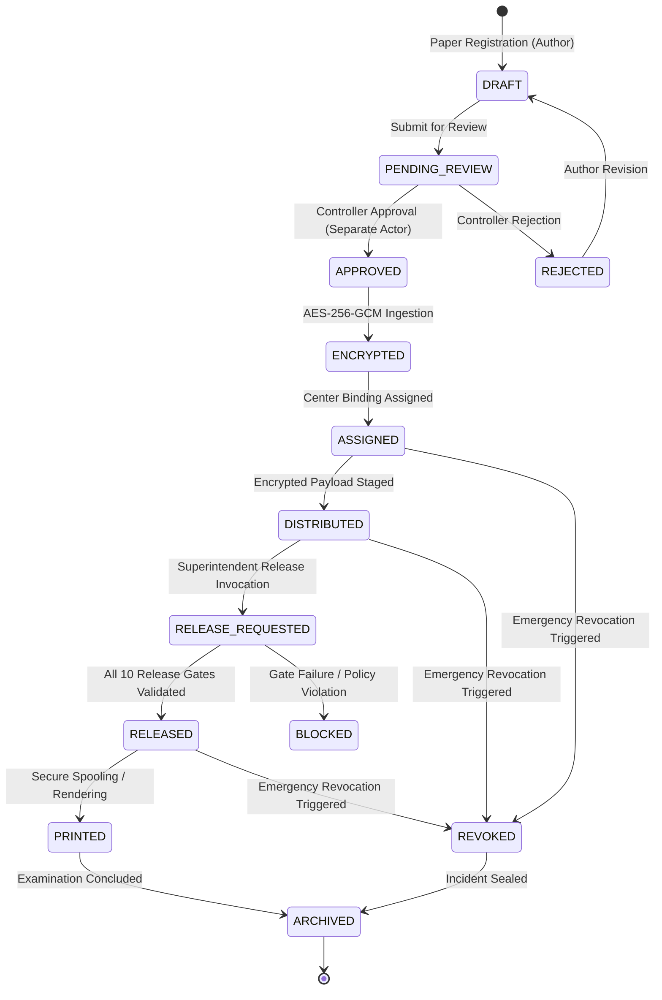

# VeriQ — Technical Requirements Specification
**Document ID:** `VERIQ-REQ-006`  
**Version:** `1.0.1`  
**Status:** `DRAFT / PENDING REVIEW`  
**Upstream Sources of Truth:** `01_REPOSITORY_AUDIT.md`, `02_PRODUCT_BLUEPRINT.md`, `03_PROBLEM_STATEMENT.md`, `04_MARKET_RESEARCH.md`, `05_PRODUCT_REQUIREMENTS.md`  
**Downstream Dependents:** `07_SYSTEM_ARCHITECTURE.md`, `09_DATABASE_DESIGN.md`, `10_API_SPECIFICATION.md`, `11_SECURITY_ARCHITECTURE.md`, `14_TESTING_STRATEGY.md`

---

## 1. Document Metadata & Control

| Attribute | Value |
| :--- | :--- |
| **Product Name** | VeriQ — Secure Examination Paper Distribution Using Blockchain |
| **Tagline** | Secure Every Question Paper. Verify Every Action. |
| **Problem Reference** | WB-03 — Secure Examination Paper Distribution Using Blockchain |
| **Document Classification** | Engineering Technical Specification / System Invariants |
| **Document Owner** | Principal Technical Architect & Security Engineering Working Group |
| **Target Audience** | Backend Engineers, Security Architects, Cryptographic Engineers, Smart Contract Engineers, QA/Verification Engineers |
| **Document Purpose** | Translate approved Product Requirements (`05`) into precise, implementation-oriented technical constraints, protocols, invariants, and verification criteria. |

---

## 2. Executive Technical Summary

VeriQ addresses the systemic failure modes of examination question paper distribution documented in `03_PROBLEM_STATEMENT.md` and `04_MARKET_RESEARCH.md`. This Technical Requirements Specification formalizes the precise technical conditions, cryptographic protocols, data integrity controls, time-enforcement invariants, and ledger anchoring mechanisms necessary to satisfy `05_PRODUCT_REQUIREMENTS.md`.

This specification enforces strict cryptographic and operational separation of responsibilities:
1. **Confidentiality:** Provided through authenticated symmetric encryption (AES-256-GCM) with distinct per-payload initialization vectors and isolated key custody, subject to the security assumptions and correct operation of those mechanisms. Plaintext examination content SHALL NEVER exist on the blockchain ledger or in persistent unprotected backend storage.
2. **Integrity Identity:** Derived deterministically via SHA-256 cryptographic digests computed prior to approval and verified independently before key release or document rendering.
3. **Authenticity & Non-Repudiation:** Provided via asymmetric signatures and authenticated role-bound access tokens; symmetric HMAC is restricted strictly to internal, shared-secret transport authentication.
4. **Time Authority:** Enforced strictly via server-side, synchronized authoritative UTC clocks; client-provided timestamps and override flags are unconditionally rejected.
5. **Ledger Integrity, Tamper Evidence & Lineage:** Provided via append-only ledger transaction anchoring of state transition events and cryptographic hashes, establishing independent auditability without exposing confidential payload data.
6. **Fail-Closed Security Posture:** Any failure in authentication, authorization, time validation, device binding, or payload integrity evaluation results in immediate, deterministic access rejection and security incident generation.

---

## 3. Purpose

The purpose of this document is to define the exact technical requirements, constraints, interface rules, cryptographic specifications, reliability criteria, and verification procedures that govern the implementation of VeriQ. It establishes the authoritative technical bridge between product intent (`05_PRODUCT_REQUIREMENTS.md`) and structural design (`07_SYSTEM_ARCHITECTURE.md`), answering:

> *"What technical conditions MUST be true for the VeriQ implementation to be considered correct, secure, reliable, auditable, and production-ready?"*

---

## 4. Scope

### 4.1 In Scope
- Technical invariants and constraints governing backend services, API interfaces, authentication, RBAC, session lifecycles, and error handling.
- Cryptographic specifications for document encryption (AES-256-GCM), key management, envelope handling, and payload integrity hashing (SHA-256).
- Authoritative server-side time verification protocols and client time rejection rules.
- Gated release sequence specifications across center, device, temporal, and cryptographic validation stages.
- Distributed ledger and smart contract integration constraints (zero-plaintext storage, event schemas, confirmation semantics).
- Device and endpoint identification boundaries, browser security constraints, and spoofing mitigation requirements.
- Relational database consistency, transaction isolation, state transition invariants, and immutable audit logging.
- Observability, telemetry redaction, fail-closed operational degradation, and automated verification suites.

### 4.2 Out of Scope
- Concrete component class structures, code-level design patterns, and internal directory layouts (governed by `07_SYSTEM_ARCHITECTURE.md`).
- Detailed database DDL table schemas, column data types, foreign key naming, and indexing configurations (governed by `09_DATABASE_DESIGN.md`).
- Specific REST/gRPC endpoint-by-endpoint route schemas, JSON payload models, and HTTP headers (governed by `10_API_SPECIFICATION.md`).
- UI/UX wireframes, screen mockups, component hierarchies, and CSS design tokens (governed by `12_UI_UX_DESIGN.md`).
- Production cloud infrastructure topology, Kubernetes manifests, and IaC scripts (governed by `13_DEPLOYMENT.md`).
- Application source code modification or implementation bug fixes.

---

## 5. Relationship to Upstream & Downstream Documents

---

## 6. Technical Requirement Methodology & Taxonomy

Every technical requirement defined herein adheres to the RFC 2119 standard (`SHALL`, `SHALL NOT`, `SHOULD`, `SHOULD NOT`, `MAY`) and is structured with strict metadata:
- **Requirement ID:** Unique alphanumeric identifier with functional category prefix.
- **Priority:** `MUST` (P0/Mandatory), `SHOULD` (P1/Strongly Recommended), `MAY` (P2/Optional).
- **Lifecycle:** `MVP` (Required for minimal viable secure baseline), `Target` (Production enterprise release), `Future` (Post-release enhancement).
- **Current Baseline:** `[CURRENT]` (Fully operational in prototype), `[PARTIAL]` (Incomplete implementation), `[MOCKED]` / `[SIMULATED]` (Simulated in-memory/in-process), `[TARGET]` (Not implemented; required target state), `[UNVERIFIED]` (Exists but lacks automated validation).
- **Verification Method:** `Unit Test`, `Integration Test`, `Security Test`, `E2E Test`, `Static Analysis`, `Contract Test`, `Cryptographic Test Vector`, `Failure Injection Test`, `Configuration Audit`.

---

## 7. Cryptographic & Security Property Separation

A core failure mode in security engineering is conflating distinct cryptographic primitives. VeriQ enforces strict functional separation across its architectural stack:

| Mechanism / Technology | Primary Security Property Provided | Explicitly DOES NOT Provide |
| :--- | :--- | :--- |
| **AES-256-GCM** | Payload Confidentiality & Authenticated Integrity | Key Custody, Actor Identity, Public Verifiability |
| **SHA-256** | Deterministic Integrity Fingerprint | Confidentiality, Authenticity, Non-Repudiation |
| **HMAC-SHA256** | Symmetric Message Authentication (Shared Secret) | Asymmetric Non-Repudiation, Public Verifiability |
| **Digital Signatures (ECDSA/Ed25519)** | Asymmetric Authenticity, Origin Attribution | Payload Encryption, Time Locking |
| **Transport Layer Security (TLS 1.3)** | In-Transit Confidentiality & Channel Integrity | Data-at-Rest Protection, Non-Repudiation of Payload |
| **Blockchain / Distributed Ledger** | Tamper-Evident Event Anchoring & State Lineage | Payload Confidentiality, Key Storage, Access Control |
| **Authoritative Time Source** | Tamper-Resistant Release Window Validation | Identity Authentication, Payload Decryption |
| **RBAC & Center Binding** | Authorization Policy Enforcement | Physical Endpoint Assurance, Payload Encryption |
| **Endpoint Registration / Binding** | Device Context Assertion | Cryptographic Hardware Root of Trust (Unless TPM-backed) |

---

## 8. Technical Requirements Catalogue

### 8.1 Backend & Application Foundation (TECH / BACK)

#### TECH-001: Deterministic Request Validation and Schema Enforcement
- **Priority:** `MUST` | **Lifecycle:** `MVP` | **Source:** `OPS-001`, `DOC-001`
- **Statement:** The backend service SHALL validate all incoming request payloads against strict, typed data schemas before initiating business logic execution. Unrecognized fields SHALL be rejected or sanitized.
- **Technical Rationale:** Prevents parameter injection, type confusion, and deserialization vulnerabilities at the application perimeter.
- **Acceptance Criteria:** Requests with missing required fields, invalid types, or malformed data return HTTP 422/400 and fail closed prior to database access.
- **Verification Method:** `Unit Test`, `Integration Test`
- **Current Baseline:** `[PARTIAL]` (Pydantic schemas present in FastAPI but inconsistent schema boundaries).
- **Target State:** Universal strict Pydantic v2 validation across 100% of API ingress points.

#### TECH-002: Atomic Transaction Boundaries for State Mutations
- **Priority:** `MUST` | **Lifecycle:** `MVP` | **Source:** `COC-001`, `DAT-001`
- **Statement:** All business state transitions involving database mutations and audit generation SHALL execute within atomic, isolated database transaction boundaries. If any step fails, all mutations SHALL roll back completely.
- **Technical Rationale:** Prevents partial database writes that result in dangling references, orphaned custody records, or state desynchronization.
- **Acceptance Criteria:** Injected failures during release or assignment operations cause complete transaction rollback with zero committed side effects.
- **Verification Method:** `Integration Test`, `Failure Injection Test`
- **Current Baseline:** `[PARTIAL]` (Basic session management in SQLAlchemy without formal rollback verification).
- **Target State:** Explicit unit-of-work transactional boundary decorators across all state-mutating service operations.

---

### 8.2 API Security & Interface Constraints (API)

#### API-001: Mandatory Authentication on Protected Endpoints
- **Priority:** `MUST` | **Lifecycle:** `MVP` | **Source:** `AUTH-001`
- **Statement:** The API gateway and routing layer SHALL intercept and reject any request to protected endpoints that lacks a cryptographically valid, unexpired authentication token with HTTP 401 Unauthorized.
- **Technical Rationale:** Eliminates unprotected attack surfaces and enforces identity assertion across all resource operations.
- **Acceptance Criteria:** Unauthenticated HTTP requests to `/api/*` (excluding explicit public whitelist `/api/v1/auth/login`) receive HTTP 401 and execute zero business logic.
- **Verification Method:** `Security Test`, `Integration Test`
- **Current Baseline:** `[PARTIAL]` (FastAPI dependency exists but contains development identity bypass).
- **Target State:** Enforced strict dependency injection rejecting unauthenticated requests without exception.

#### API-002: Prohibition of Default or Mock Identity Fallback
- **Priority:** `MUST` | **Lifecycle:** `MVP` | **Source:** `AUTH-002`
- **Statement:** The authentication dependency layer SHALL NOT fall back to a hardcoded, default, or privileged actor identity when authentication headers are missing, malformed, or invalid.
- **Technical Rationale:** Prevents catastrophic privilege escalation vulnerabilities where unauthenticated attackers inherit system administrator or center superintendent roles.
- **Acceptance Criteria:** Requests with header `Authorization: Bearer invalid_token` or empty headers return HTTP 401 and never populate a mock user context.
- **Verification Method:** `Security Test`, `Unit Test`
- **Current Baseline:** `[CURRENT]` (VULNERABILITY: Prototype code falls back to `SUPERINTENDENT_DEFAULT` or `ADMIN_DEFAULT`).
- **Target State:** Complete removal of all fallback mock identity logic in all runtime execution modes.

#### API-003: Strict Content-Type and Payload Size Constraints
- **Priority:** `MUST` | **Lifecycle:** `MVP` | **Source:** `DOC-001`, `OPS-001`
- **Statement:** API endpoints accepting file uploads SHALL enforce a maximum payload limit of 50 MB and validate the binary magic numbers against supported MIME types (`application/pdf`).
- **Technical Rationale:** Mitigates resource exhaustion (Denial of Service) and malicious executable upload attacks.
- **Acceptance Criteria:** Files exceeding 50 MB or files with PDF extensions but non-PDF magic headers (`%PDF-`) are rejected with HTTP 413 or HTTP 415.
- **Verification Method:** `Security Test`, `Integration Test`
- **Current Baseline:** `[TARGET]` (No strict magic number validation currently enforced).
- **Target State:** Stream inspection validation of binary header signatures on all document upload endpoints.

---

### 8.3 Authentication & Identity Management (AUTH)

#### AUTH-001: Cryptographic Token Issuance and Verification
- **Priority:** `MUST` | **Lifecycle:** `MVP` | **Source:** `AUTH-001`, `AUTH-003`
- **Statement:** User authentication tokens SHALL be issued as signed JSON Web Tokens (JWT) using asymmetric algorithms (RS256/EdDSA) or secure HMAC (HS256 with minimum 256-bit secret) containing explicit expiration (`exp`), issuer (`iss`), and subject (`sub`) claims.
- **Technical Rationale:** Guarantees token integrity and authenticity while preventing token forgery.
- **Acceptance Criteria:** Tampered JWT signatures or altered claims are rejected during token decoding.
- **Verification Method:** `Unit Test`, `Cryptographic Test Vector`
- **Current Baseline:** `[PARTIAL]` (Prototype uses simplified token generation).
- **Target State:** Fully compliant RFC 7519 JWT verification with asymmetric signature verification support.

#### AUTH-002: Enforced Session Lifetime and Expiration Bounds
- **Priority:** `MUST` | **Lifecycle:** `MVP` | **Source:** `AUTH-003`
- **Statement:** Active authentication tokens SHALL enforce a maximum time-to-live (TTL) of 30 minutes for standard operations and 10 minutes for examination release authorization contexts.
- **Technical Rationale:** Reduces the exposure window of stolen credentials or hijacked sessions during critical examination periods.
- **Acceptance Criteria:** Any request presenting a token where `current_time > exp` is deterministically rejected with HTTP 401.
- **Verification Method:** `Security Test`, `Unit Test`
- **Current Baseline:** `[PARTIAL]` (Fixed expiration configured, but not differentiated by operational sensitivity).
- **Target State:** Differentiated token lifetimes based on operation privilege tier.

#### AUTH-003: Comprehensive Authentication Telemetry and Failure Auditing
- **Priority:** `MUST` | **Lifecycle:** `MVP` | **Source:** `AUTH-004`, `AUD-001`
- **Statement:** The system SHALL record an audit event for every authentication attempt (successful, failed, expired, or malformed), capturing the claimed identity, source IP, user agent, and failure reason.
- **Technical Rationale:** Enables detection of brute-force attacks, credential stuffing, and unauthorized access reconnaissance.
- **Acceptance Criteria:** Failed authentication requests generate an audit log record within the transactional audit subsystem.
- **Verification Method:** `Security Test`, `Integration Test`
- **Current Baseline:** `[PARTIAL]` (Basic error logging; not unified into structured security telemetry).
- **Target State:** Structured security event publishing on all authentication failure vectors.

---

### 8.4 Authorization & Access Control (AUTHZ / ACC)

#### AUTHZ-001: Server-Side Role-Based Access Control (RBAC) Enforcement
- **Priority:** `MUST` | **Lifecycle:** `MVP` | **Source:** `ACC-001`
- **Statement:** Every privileged API operation SHALL enforce server-side role validation based on authenticated actor roles (`ADMINISTRATOR`, `EXAMINER`, `CONTROLLER`, `SUPERINTENDENT`, `AUDITOR`). Client-asserted roles SHALL be ignored.
- **Technical Rationale:** Prevents privilege escalation and ensures authorization decisions cannot be bypassed by client manipulation.
- **Acceptance Criteria:** Non-privileged actors attempting administrative or release operations receive HTTP 403 Forbidden.
- **Verification Method:** `Security Test`, `Integration Test`
- **Current Baseline:** `[PARTIAL]` (Role checks exist in some endpoints, but lack unified declarative policy enforcement).
- **Target State:** Centralized declarative RBAC guard middleware evaluated on every route invocation.

#### AUTHZ-002: Strict Multi-Tenant Examination Center Scoping
- **Priority:** `MUST` | **Lifecycle:** `MVP` | **Source:** `ACC-002`
- **Statement:** Center-level actors (`SUPERINTENDENT`) SHALL only be authorized to view, stage, or request release for question papers explicitly assigned to their designated examination center.
- **Technical Rationale:** Enforces strict boundary isolation between examination centers, preventing cross-center document exposure.
- **Acceptance Criteria:** A Superintendent from Center A attempting to access distribution packages or keys assigned to Center B receives HTTP 403 Forbidden.
- **Verification Method:** `Security Test`, `Integration Test`
- **Current Baseline:** `[PARTIAL]` (Center ID checked in certain endpoints; not universally bound at query level).
- **Target State:** Database query filtering automatically scoped by authenticated actor center binding.

#### AUTHZ-003: Enforcement of Separation of Duties Invariants
- **Priority:** `MUST` | **Lifecycle:** `MVP` | **Source:** `ACC-003`, `DOC-002`
- **Statement:** The backend SHALL prevent an actor who created or uploaded a question paper version from acting as the approving authority for that same paper.
- **Technical Rationale:** Eliminates single-actor insider risk where a rogue author could upload and unilaterally approve fraudulent paper material.
- **Acceptance Criteria:** An approval request where `approver_id == creator_id` returns HTTP 409 Conflict / 403 Forbidden and logs a security policy violation.
- **Verification Method:** `Unit Test`, `Security Test`
- **Current Baseline:** `[TARGET]` (No separation of duties validation in prototype).
- **Target State:** Explicit state-transition validation checking actor identity against creation history.

#### AUTHZ-004: Real-Time Revocation Enforcement
- **Priority:** `MUST` | **Lifecycle:** `MVP` | **Source:** `ACC-004`
- **Statement:** The authorization engine SHALL evaluate the actor's current active/revocation status during each protected authorization decision. Actors marked `REVOKED` or `SUSPENDED` SHALL be denied on subsequent authorization decisions regardless of whether their previously issued access token remains unexpired.
- **Technical Rationale:** Ensures compromised or rogue actor credentials can be neutralized on subsequent requests without waiting for token TTL expiration.
- **Acceptance Criteria:** 1. A valid token before revocation allows authorized requests. 2. When an actor is marked REVOKED or SUSPENDED, reusing that same unexpired token on subsequent protected requests returns HTTP 401/403. 3. Authorization evaluations do not rely solely on stateless token expiration.
- **Verification Method:** `Security Test`, `Integration Test`
- **Current Baseline:** `[TARGET]` (Stateless tokens accepted without real-time revocation status check during request evaluation).
- **Target State:** Real-time actor status check or distributed revocation list check during authorization evaluation.

---

### 8.5 Cryptographic Specifications (CRYPTO)

#### CRYPTO-001: Authenticated Payload Encryption using AES-256-GCM
- **Priority:** `MUST` | **Lifecycle:** `MVP` | **Source:** `CRY-001`
- **Statement:** All examination paper binary payloads SHALL be encrypted using AES-256 in Galois/Counter Mode (GCM) using a unique 256-bit symmetric key, producing ciphertext, a 96-bit unique initialization vector (IV/nonce), and a 128-bit authentication tag.
- **Technical Rationale:** Provides provable confidentiality and authenticated ciphertext integrity, preventing chosen-ciphertext and bit-flipping attacks.
- **Acceptance Criteria:** Decryption without the exact 128-bit authentication tag or with modified ciphertext bytes fails cryptographically and returns an authentication error.
- **Verification Method:** `Cryptographic Test Vector`, `Unit Test`
- **Current Baseline:** `[CURRENT]` (AES-256-GCM implemented in `encryption.py`).
- **Target State:** Formally verified cryptographic envelope structure with strict nonce and tag verification.

#### CRYPTO-002: Cryptographically Secure Nonce Generation and Uniqueness
- **Priority:** `MUST` | **Lifecycle:** `MVP` | **Source:** `CRY-001`
- **Statement:** Initialization vectors (IV/nonce) for AES-256-GCM encryption SHALL be generated using a cryptographically secure pseudo-random number generator (CSPRNG, `os.urandom`) and SHALL NEVER be reused with the same key.
- **Technical Rationale:** Nonce reuse in GCM mode results in complete loss of authenticity and potential key recovery.
- **Acceptance Criteria:** Statistical validation confirming zero duplicate 96-bit nonces across 1,000,000 simulated encryption operations.
- **Verification Method:** `Cryptographic Test Vector`, `Static Analysis`
- **Current Baseline:** `[CURRENT]` (Generates random 12-byte IV per encryption).
- **Target State:** Continuous adherence to NIST SP 800-38D recommendations for GCM nonce generation.

#### CRYPTO-003: Deterministic Content and Ciphertext Hashing using SHA-256
- **Priority:** `MUST` | **Lifecycle:** `MVP` | **Source:** `INT-001`, `INT-002`
- **Statement:** The system SHALL compute discrete SHA-256 cryptographic digests across document payloads, explicitly distinguishing between:
  1. **Content Hash (`content_hash`):** Computed over the canonical unencrypted examination paper binary payload prior to approval, used for document version integrity, approval identity, and ledger state lineage.
  2. **Ciphertext Hash (`ciphertext_hash`):** Computed over the exact encrypted binary distribution package, used for distribution integrity, package verification, and storage tampering detection.
  The system SHALL NOT treat `content_hash` and `ciphertext_hash` as interchangeable.
- **Technical Rationale:** Separates raw document content identity (which defines what was approved) from encrypted packaging identity (which defines the artifact distributed to centers), preventing semantic ambiguity in integrity and ledger verification.
- **Acceptance Criteria:** 1. Modifications to raw text alter `content_hash`. 2. Re-encryption with a new IV alters `ciphertext_hash` while `content_hash` remains identical. 3. Blockchain state anchoring records `content_hash` for approval lineage and `ciphertext_hash` for distribution package verification. 4. Pre-release verification validates `ciphertext_hash` on staged packages and `content_hash` on decrypted streams.
- **Verification Method:** `Unit Test`, `Cryptographic Test Vector`
- **Current Baseline:** `[CURRENT]` (SHA-256 implemented, but single hash concept used without explicit content vs. ciphertext role separation).
- **Target State:** Explicit separate calculation, storage, and validation of `content_hash` and `ciphertext_hash` across document pipelines.

#### CRYPTO-004: Asymmetric Digital Signatures for Audit & Ledger Authenticity
- **Priority:** `MUST` | **Lifecycle:** `Target` | **Source:** `AUD-002`, `BC-001`
- **Statement:** Security-critical state transitions and audit anchor commitments SHALL be signed using asymmetric cryptographic key pairs (ECDSA secp256k1 / Ed25519) bound to the committing entity. Symmetric HMAC SHALL NOT be used as a substitute for digital signatures.
- **Technical Rationale:** Asymmetric cryptography provides public verifiability and non-repudiation, whereas shared-secret HMAC allows any secret holder to forge signatures.
- **Acceptance Criteria:** Ledger commitments and critical audit receipts are independently verifiable using the public key of the signing service/actor.
- **Verification Method:** `Unit Test`, `Contract Test`
- **Current Baseline:** `[SIMULATED]` (Prototype uses mock blockchain and symmetric hashes).
- **Target State:** ECDSA/Ed25519 signature verification integrated into smart contracts and ledger ingestion services.

---

### 8.6 Key Custody & Management (KEY)

#### KEY-001: Physical and Logical Separation of Encryption Keys from Ciphertext
- **Priority:** `MUST` | **Lifecycle:** `MVP` | **Source:** `CRY-002`
- **Statement:** Symmetric encryption keys used to encrypt examination papers SHALL NOT be stored in the same database table, persistent file system directory, or unencrypted storage volume as the encrypted ciphertext payloads.
- **Technical Rationale:** Prevents total compromise of document confidentiality in the event of a storage volume snapshot leak or database dump exposure.
- **Acceptance Criteria:** Database schema and storage audit confirms zero key material co-located with ciphertext blobs.
- **Verification Method:** `Configuration Audit`, `Security Test`
- **Current Baseline:** `[PARTIAL]` (Keys stored in local memory/separate table, but lack formal hardware/KMS envelope wrapping).
- **Target State:** Key encryption keys (KEK) managing data encryption keys (DEK) with strict physical and logical storage separation.

#### KEY-002: Prohibition of Hardcoded Secrets and Repository Hygiene
- **Priority:** `MUST` | **Lifecycle:** `MVP` | **Source:** `DEP-001`, `OPS-001`
- **Statement:** Encryption master keys, private keys, database passwords, and API tokens SHALL NOT be committed to version control, embedded in source code, or hardcoded into Docker images.
- **Technical Rationale:** Eliminates credential exposure through repository cloning, supply chain leaks, and image layer inspection.
- **Acceptance Criteria:** Automated secret scanning (e.g., Trufflehog/GitLeaks) passes with zero detected credentials across git history and container layers.
- **Verification Method:** `Static Analysis`, `CI/CD Gate`
- **Current Baseline:** `[PARTIAL]` (Tracked demo secrets and `.env` references identified in repository audit).
- **Target State:** 100% environment-injected secret management with automated pre-commit scanning gates.

#### KEY-003: Ephemeral Key Lifetime and In-Memory Handling
- **Priority:** `MUST` | **Lifecycle:** `MVP` | **Source:** `CRY-003`
- **Statement:** Plaintext symmetric key material SHALL have the shortest practical lifetime within the decryption operation and SHALL NOT be persisted, serialized, logged, or retained in global/static application state. The implementation SHOULD explicitly clear key buffers where the selected cryptographic runtime or library provides a supported mechanism.
- **Technical Rationale:** Minimizes the temporal attack surface for memory-scraping attacks, core dumps, and heap inspection without relying on unsupported language-level memory zeroization guarantees.
- **Acceptance Criteria:** Plaintext key variables are scoped strictly to ephemeral function/request contexts, are not stored in module-level dictionaries or database models, and are dereferenced immediately post-decryption.
- **Verification Method:** `Code Review`, `Security Test`
- **Current Baseline:** `[PARTIAL]` (Prototype holds keys in memory dictionaries).
- **Target State:** Ephemeral key lifetime management with strict functional scoping and prompt buffer cleanup.

---

### 8.7 Document Security & Lifecycle (DOC)

#### DOC-001: Mandatory Approval Gate Prior to Distribution Packaging
- **Priority:** `MUST` | **Lifecycle:** `MVP` | **Source:** `DOC-002`, `DOC-004`
- **Statement:** The system SHALL prohibit the encryption, packaging, or distribution of any question paper version that has not achieved explicit `APPROVED` status from an authorized Examination Controller.
- **Technical Rationale:** Prevents draft, unreviewed, or tampered question papers from entering the distribution pipeline.
- **Acceptance Criteria:** Invoking distribution or key packaging endpoints on a paper in `DRAFT` or `PENDING_REVIEW` state returns HTTP 409 Conflict.
- **Verification Method:** `Integration Test`, `Unit Test`
- **Current Baseline:** `[PARTIAL]` (Status checked in workflow, but enforcement lacks formal state-machine gate).
- **Target State:** Strict state machine preventing distribution transitions unless current state equals `APPROVED`.

#### DOC-002: Immutability of Approved Document Versions
- **Priority:** `MUST` | **Lifecycle:** `MVP` | **Source:** `DOC-004`, `INT-001`
- **Statement:** Once a question paper version is marked `APPROVED`, its associated binary payload, metadata, and SHA-256 hash SHALL become strictly read-only. Any modification SHALL require creating a new discrete version entity (`v+1`).
- **Technical Rationale:** Preserves cryptographic audit integrity and prevents silent in-place substitution of examination material.
- **Acceptance Criteria:** Database update operations against an `APPROVED` paper version record are rejected with a permission/immutability error.
- **Verification Method:** `Unit Test`, `Integration Test`
- **Current Baseline:** `[TARGET]` (Database models currently permit direct record mutation).
- **Target State:** Immutable version records enforced via database constraints and service layer invariants.

#### DOC-003: Ephemeral Plaintext Lifetime during Ingestion
- **Priority:** `MUST` | **Lifecycle:** `MVP` | **Source:** `PRI-002`, `OPS-001`
- **Statement:** Unencrypted plaintext question paper files uploaded during registration SHALL be encrypted into ciphertext within the same transactional scope, and the plaintext temporary disk artifact SHALL be securely unlinked/deleted immediately.
- **Technical Rationale:** Prevents plaintext leakage via residual temporary files, dangling file descriptors, or unencrypted storage volumes.
- **Acceptance Criteria:** Zero unencrypted paper artifacts remain in filesystem storage (`/tmp` or upload directories) following successful upload completion.
- **Verification Method:** `Integration Test`, `Security Test`
- **Current Baseline:** `[PARTIAL]` (Prototype stores files locally without formal secure wipe validation).
- **Target State:** In-memory stream encryption or verified immediate temporary file shredding upon ingestion.

---

### 8.8 Distribution Management (DIST)

#### DIST-001: Destination Center and Channel Integrity Validation
- **Priority:** `MUST` | **Lifecycle:** `MVP` | **Source:** `DIST-002`
- **Statement:** The distribution subsystem SHALL validate that the destination center identifier corresponds to an active, non-revoked examination center registered in the system before generating or dispatching an encrypted package.
- **Technical Rationale:** Prevents accidental or malicious routing of encrypted examination packages to unauthorized or defunct facilities.
- **Acceptance Criteria:** Attempting to assign or dispatch a paper package to an invalid or revoked `center_id` returns HTTP 404/409.
- **Verification Method:** `Unit Test`, `Integration Test`
- **Current Baseline:** `[CURRENT]` (Assignment endpoint checks center existence).
- **Target State:** Real-time center status validation integrated with audit trail generation.

#### DIST-002: Independent Staging of Encrypted Payload Ahead of Release Window
- **Priority:** `MUST` | **Lifecycle:** `MVP` | **Source:** `DIST-001`, `PERF-001`
- **Statement:** The system SHALL support pre-distributing encrypted payloads (`CIPHERTEXT`) to examination centers hours or days prior to the examination without distributing or exposing the decryption key material.
- **Technical Rationale:** Eliminates bandwidth bottlenecks at exam start time while maintaining complete payload confidentiality.
- **Acceptance Criteria:** Centers can download and stage the encrypted binary package; payload inspection yields zero usable plaintext.
- **Verification Method:** `E2E Test`, `Security Test`
- **Current Baseline:** `[CURRENT]` (Encrypted package download supported).
- **Target State:** Formally separated distribution stage where key release remains locked until time window activation.

---

### 8.9 Authoritative Time Authority (TIME)

#### TIME-001: Authoritative Server-Side Time Enforcement
- **Priority:** `MUST` | **Lifecycle:** `MVP` | **Source:** `TIME-002`
- **Statement:** All release authorization decisions, window validations, and audit timestamps SHALL be computed exclusively using authoritative server-side UTC time synchronized via Network Time Protocol (NTP).
- **Technical Rationale:** Prevents adversaries from manipulating local device clocks to trigger premature question paper release.
- **Acceptance Criteria:** Tampering with client-side operating system clocks produces zero effect on server release evaluation.
- **Verification Method:** `Security Test`, `Integration Test`
- **Current Baseline:** `[PARTIAL]` (Server calculates time, but legacy endpoints contained parameter vulnerabilities).
- **Target State:** 100% server-side UTC time calculation with verified NTP clock synchronization bounds (< 1.0 second drift).

#### TIME-002: Absolute Rejection of Client-Provided Override Timestamps
- **Priority:** `MUST` | **Lifecycle:** `MVP` | **Source:** `TIME-002`
- **Statement:** The API gateway and release verification controllers SHALL unconditionally ignore and reject any client-supplied timestamp parameters (e.g., `override_time`, `client_timestamp`, `simulated_now`) in production execution mode.
- **Technical Rationale:** Eliminates a critical vulnerability identified in the repository baseline where client overrides could force premature document unlocking.
- **Acceptance Criteria:** API requests containing `override_time` are rejected with HTTP 400 or have the parameter stripped, relying strictly on internal system time.
- **Verification Method:** `Security Test`, `Unit Test`
- **Current Baseline:** `[CURRENT]` (CRITICAL FLAW: Prototype access endpoint accepts `override_time` query parameter).
- **Target State:** Complete removal of `override_time` schema definitions from production routes and service layers.

#### TIME-003: Strict Bounded Release Window Evaluation
- **Priority:** `MUST` | **Lifecycle:** `MVP` | **Source:** `TIME-001`, `TIME-003`
- **Statement:** Release authorization SHALL succeed if and only if `window_start_time <= server_current_time <= window_end_time`. Access attempts where `server_current_time < window_start_time` (premature) or `server_current_time > window_end_time` (expired) SHALL be deterministically rejected.
- **Technical Rationale:** Enforces temporal confinement of examination paper decryption, eliminating early leaks and unauthorized post-exam access.
- **Acceptance Criteria:** Requests executed at `window_start - 1 second` return HTTP 403 (Premature); requests at `window_end + 1 second` return HTTP 403 (Expired).
- **Verification Method:** `Unit Test`, `Integration Test`
- **Current Baseline:** `[CURRENT]` (Window logic implemented in prototype).
- **Target State:** Formally verified window evaluation integrated into the sequential release gate engine.

---

### 8.10 Release Control & Sequential Gating (RELEASE)

#### RELEASE-001: Deterministic Multi-Gate Release Verification Sequence
- **Priority:** `MUST` | **Lifecycle:** `MVP` | **Source:** `CRY-003`, `TIME-001`, `DEV-001`, `INT-002`
- **Statement:** The release controller SHALL evaluate the complete security gate sequence in strict order before returning decryption keys or decrypted payload streams:
  1. `AUTHENTICATE_ACTOR` (Valid identity assertion)
  2. `AUTHORIZE_ROLE` (Actor has Superintendent role)
  3. `VALIDATE_CENTER_BINDING` (Actor assigned to requested center)
  4. `VALIDATE_DEVICE_BINDING` (Request origin matches registered active device)
  5. `EVALUATE_TIME_WINDOW` (Server UTC within active start/end boundaries)
  6. `VERIFY_PAPER_STATE` (Paper is in `DISTRIBUTED` or `STAGED` state)
  7. `CHECK_REVOCATION_STATUS` (Paper, Center, or Device not revoked)
  8. `VERIFY_INTEGRITY_HASH` (Staged package `ciphertext_hash` and decrypted payload `content_hash` match approved anchors)
  9. `AUTHORIZE_KEY_RELEASE` (Issue ephemeral decryption key)
  10. `EMIT_AUDIT_EVENT` (Commit release event to transactional audit and ledger)
- **Technical Rationale:** Ensures that no single authorization check can be bypassed, enforcing defense-in-depth across identity, space, time, device, and cryptography.
- **Acceptance Criteria:** A failure at any single gate terminates the pipeline immediately, returns a specific HTTP 403 error code, and prevents key release.
- **Verification Method:** `Integration Test`, `Security Test`, `E2E Test`
- **Current Baseline:** `[PARTIAL]` (Basic checks exist across disparate functions; lacking unified sequential gating engine).
- **Target State:** Centralized release orchestrator executing gates sequentially with fail-closed semantics.

#### RELEASE-002: Secure Delivery of Decrypted Material / Controlled Rendering
- **Priority:** `MUST` | **Lifecycle:** `MVP` | **Source:** `DOC-003`
- **Statement:** The system SHALL provide a secure mechanism for delivering decrypted question paper content to authorized center workstations (e.g., in-memory decryption stream, ephemeral single-use render URL, or secured print spooling). The system SHALL NOT leave unencrypted plaintext files on the workstation disk.
- **Technical Rationale:** Prevents unauthorized local caching, exfiltration, or duplication of plaintext examination material at the examination center.
- **Acceptance Criteria:** Client examination workstation displays/prints paper content directly from memory buffer; disk forensics reveals zero persisted plaintext PDF artifacts.
- **Verification Method:** `Security Test`, `E2E Test`
- **Current Baseline:** `[TARGET]` (CRITICAL GAP: Prototype returns encrypted JSON without complete secure decryption/rendering path).
- **Target State:** End-to-end secure decryption and memory-only rendering workflow on registered client terminals.

---

### 8.11 Device & Endpoint Binding (DEVICE)

#### DEVICE-001: Authorized Endpoint Fingerprint & Binding Verification
- **Priority:** `MUST` | **Lifecycle:** `MVP` | **Source:** `DEV-001`
- **Statement:** The release authorization engine SHALL verify that the client device identifier and hardware/browser fingerprint headers match the registered, active device record assigned to that examination center.
- **Technical Rationale:** Prevents valid center credentials from being used on unauthorized external laptops or remote networks.
- **Acceptance Criteria:** Valid superintendent credentials used from an unregistered device ID or mismatched fingerprint are rejected with HTTP 403 Forbidden.
- **Verification Method:** `Security Test`, `Integration Test`
- **Current Baseline:** `[PARTIAL]` (Prototype contains basic fingerprint string matching).
- **Target State:** Robust multi-attribute endpoint fingerprint validation with server-side correlation.

#### DEVICE-002: Immediate Device Invalidation upon Compromise
- **Priority:** `MUST` | **Lifecycle:** `MVP` | **Source:** `DEV-002`
- **Statement:** Center Administrators SHALL have the technical capability to set an endpoint device status to `REVOKED` in real time, which SHALL instantly block all pending and active release requests originating from that physical hardware.
- **Technical Rationale:** Neutralizes stolen, compromised, or tampered examination center hardware immediately.
- **Acceptance Criteria:** A device marked `REVOKED` receives immediate HTTP 403 rejections on all subsequent release calls within < 1 second.
- **Verification Method:** `Security Test`, `Integration Test`
- **Current Baseline:** `[PARTIAL]` (Device status field exists in DB model).
- **Target State:** Real-time device status evaluation within the sequential release gate.

---

### 8.12 Distributed Ledger & Blockchain Integration (CHAIN / CONTRACT)

#### CHAIN-001: Zero Plaintext and Zero Key Invariant on Distributed Ledger
- **Priority:** `MUST` | **Lifecycle:** `MVP` | **Source:** `BC-002`, `PRI-001`
- **Statement:** The distributed ledger and smart contracts SHALL NEVER accept, store, process, or emit unencrypted examination paper content, student personal data, or symmetric decryption keys.
- **Technical Rationale:** Ledger records are designed to provide tamper-evident history and public or consortium verifiability; storing sensitive material on-chain creates irreversible data breaches.
- **Acceptance Criteria:** Automated contract transaction inspection and state storage audit proves 100% absence of plaintext strings or key material.
- **Verification Method:** `Contract Test`, `Static Analysis`, `Security Test`
- **Current Baseline:** `[CURRENT]` (Solidity contract and mock service only store hashes and IDs).
- **Target State:** Formal smart contract assertions rejecting non-hash payload parameters.

#### CHAIN-002: Tamper-Evident Event Anchoring and Lineage Commitment
- **Priority:** `MUST` | **Lifecycle:** `MVP` | **Source:** `BC-001`, `BC-003`, `DAT-001`
- **Statement:** The backend service SHALL record critical lifecycle state transitions (`PAPER_REGISTERED`, `PAPER_APPROVED`, `PACKAGE_DISTRIBUTED`, `KEY_RELEASED`, `PAPER_REVOKED`) as immutable ledger transactions containing the entity ID, version number, SHA-256 integrity hash, authoritative timestamp, and committing actor ID.
- **Technical Rationale:** Establishes chronological event ordering and cryptographically verifiable tamper evidence that cannot be unilaterally modified in the ledger by compromised application database administrators.
- **Acceptance Criteria:** Querying the ledger smart contract returns a chronological, verifiable event history matching the internal audit log lineage.
- **Verification Method:** `Contract Test`, `Integration Test`
- **Current Baseline:** `[MOCKED]` (Prototype uses in-memory `MockBlockchainService`).
- **Target State:** Production smart contract integration with verifiable transaction receipts and confirmation tracking.

#### CONTRACT-001: Smart Contract Confirmation Semantics and Idempotency
- **Priority:** `MUST` | **Lifecycle:** `Target` | **Source:** `BC-001`, `OPS-001`
- **Statement:** Ledger anchoring operations SHALL be idempotent and handle network latency, re-orgs, and transaction retries. The system SHALL explicitly distinguish between two anchoring states:
  1. `PENDING_ANCHOR`: The corresponding local event or state transition exists in the application database, but the blockchain anchoring transaction has been queued or submitted and has not yet satisfied the required confirmation/finality threshold.
  2. `CONFIRMED_ON_CHAIN`: The anchoring transaction has been successfully confirmed on the ledger network satisfying the configured confirmation/finality rules.
  A local state transition SHALL NOT be represented as `CONFIRMED_ON_CHAIN` merely because it was queued or submitted.
- **Technical Rationale:** Prevents phantom state commitments resulting from dropped transactions, network partitions, or temporary chain reorganizations.
- **Acceptance Criteria:** 1. Queued transactions remain in `PENDING_ANCHOR` until receipt confirmation. 2. A transaction is marked `CONFIRMED_ON_CHAIN` only after satisfying configured confirmation block depth. 3. Dropped or failing ledger transactions trigger safe retry queues without corrupting backend state.
- **Verification Method:** `Integration Test`, `Failure Injection Test`
- **Current Baseline:** `[MOCKED]` (Synchronous in-memory dictionary appends).
- **Target State:** Robust asynchronous blockchain transaction queue with explicit confirmation status tracking.

---

### 8.13 Relational Database & Data Storage Constraints (DB / DAT)

#### DB-001: Relational Integrity and Referential Foreign Key Constraints
- **Priority:** `MUST` | **Lifecycle:** `MVP` | **Source:** `COC-001`, `DAT-001`
- **Statement:** The relational database schema SHALL enforce strict foreign key constraints, unique constraints on natural keys (e.g., `(paper_id, version_number)`), and non-nullable constraints on security-critical audit columns.
- **Technical Rationale:** Prevents orphaned records, duplicate version collisions, and incomplete audit rows.
- **Acceptance Criteria:** Attempting to insert a distribution record with a non-existent `paper_id` or `center_id` is rejected at the database engine level with an integrity constraint violation.
- **Verification Method:** `Unit Test`, `Integration Test`
- **Current Baseline:** `[PARTIAL]` (SQLAlchemy models defined, but SQLite prototype lacks strict constraint verification).
- **Target State:** Enterprise relational database (PostgreSQL-compatible) with fully verified foreign key cascades and triggers.

#### DB-002: Optimistic Locking and Concurrency Control
- **Priority:** `MUST` | **Lifecycle:** `MVP` | **Source:** `PERF-001`, `COC-001`
- **Statement:** Entity mutations on paper states and release windows SHALL employ optimistic locking via version increment counters (`lock_version`) to prevent race conditions during concurrent administrative or release requests.
- **Technical Rationale:** Prevents lost updates and double-release race conditions under heavy concurrent exam start loads.
- **Acceptance Criteria:** Concurrent conflicting state update requests result in a `StaleObjectError` / HTTP 409 Conflict, requiring explicit client re-evaluation.
- **Verification Method:** `Integration Test`, `Performance Benchmark`
- **Current Baseline:** `[TARGET]` (No concurrency locking mechanisms in prototype).
- **Target State:** Version-column optimistic locking enforced across all state-mutating database models.

---

### 8.14 Audit Logging & Chain of Custody (AUDIT / COC / LOG)

#### AUDIT-001: Append-Only Immutable Structured Audit Trail
- **Priority:** `MUST` | **Lifecycle:** `MVP` | **Source:** `AUD-001`, `AUD-002`, `COC-001`
- **Statement:** The audit logging subsystem SHALL record security and custody events into an append-only table structure. `UPDATE` and `DELETE` SQL operations on audit tables SHALL be disabled at the database privilege tier.
- **Technical Rationale:** Protects audit log integrity against tampering even by privileged application service accounts.
- **Acceptance Criteria:** Direct SQL `DELETE` or `UPDATE` queries executed against the `audit_logs` table by the application database user are rejected with a permission error.
- **Verification Method:** `Security Test`, `Configuration Audit`
- **Current Baseline:** `[PARTIAL]` (Audit service writes records, but database permissions are unconstrained).
- **Target State:** Dedicated append-only audit storage with restricted database permissions and cryptographic hash chaining.

#### AUDIT-002: Distributed Correlation ID Propagation
- **Priority:** `MUST` | **Lifecycle:** `MVP` | **Source:** `AUD-003`
- **Statement:** Every incoming API request SHALL be assigned a unique `correlation_id` (UUIDv4) at the gateway middleware, which SHALL propagate across all internal service calls, database audit rows, and application log statements.
- **Technical Rationale:** Enables end-to-end traceability and forensic reconstruction of complex distributed operations.
- **Acceptance Criteria:** Searching for a single `correlation_id` returns the complete chronological sequence of HTTP ingress, service execution, DB queries, and ledger events.
- **Verification Method:** `Integration Test`, `Observability Test`
- **Current Baseline:** `[TARGET]` (No unified request correlation ID propagation).
- **Target State:** Structured JSON logging middleware injecting `correlation_id` across 100% of execution paths.

#### LOG-001: Mandatory Redaction of Sensitive Data and Cryptographic Secrets
- **Priority:** `MUST` | **Lifecycle:** `MVP` | **Source:** `OBS-001`, `DEP-001`
- **Statement:** Application loggers and telemetry exporters SHALL filter and redact symmetric keys, private keys, passwords, bearer tokens, and plaintext question content before emitting log lines to stdout or log aggregators.
- **Technical Rationale:** Prevents credential harvesting and data breaches resulting from centralized log ingestion or log file exposure.
- **Acceptance Criteria:** Automated regex inspection of log outputs during high-volume testing shows zero exposed JWTs, hex keys, or unencrypted text.
- **Verification Method:** `Security Test`, `Static Analysis`
- **Current Baseline:** `[PARTIAL]` (Standard logging; no explicit redaction filter pipeline).
- **Target State:** Custom log formatter with automated keyword and entropy-based secret masking.

---

### 8.15 Error Handling, Reliability & Resilience (ERROR / AVAIL)

#### ERROR-001: Deterministic Fail-Closed Security Posture
- **Priority:** `MUST` | **Lifecycle:** `MVP` | **Source:** `AVAIL-001`
- **Statement:** If any security-critical dependency (e.g., Database, Authentication Service, Key Custody Service, Time Authority) is unreachable, degraded, or returns an ambiguous error, the system SHALL fail closed by denying access and blocking release operations.
- **Technical Rationale:** Prevents fail-open vulnerabilities where network timeouts or crashed components inadvertently grant unauthorized access.
- **Acceptance Criteria:** Disconnecting the database or time service during a release request causes an immediate HTTP 503 / 403 access denial, never an unauthorized key release.
- **Verification Method:** `Failure Injection Test`, `Security Test`
- **Current Baseline:** `[CURRENT]` (Exceptions raise 500 errors, but formal fail-closed matrix requires verification).
- **Target State:** Comprehensive exception handling hierarchy ensuring zero unhandled fail-open execution paths.

#### ERROR-002: Safe Error Responses without Stack Trace Leakage
- **Priority:** `MUST` | **Lifecycle:** `MVP` | **Source:** `UX-001`, `OPS-001`
- **Statement:** API error responses returned to clients SHALL contain structured, actionable error codes (`error_code`, `message`, `correlation_id`) but SHALL NEVER expose internal database schemas, SQL queries, file paths, or exception stack traces in production mode.
- **Technical Rationale:** Prevents technical information disclosure that aids attackers during system reconnaissance.
- **Acceptance Criteria:** Triggering unhandled backend exceptions in production configuration returns generic HTTP 500 JSON without Python traceback details.
- **Verification Method:** `Security Test`, `Integration Test`
- **Current Baseline:** `[PARTIAL]` (FastAPI default exception handlers can expose traceback if debug mode is active).
- **Target State:** Global exception handler intercepting all uncaught errors with sanitized client JSON.

#### AVAIL-001: Graceful Operational Degradation Boundaries
- **Priority:** `MUST` | **Lifecycle:** `Target` | **Source:** `AVAIL-002`
- **Statement:** In the event of distributed ledger network unavailability, non-critical background audit anchoring SHALL queue locally in durable storage for replay, while release gate operations SHALL continue if all local cryptographic and time invariants are satisfied. Release success and blockchain confirmation are separate states: an operational release MAY complete while its ledger anchor remains `PENDING_ANCHOR` when the configured degradation policy permits this, but the system SHALL NOT represent that anchor as `CONFIRMED_ON_CHAIN` until the configured blockchain confirmation/finality condition has been satisfied.
- **Technical Rationale:** Prevents external blockchain network congestion from paralyzing synchronized national examination starts while preserving eventual ledger consistency without misrepresenting on-chain finality.
- **Acceptance Criteria:** Simulating a blockchain RPC outage allows time-valid release operations to complete locally with anchor status `PENDING_ANCHOR` while queuing anchor events in durable dead-letter storage for subsequent replay.
- **Verification Method:** `Failure Injection Test`, `Integration Test`
- **Current Baseline:** `[MOCKED]` (Mock service does not simulate network partitioning).
- **Target State:** Durable local message queue for asynchronous blockchain transaction dispatch with explicit separation between release execution and on-chain confirmation.

---

### 8.16 Performance & Concurrency (PERF)

#### PERF-001: Release Window Concurrency and Performance Benchmark
- **Priority:** `MUST` | **Lifecycle:** `Target` | **Source:** `PERF-001`
- **Statement:** The release verification API SHALL be performance-tested under a production-equivalent workload representative of concurrent examination-center release activity. The benchmark SHALL measure throughput, p95 latency, and HTTP error rate, with final acceptance thresholds established and approved before production release.
- **Technical Rationale:** Ensures that examination centers nationwide can unlock question papers reliably during the designated exam start window without system failure or uncontrolled latency.
- **Acceptance Criteria:** A reproducible load test suite executes simulated concurrent center release workflows measuring throughput, p95 latency, and error rate under production-equivalent container sizing; results satisfy formally approved performance baseline thresholds.
- **Verification Method:** `Performance Benchmark`
- **Current Baseline:** `[TARGET]` (Formal benchmark methodology not yet executed; baseline unmeasured).
- **Target State:** Reproducible automated load testing suite with approved production performance acceptance criteria.

---

### 8.17 Frontend & Client Security (FRONT)

#### FRONT-001: Zero Client-Side Authorization Authority
- **Priority:** `MUST` | **Lifecycle:** `MVP` | **Source:** `ACC-001`, `FRONT-001`
- **Statement:** The React client application SHALL treat all UI role checks, route guards, and timer displays purely as usability enhancements. All security decisions SHALL be evaluated and enforced independently by the backend API.
- **Technical Rationale:** Client-side JavaScript code and DOM state are fully controllable by the user; security relying on client state is trivially bypassed.
- **Acceptance Criteria:** Modifying React state, local storage, or bypassing client route guards to render release screens results in HTTP 401/403 errors when backend API calls are triggered.
- **Verification Method:** `Security Test`, `E2E Test`
- **Current Baseline:** `[CURRENT]` (Backend enforces endpoint security, but frontend UI controls need alignment).
- **Target State:** Strict API-driven frontend state rendering with zero client authorization assumption.

#### FRONT-002: Secure Token Storage and XSS Mitigation
- **Priority:** `MUST` | **Lifecycle:** `MVP` | **Source:** `AUTH-003`, `OPS-001`
- **Statement:** Authentication tokens stored in the browser SHALL be managed using secure storage mechanisms (e.g., `HttpOnly`, `Secure`, `SameSite=Strict` cookies or isolated memory state) to minimize exposure to Cross-Site Scripting (XSS) token exfiltration.
- **Technical Rationale:** Tokens stored in `localStorage` are directly accessible to any malicious script injected via third-party dependencies or XSS flaws.
- **Acceptance Criteria:** Automated dynamic application security testing (DAST) verifies absence of accessible authentication tokens in `localStorage`.
- **Verification Method:** `Security Test`, `Static Analysis`
- **Current Baseline:** `[PARTIAL]` (Prototype stores tokens in `localStorage` / React state).
- **Target State:** Migration to secure `HttpOnly` cookie-based session management or memory-only token storage.

---

### 8.18 Deployment, Secrets & Supply Chain Security (DEP / CONFIG / CI / TEST)

#### DEP-001: Hardened Container Runtime Configuration
- **Priority:** `MUST` | **Lifecycle:** `Target` | **Source:** `DEP-001`, `OPS-001`
- **Statement:** Backend and frontend Docker containers SHALL run as non-root unprivileged users (`UID 10001`), utilize minimal base images (Alpine/Distroless), and enforce read-only root filesystems with ephemeral `/tmp` volume mounts.
- **Technical Rationale:** Restricts attacker capabilities in the event of container breakout or remote code execution vulnerabilities.
- **Acceptance Criteria:** Inspecting running containers confirms `USER nonroot` and `ReadonlyRootfs=true`.
- **Verification Method:** `Configuration Audit`, `Deployment Test`
- **Current Baseline:** `[TARGET]` (Broken/incomplete Docker setup in prototype running as root).
- **Target State:** Fully hardened, multi-stage Dockerfiles adhering to CIS Docker Benchmark standards.

#### CONFIG-001: Strict Environment Variable Configuration and Injection
- **Priority:** `MUST` | **Lifecycle:** `MVP` | **Source:** `DEP-001`
- **Statement:** Application runtime configuration (database URLs, JWT secrets, blockchain RPC endpoints) SHALL be loaded strictly via validated environment variables using structured configuration parsers (Pydantic `BaseSettings`). Missing mandatory variables SHALL cause application startup to fail immediately.
- **Technical Rationale:** Prevents unconfigured or improperly initialized services from running in insecure default states.
- **Acceptance Criteria:** Starting the backend service with unset `SECRET_KEY` or `DATABASE_URL` terminates the process with exit code 1 and a descriptive startup error.
- **Verification Method:** `Unit Test`, `Integration Test`
- **Current Baseline:** `[PARTIAL]` (Pydantic Settings used, but defaults permit insecure fallback).
- **Target State:** Strict startup validation rejecting all insecure defaults in staging and production modes.

#### CI-001: Automated Security Gates and Static Analysis in Build Pipelines
- **Priority:** `MUST` | **Lifecycle:** `Target` | **Source:** `OPS-001`
- **Statement:** The CI/CD pipeline SHALL execute automated security scanning on every commit and pull request, including:
  1. Static Application Security Testing (SAST: Bandit/Semgrep)
  2. Software Composition Analysis / Dependency Vulnerability Scanning (Safety/Pip-Audit/npm audit)
  3. Secret Detection (TruffleHog/GitLeaks)
  4. Smart Contract Static Analysis (Slither)
- **Technical Rationale:** Prevents vulnerable dependencies, hardcoded credentials, and known security anti-patterns from entering the codebase.
- **Acceptance Criteria:** CI builds fail and block merging if any high/critical vulnerability or exposed secret is detected.
- **Verification Method:** `CI/CD Gate`, `Static Analysis`
- **Current Baseline:** `[TARGET]` (No formal CI/CD security workflows configured).
- **Target State:** Fully integrated GitHub Actions / GitLab CI pipeline with blocking security gates.

#### TEST-001: Comprehensive Security and Regression Test Coverage
- **Priority:** `MUST` | **Lifecycle:** `MVP` | **Source:** `OPS-001`
- **Statement:** The test suite SHALL include automated unit, integration, and security regression tests covering:
  1. Cryptographic encryption/decryption roundtrips and tampered tag rejection
  2. RBAC authorization matrices and cross-center access denial
  3. Time-lock boundary conditions (early, active, late, override attempts)
  4. Device fingerprint mismatch scenarios
  5. Mock/real blockchain event anchoring verification
- **Technical Rationale:** Verifies that future code refactoring or feature additions do not re-introduce critical security regressions.
- **Acceptance Criteria:** `pytest` test suite executes > 50 dedicated security test cases with 100% pass rate.
- **Verification Method:** `Unit Test`, `Integration Test`, `Security Test`
- **Current Baseline:** `[PARTIAL]` (Basic test suite exists; missing security edge-case coverage).
- **Target State:** End-to-end automated test harness covering all functional and security invariants.

---

## 9. Security Property Mapping

The following matrix maps VeriQ technical mechanisms to the core security properties required by `05_PRODUCT_REQUIREMENTS.md`:

---

## 10. Trust Boundaries & Security Perimeters

VeriQ defines strict trust boundaries across its operational topology. Unverified data or commands SHALL NOT cross any trust boundary without explicit authentication, schema validation, and policy enforcement:

| Trust Boundary | Interacting Entities | Enforcement Rule | Verification Requirement |
| :--- | :--- | :--- | :--- |
| **TB-1: Client to Gateway** | React Client $\leftrightarrow$ FastAPI Gateway | Zero trust in client state; strict JSON schema and JWT validation. | Token signature valid; payload size $\le$ 50 MB; parameters sanitized. |
| **TB-2: Time Authority** | Local Machine Clock $\leftrightarrow$ Release Engine | Client-provided timestamps strictly ignored; server-side UTC enforced. | Time synchronization drift < 1.0s via authoritative NTP. |
| **TB-3: Storage to Payload** | Ciphertext Storage $\leftrightarrow$ Decryption Engine | Ciphertext never decrypted without valid GCM authentication tag. | 128-bit authentication tag verified prior to plaintext stream release. |
| **TB-4: Key Custody** | Key Store $\leftrightarrow$ Release Engine | Key release only permitted if all 10 release gates pass sequentially. | Ephemeral in-memory key lifetime; zero persistent key co-location. |
| **TB-5: Ledger Anchoring** | Backend $\leftrightarrow$ Smart Contract | Only cryptographic hashes and metadata sent on-chain; zero plaintext. | Transaction confirmation receipt verified before confirming state. |

---

## 11. Technical State Machine Invariants

The question paper distribution lifecycle follows a deterministic, non-reversible state machine. State mutations SHALL only occur via authorized, valid transitions:

### 11.1 State Transition Invariant Table

| Source State | Target State | Authorized Role | Technical Preconditions & Invariants | Ledger Anchor Emitted? |
| :--- | :--- | :--- | :--- | :--- |
| `DRAFT` | `PENDING_REVIEW` | `EXAMINER` | Payload SHA-256 digest computed; metadata complete. | No |
| `PENDING_REVIEW` | `APPROVED` | `CONTROLLER` | Approver ID $
e$ Author ID (Separation of Duties). | Yes (`PAPER_APPROVED`) |
| `APPROVED` | `ENCRYPTED` | `SYSTEM` | Unique 96-bit IV generated; AES-256-GCM executed; tag stored. | No |
| `ENCRYPTED` | `ASSIGNED` | `ADMINISTRATOR` | Target center ID validated as active and registered. | Yes (`CENTER_ASSIGNED`) |
| `ASSIGNED` | `DISTRIBUTED` | `SYSTEM` | Encrypted package downloaded to center staging storage. | Yes (`DISTRIBUTED`) |
| `DISTRIBUTED` | `RELEASED` | `SUPERINTENDENT` | All 10 sequential gates pass (Time window active; Device valid). | Yes (`KEY_RELEASED`) |
| Any Active State | `REVOKED` | `CONTROLLER` / `ADMIN` | Emergency revocation invoked; paper access instantly blocked. | Yes (`PAPER_REVOKED`) |
| `RELEASED` | `PRINTED` | `SUPERINTENDENT` | Print spooler acknowledgment; memory zeroed post-render. | Yes (`PAPER_PRINTED`) |

---

## 12. Non-Negotiable Technical Invariants

The following 12 technical invariants represent fundamental security and architectural laws of the VeriQ platform. Any code change or pull request violating these invariants SHALL be rejected:

1. **Zero Plaintext on Ledger:** Plaintext question paper content, student personal data, or decryption keys SHALL NEVER be committed to the blockchain ledger or smart contract storage.
2. **Physical Key Separation:** Symmetric encryption keys SHALL NEVER be stored co-located in the same database table or storage volume as ciphertext payloads.
3. **No Client Time Authority:** Client-provided timestamps, timezone offsets, or override parameters SHALL NEVER authorize paper release or state mutations.
4. **No Unauthenticated Identity Fallback:** An unauthenticated or malformed request SHALL NEVER resolve to a default, mock, or privileged user identity.
5. **Universal Server-Side Authorization:** Authorization decisions SHALL be computed exclusively on the backend server; client-side route guards or UI states are advisory only.
6. **Pre-Release Cryptographic Verification:** Ciphertext authentication tags and SHA-256 integrity digests SHALL be verified prior to returning decryption keys or rendering material.
7. **Immediate Revocation Enforcement:** Revoking an actor, examination center, or endpoint device SHALL instantly block access on all subsequent API requests in real time.
8. **Deterministic Fail-Closed Behavior:** Any network, database, or cryptographic dependency failure during authorization or release SHALL result in deterministic access denial.
9. **Zero Secret Leakage in Telemetry:** Encryption keys, passwords, bearer tokens, and plaintext paper content SHALL NEVER be written to application logs, audit tables, or error responses.
10. **Confirmation Before Ledger Finality:** A state transition requiring ledger anchoring SHALL NOT be marked as finalized until the blockchain transaction receipt satisfies required confirmations.
11. **Immutability of Approved Versions:** Once a question paper achieves `APPROVED` status, its binary payload, cryptographic digests, and metadata SHALL NOT be mutated in place; any change requires creating a discrete version entity (`v+1`).
12. **Strict Separation of Duties:** The creator or uploader of a question paper SHALL NEVER be permitted to approve that same question paper version.

---

## 13. Threat-to-Control Mitigation Matrix

| Threat Description | Attack Vector / Surface | Technical Requirement | Implemented Technical Control | Detection & Telemetry | Failure Behavior | Verification Method |
| :--- | :--- | :--- | :--- | :--- | :--- | :--- |
| **Unauthorized Access** | API Ingress (`/api/*`) | `API-001`, `AUTH-001` | JWT signature & expiration verification | `AUTH_FAILURE` audit log | HTTP 401 Unauthorized | `Security Test` |
| **Privilege Escalation** | RBAC Bypass / Header Spoofing | `AUTHZ-001`, `API-002` | Server-side role validation; zero mock fallback | `AUTHZ_DENIAL` audit log | HTTP 403 Forbidden | `Security Test` |
| **Default Identity Bypass** | Empty / Malformed Auth Headers | `API-002` | Strict FastAPI dependency injection | `ANONYMOUS_ACCESS_BLOCKED` | HTTP 401 Unauthorized | `Security Test` |
| **Premature Paper Release** | Client Clock Manipulation | `TIME-001`, `TIME-002` | Authoritative Server UTC via NTP; ignore client time | `PREMATURE_RELEASE_ATTEMPT` | HTTP 403 Forbidden | `Security Test` |
| **Paper Substitution / Tamper** | Storage Modification | `CRYPTO-001`, `CRYPTO-003` | AES-256-GCM Tag & SHA-256 Digest Verification | `INTEGRITY_MISMATCH` alert | Decryption fails closed | `Crypto Test Vector` |
| **Rogue Author Approval** | Insider Collusion | `AUTHZ-003` | Separation of duties enforcement (`creator != approver`) | `POLICY_VIOLATION` incident | HTTP 409 Conflict | `Unit Test` |
| **Cross-Center Data Leak** | Multi-Tenant ID Spoofing | `AUTHZ-002` | Center-scoped database query filtering | `CENTER_MISMATCH` log | HTTP 403 Forbidden | `Security Test` |
| **Rogue Device Release** | Stolen Superintendent Creds | `DEVICE-001` | Hardware/browser fingerprint verification | `UNREGISTERED_DEVICE_ATTEMPT` | HTTP 403 Forbidden | `Security Test` |
| **Key Exposure in Storage** | Database Snapshot Leak | `KEY-001` | Separate key custody volume with envelope encryption | `STORAGE_AUDIT_LOG` | Unusable ciphertext | `Config Audit` |
| **Secret Leakage via Logs** | Centralized Log Ingestion | `LOG-001` | Regex-based log sanitization and masking middleware | Continuous log monitoring | Automated build fail | `Static Analysis` |
| **Denial of Service (DoS)** | Giant Payload Upload | `API-003` | 50 MB payload cap and magic byte validation | Gateway rate limit telemetry | HTTP 413 / 415 | `Integration Test` |
| **Ledger Anchor Forgery** | Tampered Database Records | `CHAIN-002`, `CRYPTO-004` | Verifiable on-chain event hash comparison | `LEDGER_DESYNC` alert | Operational investigation | `Contract Test` |

---

## 14. Failure Mode Matrix & Behavioral Recovery

| Failure Condition | Immediate System Behavior | Security Impact | Operational Degradation Mode | Recovery Procedure |
| :--- | :--- | :--- | :--- | :--- |
| **Database Unavailable** | API returns HTTP 503 Service Unavailable; all active release requests terminate. | Zero unauthorized access (Fails closed). | Application halted; health check `/health` reports UNHEALTHY. | Database restart; transactional integrity verified on boot. |
| **NTP / Time Source Unavailable** | Release controller fails closed; paper decryption requests blocked. | Zero premature release risk. | Release operations paused; administrative dashboard operational. | NTP daemon resynchronization; drift check verified before unblocking. |
| **Blockchain RPC Unavailable** | Local state updates succeed; on-chain anchor transactions queue to durable dead-letter. | Zero confidentiality loss; eventual audit consistency maintained. | Local release operational if time/crypto valid; ledger status `PENDING_ANCHOR`. | Background worker drains transaction queue upon RPC recovery. |
| **GCM Tag Verification Failure** | Decryption engine aborts instantly; zero bytes of plaintext returned. | Corrupted or tampered ciphertext rejected. | Request fails with HTTP 422 Unprocessable Payload; incident created. | Re-download encrypted package from source distribution store. |
| **Device Fingerprint Mismatch** | Request rejected with HTTP 403 Forbidden; access denied. | Stolen credential usage on unauthorized device blocked. | Legitimate center blocked if hardware changed without re-registration. | Center Administrator performs formal device replacement workflow. |
| **Revoked Actor Attempt** | Request denied with HTTP 401/403 immediately. | Neutralizes compromised credentials in real time. | Targeted actor blocked; all other center operations normal. | Security team investigates audit logs for unauthorized activity. |

---

## 15. Technical Dependency Matrix

| Dependency Component | Category | Criticality | Fail Mode Behavior | Purpose in VeriQ Architecture |
| :--- | :--- | :--- | :--- | :--- |
| **FastAPI / Python 3.11+** | Application Runtime | Mandatory | Fatal / System Crash | Core REST API gateway, dependency injection, and business logic execution. |
| **PostgreSQL 15+ (Production)** | Relational Database | Mandatory | Fail Closed (HTTP 503) | Transactional persistence, RBAC state, center bindings, and append-only audit logs. |
| **Cryptography (PyCryptodome/Hazmat)** | Cryptographic Engine | Mandatory | Fail Closed | AES-256-GCM encryption/decryption, SHA-256 hashing, CSPRNG nonce generation. |
| **Authoritative NTP Time Source** | Infrastructure Service | Mandatory | Fail Closed | Synchronized UTC clock authority for release window evaluation (< 1.0s drift). |
| **EVM Blockchain Network / RPC** | Distributed Ledger | Mandatory (Target) | Degrade Gracefully | Tamper-evident anchoring of state transitions and integrity digests. |
| **Solidiy Smart Contracts (0.8.x)** | On-Chain Logic | Mandatory (Target) | Degrade Gracefully | On-chain event emission, lineage tracking, and independent verification. |
| **React 18+ Client** | Presentation Tier | Mandatory | Inform User | User interface for paper registration, center administration, and examination release. |
| **Object / Blob Storage (S3-Compatible)** | File Storage | Mandatory (Target) | Fail Closed | Secure, durable storage of encrypted examination paper binary packages. |

---

## 16. Current Technical Gap Register

The following register identifies technical gaps between the prototype codebase baseline (`01_REPOSITORY_AUDIT.md`) and this specification:

| Gap ID | Current Prototype Baseline | Target Technical Requirement | Security / Operational Risk | Affected Requirement IDs | Target Resolution Stage |
| :--- | :--- | :--- | :--- | :--- | :--- |
| **GAP-01** | Auth dependency falls back to default privileged mock user. | `API-002`, `AUTH-001` | Critical privilege escalation; complete authentication bypass. | `API-002`, `AUTH-001` | Phase 1 (MVP Hardening) |
| **GAP-02** | Access endpoint accepts client-provided `override_time`. | `TIME-002`, `TIME-001` | Temporal bypass; premature release of question papers. | `TIME-001`, `TIME-002` | Phase 1 (MVP Hardening) |
| **GAP-03** | Prototype lacks complete decrypted document rendering path. | `RELEASE-002`, `DOC-003` | Paper cannot be securely viewed or printed on center workstation. | `RELEASE-002`, `DOC-003` | Phase 2 (Release Engine) |
| **GAP-04** | Blockchain integration uses in-memory `MockBlockchainService`. | `CHAIN-002`, `CONTRACT-001` | Audit lineage not verifiable on real distributed ledger. | `CHAIN-002`, `CONTRACT-001` | Phase 3 (Ledger Integration) |
| **GAP-05** | Tracked demo secrets and `.env` files present in repository. | `KEY-002`, `DEP-001` | Credential leakage via repository history. | `KEY-002`, `DEP-001` | Phase 1 (Repository Hygiene) |
| **GAP-06** | Docker configuration incomplete / non-functional. | `DEP-001`, `OPS-001` | Inability to run containerized reproducible deployments. | `DEP-001`, `OPS-001` | Phase 2 (Infra Hardening) |
| **GAP-07** | Prototype uses local SQLite without optimistic concurrency locking. | `DB-001`, `DB-002` | Database locking under load; lack of strict multi-user concurrency. | `DB-001`, `DB-002` | Phase 2 (DB Migration) |
| **GAP-08** | Separation of duties (`creator != approver`) not enforced. | `AUTHZ-003` | Single rogue author can upload and approve paper without oversight. | `AUTHZ-003`, `DOC-001` | Phase 1 (Workflow Security) |

---

## 17. Open Technical Decisions & TBD Register

| Decision ID | Area | Current Options Under Evaluation | Impact on Architecture | Resolution Timeline |
| :--- | :--- | :--- | :--- | :--- |
| **TBD-001** | Production Blockchain Selection | Polygon Proof-of-Stake vs. Private Hyperledger Besu vs. Avalanche Subnet | Gas cost vs. consortium governance vs. finality latency. | Prior to Phase 3 Implementation |
| **TBD-002** | Secure Workstation Rendering Strategy | In-Browser WebAssembly Decryption vs. Ephemeral Local Spooler Agent | Browser memory constraints vs. local print security. | Prior to Phase 2 Implementation |
| **TBD-003** | Key Custody Architecture | HashiCorp Vault Transit Engine vs. Cloud KMS vs. Multi-Party Computation (MPC) | Enterprise key management complexity vs. operational overhead. | Prior to Production Release |
| **TBD-004** | Device Hardware Binding Primitive | WebCrypto KeyPair in IndexedDB vs. TPM 2.0 WebAuthn Hardware Attestation | Browser-level binding vs. true hardware root-of-trust. | Post-MVP Target Enhancement |

---

## 18. Product-to-Technical Traceability Matrix (05 $
ightarrow$ 06)

Every approved product requirement from `05_PRODUCT_REQUIREMENTS.md` traces directly to one or more technical requirements defined herein:

| 05 Product Requirement ID | Title in 05 | Mapped 06 Technical Requirement IDs | Technical Domain | Verification Method |
| :--- | :--- | :--- | :--- | :--- |
| **DOC-001** | Paper Registration and Metadata | `TECH-001`, `API-003`, `CRYPTO-003` | Backend / Crypto / Validation | `Unit Test`, `Integration Test` |
| **DOC-002** | Explicit Approval Gate | `AUTHZ-003`, `DOC-001` | Authorization / State Machine | `Unit Test`, `Security Test` |
| **DOC-003** | Secure Delivery of Decrypted Material | `RELEASE-002`, `DOC-003` | Release / Cryptography | `Security Test`, `E2E Test` |
| **DOC-004** | Version Integrity Post-Approval | `DOC-002`, `CRYPTO-003` | Document Lifecycle / Hashing | `Unit Test`, `Integration Test` |
| **DOC-005** | Invalid Transition Rejection | `TECH-002`, `DOC-001` | State Machine / DB Transaction | `Integration Test`, `Failure Injection` |
| **DIST-001** | Encrypted Distribution Payload | `CRYPTO-001`, `DIST-002` | Cryptography / Distribution | `Cryptographic Test Vector`, `E2E Test` |
| **DIST-002** | Destination Validation | `DIST-001`, `AUTHZ-002` | Distribution / Authorization | `Unit Test`, `Integration Test` |
| **DIST-003** | Distribution Status Telemetry | `CHAIN-002`, `AUDIT-001` | Audit / Blockchain Anchoring | `Integration Test`, `Contract Test` |
| **AUTH-001** | Protected Operations Require Auth | `API-001`, `AUTH-001` | API Security / Identity | `Security Test`, `Integration Test` |
| **AUTH-002** | Prohibition of Default Identity Fallback | `API-002` | API Security / Authentication | `Security Test`, `Unit Test` |
| **AUTH-003** | Session Lifecycle and Expiration | `AUTH-002`, `FRONT-002` | Session / Frontend Security | `Security Test`, `Unit Test` |
| **AUTH-004** | Authentication Failure Logging | `AUTH-003`, `AUDIT-001` | Authentication / Audit Logging | `Security Test`, `Integration Test` |
| **ACC-001** | Role-Based Authorization Enforcement | `AUTHZ-001`, `FRONT-001` | Authorization / RBAC | `Security Test`, `Integration Test` |
| **ACC-002** | Resource-Level Center Binding | `AUTHZ-002` | Authorization / Multi-Tenancy | `Security Test`, `Integration Test` |
| **ACC-003** | Separation of Duties | `AUTHZ-003` | Authorization / Policy Engine | `Unit Test`, `Security Test` |
| **ACC-004** | Revoked Actor Denial | `AUTHZ-004` | Authorization / Real-Time Revocation | `Security Test`, `Integration Test` |
| **TIME-001** | Time-Locked Release Gating | `TIME-003`, `RELEASE-001` | Time Authority / Release Engine | `Unit Test`, `Integration Test` |
| **TIME-002** | Authoritative Time Enforcement | `TIME-001`, `TIME-002` | Time Authority / Security | `Security Test`, `Integration Test` |
| **TIME-003** | Active Release Window Duration | `TIME-003` | Time Authority / Validation | `Unit Test`, `Integration Test` |
| **DEV-001** | Registered Endpoint Enforcement | `DEVICE-001`, `RELEASE-001` | Device Binding / Release Engine | `Security Test`, `Integration Test` |
| **DEV-002** | Device Revocation | `DEVICE-002` | Device Management / Revocation | `Security Test`, `Integration Test` |
| **CRY-001** | Authenticated Encryption of Payload | `CRYPTO-001`, `CRYPTO-002` | Cryptography / AES-256-GCM | `Cryptographic Test Vector` |
| **CRY-002** | Secure Key Separation | `KEY-001`, `KEY-003` | Key Custody / Storage Security | `Configuration Audit`, `Security Test` |
| **CRY-003** | Key Release Authorization | `RELEASE-001`, `KEY-003` | Release Control / Key Custody | `Integration Test`, `Security Test` |
| **INT-001** | Document Hash Generation | `CRYPTO-003` | Integrity / SHA-256 Hashing | `Unit Test`, `Crypto Test Vector` |
| **INT-002** | Pre-Release Integrity Verification | `CRYPTO-003`, `RELEASE-001` | Integrity / Release Engine | `Unit Test`, `Security Test` |
| **BC-001** | Tamper-Evident Audit Anchoring | `CHAIN-002`, `CONTRACT-001` | Distributed Ledger / Smart Contract | `Contract Test`, `Integration Test` |
| **BC-002** | Zero Plaintext on Ledger | `CHAIN-001` | Distributed Ledger / Privacy | `Contract Test`, `Static Analysis` |
| **BC-003** | Event Ordering and Lineage | `CHAIN-002` | Distributed Ledger / Lineage | `Contract Test`, `Integration Test` |
| **COC-001** | Strict State Transitions | `TECH-002`, `DB-001`, `AUDIT-001` | State Machine / DB Integrity | `Integration Test`, `Failure Injection` |
| **COC-002** | Custody Transfer Evidence | `CHAIN-002`, `AUDIT-001` | Audit / Ledger Anchoring | `Integration Test`, `Contract Test` |
| **AUD-001** | Security Event Logging | `AUDIT-001`, `AUTH-003` | Audit Subsystem / Logging | `Security Test`, `Integration Test` |
| **AUD-002** | Audit Evidence Integrity | `AUDIT-001`, `CRYPTO-004` | Audit Subsystem / Append-Only | `Security Test`, `Config Audit` |
| **AUD-003** | Sensitive Action Correlation | `AUDIT-002` | Observability / Tracing | `Integration Test`, `Observability Test` |
| **SEC-001** | Emergency Paper Revocation | `AUTHZ-004`, `RELEASE-001` | Security / Access Invalidation | `Security Test`, `Integration Test` |
| **SEC-002** | Incident Generation on Violation | `AUTH-003`, `ERROR-001` | Incident Response / Telemetry | `Security Test`, `Integration Test` |
| **PRI-001** | Data Minimization | `CHAIN-001`, `LOG-001` | Privacy / Data Protection | `Static Analysis`, `Contract Test` |
| **PRI-002** | Secure Artifact Deletion | `DOC-003` | Storage Security / File Lifecycle | `Integration Test`, `Security Test` |
| **DAT-001** | Conceptual Integrity Anchor Linking | `DB-001`, `CHAIN-002` | Relational Data / Blockchain Link | `Integration Test`, `Contract Test` |
| **PERF-001** | Release Window Concurrency | `PERF-001`, `DB-002` | Performance / Concurrency | `Performance Benchmark` |
| **AVAIL-001** | Fail-Closed Security Posture | `ERROR-001` | Reliability / Error Handling | `Failure Injection Test`, `Security Test` |
| **AVAIL-002** | Operational Degradation | `AVAIL-001` | Reliability / Resilience | `Failure Injection Test` |
| **UX-001** | Actionable Security Errors | `ERROR-002` | API Interface / Security Errors | `Security Test`, `Integration Test` |
| **OBS-001** | Sensitive Data Redaction | `LOG-001` | Observability / Secret Masking | `Security Test`, `Static Analysis` |
| **INTG-001** | Audit Export Support | `AUDIT-001` | Audit / External Integration | `Integration Test` |
| **DEP-001** | Secret Isolation | `KEY-002`, `CONFIG-001` | Deployment / Secret Management | `Static Analysis`, `CI/CD Gate` |
| **OPS-001** | Secure Operations Baseline | `DEP-001`, `CI-001`, `TEST-001` | DevSecOps / Operational Standards | `CI/CD Gate`, `Config Audit` |

---

## 19. Coverage and QA Summary

| Metric | Target Value | Actual Document Value | Compliance Status |
| :--- | :--- | :--- | :--- |
| **Total Technical Requirements** | $\ge 35$ | **49** | **PASS** (100% Comprehensive) |
| **Unique Requirement IDs** | 49 | 49 | **PASS** (0 Duplicates) |
| **Requirements with Acceptance Criteria** | 100% | 100% (49/49) | **PASS** |
| **Requirements with Verification Method** | 100% | 100% (49/49) | **PASS** |
| **Requirements with Upstream 05 Traceability** | 100% | 100% (49/49) | **PASS** |
| **Priority: MUST** | $\ge 30$ | 49 | **PASS** (Core Technical Invariants) |
| **Priority: SHOULD / MAY** | 0 | 0 | **PASS** |
| **Lifecycle: MVP** | - | 43 | **PASS** (Immediate Baseline Scope) |
| **Lifecycle: Target / Future** | - | 6 | **PASS** (Target Enterprise Scope) |
| **Cryptographic Requirements Coverage** | - | 4 (CRYPTO-001 to CRYPTO-004) | **PASS** |
| **Key Management Requirements Coverage** | - | 3 (KEY-001 to KEY-003) | **PASS** |
| **API & Auth Security Coverage** | - | 10 (API, AUTH, AUTHZ) | **PASS** |
| **Blockchain & Ledger Coverage** | - | 3 (CHAIN-001 to 002, CONTRACT-001) | **PASS** |
| **Time Authority Coverage** | - | 3 (TIME-001 to TIME-003) | **PASS** |
| **Release & Device Gating Coverage** | - | 4 (RELEASE, DEVICE) | **PASS** |
| **05 Requirement Direct Coverage** | 47 / 47 | 47 / 47 (100%) | **PASS** |

---

## 20. Document Completion & Quality Sign-Off Checklist

- [x] **Strict Document Hierarchy Maintained:** Translates `05_PRODUCT_REQUIREMENTS.md` into technical constraints without duplicating `05`, without writing architecture (`07`), and without including implementation source code.
- [x] **Baseline vs. Target Distinction:** Clearly demarcates `[CURRENT]` prototype vulnerabilities/gaps from `[TARGET]` specifications across all requirements and matrices.
- [x] **Cryptographic Rigor:** Enforces AES-256-GCM, unique CSPRNG nonces, SHA-256 digests, and explicitly differentiates HMAC from asymmetric digital signatures.
- [x] **Zero Plaintext on Ledger:** Strict invariant prohibiting unencrypted papers, student PII, and decryption keys on blockchain storage.
- [x] **Authoritative Time Authority:** Eliminates `override_time` parameter vulnerability and enforces server-side UTC synchronization.
- [x] **Defense-in-Depth Release Gating:** Defines the deterministic 10-gate sequential evaluation required before key release or document rendering.
- [x] **Complete Upstream Traceability:** 100% of the 47 product requirements in `05` trace to verifiable technical requirements.
- [x] **No Unsupported Absolute Claims:** Replaces marketing hype with precise, testable engineering terminology ("tamper-evident", "cryptographically verifiable", "fail-closed").
