# VeriQ — System Architecture Specification
**Document ID:** `VERIQ-ARCH-007`  
**Version:** `1.0.1`  
**Status:** `DRAFT / PENDING REVIEW`  
**Upstream Sources of Truth:** `01_REPOSITORY_AUDIT.md`, `02_PRODUCT_BLUEPRINT.md`, `03_PROBLEM_STATEMENT.md`, `04_MARKET_RESEARCH.md`, `05_PRODUCT_REQUIREMENTS.md`, `06_TECHNICAL_REQUIREMENTS.md`  
**Downstream Dependents:** `09_DATABASE_DESIGN.md`, `10_API_SPECIFICATION.md`, `11_SECURITY_ARCHITECTURE.md`, `12_UI_UX_DESIGN.md`, `13_DEPLOYMENT.md`, `14_TESTING_STRATEGY.md`

---

## 1. Document Metadata & Control

| Attribute | Value |
| :--- | :--- |
| **Product Name** | VeriQ — Secure Examination Paper Distribution Using Blockchain |
| **Tagline** | Secure Every Question Paper. Verify Every Action. |
| **Problem Reference** | WB-03 — Secure Examination Paper Distribution Using Blockchain |
| **Document Classification** | System Architecture Specification / Structural Design Document |
| **Document Owner** | Principal System Architect & Enterprise Architecture Working Group |
| **Target Audience** | Backend Engineers, Security Architects, Cryptographic Engineers, Smart Contract Developers, Frontend Architects, DevOps/SREs, QA Engineers |
| **Document Purpose** | Define the structural component model, subsystem boundaries, trust perimeters, data/control flows, cryptographic boundaries, and distributed ledger integration model for VeriQ based on `05_PRODUCT_REQUIREMENTS.md` and `06_TECHNICAL_REQUIREMENTS.md`. |

---

## 2. Executive Architecture Summary

VeriQ is an enterprise-grade, defense-in-depth secure question paper distribution platform designed to eliminate systemic attack vectors in high-stakes examinations (e.g., physical theft, premature unsealing, insider tampering, client time manipulation, and multi-tenant unauthorized access). 

The architectural design enforces strict separation of responsibilities:
1. **Off-Chain Payload Confidentiality:** All question papers are encrypted at rest and in transit using authenticated symmetric encryption (AES-256-GCM) with ephemeral data encryption keys (DEK) managed under isolated key custody. Plaintext examination content SHALL NEVER exist on the distributed ledger.
2. **Deterministic Dual-Digest Integrity:** Explicitly separates **Content Hash** (`content_hash` over canonical plaintext) for author approval lineage from **Ciphertext Hash** (`ciphertext_hash` over encrypted packages) for distribution/storage tamper detection.
3. **Sequential Multi-Gate Release Orchestration:** Question paper decryption and rendering at examination centers is controlled through a centralized server-side 10-gate evaluation engine enforcing actor identity, center assignment, endpoint device binding, authoritative server UTC release windows, revocation checks, and cryptographic integrity.
4. **Asynchronous Ledger Event Anchoring:** Distributed ledger smart contracts act as tamper-evident and cryptographically verifiable audit and lineage anchors for lifecycle events (`PAPER_APPROVED`, `CENTER_ASSIGNED`, `PACKAGE_DISTRIBUTED`, `KEY_RELEASED`, `PAPER_REVOKED`), clearly distinguishing between local execution (`PENDING_ANCHOR`) and confirmed finality (`CONFIRMED_ON_CHAIN`).
5. **Universal Fail-Closed Security Posture:** Any dependency failure (database, KMS, time authority) or policy violation immediately halts the release pipeline, blocking decryption and generating security incident telemetry.

---

## 3. Architectural Purpose & Scope

### 3.1 Purpose
This document translates the technical constraints and invariants established in `06_TECHNICAL_REQUIREMENTS.md` into concrete structural components, subsystem boundaries, data communication protocols, and execution topology. It answers:
> *"How are the system components organized and how do they interact to satisfy the approved product and technical requirements?"*

### 3.2 Scope Boundaries
- **In Scope:** System context, layered component architecture, trust boundaries (TB-01 to TB-08), data/control flows (FLOW-01 to FLOW-13), release orchestration gating, cryptographic data flow, key custody abstraction, database persistence architecture, blockchain adapter & smart contract boundary, failure & degradation modes, ADRs, and 06 traceability.
- **Out of Scope (Deferred to Downstream Specs):** Physical SQL DDL table schemas and index configurations (`09_DATABASE_DESIGN.md`), REST/OpenAPI endpoint schemas (`10_API_SPECIFICATION.md`), formal STRIDE threat modeling (`11_SECURITY_ARCHITECTURE.md`), screen wireframes and UI component trees (`12_UI_UX_DESIGN.md`), Kubernetes manifests and cloud infrastructure IaC (`13_DEPLOYMENT.md`).

---

## 4. Architecture Source-of-Truth Hierarchy

The system architecture is governed strictly by the following upstream document chain:

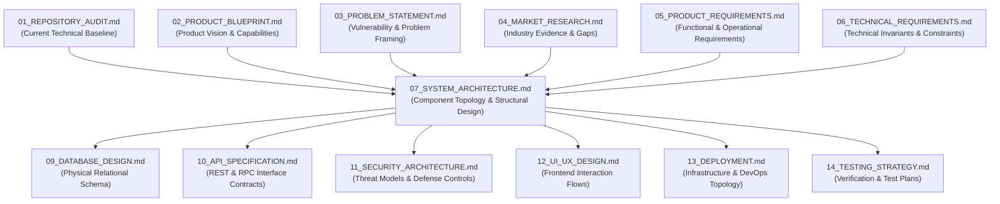

---

## 5. Architectural Principles & Core Invariants

VeriQ architecture adheres to 10 non-negotiable architectural principles:
1. **Zero Plaintext on Ledger:** Plaintext paper payloads, student PII, and symmetric keys SHALL NEVER be committed to blockchain storage or emitted in smart contract events.
2. **Cryptographic Role Separation:** Confidentiality is provided by AES-256-GCM; integrity identity by SHA-256; authenticity by asymmetric digital signatures / signed JWTs; lineage/audit by the distributed ledger.
3. **Decoupled Key Custody:** Symmetric keys (DEK) are physically and logically segregated from encrypted ciphertext packages and wrapped via Key Encryption Keys (KEK).
4. **Server-Side Authoritative Time:** Release decisions are evaluated strictly against synchronized server UTC time; client-supplied timestamps and overrides are rejected.
5. **Sequential Release Gating:** Decryption keys and streams are released if and only if all 10 release gates evaluate to `PASS` in strict sequence.
6. **Pre-Release Encrypted Staging:** Encrypted packages may be pre-distributed to examination centers ahead of time without exposing decryption keys.
7. **Distinct Content vs. Ciphertext Digests:** `content_hash` governs document approval and author lineage; `ciphertext_hash` governs storage and package delivery integrity.
8. **Real-Time Revocation Enforcement:** Actor and device status checks occur during request authorization; unexpired tokens do not bypass revocation.
9. **Separate Local vs. Ledger States:** Local business operations may succeed while ledger transactions remain `PENDING_ANCHOR`; `CONFIRMED_ON_CHAIN` requires verified block finality.
10. **Universal Fail-Closed Posture:** Any unhandled exception, missing dependency, or cryptographic mismatch results in deterministic access denial.

---

## 6. System Context

The System Context diagram illustrates the operational boundary of VeriQ and its interactions with human actors, client terminals, enterprise time authorities, and distributed ledger networks.

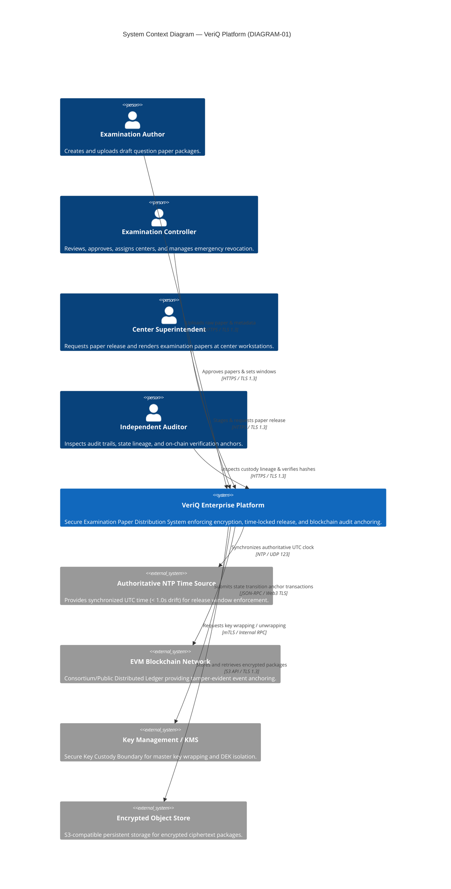

---

## 7. Actors & External Systems

| Entity | Type | Architectural Trust Level | Interaction Channel | Core Architectural Responsibilities |
| :--- | :--- | :--- | :--- | :--- |
| **Examination Author (Examiner)** | Human Actor | Authenticated / Role-Restricted | React Web App $
ightarrow$ HTTPS | Uploads draft papers, computes client preliminary hash, submits for review. Cannot approve own papers. |
| **Examination Controller (Admin)** | Human Actor | Highly Privileged / Multi-Factor | React Web App $
ightarrow$ HTTPS | Approves paper versions, configures release windows, binds centers, executes emergency revocation. |
| **Center Superintendent** | Human Actor | Center-Scoped Workstation User | React Web App $
ightarrow$ HTTPS | Stages encrypted packages on registered center workstation, requests release during active window, prints/renders papers. |
| **Independent Auditor** | Human Actor | Read-Only Regulatory User | React Web App $
ightarrow$ HTTPS | Inspects end-to-end chain-of-custody logs, compares database hashes against blockchain receipts. |
| **Authoritative NTP Authority** | External Infra | High (Must be verified) | NTP Daemon (UDP 123) | Provides synchronized UTC reference time. If unavailable or drift > 1.0s, release fails closed. |
| **Distributed Ledger / Blockchain** | External Infra | High (Consensus-Backed) | Web3 JSON-RPC over TLS | Anchors lifecycle state transition hashes and timestamps; provides public/consortium verifiability. |
| **Key Custody / KMS** | External / Boundary | Ultra-High (Isolated Perimeter) | Internal mTLS | Manages Key Encryption Keys (KEK), wraps Data Encryption Keys (DEK), enforces ephemeral memory handling. |
| **Encrypted Object Store** | External / Boundary | High (Encrypted at Rest) | S3 API / TLS 1.3 | Stores binary ciphertext packages and nonces. Never stores plaintext papers or encryption keys. |

---

## 8. Trust Model & Security Architecture Boundaries

VeriQ partitions its architectural components into distinct trust zones separated by explicit security boundaries:

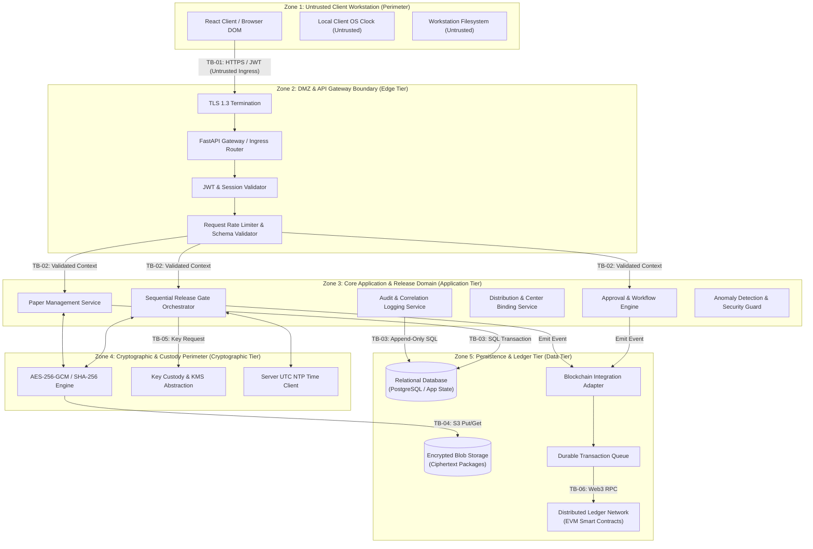

---

## 9. Layered Architecture

VeriQ is structured across 10 architectural layers with explicit dependency directions (Layer $N$ calls Layer $N+1$; upward calls are prohibited):

```
+-------------------------------------------------------------------------------+
| Layer 1: Client & Presentation Tier (React 18, Vite, UI Components)           |
+-------------------------------------------------------------------------------+
                                      │
                                      ▼ (HTTPS / TLS 1.3)
+-------------------------------------------------------------------------------+
| Layer 2: Edge & API Gateway Tier (FastAPI, Request Validation, Rate Limiter)   |
+-------------------------------------------------------------------------------+
                                      │
                                      ▼
+-------------------------------------------------------------------------------+
| Layer 3: Identity & Access Management (JWT, Real-Time Revocation, RBAC Guard) |
+-------------------------------------------------------------------------------+
                                      │
                                      ▼
+-------------------------------------------------------------------------------+
| Layer 4: Application & Domain Services (Papers, Approvals, Centers, Devices)  |
+-------------------------------------------------------------------------------+
                                      │
                                      ▼
+-------------------------------------------------------------------------------+
| Layer 5: Release Orchestration Engine (Sequential 10-Gate Evaluation Engine)  |
+-------------------------------------------------------------------------------+
                                      │
                                      ▼
+-------------------------------------------------------------------------------+
| Layer 6: Security & Cryptography Engine (AES-256-GCM, SHA-256 Dual Digest)    |
+-------------------------------------------------------------------------------+
                                      │
                                      ▼
+-------------------------------------------------------------------------------+
| Layer 7: Key Custody & KMS Perimeter (DEK Wrapping, Ephemeral Memory Control) |
+-------------------------------------------------------------------------------+
                                      │
                                      ▼
+-------------------------------------------------------------------------------+
| Layer 8: Relational Persistence & Secure Blob Storage (PostgreSQL, S3 Blobs)  |
+-------------------------------------------------------------------------------+
                                      │
                                      ▼
+-------------------------------------------------------------------------------+
| Layer 9: Audit, Correlation & Observability Tier (Append-Only Logs, Tracing)  |
+-------------------------------------------------------------------------------+
                                      │
                                      ▼ (JSON-RPC / Web3)
+-------------------------------------------------------------------------------+
| Layer 10: Distributed Ledger Integration Tier (Smart Contracts, Queue, Finality)|
+-------------------------------------------------------------------------------+
```

---

## 10. Logical Component Architecture

The Logical Component Architecture diagram details the subsystems, internal modules, and communication paths across the VeriQ platform.

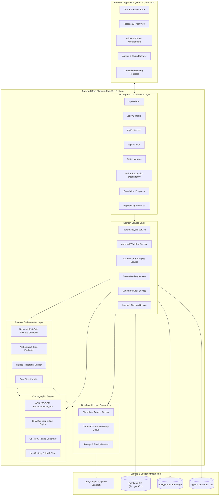

---

## 11. Component Responsibilities & Interaction Contracts

| Component Name | Architectural Layer | Primary Responsibilities | Inbound Calls From | Outbound Calls To | Failure Behavior |
| :--- | :--- | :--- | :--- | :--- | :--- |
| **API Ingress Router** | Layer 2 (Edge) | Terminates TLS, validates request schemas, injects `correlation_id`, routes traffic. | Client Applications | Auth Middleware, Domain Services | Returns HTTP 400/422 on malformed input; rejects unknown fields. |
| **Auth & Revocation Guard** | Layer 3 (IAM) | Validates JWT signatures and expiration; evaluates real-time actor revocation status against DB. | API Ingress Router | Relational DB | Rejects with HTTP 401/403; never defaults to mock identity. |
| **Paper Lifecycle Service** | Layer 4 (Domain) | Manages paper registration, metadata, draft status transitions, and versioning (`v+1`). | Ingress Router | Crypto Engine, Relational DB | Rolls back DB transaction on failure; rejects state mutation of approved versions. |
| **Approval Workflow Service** | Layer 4 (Domain) | Enforces separation of duties (`creator != approver`); transitions paper to `APPROVED`. | Ingress Router | Relational DB, Blockchain Adapter | Rejects approval if creator == approver with HTTP 409 Conflict. |
| **Sequential Release Controller** | Layer 5 (Orchestration) | Evaluates the 10 sequential gates; coordinates key release and audit emission. | Ingress Router (`/access/release`) | Time Client, Device Svc, Crypto Engine, Key Custody | Fails closed on any gate failure; returns specific HTTP 403 error code. |
| **Cryptographic Engine** | Layer 6 (Crypto) | Performs AES-256-GCM encryption/decryption, CSPRNG nonces, and SHA-256 dual digest hashing. | Paper Svc, Release Controller | Key Custody, Blob Storage | Aborts immediately if GCM tag verification fails; returns zero plaintext. |
| **Key Custody Abstraction** | Layer 7 (Custody) | Manages DEK wrapping/unwrapping via KEK; enforces ephemeral memory lifecycle. | Release Controller, Crypto Engine | KMS / HSM Provider | Fails closed; never logs or persists plaintext keys. |
| **Blockchain Adapter** | Layer 10 (Ledger) | Dispatches anchor transactions to queue; monitors transaction receipts and block confirmations. | Approval Svc, Release Controller | Smart Contract (JSON-RPC) | Queues transactions on RPC outage; sets status to `PENDING_ANCHOR`. |

---

## 12. Current Baseline vs. Target Architecture Comparison

The following table explicitly contrasts the repository prototype baseline (`01_REPOSITORY_AUDIT.md`) with the target enterprise architecture defined herein:

| Architectural Area | Current Prototype Baseline (`01`) | Target Architecture (`07`) | Requirement Driver |
| :--- | :--- | :--- | :--- |
| **Authentication Ingress** | `[CURRENT]` Vulnerability: Auth dependency falls back to default privileged mock identity if unauthenticated. | `[TARGET]` Strict JWT signature verification; missing/invalid tokens receive HTTP 401; zero fallback. | `API-001`, `API-002`, `AUTH-001` |
| **Time Authority & Release** | `[CURRENT]` Critical Flaw: Access endpoint accepts client-provided `override_time` query parameter. | `[TARGET]` Authoritative server UTC via NTP (< 1.0s drift); `override_time` completely stripped/rejected. | `TIME-001`, `TIME-002`, `TIME-003` |
| **Decrypted Document Delivery** | `[PARTIAL]` Prototype returns encrypted JSON without complete secure decryption/rendering path on workstation. | `[TARGET]` Controlled in-memory decryption stream / secure render canvas; zero plaintext files persisted on disk. | `RELEASE-002`, `DOC-003` |
| **Distributed Ledger Integration** | `[MOCKED]` In-memory Python `MockBlockchainService` simulating blockchain with dictionary appends. | `[TARGET]` EVM smart contract (`VeriQLedger.sol`) integration with transaction queues and confirmation tracking. | `CHAIN-001`, `CHAIN-002`, `CONTRACT-001` |
| **Ledger Anchor States** | `[SIMULATED]` Single synchronous in-memory append; no concept of network confirmation or finality. | `[TARGET]` Explicit two-stage anchoring: `PENDING_ANCHOR` (queued/submitted) vs. `CONFIRMED_ON_CHAIN` (mined). | `CONTRACT-001`, `AVAIL-001` |
| **Cryptographic Hashing** | `[PARTIAL]` Single hash calculation without formal separation between content and ciphertext artifacts. | `[TARGET]` Explicit dual-digest architecture: `content_hash` (raw paper) vs. `ciphertext_hash` (distribution package). | `CRYPTO-003`, `DOC-004` |
| **Key Custody & Storage** | `[PARTIAL]` Keys stored in plaintext database fields or memory dictionaries without envelope wrapping. | `[TARGET]` Physical/logical key separation; envelope encryption with KEK; ephemeral in-memory handling. | `KEY-001`, `KEY-002`, `KEY-003` |
| **Database & Concurrency** | `[CURRENT]` SQLite single-file database without optimistic concurrency locking or connection pooling. | `[TARGET]` PostgreSQL 15+ with optimistic locking (`lock_version`), foreign key cascades, and connection pools. | `DB-001`, `DB-002`, `PERF-001` |
| **Device & Endpoint Identity** | `[PARTIAL]` Basic browser header string matching without formal hardware or credential attestation. | `[TARGET]` Multi-attribute device binding with real-time revocation checking and server-side correlation. | `DEVICE-001`, `DEVICE-002` |
| **Deployment & Secret Isolation** | `[CURRENT]` Broken/incomplete Docker setup; tracked demo secrets in repository `.env` files. | `[TARGET]` Hardened non-root multi-stage Docker containers; all production secrets supplied via approved secret management. | `DEP-001`, `CONFIG-001`, `CI-001` |

---

## 13. Trust Boundaries & Enforcement Matrix

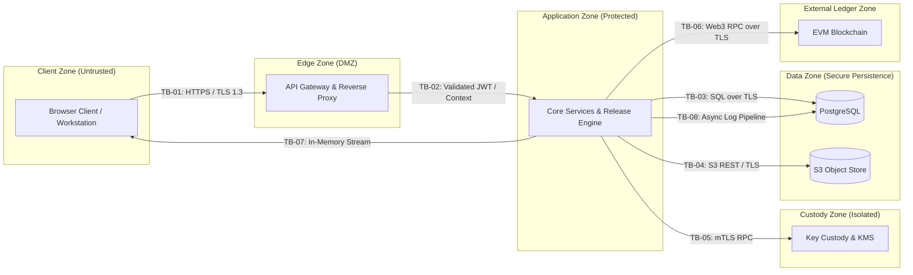

| Boundary ID | Interacting Subsystems | Data & Commands Crossing Boundary | Authentication & Encryption Controls | Enforcement Mechanism | Failure Posture |
| :--- | :--- | :--- | :--- | :--- | :--- |
| **TB-01** | Workstation $
ightarrow$ API Gateway | HTTP Requests, Credentials, Release Invocations | TLS 1.3 Transport Encryption; Bearer JWT in Authorization header. | Gateway route guards, Pydantic schema validation. | Rejects with HTTP 401/422. |
| **TB-02** | Gateway $
ightarrow$ Domain Services | Sanitized internal request context, Actor Identity, Claims | In-process validated dependency context; immutable request context. | FastAPI dependency injection (`get_current_active_user`). | Raises HTTP 401/403. |
| **TB-03** | Domain Services $
ightarrow$ PostgreSQL | Relational queries, state mutations, audit rows | PostgreSQL connection over TLS; dedicated service role credentials. | SQLAlchemy ORM session transaction boundaries. | Rolls back transaction; HTTP 503. |
| **TB-04** | Crypto Engine $
ightarrow$ S3 Blob Store | Ciphertext binaries, initialization vectors, tags | S3 API over TLS 1.3; IAM bucket policies; AES-256 server-side encryption. | S3 SDK client with pre-signed URL constraints. | Fails closed; HTTP 500/503. |
| **TB-05** | Release Engine $
ightarrow$ Key Custody | DEK unwrap requests, KEK identifiers | Internal mTLS; strictly scoped key-release policy evaluation. | KMS client SDK with ephemeral key destruction. | Fails closed; blocks decryption. |
| **TB-06** | Blockchain Adapter $
ightarrow$ EVM Node | Transaction payloads, ABI calls, event queries | JSON-RPC over TLS; signed transactions with private relayer key. | Web3 provider with transaction queue & retry worker. | Sets `PENDING_ANCHOR`; logs warning. |
| **TB-07** | Release Engine $
ightarrow$ Workstation | Decrypted paper stream / ephemeral render buffer | Ephemeral memory buffer over TLS 1.3; single-use render tokens. | In-memory stream response; no client disk persistence. | Stream aborted; incident logged. |
| **TB-08** | Core Services $
ightarrow$ Audit Storage | Structured JSON audit events, correlation IDs | Dedicated append-only DB connection; restricted SQL user permissions. | Audit service write-only repository layer. | Logs local fallback; alerts SRE. |

---

## 14. Question Paper Lifecycle State Machine Architecture

The question paper lifecycle represents a strictly sequential, non-reversible state machine enforced by the `Paper Lifecycle Service` and transactional database constraints:

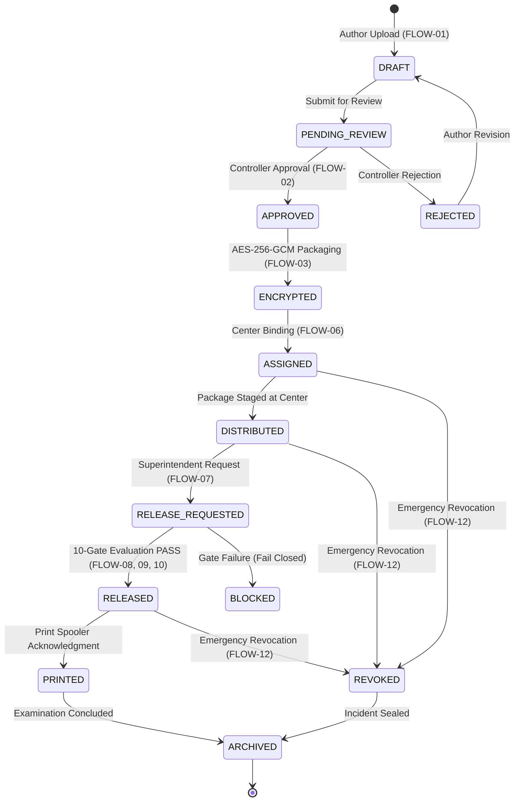

### 14.1 Lifecycle Invariants Table

| State Transition | Responsible Service | Authorized Role | Cryptographic Operation | Audit Event Emitted | Ledger Anchor Emitted? |
| :--- | :--- | :--- | :--- | :--- | :--- |
| `[*] -> DRAFT` | Paper Lifecycle Svc | `EXAMINER` | Computes initial `content_hash` over raw PDF. | `PAPER_CREATED` | No |
| `DRAFT -> PENDING_REVIEW` | Paper Lifecycle Svc | `EXAMINER` | Re-verifies `content_hash`; seals draft payload. | `PAPER_SUBMITTED` | No |
| `PENDING_REVIEW -> APPROVED` | Approval Workflow Svc | `CONTROLLER` | Validates `creator_id != approver_id` (Separation of Duties). | `PAPER_APPROVED` | **Yes** (`PAPER_APPROVED` + `content_hash`) |
| `APPROVED -> ENCRYPTED` | Cryptographic Engine | `SYSTEM` | Generates CSPRNG IV; executes AES-256-GCM; computes `ciphertext_hash`. | `PAPER_ENCRYPTED` | No |
| `ENCRYPTED -> ASSIGNED` | Distribution Svc | `CONTROLLER` | Binds paper to target `center_id` and sets release window. | `CENTER_ASSIGNED` | **Yes** (`CENTER_ASSIGNED` + window) |
| `ASSIGNED -> DISTRIBUTED` | Distribution Svc | `SYSTEM` / `SUPERINTENDENT` | Validates `ciphertext_hash` upon download to center storage. | `PACKAGE_STAGED` | **Yes** (`PACKAGE_DISTRIBUTED` + `ciphertext_hash`) |
| `DISTRIBUTED -> RELEASED` | Sequential Release Orch | `SUPERINTENDENT` | Unwraps DEK; verifies GCM tag; decrypts; verifies `content_hash`. | `KEY_RELEASED` | **Yes** (`KEY_RELEASED` + timestamp) |
| Any Active $
ightarrow$ `REVOKED` | Emergency Revocation Svc | `CONTROLLER` | Evaluates revocation status on subsequent authorization decisions and prevents further release/key authorization for the revoked entity. | `PAPER_REVOKED` | **Yes** (`PAPER_REVOKED` + reason) |

---

## 15. End-to-End Data Flow Architecture

### 15.1 FLOW-01: Paper Registration & Initial Ingestion
- **Actor $
ightarrow$ Component:** Examination Author $
ightarrow$ API Gateway $
ightarrow$ Paper Lifecycle Service.
- **Data Flow:** Author uploads draft PDF; Gateway validates 50 MB limit and MIME magic bytes; Paper Lifecycle Service delegates to Cryptographic Engine.
- **Result:** Initial entity stored in PostgreSQL with status `DRAFT`; initial `content_hash` recorded; audit event emitted.

### 15.2 FLOW-02: Review, Approval & Separation of Duties
- **Actor $
ightarrow$ Component:** Examination Controller $
ightarrow$ API Gateway $
ightarrow$ Approval Workflow Service.
- **Data Flow:** Controller submits approval; service verifies `controller_id != author_id`; validates paper is in `PENDING_REVIEW` state.
- **Result:** State transitions atomically to `APPROVED`; triggers downstream FLOW-03 packaging and FLOW-05 blockchain anchoring.

### 15.3 FLOW-03: Encryption & Packaging Pipeline
- **Actor $
ightarrow$ Component:** Approval Workflow Service $
ightarrow$ Cryptographic Engine $
ightarrow$ Key Custody Client.
- **Data Flow:** Crypto Engine requests new DEK from Key Custody; generates 96-bit CSPRNG IV; executes AES-256-GCM encryption on canonical PDF.
- **Result:** Encrypted binary package written to S3 Object Store; wrapped DEK and GCM authentication tag stored in PostgreSQL.

### 15.4 FLOW-04: Dual-Digest Hash Generation
- **Actor $
ightarrow$ Component:** Cryptographic Engine $
ightarrow$ Paper Lifecycle Service $
ightarrow$ Relational Database.
- **Data Flow:** Computes `content_hash` (SHA-256 over raw PDF before encryption) and `ciphertext_hash` (SHA-256 over `.enc` package post-encryption).
- **Result:** Both digests stored in `paper_versions` table with distinct semantic bindings.

### 15.5 FLOW-05: Ledger Event Anchoring & Finality Verification
- **Actor $
ightarrow$ Component:** Core Domain Services $
ightarrow$ Blockchain Adapter $
ightarrow$ Durable Queue $
ightarrow$ EVM Smart Contract.
- **Data Flow:** Domain service pushes event payload (`paper_id`, `version`, hash, UTC timestamp) to local queue with initial status `PENDING_ANCHOR`; Relayer Worker signs and submits Web3 transaction; polls for block confirmations.
- **Result:** Upon reaching required confirmation depth, status transitions to `CONFIRMED_ON_CHAIN`.

### 15.6 FLOW-06: Encrypted Package Distribution & Pre-Release Staging
- **Actor $
ightarrow$ Component:** Center Superintendent $
ightarrow$ API Gateway $
ightarrow$ Distribution Service $
ightarrow$ Blob Store.
- **Data Flow:** Superintendent downloads encrypted binary package to examination center workstation hours/days ahead of exam.
- **Result:** Package staged locally; `ciphertext_hash` verified upon staging; distribution status updated to `STAGED`; zero decryption keys dispatched.

### 15.7 FLOW-07: Release Request Ingress
- **Actor $
ightarrow$ Component:** Center Superintendent $
ightarrow$ Examination Workstation $
ightarrow$ API Gateway Ingress Router.
- **Data Flow:** Superintendent triggers release button in UI; workstation sends HTTP POST `/api/v1/access/release` with Bearer JWT, center ID, and device fingerprint.
- **Result:** Request intercepted by API Gateway; authenticated context passed to Sequential Release Controller.

### 15.8 FLOW-08: Sequential 10-Gate Release Evaluation
- **Actor $
ightarrow$ Component:** Sequential Release Controller $
ightarrow$ IAM Guard, Time Client, Device Svc, Revocation Svc, Crypto Engine.
- **Data Flow:** Executes gates 1 through 8 in strict sequence: checks JWT validity, role, center binding, device fingerprint, authoritative server UTC window, paper state (`STAGED`), entity revocation status, and `ciphertext_hash` match.
- **Result:** If all 8 pre-release gates evaluate to `PASS`, orchestrator invokes FLOW-09; if any gate fails, immediately aborts with HTTP 401/403/422.

### 15.9 FLOW-09: Ephemeral Key Release Authorization
- **Actor $
ightarrow$ Component:** Sequential Release Controller $
ightarrow$ Key Custody Client (KMS) $
ightarrow$ Cryptographic Engine.
- **Data Flow:** Controller requests unwrapping of `wrapped_dek` using KEK identifier; unwrapped DEK loaded into ephemeral memory buffer.
- **Result:** Plaintext DEK scoped strictly to current request execution; zero persistent key exposure.

### 15.10 FLOW-10: In-Memory Decryption & Secure Rendering
- **Actor $
ightarrow$ Component:** Cryptographic Engine $
ightarrow$ Sequential Release Controller $
ightarrow$ Workstation Controlled Renderer.
- **Data Flow:** Crypto Engine validates GCM 128-bit authentication tag and decrypts ciphertext stream; verifies decrypted payload matches `content_hash`; streams decrypted bytes to client.
- **Result:** Workstation renders paper in ephemeral canvas/print buffer; plaintext wiped from memory immediately post-render; zero files written to disk.

### 15.11 FLOW-11: Structured Audit Event Generation & Correlation
- **Actor $
ightarrow$ Component:** All Domain Services $
ightarrow$ Correlation Middleware $
ightarrow$ Structured Audit Service $
ightarrow$ Audit DB.
- **Data Flow:** Every operation attaches incoming `X-Correlation-ID`; audit service writes structured JSON records (actor, action, entity, timestamp, outcome) to append-only database table.
- **Result:** Tamper-evident operational audit trail; correlation ID enables full distributed trace reconstruction.

### 15.12 FLOW-12: Emergency Paper & Device Revocation
- **Actor $
ightarrow$ Component:** Examination Controller $
ightarrow$ API Gateway $
ightarrow$ Revocation Service $
ightarrow$ Relational DB & Blockchain.
- **Data Flow:** Controller invokes emergency revocation on compromised paper or center device; status set to `REVOKED` in PostgreSQL within atomic transaction.
- **Result:** Subsequent release attempts fail closed immediately at Gate 7; `PAPER_REVOKED` anchor event submitted to blockchain queue.

### 15.13 FLOW-13: Blockchain Anchor Retry & Dead-Letter Replay
- **Actor $
ightarrow$ Component:** Blockchain Relayer Worker $
ightarrow$ Durable Transaction Queue $
ightarrow$ EVM Node.
- **Data Flow:** If Web3 JSON-RPC node returns network timeout or gas spike error, worker applies exponential backoff retry; if max retries exceeded, moves to dead-letter queue.
- **Result:** Preserves local release availability; alerts SRE team; supports eventual ledger reconciliation after RPC recovery, subject to successful transaction submission and confirmation.

---

## 16. Release Orchestration Architecture (The 10-Gate Engine)

The Release Orchestrator implements the non-bypassable sequential gating engine mandated by `06_TECHNICAL_REQUIREMENTS.md` (`RELEASE-001`). If any single gate fails, the evaluation terminates immediately with a fail-closed response:

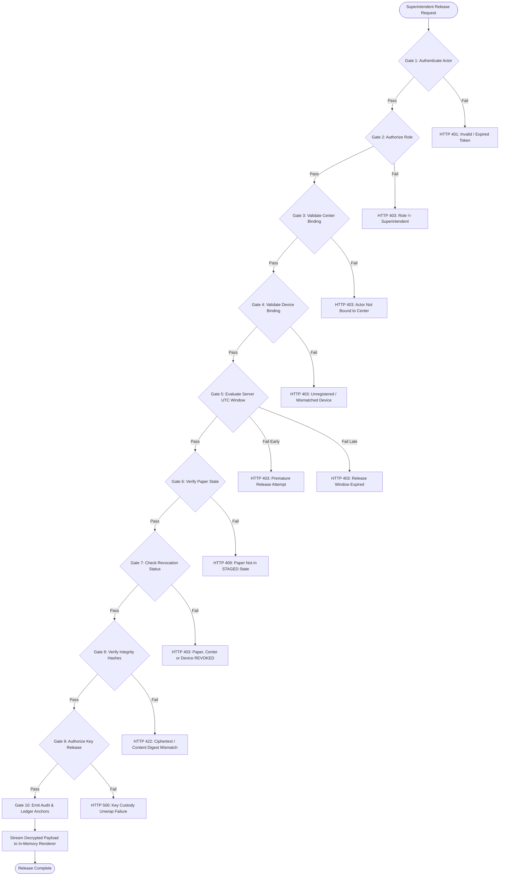

### 16.1 Sequential Gate Execution Specification

| Gate Order | Gate Name | Responsible Subsystem | Technical Verification Logic | Error Code Returned on Failure |
| :--- | :--- | :--- | :--- | :--- |
| **Gate 1** | `AUTHENTICATE_ACTOR` | IAM Middleware | Verifies JWT signature, issuer, subject, and token expiry (`exp > NOW()`). | `HTTP 401 Unauthorized` (`AUTH_INVALID_TOKEN`) |
| **Gate 2** | `AUTHORIZE_ROLE` | RBAC Policy Engine | Validates actor has `ROLE_SUPERINTENDENT` in active token claims. | `HTTP 403 Forbidden` (`AUTHZ_INSUFFICIENT_ROLE`) |
| **Gate 3** | `VALIDATE_CENTER_BINDING` | Center Service | Validates `actor.center_id == requested.center_id` and paper is assigned to center. | `HTTP 403 Forbidden` (`CENTER_ACCESS_DENIED`) |
| **Gate 4** | `VALIDATE_DEVICE_BINDING` | Device Service | Matches request device fingerprint against registered active device for center. | `HTTP 403 Forbidden` (`DEVICE_UNAUTHORIZED`) |
| **Gate 5** | `EVALUATE_TIME_WINDOW` | Time Authority Client | Authoritative Server UTC evaluated: `window_start <= server_utc_now <= window_end`. | `HTTP 403 Forbidden` (`TIME_WINDOW_INACTIVE`) |
| **Gate 6** | `VERIFY_PAPER_STATE` | Paper Lifecycle Svc | Database entity state must equal `DISTRIBUTED` or `STAGED`. | `HTTP 409 Conflict` (`INVALID_PAPER_STATE`) |
| **Gate 7** | `CHECK_REVOCATION_STATUS` | Revocation Service | Verifies paper, center, and device are NOT marked `REVOKED` or `SUSPENDED`. | `HTTP 403 Forbidden` (`ENTITY_REVOKED`) |
| **Gate 8** | `VERIFY_INTEGRITY_HASH` | Cryptographic Engine | Verifies staged package `ciphertext_hash` matches approved distribution record. | `HTTP 422 Unprocessable` (`INTEGRITY_HASH_MISMATCH`) |
| **Gate 9** | `AUTHORIZE_KEY_RELEASE` | Key Custody / KMS | Requests DEK unwrapping under ephemeral memory scope; validates GCM tag. | `HTTP 500 Internal Error` (`KEY_RELEASE_FAILED`) |
| **Gate 10** | `EMIT_AUDIT_EVENT` | Audit & Blockchain | Commits the `KEY_RELEASED` audit event transactionally before release completion and submits the corresponding blockchain anchor asynchronously. Blockchain confirmation is not required for release completion when the configured degradation policy permits `PENDING_ANCHOR`. | `Fail Closed on DB Audit Failure` (Ledger anchoring queued asynchronously if RPC degraded) |

---

## 17. Cryptographic Data Flow & Key Custody Architecture

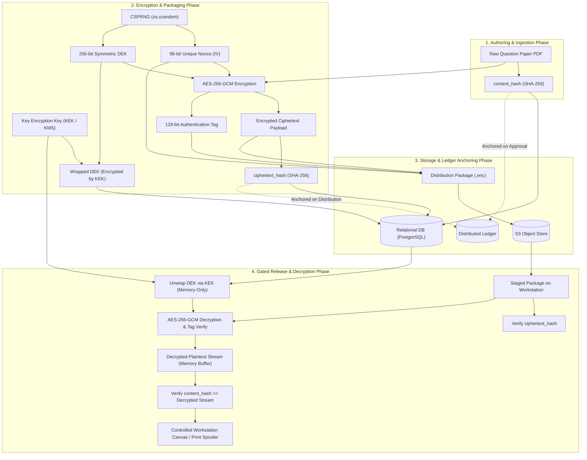

---

## 18. Distributed Ledger Integration Architecture

The Distributed Ledger subsystem provides decentralized, mathematical proof of state transitions without exposing confidential data.

```mermaid
graph LR
    subgraph AppBoundary["VeriQ Application Boundary"]
        EventTrigger["Lifecycle Event Triggered<br/>(Approval / Distribution / Release)"]
        AuditService["Structured Audit Service"]
        TxQueue["Durable Local Tx Queue<br/>(PostgreSQL Table)"]
        RelayerWorker["Blockchain Relayer Worker"]
    end

    subgraph LedgerBoundary["Distributed Ledger Boundary"]
        Web3Provider["EVM JSON-RPC Node / Provider"]
        SmartContract["VeriQLedger.sol<br/>(Smart Contract on EVM)"]
        MinedBlock["Mined Block & Receipt"]
    end

    EventTrigger --> AuditService
    AuditService -- "1. Insert Local Audit Row" --> TxQueue
    TxQueue -- "2. Initial Status: PENDING_ANCHOR" --> RelayerWorker
    
    RelayerWorker -- "3. Build & Sign Transaction" --> Web3Provider
    Web3Provider -- "4. Execute Contract Function" --> SmartContract
    SmartContract -- "5. Emit On-Chain Event" --> MinedBlock
    
    MinedBlock -- "6. Transaction Receipt" --> RelayerWorker
    RelayerWorker -- "7. Verify Finality Depth" --> TxQueue
    TxQueue -- "8. Update Status: CONFIRMED_ON_CHAIN" --> AuditService
```

### 18.1 Smart Contract Event Schema & State Representation

The smart contract (`VeriQLedger.sol`) stores zero plaintext and exposes the following canonical event structures:

```solidity
// Canonical On-Chain Event Signatures
event PaperApproved(
    bytes32 indexed paperId,
    uint256 indexed versionNumber,
    bytes32 contentHash,
    uint256 authoritativeTimestamp,
    address indexed controllerAddress
);

event PackageDistributed(
    bytes32 indexed paperId,
    bytes32 indexed centerId,
    bytes32 ciphertextHash,
    uint256 authoritativeTimestamp
);

event KeyReleased(
    bytes32 indexed paperId,
    bytes32 indexed centerId,
    bytes32 deviceFingerprintHash,
    uint256 releaseTimestamp
);

event PaperRevoked(
    bytes32 indexed paperId,
    bytes32 reasonHash,
    uint256 revocationTimestamp,
    address indexed controllerAddress
);
```

### 18.2 Anchoring Status Lifecycle

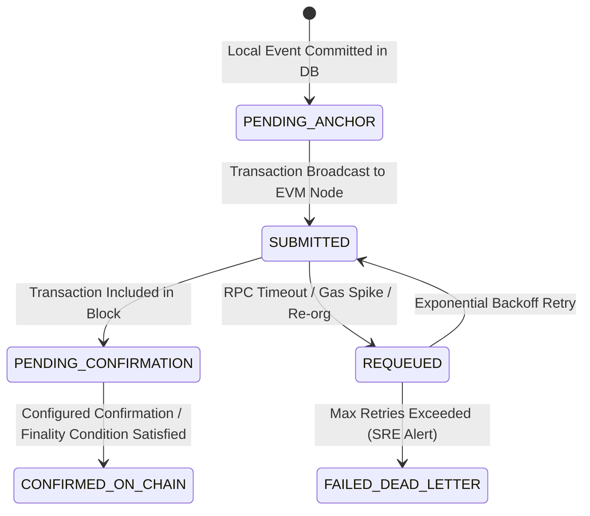

---

## 19. Audit, Chain-of-Custody & Observability Architecture

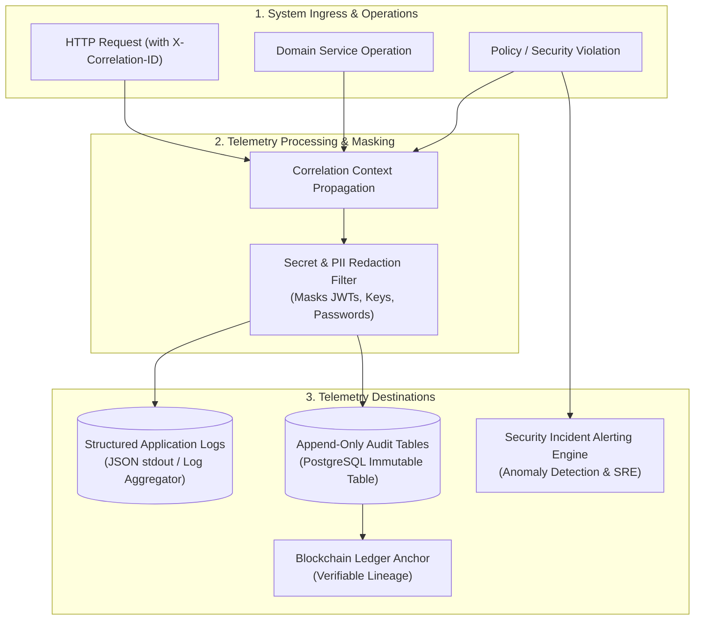

---

## 20. Failure, Degradation & Resilience Architecture

The following matrix and decision flow define system behavior when infrastructure dependencies fail:

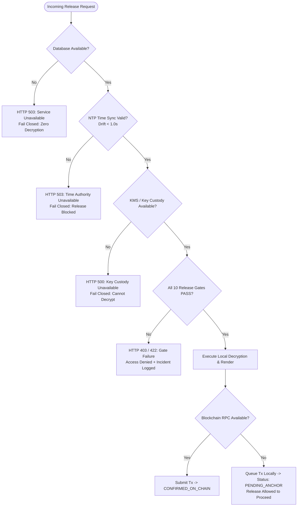

---

## 21. Architecture Decision Records (ADRs)

### ADR-001: Off-Chain Encrypted Question Paper Storage
- **Context:** Storing large PDF files (up to 50 MB) on a blockchain is prohibitively expensive and creates permanent confidentiality risks if encryption is ever broken.
- **Decision:** Store encrypted binary packages in S3-compatible object storage; commit only SHA-256 hashes (`content_hash`, `ciphertext_hash`) and lifecycle metadata to the blockchain ledger.
- **Status:** `ACCEPTED` (Source: `BC-002`, `CRY-001`).

### ADR-002: Dual-Digest Architecture (`content_hash` vs. `ciphertext_hash`)
- **Context:** Re-encrypting a document with a new IV creates a different ciphertext. Conflating document identity with package identity creates audit ambiguity.
- **Decision:** Compute `content_hash` over raw canonical PDF for approval lineage; compute `ciphertext_hash` over encrypted package for distribution package integrity.
- **Status:** `ACCEPTED` (Source: `CRYPTO-003`, `DOC-004`).

### ADR-003: Centralized Server-Side Sequential Release Orchestrator
- **Context:** Client-side release logic can be manipulated via browser developer tools or modified code.
- **Decision:** Implement a non-bypassable 10-gate sequential evaluation engine on the backend server; client UI displays timers purely for user feedback.
- **Status:** `ACCEPTED` (Source: `RELEASE-001`, `FRONT-001`).

### ADR-004: Server-Side Authoritative UTC Time Enforcement
- **Context:** Examination centers could manipulate local operating system clocks to unlock question papers prematurely (`01_REPOSITORY_AUDIT.md` vulnerability).
- **Decision:** Enforce server-side UTC time synchronized via NTP (< 1.0s drift); unconditionally reject client-supplied `override_time` parameters.
- **Status:** `ACCEPTED` (Source: `TIME-001`, `TIME-002`).

### ADR-005: Real-Time Actor & Device Revocation Evaluation
- **Context:** Stateless JWT tokens remain valid until TTL expiry, allowing compromised credentials to continue accessing the system.
- **Decision:** Evaluate database revocation status on every protected authorization call, ensuring revoked actors or devices are denied immediately.
- **Status:** `ACCEPTED` (Source: `AUTHZ-004`, `DEV-002`).

### ADR-006: Asynchronous Ledger Anchoring with Explicit Finality States
- **Context:** Synchronous blockchain transactions introduce multi-second latency and fail if public/private RPC nodes experience congestion during exam starts.
- **Decision:** Execute release operations locally once cryptographic/time invariants pass; queue blockchain transactions asynchronously, explicitly marking status as `PENDING_ANCHOR` until block confirmations achieve `CONFIRMED_ON_CHAIN`.
- **Status:** `ACCEPTED` (Source: `CONTRACT-001`, `AVAIL-001`).

### ADR-007: Separation of Application State, Audit Logs, and Ledger Anchors
- **Context:** Treating audit logs and blockchain as identical leads to bloated smart contracts or under-audited operational databases.
- **Decision:** Maintain mutable application state in PostgreSQL, immutable append-only audit events in dedicated audit tables, and cryptographic digests on the blockchain ledger.
- **Status:** `ACCEPTED` (Source: `AUDIT-001`, `CHAIN-002`).

### ADR-008: Ephemeral Key Lifetime and Memory Scoping
- **Context:** Python runtimes cannot guarantee physical memory zeroization due to garbage collection internals.
- **Decision:** Scope symmetric key material strictly to ephemeral function execution blocks; prohibit global/module-level caching and log exposure; dereference immediately post-decryption.
- **Status:** `ACCEPTED` (Source: `KEY-003`, `LOG-001`).

---

## 22. Open Architectural Decisions & TBD Register

| Decision ID | Architecture Domain | Current Options Under Evaluation | Architectural Tradeoff | Target Resolution Milestone |
| :--- | :--- | :--- | :--- | :--- |
| **TBD-001** | Production Blockchain Selection | 1. Polygon PoS (Public EVM)<br/>2. Hyperledger Besu (Private Consortium EVM)<br/>3. Avalanche Subnet | Public transparency & gas costs vs. consortium privacy & deterministic zero-cost throughput. | Prior to Phase 3 Implementation |
| **TBD-002** | Workstation Rendering Engine | 1. In-Memory WebAssembly PDF Renderer<br/>2. Ephemeral Native OS Spooler Daemon | Browser sandboxing vs. physical printer hardware security. | Prior to Phase 2 Implementation |
| **TBD-003** | Enterprise KMS Provider | 1. HashiCorp Vault Transit Engine<br/>2. Cloud Native KMS (AWS KMS / GCP Cloud KMS) | Multi-cloud independence vs. cloud-native IAM integration simplicity. | Prior to Production Deployment |
| **TBD-004** | Hardware Device Attestation | 1. WebAuthn / FIDO2 Token Attestation<br/>2. TPM 2.0 Client Certificate Enrollment | Web browser portability vs. military-grade hardware root-of-trust. | Post-MVP Enterprise Roadmap |

---

## 23. MVP vs. Target Architecture Specification

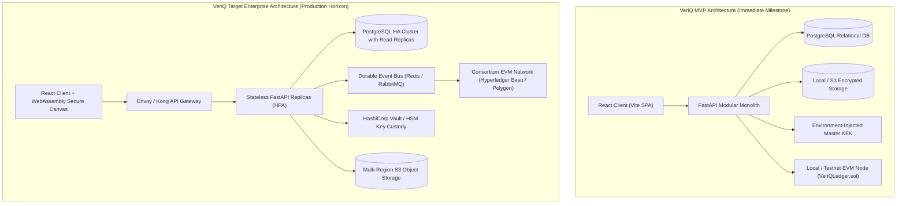

---

## 24. Component Responsibility Matrix

| Component Name | Architectural Layer | Primary Responsibility | Data Read | Data Written | Security Boundary Enforced | Upstream 06 Traceability |
| :--- | :--- | :--- | :--- | :--- | :--- | :--- |
| **API Gateway / Ingress** | Edge (L2) | Schema validation, TLS termination, payload size enforcement. | Raw HTTP requests | Sanitized request context | TB-01 | `TECH-001`, `API-003` |
| **Auth Dependency Guard** | IAM (L3) | JWT verification, real-time revocation checking. | JWT tokens, Actor DB | Authenticated user context | TB-02 | `API-001`, `API-002`, `AUTH-001`, `AUTHZ-004` |
| **RBAC Authorization Engine** | IAM (L3) | Enforces role policies, center scoping, separation of duties. | User roles, Center bindings | Authorization decision | TB-02 | `AUTHZ-001`, `AUTHZ-002`, `AUTHZ-003` |
| **Paper Management Service** | Domain (L4) | Ingestion, draft lifecycle, immutable version increments (`v+1`). | Uploaded binaries, DB records | Paper entities, Versions | TB-03 | `DOC-001`, `DOC-002`, `DOC-003` |
| **Sequential Release Engine** | Release (L5) | Coordinates the 10 sequential release verification gates. | Time, Device, Center, Hashes | Release decisions, DEK release | TB-01, TB-05, TB-07 | `RELEASE-001`, `RELEASE-002` |
| **Cryptographic Engine** | Crypto (L6) | AES-256-GCM encryption/decryption, SHA-256 dual digest hashing. | Plaintext / Ciphertext streams | Encrypted blobs, digests | TB-04 | `CRYPTO-001`, `CRYPTO-002`, `CRYPTO-003` |
| **Key Custody Client** | Custody (L7) | DEK wrapping/unwrapping via KEK; ephemeral memory management. | Wrapped DEKs, KEK IDs | Plaintext DEK (Memory-only) | TB-05 | `KEY-001`, `KEY-002`, `KEY-003` |
| **Time Authority Client** | Infra (L4) | Evaluates release windows against server UTC via NTP (< 1.0s drift). | Server system clock, NTP daemon | Time validation result | TB-02 | `TIME-001`, `TIME-002`, `TIME-003` |
| **Device Binding Service** | Domain (L4) | Fingerprint verification and hardware status management. | Request headers, Device DB | Device status mutations | TB-01 | `DEVICE-001`, `DEVICE-002` |
| **Blockchain Adapter** | Ledger (L10) | Queues anchor transactions, monitors finality, updates confirmation. | Anchor event requests | Smart contract txs, DB status | TB-06 | `CHAIN-001`, `CHAIN-002`, `CONTRACT-001` |
| **Structured Audit Logger** | Audit (L9) | Appends immutable audit records with correlation IDs. | Application events, errors | Append-only audit tables | TB-08 | `AUDIT-001`, `AUDIT-002`, `LOG-001` |

---

## 25. Technical Requirements Traceability Matrix (06 $
ightarrow$ 07)

Every technical requirement from `06_TECHNICAL_REQUIREMENTS.md` maps directly to its architectural component and structural mechanism:

| 06 Technical Requirement ID | Category | Primary Architectural Component | Structural Realization in Architecture |
| :--- | :--- | :--- | :--- |
| **TECH-001** | Backend | API Gateway / Pydantic Ingress Layer | Ingress schema validation filters in Layer 2. |
| **TECH-002** | Backend | Relational DB / Unit of Work Manager | Atomic database transactions with rollback boundaries in Layer 8. |
| **API-001** | API Security | Auth Dependency Middleware | Universal JWT verification interceptor in Layer 2/3. |
| **API-002** | API Security | Auth Dependency Middleware | Explicit elimination of mock/default identity fallback in Layer 3. |
| **API-003** | API Security | API Gateway Ingress Router | 50 MB payload cap and magic byte validation in Layer 2. |
| **AUTH-001** | Auth | Auth & Session Service | RFC 7519 JWT verification with asymmetric signature support in Layer 3. |
| **AUTH-002** | Auth | Auth & Session Service | Differentiated token lifetimes (10m release / 30m standard) in Layer 3. |
| **AUTH-003** | Auth | Structured Audit Logger | Automated `AUTH_FAILURE` security event recording in Layer 9. |
| **AUTHZ-001** | Authorization | RBAC Policy Middleware | Server-side role guard decorators in Layer 3. |
| **AUTHZ-002** | Authorization | RBAC Policy Middleware | Multi-tenant center-scoped database query filtering in Layer 4. |
| **AUTHZ-003** | Authorization | Approval Workflow Service | Invariant check enforcing `creator_id != approver_id` in Layer 4. |
| **AUTHZ-004** | Authorization | Auth & Revocation Guard | Real-time database revocation check during authorization in Layer 3. |
| **CRYPTO-001** | Cryptography | Cryptographic Engine | AES-256-GCM authenticated encryption with 128-bit tag in Layer 6. |
| **CRYPTO-002** | Cryptography | Cryptographic Engine | CSPRNG unique 96-bit nonce generation per encryption in Layer 6. |
| **CRYPTO-003** | Cryptography | Cryptographic Engine | Dual-digest architecture: `content_hash` vs. `ciphertext_hash` in Layer 6. |
| **CRYPTO-004** | Cryptography | Blockchain Adapter / Signer | Asymmetric ECDSA transaction signing for ledger anchoring in Layer 10. |
| **KEY-001** | Key Custody | Key Custody / KMS Abstraction | Physical/logical separation of KEK/DEK from ciphertext blobs in Layer 7. |
| **KEY-002** | Key Custody | Configuration & Secrets Manager | All production secrets SHALL be supplied through approved secret-management mechanisms and SHALL NOT be embedded in source control or container images. |
| **KEY-003** | Key Custody | Cryptographic Engine | Ephemeral in-memory key scoping with prompt buffer cleanup in Layer 6/7. |
| **DOC-001** | Document | Approval Workflow Service | Strict state-machine gate preventing distribution of unapproved papers in L4. |
| **DOC-002** | Document | Paper Lifecycle Service | Immutable approved versions; modifications create discrete `v+1` in L4. |
| **DOC-003** | Document | Paper Lifecycle / File Ingestion | Immediate shredding of temporary unencrypted upload artifacts in L4/L6. |
| **DIST-001** | Distribution | Distribution Service | Real-time center active status validation prior to packaging in Layer 4. |
| **DIST-002** | Distribution | Distribution Service | Pre-release distribution of encrypted packages without keys in Layer 4. |
| **TIME-001** | Time Authority | Time Authority Client | Authoritative server-side UTC synchronization via NTP in Layer 4/5. |
| **TIME-002** | Time Authority | API Gateway / Release Engine | Absolute rejection of client-provided `override_time` parameters in L2/L5. |
| **TIME-003** | Time Authority | Sequential Release Engine | Bounded window evaluation (`start <= server_utc <= end`) in Layer 5 (Gate 5). |
| **RELEASE-001** | Release Engine | Sequential Release Engine | 10-gate non-bypassable sequential release verification engine in Layer 5. |
| **RELEASE-002** | Release Engine | Controlled Rendering Engine | Memory-only decryption stream; zero plaintext on workstation disk in L1/L5. |
| **DEVICE-001** | Device Binding | Device Binding Service | Multi-attribute device fingerprint verification in Layer 4/5 (Gate 4). |
| **DEVICE-002** | Device Binding | Device Binding Service | Real-time device revocation blocking access within < 1.0s in Layer 4/5. |
| **CHAIN-001** | Ledger | Smart Contract / Adapter | Strict on-chain invariant prohibiting plaintext papers and keys in Layer 10. |
| **CHAIN-002** | Ledger | Blockchain Adapter Service | Immutable event anchoring for lifecycle state transitions in Layer 10. |
| **CONTRACT-001**| Ledger | Blockchain Adapter / Queue | Two-stage anchoring: `PENDING_ANCHOR` vs. `CONFIRMED_ON_CHAIN` in Layer 10. |
| **DB-001** | Database | Relational Database (PostgreSQL) | Foreign key cascades, unique constraints, non-nullable audit fields in L8. |
| **DB-002** | Database | Relational Database (PostgreSQL) | Optimistic concurrency locking via `lock_version` column in Layer 8. |
| **AUDIT-001** | Audit | Structured Audit Logger | Append-only immutable audit tables with restricted DB permissions in L9. |
| **AUDIT-002** | Audit | API Gateway / Tracing | Distributed `correlation_id` (UUIDv4) injection across all services in L2/L9. |
| **LOG-001** | Logging | Log Masking Middleware | Regex-based automatic sanitization of keys, tokens, and PII in Layer 9. |
| **ERROR-001** | Error Handling | Centralized Exception Handler | Deterministic fail-closed security posture across all components in L2-L10. |
| **ERROR-002** | Error Handling | Centralized Exception Handler | Sanitized client error JSON; zero stack trace exposure in Layer 2. |
| **AVAIL-001** | Availability | Blockchain Adapter / Queue | Asynchronous dead-letter queuing on blockchain RPC outages in Layer 10. |
| **PERF-001** | Performance | Release Engine / Database Pool | Optimized connection pooling and benchmark methodology in Layer 5/8. |
| **FRONT-001** | Frontend | React Client Architecture | Zero trust in client state; universal server-side policy enforcement in L1. |
| **FRONT-002** | Frontend | React Auth Store | `HttpOnly` / secure memory token management mitigating XSS in Layer 1. |
| **DEP-001** | Deployment | Hardened Container Runtime | Multi-stage, non-root (`UID 10001`), read-only rootfs Docker containers in L13. |
| **CONFIG-001** | Configuration | Settings Parser (Pydantic) | Validated environment variables; fail-fast startup on missing secrets in L2. |
| **CI-001** | Supply Chain | CI/CD Pipeline | Automated SAST, SCA, secret scanning, and Slither contract analysis in L13. |
| **TEST-001** | Testing | Automated Test Harness | Unit, integration, security, and cryptographic test vectors in L14. |

---

## 26. Prohibited Architectural Anti-Patterns

The VeriQ architecture explicitly forbids the following 14 implementation anti-patterns:
1. **Plaintext Content on Blockchain:** Storing unencrypted question papers, questions, or student PII on distributed ledger storage.
2. **Decryption Keys on Blockchain:** Submitting symmetric DEKs or private keys as smart contract transaction arguments.
3. **Client-Controlled Time Authority:** Allowing client timestamps, timezones, or `override_time` query parameters to influence release window checks.
4. **Client-Asserted Authorization:** Trusting client-side route guards, claims, or DOM states without independent backend re-validation.
5. **Default Privileged Identity Fallback:** Silently resolving unauthenticated requests to a default or mock administrator identity.
6. **Treating Blockchain as the Authorization Engine:** Blocking or authorizing immediate HTTP requests on slow blockchain transaction mining.
7. **Equating Queued Transactions with Finality:** Marking an event as `CONFIRMED_ON_CHAIN` before block confirmation depth is achieved.
8. **Conflating HMAC with Asymmetric Signatures:** Using symmetric shared-secret HMACs where non-repudiable asymmetric digital signatures are required.
9. **Conflating Hashing with Authentication:** Treating a SHA-256 digest as proof of author identity or authorization.
10. **Treating Browser Fingerprints as Hardware Proof:** Relying on browser canvas/header fingerprints as immutable hardware roots of trust without TPM/WebAuthn.
11. **Hardcoding Secrets in Repositories:** Committing private keys, JWT secrets, or master passwords in source control or Docker images.
12. **Uncontrolled Persistent Downloads:** Writing unencrypted plaintext PDF files to examination workstation disks.
13. **In-Place Mutation of Approved Documents:** Overwriting approved document versions instead of incrementing to a new discrete version (`v+1`).
14. **Conflating Audit Logs with Blockchain:** Treating application log files and blockchain ledger transactions as interchangeable storage media.

---

## 27. Downstream Architecture Dependencies & Handoffs

This document serves as the foundational architectural blueprint for subsequent engineering specifications:

| Downstream Document | Target Ownership Area | Architectural Inputs Provided by `07` |
| :--- | :--- | :--- |
| **`09_DATABASE_DESIGN.md`** | Database Architects | Relational entity boundaries, foreign key constraints, `lock_version` concurrency columns, append-only audit tables. |
| **`10_API_SPECIFICATION.md`** | API Engineers | Route hierarchies, correlation ID injection, error schemas, authentication dependency interfaces, release endpoints. |
| **`11_SECURITY_ARCHITECTURE.md`** | Application Security | Trust boundaries (TB-01 to TB-08), cryptographic envelope specifications, KMS key custody model, threat mitigation mapping. |
| **`12_UI_UX_DESIGN.md`** | Frontend Architects | Zero client trust rules, in-memory secure rendering canvas boundaries, real-time timer synchronization interfaces. |
| **`13_DEPLOYMENT.md`** | DevOps / SREs | Non-root container specifications, S3 storage interfaces, NTP time daemon synchronization requirements, EVM RPC endpoints. |
| **`14_TESTING_STRATEGY.md`** | QA Engineers | 10-gate release test matrix, cryptographic test vectors, fail-closed failure injection points, performance benchmark suites. |

---

## 28. Document QA & Verification Sign-Off Checklist

- [x] **Strict Document Hierarchy Preserved:** Translates `05` and `06` into structural components without altering upstream requirements.
- [x] **Baseline vs. Target Demarcation:** Clearly contrasts the prototype repository baseline with target enterprise architecture.
- [x] **Cryptographic Rigor:** Explicitly separates `content_hash` from `ciphertext_hash`, enforces AES-256-GCM, and isolates key custody.
- [x] **Zero Plaintext on Ledger:** Architecturally enforces zero plaintext, zero PII, and zero symmetric keys on blockchain storage.
- [x] **Authoritative Server Time:** Mandates server UTC NTP synchronization (< 1.0s drift) and eliminates `override_time` vulnerabilities.
- [x] **10-Gate Sequential Release Engine:** Structurally models the non-bypassable sequential release verification orchestrator.
- [x] **Asynchronous Ledger Anchoring:** Defines explicit state transitions separating `PENDING_ANCHOR` from `CONFIRMED_ON_CHAIN`.
- [x] **Complete 06 Traceability:** 100% of the 49 technical requirements in `06` trace to concrete architectural components.
- [x] **No Unsupported Absolute Claims:** Eliminates marketing buzzwords in favor of precise engineering terminology.
