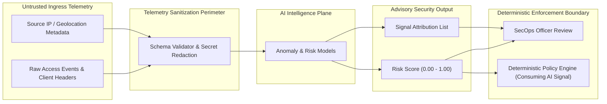
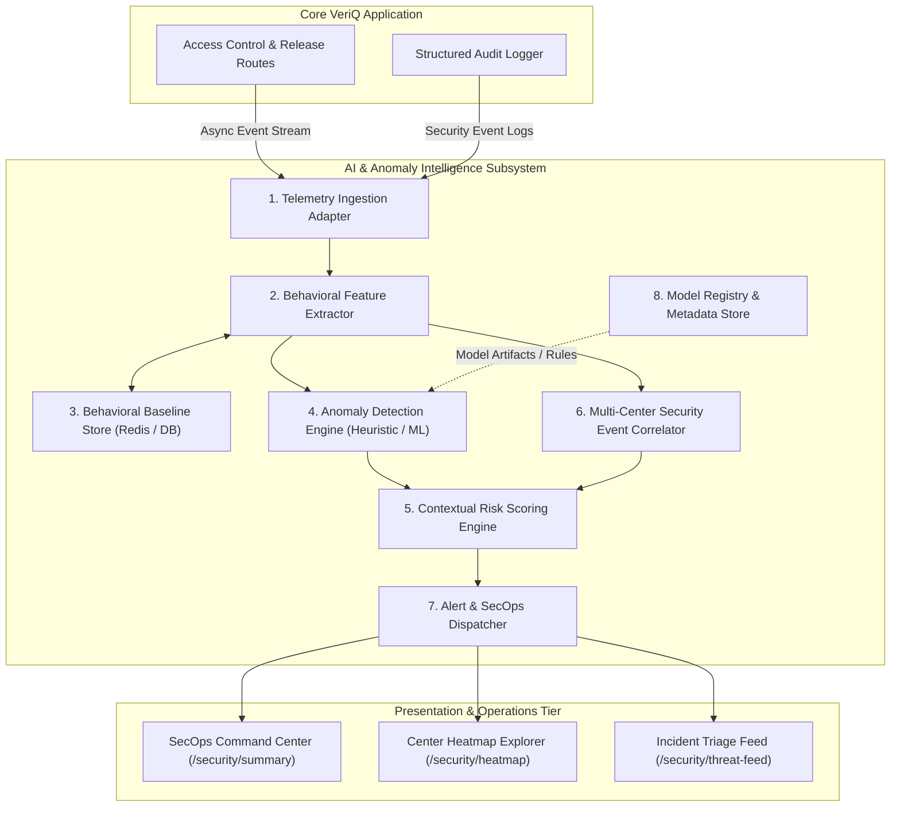
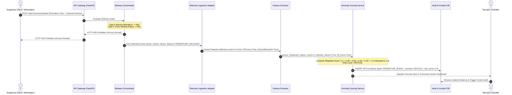
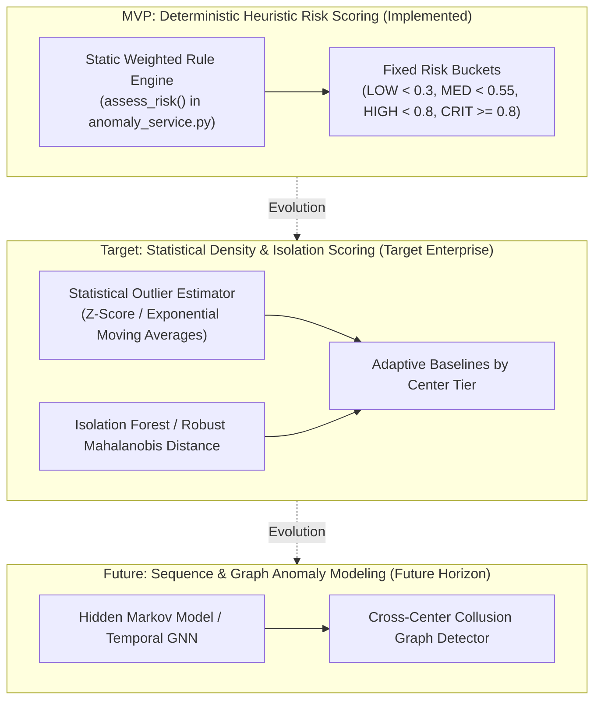
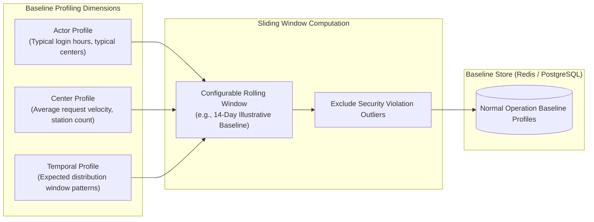
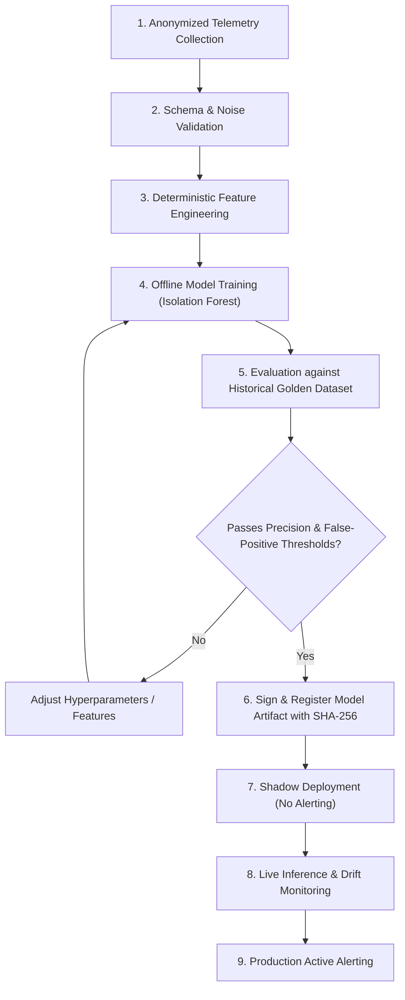
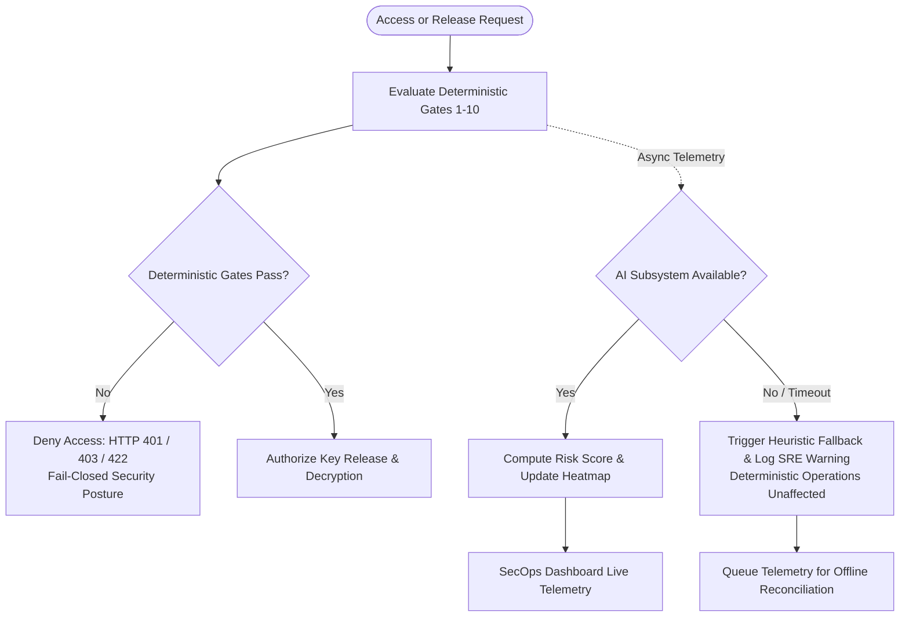

# VeriQ — AI & Anomaly Detection Architecture Specification
**Document ID:** `VERIQ-ARCH-008`  
**Version:** `1.0.2`  
**Status:** `DRAFT / PENDING REVIEW`  
**Upstream Sources of Truth:** `01_REPOSITORY_AUDIT.md`, `02_PRODUCT_BLUEPRINT.md`, `03_PROBLEM_STATEMENT.md`, `04_MARKET_RESEARCH.md`, `05_PRODUCT_REQUIREMENTS.md`, `06_TECHNICAL_REQUIREMENTS.md`, `07_SYSTEM_ARCHITECTURE.md`  
**Downstream Dependents:** `10_API_SPECIFICATION.md`, `11_SECURITY_ARCHITECTURE.md`, `12_UI_UX_DESIGN.md`, `14_TESTING_STRATEGY.md`

---

## 1. Document Metadata & Control

| Attribute | Value |
| :--- | :--- |
| **Product Name** | VeriQ — Secure Examination Paper Distribution Using Blockchain |
| **Tagline** | Secure Every Question Paper. Verify Every Action. |
| **Problem Reference** | WB-03 — Secure Examination Paper Distribution Using Blockchain |
| **Document Classification** | Subsystem Architecture Specification / AI & Security Telemetry Design |
| **Document Owner** | Principal AI Systems Architect & Security Intelligence Working Group |
| **Target Audience** | Backend Engineers, Security Operations (SecOps) Engineers, ML Engineers, Application Security Architects, QA Engineers |
| **Document Purpose** | Formally define whether, where, and how AI, machine learning, and heuristic anomaly detection contribute to VeriQ, establishing the strict subordination of AI intelligence to deterministic security controls. |

---

## 2. Executive AI Architecture Summary

VeriQ's core mission is the tamper-evident, time-locked, and cryptographically verified distribution of high-stakes examination question papers. The core security properties of VeriQ—confidentiality, integrity, authentication, release-window enforcement, and tamper-evident state lineage—are enforced **exclusively by deterministic cryptographic and policy-driven control planes**.

**AI/ML is NOT the security authority in VeriQ.** 

Instead, the AI & Anomaly Detection subsystem operates strictly within an **Advisory and Security Intelligence Plane**:
1. **Role of AI:** Behavioral telemetry analysis, out-of-schedule access anomaly scoring, multi-center risk prioritization, brute-force access clustering, and SecOps investigation assistance.
2. **Subordination to Policy:** AI recommendations, anomaly scores, and risk flags **SHALL NEVER silently override, bypass, or replace** deterministic authorization (RBAC), cryptographic checks (AES-256-GCM / SHA-256), authoritative server UTC time windows, or emergency paper revocation.
3. **No Plaintext Ingestion:** The AI subsystem processes strictly metadata, access logs, timing signals, center identifiers, and error patterns. Raw question paper plaintext content and cryptographic keys **SHALL NEVER be ingested into AI or ML models**.
4. **No Unnecessary Large Language Models:** VeriQ does not employ generative LLMs in the critical path. Anomaly detection relies on explainable heuristic scoring, statistical density estimation, and isolation-based models designed for low-latency operational telemetry.

```mermaid
graph TD
    subgraph DeterministicControlPlane["DETERMINISTIC CONTROL PLANE (Authoritative)"]
        Auth["Authentication (JWT / HMAC)"]
        RBAC["Authorization & Center Scoping"]
        TimeLock["Server UTC Time-Lock Authority"]
        Crypto["AES-256-GCM / SHA-256 Integrity"]
        ReleaseGates["10-Gate Sequential Release Engine"]
        Chain["Distributed Ledger Finality"]
    end

    subgraph SecurityTelemetryStream["TELEMETRY EXPORT (Metadata Only)"]
        Logs["Access Logs & Denials"]
        Timing["Request Timestamps & Frequency"]
        DeviceContext["Device Fingerprint Attributes"]
        AnchorEvents["Ledger Anchoring Status"]
    end

    subgraph AIAdvisoryPlane["AI & ANOMALY INTELLIGENCE PLANE (Advisory Only)"]
        Ingestion["Telemetry Ingestion & Masking"]
        FeatureEngine["Behavioral Feature Extraction"]
        AnomalyEngine["Anomaly Detection & Isolation Engine"]
        RiskScorer["Contextual Risk Scoring Engine"]
        SecOpsAdvisor["Investigation & Alert Dispatcher"]
    end

    subgraph HumanSecOps["SECURITY OPERATIONS & INCIDENT RESPONSE"]
        SOC["SecOps Command Center / Auditor Portal"]
        IncidentTriage["Manual / Policy-Driven Incident Triage"]
    end

    DeterministicControlPlane -->|Emits Security Telemetry| SecurityTelemetryStream
    SecurityTelemetryStream --> Ingestion
    Ingestion --> FeatureEngine
    FeatureEngine --> AnomalyEngine
    AnomalyEngine --> RiskScorer
    RiskScorer --> SecOpsAdvisor
    SecOpsAdvisor -->|Advisory Alerts & Risk Heatmaps| SOC
    SOC --> IncidentTriage
    IncidentTriage -.->|Manual Policy Action (e.g., Paper Revocation)| DeterministicControlPlane
```

---

## 3. AI Scope & Architectural Boundaries

### 3.1 In-Scope Capabilities
- **Behavioral Anomaly Detection:** Detecting abnormal access velocity, out-of-schedule custody inspection requests, and burst authentication failures across examination centers.
- **Contextual Risk Scoring:** Aggregating multi-attribute security telemetry (e.g., device mismatch, timing deviation, hash discrepancies) into normalized risk scores (`LOW`, `MEDIUM`, `HIGH`, `CRITICAL`).
- **Examination Center Risk Heatmaps:** Calculating geographical and center-level risk aggregations to assist Central Examination Controllers during synchronized national exam rollouts.
- **Incident Prioritization & Telemetry Correlation:** Correlating distributed access events sharing identical IP subnets, user agents, or target papers to identify coordinated intrusion attempts.
- **SecOps Investigation Assistance:** Providing transparent, explainable signal breakdowns (e.g., contributing feature attribution) for open security incidents.

### 3.2 Out-of-Scope & Prohibited Capabilities
- **Deciding Paper Release:** AI models SHALL NEVER make paper decryption or key release decisions.
- **Replacing RBAC or Authentication:** AI scores SHALL NOT grant access to unauthenticated or unauthorized actors.
- **Cryptographic Key Handling:** AI models SHALL NOT generate, recover, hold, or process cryptographic encryption keys.
- **Plaintext Content Ingestion:** AI pipelines SHALL NOT ingest, vectorize, summarize, or inspect unencrypted question paper payloads.
- **Overriding Emergency Revocation:** An AI output indicating "low risk" SHALL NEVER unblock a paper or center marked `REVOKED`.
- **Modifying Audit or Ledger State:** AI subsystems SHALL NOT directly write or mutate relational audit logs or blockchain transactions.

---

## 4. AI Necessity Assessment

Before introducing ML complexity, VeriQ formally evaluated the technical necessity of AI against deterministic alternatives:

| Security / Operational Problem | Deterministic Alternative | AI / Heuristic Value-Add | Selected Approach | Architectural Lifecycle |
| :--- | :--- | :--- | :--- | :--- |
| **Enforcing Exam Start Time** | If `now < start_time`, reject request (HTTP 403). | None. AI cannot add value to strict boolean temporal conditions. | **Deterministic Gate 5** (Server UTC NTP) | `MVP` (Mandatory) |
| **Detecting Tampered Papers** | If `SHA256(payload) != anchored_hash`, reject. | None. Cryptographic hashing provides deterministic integrity verification. | **Deterministic Gate 8** (SHA-256) | `MVP` (Mandatory) |
| **Multi-Factor Access Risk Scoring** | Complex static nested `if/else` rules for every combination of security denial. | Provides normalized risk scoring across simultaneous signals (frequency, off-hours, device, hash). | **Heuristic Risk Engine** (`anomaly_service.py`) | `MVP` (Partially Implemented in Prototype) |
| **Center Risk Heatmap Aggregation** | Simple incident counts per center. | Weighs severity of incidents (hash mismatch > timing failure > brute force) dynamically. | **Weighted Severity Aggregator** | `MVP` (Partially Implemented in Prototype) |
| **Coordinated Low-and-Slow Probing** | Rigid rate limiting per IP (bypassed by distributed IPs). | Sequence anomaly detection across temporal sliding windows spanning multiple centers. | **Statistical Isolation / Clustering** | `Target` (Planned) |
| **Natural Language Paper Summarization** | Standard metadata fields (Subject, Grade, Code). | Unnecessary. High risk of leaking confidential questions to LLM memory/logs. | **PROHIBITED** (Zero LLM Ingestion) | `N/A` (Prohibited) |

---

## 5. AI vs. Deterministic Control Plane Comparison

| Operational Dimension | Deterministic Control Plane | AI Intelligence Plane |
| :--- | :--- | :--- |
| **Primary Objective** | Binary access enforcement, payload confidentiality, and cryptographic integrity. | Pattern discovery, risk quantification, and SecOps triage assistance. |
| **Mathematical Foundation** | AES-256-GCM, SHA-256, ECDSA, RFC 7519 JWT, Boolean RBAC Logic. | Weighted heuristics, statistical outlier scoring, isolation forests, clustering. |
| **Execution Authority** | **Authoritative & Enforcing** (Permit / Deny / Abort). | **Advisory & Informational** (Score / Flag / Alert). |
| **Failure Mode** | **Fail-Closed** (Deny access on error). | **Fail-Safe / Degraded** (Continue deterministic enforcement; log alert degradation). |
| **Latency Requirement** | Governed by approved performance requirements defined in the technical requirements and validated through benchmarking. | Asynchronous / near-real-time; numerical latency targets are TBD and shall be established through approved benchmarking and operational validation. |
| **Auditability** | Complete deterministic audit rows & blockchain transaction receipts. | Traceable model inference logs, feature snapshots, and attribution weights. |

---

## 6. AI Trust Model

The AI subsystem operates under a zero-trust model regarding its inputs and advisory outputs:



### 6.1 Trust Model Invariants
1. **Untrusted Telemetry Inputs:** Client-provided metadata (e.g., user agents, canvas fingerprints) are considered untrusted and subject to strict sanitization before feature extraction.
2. **Advisory Outputs:** Anomaly scores and risk classifications generated by the AI subsystem are treated as **untrusted recommendations** until evaluated by an authorized SecOps officer or an explicit deterministic policy engine.
3. **No Autonomous Privilege Escalation:** AI output SHALL NOT autonomously alter user roles, approve question papers, or modify center allocations.

---

## 7. AI Threat Model & Adversarial Mitigations

| Threat ID | Threat Description | Attack Vector | Impact on VeriQ | Implemented Architectural Mitigation |
| :--- | :--- | :--- | :--- | :--- |
| **AT-01** | **Telemetry Poisoning** | Attacker generates high volumes of benign noise to skew statistical anomaly baselines. | Degrades anomaly detection sensitivity (masking true attacks). | Baseline calculation excludes unauthenticated traffic; uses robust statistical medians rather than means. |
| **AT-02** | **Adversarial Evasion** | Attacker probes release endpoints just below heuristic velocity thresholds (low-and-slow). | Avoids triggering velocity-based risk score increases. | Multi-dimensional correlation combining timing, device entropy, and center-wide density metrics. |
| **AT-03** | **False Positive Flooding** | Attacker deliberately triggers benign anomalies to overwhelm SecOps analysts (Alert Fatigue). | SecOps team misses real intrusion events due to alert volume. | Dynamic alert deduplication, risk score thresholding, and severity-weighted alert grouping. |
| **AT-04** | **Model Inversion / Data Leak** | Attacker queries inference API repeatedly to reconstruct underlying training data. | Exposure of historical access patterns or institutional metadata. | Inference APIs restricted to internal SecOps roles; models trained only on aggregated, pseudonymized metadata. |
| **AT-05** | **Sensitive Data Ingestion** | Accidental pipeline inclusion of plaintext paper content or JWT tokens in feature logs. | Plaintext leak via observability logs or model checkpoints. | Automated regex redaction filter in telemetry ingestion pipeline (`LOG-001`). |
| **AT-06** | **Supply Chain Compromise** | Malicious third-party ML dependency or pre-trained model artifact introduced via pip/npm. | Remote code execution or backdoor in telemetry processing pipeline. | Pinned dependencies, automated SAST/SCA scanning (`CI-001`), and refusal to execute unverified binary models. |

---

## 8. AI Logical Component Architecture

The AI subsystem consists of 8 modular components residing within the Application and Observability tiers:



---

## 9. End-to-End AI Telemetry & Risk Scoring Data Flow



---

## 10. AI Input Data Model & Feature Matrix

The AI subsystem operates under strict data classification boundaries:

| Data Attribute | Attribute Category | Description & Usage | Sensitivity Level | Privacy & Security Rules |
| :--- | :--- | :--- | :--- | :--- |
| `center_id` | **Required** | Identifier of the examination center requesting access. | Operational Metadata | Pseudonymized; center scoped. |
| `timestamp_utc` | **Required** | Server UTC timestamp of the access event. | Operational Metadata | Authoritative server clock only. |
| `denial_reason` | **Required** | Machine-readable reason for access denial (e.g., `TIME_EARLY`, `DEVICE_MISMATCH`). | Operational Metadata | Standardized enum values only. |
| `attempt_frequency_5m` | **Derived** | Number of access attempts from this actor/center in the past 5 minutes. | Behavioral Metric | Aggregated in memory/cache. |
| `is_unknown_device` | **Derived** | Boolean flag indicating device fingerprint mismatch. | Security Telemetry | Hash digest of device attributes only. |
| `is_off_hours` | **Derived** | Boolean flag indicating access outside approved center operating schedule (Illustrative baseline — configurable by policy). | Temporal Metric | Computed relative to center timezone. |
| `is_hash_mismatch` | **Derived** | Boolean flag indicating SHA-256 ciphertext or content hash discrepancy. | Critical Security Signal | Triggers immediate risk elevation (+0.80). |
| `paper_plaintext` | **PROHIBITED** | Unencrypted question paper binary, text, or questions. | **CONFIDENTIAL EXAM DATA** | **STRICTLY PROHIBITED FROM INGESTION.** |
| `decryption_keys` | **PROHIBITED** | Symmetric DEK, KEK, private keys, or seed material. | **SECRET KEY MATERIAL** | **STRICTLY PROHIBITED FROM INGESTION.** |
| `bearer_tokens` | **PROHIBITED** | Raw JWT strings, passwords, session cookies. | **CREDENTIAL DATA** | **STRICTLY PROHIBITED FROM INGESTION.** |

---

## 11. Feature Engineering Architecture

Features are derived dynamically from streaming and sliding-window event buffers:

### 11.1 Feature Categories & Derivation Functions

```
+-------------------------------------------------------------------------------+
| 1. Velocity & Frequency Features                                              |
|    - velocity_5min: Count of access attempts in [T-5min, T]                   |
|    - burst_ratio: (Attempts in last 1min) / (Average attempts per min over 1hr)|
|    - failed_auth_rate: Failed auth attempts / Total requests in window        |
+-------------------------------------------------------------------------------+
| 2. Temporal & Schedule Features                                               |
|    - delta_to_window_start: Seconds remaining until release window opens      |
|    - delta_to_window_end: Seconds elapsed since release window closed         |
|    - off_hours_flag: 1 if request outside scheduled center operational hours, else 0 (Policy-defined)  |
+-------------------------------------------------------------------------------+
| 3. Endpoint & Identity Entropy Features                                       |
|    - device_switch_count: Unique device fingerprints seen for actor in 24hr   |
|    - ip_subnet_divergence: Geolocation / Subnet distance from center baseline |
+-------------------------------------------------------------------------------+
| 4. Cryptographic & State Anomaly Features                                     |
|    - hash_discrepancy_flag: 1 if payload SHA-256 != anchored hash, else 0     |
|    - invalid_state_transition_flag: 1 if request violates lifecycle sequence   |
+-------------------------------------------------------------------------------+
```

---

## 12. Anomaly Detection Architecture

VeriQ structures its anomaly detection capabilities across three evolutionary tiers:



### 12.1 MVP Heuristic Anomaly Engine (Current Implementation)
The baseline implementation in `backend/app/services/anomaly_service.py` evaluates explicit additive weights:

$$	ext{Risk Score} = \min\left(1.0, \max\left(0.0, 0.10 + \sum W_i \cdot I_i
ight)
ight)$$

Where indicators $I_i$ and weights $W_i$ are defined as:
- $W_{	ext{hash\_mismatch}} = 0.80$ (Cryptographic tamper detected)
- $W_{	ext{premature\_access}} = 0.45$ (Attempted access ahead of time window)
- $W_{	ext{unknown\_device}} = 0.40$ (Unregistered hardware fingerprint)
- $W_{	ext{burst\_frequency}} = 0.35$ ($> 3$ attempts in 5 minutes)
- $W_{	ext{off\_hours}} = 0.20$ (Out-of-schedule custody inspection)

---

## 13. Contextual Risk Scoring & Priority Classification

Risk scores are mapped into four actionable operational priority tiers:

| Normalized Risk Score ($R$) | Severity Level | Visual Indicator | Deterministic Policy Response (Using AI Signal) | Recommended SecOps Action |
| :--- | :--- | :--- | :--- | :--- |
| **$0.80 \le R \le 1.00$** | **CRITICAL** | Red (Blinking) | Emits CRITICAL advisory signal; deterministic policy engine may increment center threat score and log incident via audit subsystem. | Immediate Controller review; initiate center hardware lock verification. |
| **$0.55 \le R < 0.80$** | **HIGH** | Orange | Emits HIGH advisory signal; flags incident in SecOps threat feed for prioritized analyst triage. | SecOps analyst investigates within operational priority window. |
| **$0.30 \le R < 0.55$** | **MEDIUM** | Yellow | Emits MEDIUM advisory signal; recorded in operational warning telemetry. | Triage in routine operational review. |
| **$0.00 \le R < 0.30$** | **LOW** | Green | Emits LOW advisory signal; archived to operational telemetry. | No action required; archived to telemetry store. |

> [!IMPORTANT]
> The AI subsystem emits strictly advisory signals, scores, and recommendations. Any automated security action or ledger event is executed exclusively by the deterministic application/policy engine using the AI signal as an input. The AI subsystem SHALL NOT directly write blockchain transactions, modify audit state, revoke entities, or authorize key release.

---

## 14. Behavioral Baseline Architecture

To detect anomalies in target enterprise deployments, the system establishes rolling statistical baselines:



### 14.1 Cold-Start & Sparse Data Handling
- **New Examination Centers:** Centers with limited operational history (e.g., $< 7$ days illustrative threshold) default to **Conservative Institutional Baselines** derived from national cluster averages.
- **Sparse Exam Schedules:** Examination papers with low interaction frequencies rely on **Rule-Based Strict Bounds** rather than purely statistical distributions.

---

## 15. Explainability & SecOps Investigation Support

VeriQ mandates **transparent explainability** for all AI and anomaly outputs. Black-box opaque alerts ("AI flagged this") are strictly prohibited.

Every emitted incident contains structured signal attribution:

```json
{
  "incident_id": "INC-2026-9812",
  "centre_id": "CTR-MUM-01",
  "paper_id": "PAP-MATH-01",
  "risk_score": 0.85,
  "risk_level": "CRITICAL",
  "signals": [
    "Document cryptographic SHA-256 mismatch detected against anchored ledger",
    "Hardware fingerprint mismatch: device not authorized for this examination centre"
  ],
  "contributing_factors": [
    {"factor": "is_hash_mismatch", "weight": 0.80},
    {"factor": "is_unknown_device", "weight": 0.40},
    {"factor": "base_score", "weight": 0.10}
  ],
  "classification_notice": "Risk indication calculated from behavioral telemetry, not conclusive proof of malicious intent.",
  "recommended_playbook": "PLAYBOOK-SEC-03: Cryptographic Integrity Investigation",
  "timestamp": "2026-09-16T17:45:00Z"
}
```

---

## 16. AI Security Controls & Perimeter Defense

| Control Area | Security Control Specification | Architectural Implementation | Upstream Traceability |
| :--- | :--- | :--- | :--- |
| **Inference API Auth** | AI telemetry ingestion and query routes require valid admin/secops JWT credentials. | FastAPI RBAC dependency (`ROLE_ADMINISTRATOR`, `ROLE_AUDITOR`). | `AUTHZ-001`, `API-001` |
| **Rate Limiting** | Inference endpoints enforce configurable rate limits per SecOps client (e.g., 100 req/min illustrative limit). | Redis sliding-window token bucket. | `OPS-001` |
| **Model Artifact Integrity** | Heuristic parameter tables and ML models are cryptographically signed (SHA-256 checksums). | Startup integrity verification in `main.py`. | `INT-001` |
| **Secret Sanitization** | Automatic scrubbing of bearer tokens, passwords, and encryption keys from feature buffers. | Custom Pydantic telemetry sanitization validator. | `LOG-001`, `OBS-001` |

---

## 17. Privacy & Data Minimization Architecture

The AI subsystem strictly enforces data minimization principles:
1. **Zero Examination Content Ingestion:** Question papers, question text, answer keys, or candidate responses **SHALL NEVER enter the AI telemetry pipeline**.
2. **Pseudonymized Actor References:** Feature extractors operate on internal surrogate keys (`actor_uuid`) rather than Personally Identifiable Information (PII) such as full names, email addresses, or phone numbers.
3. **Telemetry Data Retention:** Retention periods for raw streaming feature buffers and aggregated risk statistics SHALL be defined by approved examination data governance policies (`PRI-001`). Exact durations (e.g., short-lived volatile buffers vs. persistent historical incident records) are `TBD / Policy-Defined`.

---

## 18. Model Lifecycle & MLOps Architecture

For target enterprise ML models, VeriQ defines an auditable, reproducible model lifecycle:



---

## 19. AI Evaluation & Verification Framework

To prevent alert fatigue and ensure operational reliability, AI models are evaluated against standardized offline test suites:

| Evaluation Metric | Target Benchmark Criteria | Verification Method | Operational Consequence of Failure |
| :--- | :--- | :--- | :--- |
| **Precision (Critical Alerts)** | `TBD / Validation-Dependent` (Target: High precision to minimize false alarms) | Offline regression suite (`test_anomaly.py`) | High false positives cause SecOps alarm fatigue; model blocked from deployment. |
| **Detection Recall** | `TBD / Validation-Dependent` (Target: High sensitivity for multi-signal attacks) | Synthetic adversary injection benchmark | Undetected attacks; model must fail closed to rule-based fallback. |
| **Inference Latency (p99)** | `TBD / Benchmark-Dependent` (Target: Sub-second non-blocking execution) | Locust / k6 performance benchmark | Latency spikes degrade API response times; triggers heuristic fallback. |
| **Feature Drift Tolerance** | `TBD / Policy-Defined` (e.g., Population Stability Index monitoring) | Continuous weekly telemetry drift monitor | Triggers SecOps notification for baseline retraining. |

> [!NOTE]
> All numerical acceptance thresholds shall be established through approved validation, benchmarking, and operational baselining prior to production promotion.

---

## 20. AI Failure, Resilience & Graceful Degradation

A fundamental architectural requirement is that **AI subsystem failure SHALL NEVER compromise deterministic security enforcement**:



### 20.1 Failure Matrix & Degradation Hierarchy
1. **Statistical / ML Model Failure:** If a statistical or ML model is unavailable or fails validation, the subsystem falls back to the approved deterministic heuristic anomaly rules where available (`assess_risk()`).
2. **Complete AI Subsystem Outage:** If the anomaly/AI subsystem itself is unavailable or crashes, deterministic authentication, authorization, cryptographic verification, time-locking, revocation, and release enforcement **continue independently and unaffected**. Telemetry is queued to durable local storage for subsequent replay, and SRE receives an operational warning.
3. **Telemetry Ingestion Overload:** Gateway drops non-critical telemetry metrics while preserving mandatory transactional database audit logs (`AUDIT-001`).

---

## 21. AI Auditability & Provenance Traceability

AI assessments are designed to be auditable and reproducible where the recorded feature inputs, rule/model version, and inference output are available:
1. **Model Version Binding:** Every incident and risk score record contains `model_version` (e.g., `HEURISTIC-v1.0.0` or `ISOFOREST-v2.1.0`).
2. **Feature Snapshot Logging:** The raw boolean indicators and frequency metrics that generated the score are serialized into the JSON payload of the incident table.
3. **Deterministic Replayability:** Given the recorded feature snapshot and model version, SecOps auditors can independently re-compute and mathematically verify the exact score.

---

## 22. AI + Distributed Ledger Boundary

The boundary between AI and the Distributed Ledger is strictly uni-directional:

```mermaid
flowchart LR
    subgraph DistributedLedger["Distributed Ledger Boundary (Tamper-Evident Source of Truth)"]
        SmartContract["VeriQLedger.sol Events"]
        TxReceipts["Block Receipts & Confirmation Depth"]
    end

    subgraph AIPlane["AI Intelligence Plane"]
        ChainWatcher["Ledger Telemetry Ingestion"]
        AnomalyModel["Reorganization & Failure Pattern Detector"]
    end

    SmartContract -->|Read-Only Event Metadata| ChainWatcher
    TxReceipts -->|Read-Only Status (PENDING / CONFIRMED)| ChainWatcher
    ChainWatcher --> AnomalyModel
    AnomalyModel -->|Emits Advisory Alert on Desync| SecOps[SecOps Command Center]

    AIPlane -. "PROHIBITED: Cannot write, forge, or alter on-chain state" .-x DistributedLedger
```

- **Permitted Interaction:** AI processes on-chain event logs and confirmation latency to detect network partitioning, RPC degradation, or unusual transaction failure bursts.
- **Strict Prohibition:** AI models SHALL NEVER sign transactions, modify smart contract state, forge audit hashes, or alter blockchain consensus parameters.

---

## 23. AI + Release Engine Boundary

The interaction between AI intelligence and the Sequential 10-Gate Release Engine is strictly decoupled:

```mermaid
graph TD
    subgraph ReleaseEngine["Sequential 10-Gate Release Engine (Deterministic)"]
        Gate1["Gate 1: Auth"] --> Gate2["Gate 2: Role"]
        Gate2 --> Gate3["Gate 3: Center"]
        Gate3 --> Gate4["Gate 4: Device"]
        Gate4 --> Gate5["Gate 5: Time"]
        Gate5 --> Gate6["Gate 6: State"]
        Gate6 --> Gate7["Gate 7: Revocation"]
        Gate7 --> Gate8["Gate 8: Hash"]
        Gate8 --> Gate9["Gate 9: Key Release"]
        Gate9 --> Gate10["Gate 10: Audit Log"]
    end

    subgraph AIAdvisory["AI Advisory Subsystem"]
        RiskIndicator["Telemetry Anomaly Assessment"]
        CenterRiskScore["Center Risk Indicator (0-100)"]
    end

    ReleaseEngine -->|1. Asynchronous Telemetry Event| AIAdvisory
    AIAdvisory -.->|2. Optional Pre-Release Risk Advisory to Controller| SecOpsConsole[Controller / SecOps UI]
    
    SecOpsConsole -.->|3. Manual Controller Revocation (If warranted)| Gate7
```

- The 10-Gate release engine executes autonomously. It **does not wait for AI evaluation** to complete before returning decryption streams to authorized users.
- Anomaly scores inform Central Controllers and SecOps dashboards; if an anomaly is severe, a human Controller may execute formal emergency revocation (`SEC-001`), which immediately halts release at Gate 7.

---

## 24. MVP vs. Target vs. Future AI Architecture

| Capability Area | Current Repository Baseline (`01`) | MVP Target Architecture | Target Enterprise Architecture | Future Horizon (Post-Launch) |
| :--- | :--- | :--- | :--- | :--- |
| **Risk Scoring Algorithm** | `[PARTIAL]` Static weighted heuristic in `anomaly_service.py`. | Standardized, configurable multi-signal heuristic engine. | Isolation Forest + statistical outlier density models. | Temporal Sequence Graph Neural Networks (GNN). |
| **Center Threat Heatmap** | `[PARTIAL]` Prototype `/security/heatmap` endpoint aggregating basic incidents. | Dynamic severity-weighted center risk heatmap in UI. | Real-time geospatial risk clustering and anomaly feed. | Predictive risk modeling based on historical exam series. |
| **SecOps Threat Feed** | `[PARTIAL]` Prototype `/security/threat-feed` displaying open incidents from DB. | Structured incident feed with contributing feature breakdown. | Automated playbook recommendation and SecOps triage queue. | Automated SOAR workflow orchestration. |
| **Machine Learning Models** | `[NOT FOUND]` Zero ML weights or trained models in repository (Target capability). | Pure explainable heuristic engine (zero opaque ML black-boxes). | Supervised / Unsupervised Isolation models for probing detection. | Multi-modal access pattern classification. |
| **Large Language Models (LLM)** | `[NOT FOUND]` No LLMs present in repository. | **PROHIBITED** (Zero LLMs in core distribution pipeline). | **PROHIBITED** (Zero LLMs in core distribution pipeline). | Optional read-only audit log natural-language query assistant (SecOps only). |

---

## 25. Architecture Decision Records (ADRs)

### ADR-001: Subordination of AI to Deterministic Policy Controls
- **Context:** High-stakes examination distribution requires deterministic legal accountability and cryptographically verifiable security enforcement. Probabilistic AI models can suffer from false positives and false negatives.
- **Decision:** AI models SHALL serve strictly in an advisory and observability capacity. All authentication, authorization, cryptographic decryption, time-locking, and revocation decisions are executed exclusively by deterministic policy engines.
- **Status:** `ACCEPTED` (Source: `AVAIL-001`, `AUTHZ-001`, `TIME-001`).

### ADR-002: Complete Exclusion of Plaintext Question Papers from AI Telemetry
- **Context:** Ingesting question paper content into AI processing pipelines creates secondary data leakage vectors and violates confidentiality invariants.
- **Decision:** The AI and anomaly detection subsystem SHALL ingest only operational metadata, timestamps, center IDs, and error codes. Plaintext question papers and cryptographic keys are strictly excluded.
- **Status:** `ACCEPTED` (Source: `BC-002`, `PRI-001`, `LOG-001`).

### ADR-003: Selection of Explainable Heuristics for MVP Anomaly Scoring
- **Context:** Complex deep learning models require large training datasets, introduce inference latency, and act as opaque black boxes during critical examination investigations.
- **Decision:** Deploy a transparent, explainable additive heuristic scoring engine (`anomaly_service.py`) for MVP, ensuring signal attribution is auditable through recorded feature inputs, rule versions, and inference outputs.
- **Status:** `ACCEPTED` (Source: `UX-001`, `OBS-001`).

### ADR-004: Asynchronous Decoupling of AI Telemetry from the Release Engine
- **Context:** Synchronous anomaly scoring in the critical release path introduces latency and risks blocking legitimate examination centers during AI outages.
- **Decision:** Telemetry ingestion and risk scoring execute asynchronously; failures in the AI subsystem do not block or delay deterministic release gate evaluations.
- **Status:** `ACCEPTED` (Source: `PERF-001`, `AVAIL-002`).

---

## 26. Open AI Decisions & TBD Register

| Decision ID | Area | Current Options Under Evaluation | Tradeoff & Architectural Impact | Target Resolution Milestone |
| :--- | :--- | :--- | :--- | :--- |
| **TBD-001** | Production ML Model Framework | 1. Scikit-Learn Isolation Forest<br/>2. ONNX Runtime Lightweight Embeddings | Python ecosystem simplicity vs. cross-platform C++ execution speed. | Prior to Phase 3 Implementation |
| **TBD-002** | Telemetry Stream Architecture | 1. Async PostgreSQL Table Notifies<br/>2. Redis Streams / Kafka Event Bus | Zero-dependency prototype simplicity vs. high-throughput enterprise event scaling. | Prior to Target Deployment |
| **TBD-003** | Automated Threshold Tuning | 1. Static SecOps-Configured Weights<br/>2. Bayesian Auto-Tuned Severity Weights | Operational transparency vs. adaptive sensitivity optimization. | Phase 3 Optimization |
| **TBD-004** | Natural Language SecOps Assistant | 1. Defer entirely<br/>2. Sandboxed Local LLM (Ollama) for Auditor Queries | Security surface minimization vs. auditor investigation efficiency. | Future Horizon |

---

## 27. Requirements Traceability Matrix (05 / 06 / 07 $
ightarrow$ 08)

| Upstream Requirement ID | Upstream Document | Architectural Realization in AI Subsystem (`08`) |
| :--- | :--- | :--- |
| **SEC-002** | `05_PRODUCT_REQUIREMENTS.md` | Automated incident generation and risk scoring on security policy violations (Section 13). |
| **OBS-001** | `05_PRODUCT_REQUIREMENTS.md` | Automated redaction of secrets, tokens, and PII in AI telemetry ingestion pipeline (Section 17). |
| **AUTH-004** | `05_PRODUCT_REQUIREMENTS.md` | Authentication failure pattern detection and burst velocity feature engineering (Section 11). |
| **AUTH-003** | `06_TECHNICAL_REQUIREMENTS.md` | Real-time monitoring of failed authentication attempts for brute-force clustering (Section 10). |
| **LOG-001** | `06_TECHNICAL_REQUIREMENTS.md` | Mandatory regex masking of sensitive key material prior to feature extraction (Section 16). |
| **AVAIL-001** | `06_TECHNICAL_REQUIREMENTS.md` | Deterministic fail-closed policy maintained independently of AI subsystem status (Section 20). |
| **AVAIL-002** | `06_TECHNICAL_REQUIREMENTS.md` | Graceful degradation of AI alerting during telemetry queue backlog (Section 20). |
| **Anomaly Scoring Svc** | `07_SYSTEM_ARCHITECTURE.md` | Formal structural specification of `anomaly_service.py` within Layer 4 Domain Tier (Section 8). |

---

## 28. AI Architecture Summary & Quality Sign-Off Checklist

- [x] **Strict Subordination Established:** AI is formally defined as an advisory intelligence plane; all security enforcement remains strictly deterministic.
- [x] **Zero Plaintext Ingestion Invariant:** Plaintext examination papers and cryptographic keys are strictly excluded from AI pipelines.
- [x] **Zero Gate Bypass:** AI models cannot authorize key release, override time windows, bypass RBAC, or unblock revoked entities.
- [x] **Explainable Signal Attribution:** All risk scores provide explicit, auditable breakdowns of contributing behavioral factors.
- [x] **Graceful Failure Posture:** Failure, corruption, or timeout of AI models does not impact core examination distribution or release.
- [x] **Complete Upstream Traceability:** Fully mapped to security, observability, and anomaly requirements in `05`, `06`, and `07`.
- [x] **No Fabricated Buzzwords or Claims:** Prohibits unnecessary generative LLMs; eliminates unsupported claims or marketing assertions.
