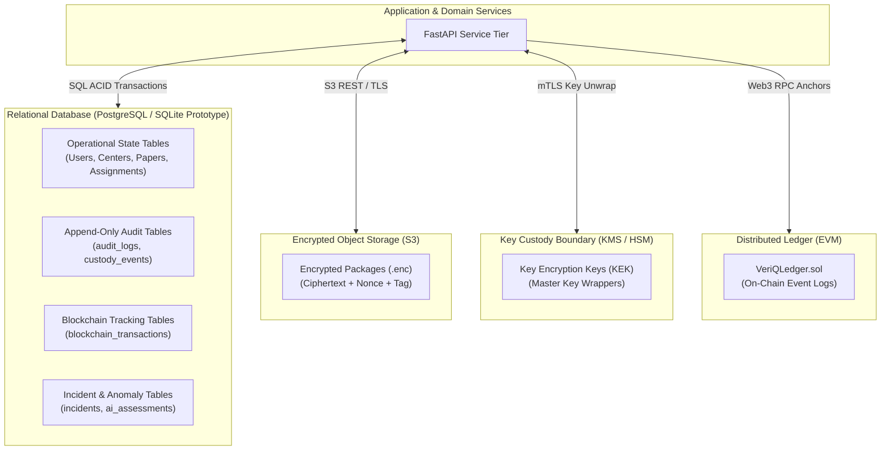
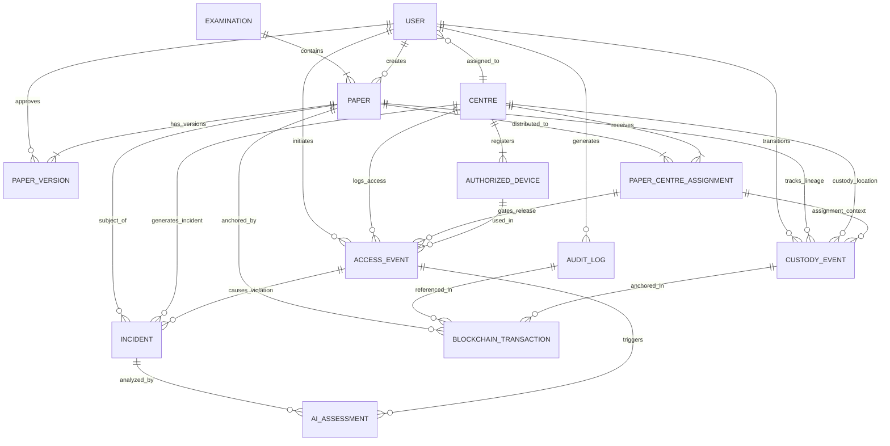
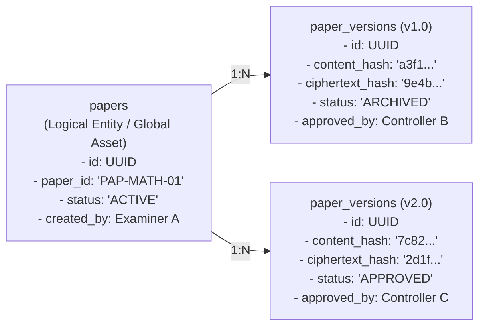
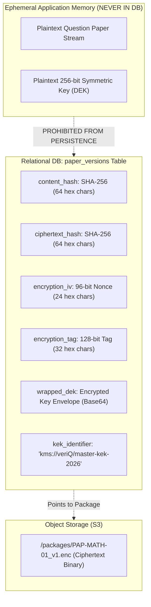
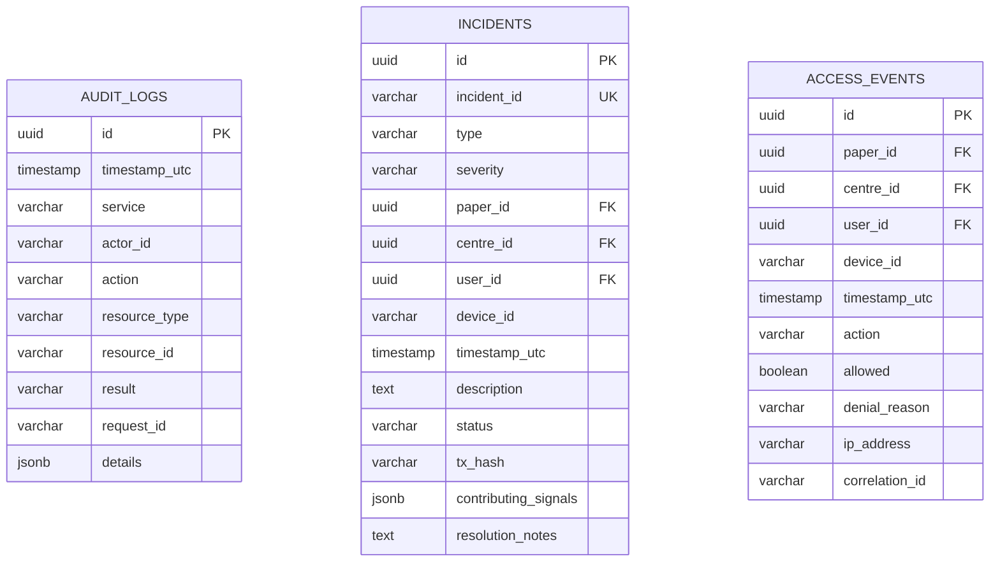
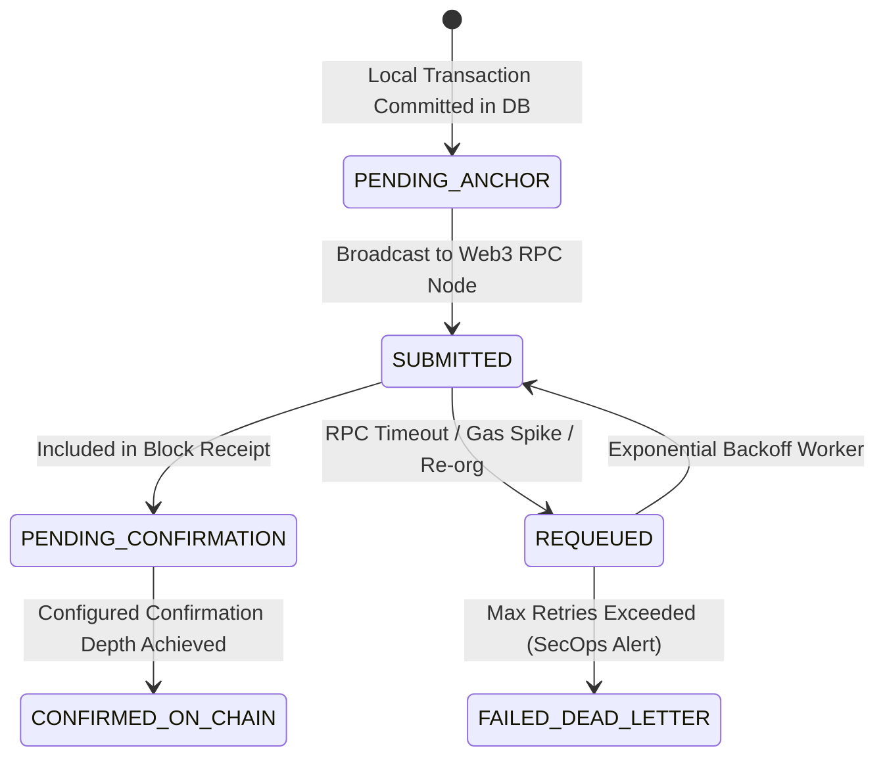
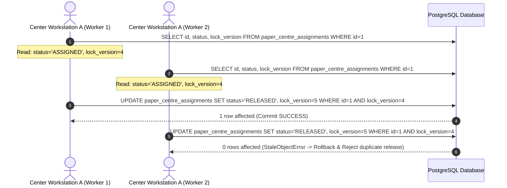
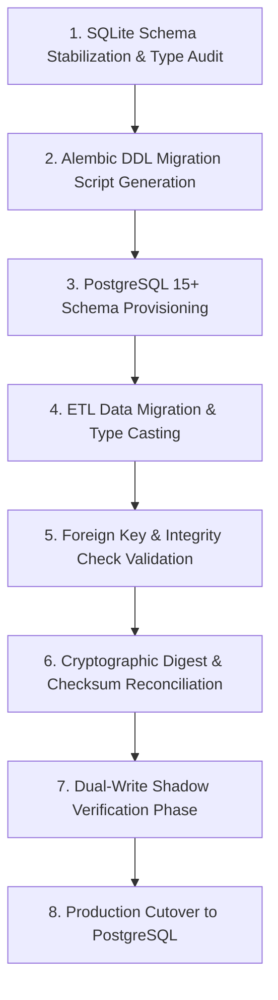

# VeriQ — Database & Persistence Architecture Specification
**Document ID:** `VERIQ-DB-009`  
**Version:** `1.0.1`  
**Status:** `DRAFT / PENDING REVIEW`  
**Upstream Sources of Truth:** `01_REPOSITORY_AUDIT.md`, `02_PRODUCT_BLUEPRINT.md`, `03_PROBLEM_STATEMENT.md`, `04_MARKET_RESEARCH.md`, `05_PRODUCT_REQUIREMENTS.md`, `06_TECHNICAL_REQUIREMENTS.md`, `07_SYSTEM_ARCHITECTURE.md`, `08_AI_ARCHITECTURE.md`  
**Downstream Dependents:** `10_API_SPECIFICATION.md`, `11_SECURITY_ARCHITECTURE.md`, `13_DEPLOYMENT.md`, `14_TESTING_STRATEGY.md`

---

## 1. Document Metadata & Control

| Attribute | Value |
| :--- | :--- |
| **Product Name** | VeriQ — Secure Examination Paper Distribution Using Blockchain |
| **Tagline** | Secure Every Question Paper. Verify Every Action. |
| **Problem Reference** | WB-03 — Secure Examination Paper Distribution Using Blockchain |
| **Document Classification** | Database & Persistence Architecture Specification / Data Modeling Specification |
| **Document Owner** | Principal Database Architect & Data Security Engineering Working Group |
| **Target Audience** | Backend Engineers, Database Administrators, Security Architects, Cryptographic Engineers, DevOps/SREs, QA Engineers |
| **Document Purpose** | Define the conceptual, logical, and relational data architecture for VeriQ, establishing entity relationships, integrity constraints, cryptographic key boundaries, audit trails, blockchain anchor tracking, and the migration path from SQLite to PostgreSQL. |

---

## 2. Database Architecture Executive Summary

VeriQ's database architecture provides transactional state persistence, referential integrity, and append-oriented audit storage for the question paper distribution lifecycle. The persistence model strictly enforces separation of concerns across the storage layer:

1. **Relational Database (Operational State & Audit):** Manages relational entities (Users, Roles, Centers, Devices, Papers, Versions, Assignments, Incidents, Audits). In the target architecture, PostgreSQL enforces atomic transaction boundaries, optimistic locking (`lock_version`), foreign key cascades, and check constraints.
2. **Encrypted Blob Storage (Payload Ciphertext):** Persistent S3-compatible object store for encrypted question paper binary packages (`.enc`). The database stores only object URIs, initialization vectors, authentication tags, and cryptographic hashes. **Plaintext examination content SHALL NEVER be persisted in the database.**
3. **Key Custody Boundary (KMS / HSM):** Symmetric Data Encryption Keys (DEKs) are stored in the database exclusively in wrapped form (`wrapped_dek`) encrypted by a master Key Encryption Key (KEK). **Plaintext symmetric keys SHALL NEVER exist in database columns or table rows.**
4. **Distributed Ledger (Tamper-Evident Lineage):** Blockchain smart contracts anchor cryptographic digests (`content_hash`, `ciphertext_hash`) and lifecycle state transitions. The database tracks anchor lifecycle states (`PENDING_ANCHOR` vs. `CONFIRMED_ON_CHAIN`) without duplicating the ledger.
5. **AI Telemetry Boundary:** Ingests only operational metadata, timestamps, and error patterns. Raw question content, credentials, and cryptographic keys are strictly excluded.



---

## 3. Database Responsibility Boundary Matrix

| Data Domain / Artifact | Relational Database | Encrypted Object Storage | Key Custody (KMS) | Distributed Ledger | AI Telemetry Store |
| :--- | :--- | :--- | :--- | :--- | :--- |
| **Plaintext Question Papers** | **PROHIBITED** | **PROHIBITED** | **PROHIBITED** | **PROHIBITED** | **PROHIBITED** |
| **Encrypted Paper Packages (`.enc`)** | Object URI only | **Primary Storage** | No | No | No |
| **Content Hash (`content_hash`)** | Primary Metadata | No | No | **Anchored (Approval)** | Feature input |
| **Ciphertext Hash (`ciphertext_hash`)** | Primary Metadata | No | No | **Anchored (Distribution)**| Feature input |
| **Plaintext Symmetric Keys (DEK)** | **PROHIBITED** | **PROHIBITED** | Ephemeral Memory | **PROHIBITED** | **PROHIBITED** |
| **Wrapped Encryption Keys (`wrapped_dek`)** | **Stored (Encrypted)** | No | Generates/Unwraps | **PROHIBITED** | **PROHIBITED** |
| **User & Role Authentication Data** | Stored (Hashed) | No | No | No | No |
| **Center & Device Bindings** | Stored (Active status)| No | No | Fingerprint digest | Context input |
| **Authoritative Release Windows** | Stored (UTC Start/End)| No | No | Anchored | Timing feature |
| **Append-Only Audit Logs** | **Primary Storage** | Optional Cold Archive | No | Anchored Receipts | Training source |
| **Blockchain Transaction Status** | `PENDING` / `CONFIRMED` | No | No | Transaction State | Latency feature |
| **AI Anomaly & Risk Scores** | Stored (Advisory) | No | No | Reason Hash on Revoke | Primary Output |

---

## 4. Data Classification & Protection Architecture

| Classification Tier | Description | Examples | Database Storage Rule | Protection Controls |
| :--- | :--- | :--- | :--- | :--- |
| **Tier 1: Public / Low Sensitivity** | Non-sensitive operational reference data. | Subject names, examination codes, city/state names. | Plaintext relational columns. | Standard database integrity constraints. |
| **Tier 2: Operational Metadata** | System routing, timing, and workflow state. | Release window UTC timestamps, paper status, version strings. | Plaintext relational columns. | Role-based database query scoping; optimistic locking. |
| **Tier 3: Cryptographic Metadata** | Hashes, nonces, and wrapped key envelopes. | `content_hash`, `ciphertext_hash`, `encryption_iv`, `wrapped_dek`. | Dedicated binary/hex string columns. | Strict referential integrity; immutable post-approval. |
| **Tier 4: Security-Sensitive Telemetry** | Actor identities, device fingerprints, audit records. | `actor_id`, `device_fingerprint`, `ip_address`, `denial_reason`. | Restricted relational tables. | Append-only permissions; pseudonymization where applicable. |
| **Tier 5: Authentication Secrets** | User credential verification data. | `hashed_password` (Argon2id / bcrypt). | One-way cryptographic hash columns. | Salting + strong hashing; never logged or exported. |
| **Tier 6: Confidential Material** | Plaintext examination questions, master private keys. | Raw exam PDF binaries, unencrypted DEK/KEK. | **STRICTLY PROHIBITED FROM PERSISTENCE.** | Processed strictly in volatile ephemeral memory buffers. |

---

## 5. Conceptual Entity-Relationship Data Model

The conceptual data model captures the complete operational lifecycle, separation-of-duties approval, multi-center distribution, release gating, audit logging, and blockchain anchor tracking:



---

## 6. Entity Catalog & Structural Specification

### 6.1 `users` (Actor Identity & Role Binding)
- **Purpose:** Represents authenticated administrative, authoring, supervisory, and auditing actors.
- **Role Modeling Architecture Decision:**
  - **MVP Design (Selected):** Single constrained role per actor stored directly in `users.role` with strict enum check constraints (`ADMINISTRATOR`, `EXAMINER`, `CONTROLLER`, `SUPERINTENDENT`, `AUDITOR`).
  - **Target Enterprise Design (`[TARGET / TBD]`):** Normalized `roles` and `user_roles` mapping tables if multi-role institutional delegation is required in future releases.
- **Lifecycle:** Created by Admin $\rightarrow$ Active $\rightarrow$ Suspended $\rightarrow$ Revoked.
- **Security Sensitivity:** Tier 4 / Tier 5 (Contains credential hashes).
- **Primary Key:** `id` (UUIDv4).
- **Natural / Unique Key:** `username` (VARCHAR 50, UNIQUE), `email` (VARCHAR 255, UNIQUE).
- **Foreign Keys:** `centre_id` $\rightarrow$ `centres(id)` (Nullable, ON DELETE SET NULL).
- **Immutable Fields:** `id`, `created_at`.
- **Mutable Fields:** `hashed_password`, `role`, `is_active`, `last_login`, `lock_version`.
- **Required Indexes:** `ix_users_username` (UNIQUE), `ix_users_email` (UNIQUE), `ix_users_centre_id`.
- **Current Baseline (`01`):** `[IMPLEMENTED]` Present in SQLite prototype (`entities.py`).
- **Target State (`07`):** `[TARGET]` Strict role enum check constraints, Argon2id password hashing, and optimistic locking.

### 6.2 `examinations` (Institutional Examination Container)
- **Purpose:** Groups subjects, sessions, scheduled dates, and global examination metadata.
- **Lifecycle:** Scheduled $
ightarrow$ In Progress $
ightarrow$ Concluded $
ightarrow$ Archived.
- **Security Sensitivity:** Tier 1 / Tier 2.
- **Primary Key:** `id` (UUIDv4).
- **Natural / Unique Key:** `exam_code` (VARCHAR 50, UNIQUE).
- **Immutable Fields:** `id`, `created_at`.
- **Mutable Fields:** `title`, `scheduled_date`, `start_time`, `end_time`, `status`, `total_marks`.
- **Required Indexes:** `ix_examinations_exam_code` (UNIQUE), `ix_examinations_status`.
- **Current Baseline (`01`):** `[IMPLEMENTED]` Present in SQLite prototype (`entities.py`).
- **Target State (`07`):** `[TARGET]` Bounded time checks and foreign key cascades to papers.

### 6.3 `papers` (Abstract Question Paper Entity)
- **Purpose:** Represents the top-level logical question paper asset across its version lifecycle.
- **Lifecycle:** Draft $
ightarrow$ Active $
ightarrow$ Revoked $
ightarrow$ Archived.
- **Security Sensitivity:** Tier 2 / Tier 3.
- **Primary Key:** `id` (UUIDv4).
- **Natural / Unique Key:** `paper_id` (VARCHAR 50, UNIQUE).
- **Foreign Keys:** `exam_id` $
ightarrow$ `examinations(id)` (ON DELETE RESTRICT), `created_by` $
ightarrow$ `users(id)`.
- **Immutable Fields:** `id`, `paper_id`, `exam_id`, `created_by`, `created_at`.
- **Mutable Fields:** `current_version_id`, `status`, `revocation_reason`, `revoked_at`, `lock_version`.
- **Required Indexes:** `ix_papers_paper_id` (UNIQUE), `ix_papers_exam_id`, `ix_papers_status`.
- **Current Baseline (`01`):** `[IMPLEMENTED]` Present in SQLite prototype (`entities.py`).
- **Target State (`07`):** `[TARGET]` Refactored to separate logical paper from discrete versions (`paper_versions`).

### 6.4 `paper_versions` (Discrete Immutable Question Paper Version)
- **Purpose:** Holds immutable version-specific cryptographic digests, envelope metadata, and approval state.
- **Lifecycle:** Draft $
ightarrow$ Pending Review $
ightarrow$ Approved $
ightarrow$ Packaged $
ightarrow$ Archived.
- **Security Sensitivity:** Tier 3 (Cryptographic Envelopes).
- **Primary Key:** `id` (UUIDv4).
- **Natural / Unique Key:** `(paper_id, version_number)` (COMPOSITE UNIQUE).
- **Foreign Keys:** `paper_id` $
ightarrow$ `papers(id)` (ON DELETE CASCADE), `approved_by` $
ightarrow$ `users(id)`.
- **Immutable Fields (Post-Approval):** `content_hash`, `ciphertext_hash`, `encryption_iv`, `encryption_tag`, `wrapped_dek`, `approved_by`, `approved_at`.
- **Mutable Fields:** `status` (Until `APPROVED`, after which entity is locked), `lock_version`.
- **Required Indexes:** `ix_paper_versions_composite` (paper_id, version_number UNIQUE), `ix_paper_versions_content_hash`.
- **Current Baseline (`01`):** `[PARTIAL]` Version fields stored directly on `papers` table in prototype.
- **Target State (`07`):** `[TARGET]` Discrete immutable table enforcing strict separation of duties and dual-digest storage.

### 6.5 `centres` (Examination Center Registry)
- **Purpose:** Represents authorized physical facilities designated to conduct examinations.
- **Lifecycle:** Pending Authorization $
ightarrow$ Active $
ightarrow$ Flagged $
ightarrow$ Suspended $
ightarrow$ Revoked.
- **Security Sensitivity:** Tier 2.
- **Primary Key:** `id` (UUIDv4).
- **Natural / Unique Key:** `centre_id` (VARCHAR 50, UNIQUE), `code` (VARCHAR 50, UNIQUE).
- **Immutable Fields:** `id`, `created_at`.
- **Mutable Fields:** `name`, `city`, `state`, `is_authorized`, `status`, `lock_version`.
- **Required Indexes:** `ix_centres_centre_id` (UNIQUE), `ix_centres_code` (UNIQUE), `ix_centres_status`.
- **Current Baseline (`01`):** `[IMPLEMENTED]` Present in SQLite prototype (`entities.py`).
- **Target State (`07`):** `[TARGET]` Multi-tenant center scoping constraints and status checks.

### 6.6 `authorized_devices` (Registered Workstation Endpoints)
- **Purpose:** Binds approved physical workstations to specific examination centers.
- **Lifecycle:** Pending $
ightarrow$ Authorized $
ightarrow$ Suspended $
ightarrow$ Revoked.
- **Security Sensitivity:** Tier 4 (Device Telemetry).
- **Primary Key:** `id` (UUIDv4).
- **Natural / Unique Key:** `device_id` (VARCHAR 100, UNIQUE).
- **Foreign Keys:** `centre_id` $
ightarrow$ `centres(id)` (ON DELETE CASCADE).
- **Immutable Fields:** `id`, `device_id`, `registered_at`.
- **Mutable Fields:** `device_fingerprint`, `device_name`, `os`, `ip_address`, `status`, `last_seen`.
- **Required Indexes:** `ix_devices_device_id` (UNIQUE), `ix_devices_centre_id`, `ix_devices_fingerprint`.
- **Current Baseline (`01`):** `[IMPLEMENTED]` Present in SQLite prototype (`entities.py`).
- **Target State (`07`):** `[TARGET]` Server-side fingerprint correlation and real-time revocation checking.

### 6.7 `paper_centre_assignments` (Distribution & Release Window Binding)
- **Purpose:** Maps specific paper versions to authorized centers with bounded time-locked release windows.
- **Lifecycle:** Assigned $
ightarrow$ Staged $
ightarrow$ Active $
ightarrow$ Released $
ightarrow$ Expired $
ightarrow$ Cancelled.
- **Security Sensitivity:** Tier 2 / Tier 3.
- **Primary Key:** `id` (UUIDv4).
- **Natural / Unique Key:** `(paper_version_id, centre_id)` (COMPOSITE UNIQUE).
- **Foreign Keys:** `paper_version_id` $
ightarrow$ `paper_versions(id)`, `centre_id` $
ightarrow$ `centres(id)`.
- **Immutable Fields:** `id`, `paper_version_id`, `centre_id`, `created_at`.
- **Mutable Fields:** `release_window_start`, `release_window_end`, `status`, `staged_at`, `released_at`, `lock_version`.
- **Required Indexes:** `ix_pca_composite` (UNIQUE), `ix_pca_window` (release_window_start, release_window_end).
- **Current Baseline (`01`):** `[IMPLEMENTED]` Present in prototype (`entities.py`).
- **Target State (`07`):** `[TARGET]` Authoritative server UTC check constraints and staging status tracking.

### 6.8 `access_events` (Release Requests & Authorization Attempts)
- **Purpose:** Records every paper access, staging download, verification, and decryption request with security context and gate outcomes.
- **Semantics Distinction:** Captures request/attempt telemetry; distinct from formal lifecycle state transitions in `custody_events`.
- **Lifecycle:** Insert-Only (Immutable after insertion).
- **Security Sensitivity:** Tier 4.
- **Primary Key:** `id` (UUIDv4).
- **Foreign Keys:** `paper_id` $\rightarrow$ `papers(id)`, `centre_id` $\rightarrow$ `centres(id)`, `user_id` $\rightarrow$ `users(id)`.
- **Immutable Fields:** Insert-Only (All columns).
- **Mutable Fields:** None.
- **Required Indexes:** `ix_access_paper_time` (paper_id, timestamp), `ix_access_centre_time` (centre_id, timestamp), `ix_access_allowed`.
- **Current Baseline (`01`):** `[IMPLEMENTED]` Present in prototype (`entities.py`).
- **Target State (`07`):** `[TARGET]` Enforced append-only database table permissions and correlation ID injection.

### 6.9 `custody_events` (Chain-of-Custody & State Transition Lineage)
- **Purpose:** Represents formal question paper lifecycle transitions and custody transfers independently from general access telemetry.
- **Lifecycle:** Insert-Only (Immutable after insertion).
- **Security Sensitivity:** Tier 3 / Tier 4.
- **Primary Key:** `id` (UUIDv4).
- **Foreign Keys:** `paper_id` $\rightarrow$ `papers(id)`, `paper_version_id` $\rightarrow$ `paper_versions(id)`, `assignment_id` $\rightarrow$ `paper_centre_assignments(id)` (Nullable), `actor_id` $\rightarrow$ `users(id)`, `audit_log_id` $\rightarrow$ `audit_logs(id)`.
- **Immutable Fields:** `id`, `paper_id`, `paper_version_id`, `assignment_id`, `previous_state`, `new_state`, `actor_id`, `centre_id`, `timestamp_utc`, `reason`, `correlation_id`, `tx_hash`.
- **Mutable Fields:** None.
- **Required Indexes:** `ix_custody_paper` (paper_id, timestamp_utc), `ix_custody_state` (previous_state, new_state).
- **Current Baseline (`01`):** `[PARTIAL]` Deduced from paper status changes and access events in prototype.
- **Target State (`07`):** `[TARGET]` Dedicated chain-of-custody table linked to blockchain anchor transactions.

### 6.10 `blockchain_transactions` (On-Chain Anchor Lifecycle & Receipts)
- **Purpose:** Tracks distributed ledger transactions, confirmation depth, and event anchoring state.
- **Lifecycle:** Queued (`PENDING_ANCHOR`) $\rightarrow$ Submitted $\rightarrow$ Mined (`PENDING_CONFIRMATION`) $\rightarrow$ Finalized (`CONFIRMED_ON_CHAIN`) / Dead-Letter.
- **Security Sensitivity:** Tier 3.
- **Primary Key:** `id` (UUIDv4).
- **Natural / Unique Key:** `tx_hash` (VARCHAR 66, UNIQUE when submitted).
- **Foreign Keys:** `paper_id` $\rightarrow$ `papers(id)`.
- **Immutable Fields:** `id`, `paper_id`, `event_type`, `payload_hash`, `created_at`.
- **Mutable Fields:** `tx_hash`, `block_number`, `status`, `confirmed_at`, `retry_count`, `last_error`.
- **Required Indexes:** `ix_bt_tx_hash` (UNIQUE), `ix_bt_status`, `ix_bt_paper_id`.
- **Current Baseline (`01`):** `[MOCKED]` In-memory dictionary in prototype; mock table in SQLite.
- **Target State (`07`):** `[TARGET]` Two-stage confirmation tracking, retry queue management, and finality depth recording.

### 6.11 `incidents` (Security Policy Violations & Threat Triage)
- **Purpose:** Stores detected security anomalies, failed release attempts, and policy violations for SecOps investigation.
- **Lifecycle:** Open $\rightarrow$ Investigating $\rightarrow$ Acknowledged $\rightarrow$ Resolved $\rightarrow$ Closed.
- **Security Sensitivity:** Tier 4.
- **Primary Key:** `id` (UUIDv4).
- **Natural / Unique Key:** `incident_id` (VARCHAR 50, UNIQUE).
- **Foreign Keys:** `paper_id` $\rightarrow$ `papers(id)`, `centre_id` $\rightarrow$ `centres(id)`, `user_id` $\rightarrow$ `users(id)`.
- **Immutable Fields:** `id`, `incident_id`, `type`, `timestamp`.
- **Mutable Fields:** `severity`, `status`, `description`, `tx_hash`, `resolution_notes`, `resolved_at`, `lock_version`.
- **Required Indexes:** `ix_incidents_incident_id` (UNIQUE), `ix_incidents_status`, `ix_incidents_severity`.
- **Current Baseline (`01`):** `[IMPLEMENTED]` Present in prototype (`entities.py`).
- **Target State (`07`):** `[TARGET]` Severity-weighted indexing, contributing factor JSON storage, and SecOps resolution tracking.

### 6.12 `ai_assessments` (Advisory Anomaly & Risk Telemetry)
- **Purpose:** Stores advisory risk scores, heuristic evaluations, and feature snapshots generated by the AI anomaly subsystem.
- **Lifecycle:** Insert-Only (Advisory Telemetry).
- **Security Sensitivity:** Tier 4 (Operational Telemetry; strictly zero plaintext papers or keys).
- **Primary Key:** `id` (UUIDv4).
- **Foreign Keys:** `incident_id` $\rightarrow$ `incidents(id)` (Nullable), `access_event_id` $\rightarrow$ `access_events(id)` (Nullable).
- **Immutable Fields:** `id`, `incident_id`, `access_event_id`, `model_version`, `risk_score`, `risk_level`, `contributing_signals`, `classification_notice`, `timestamp_utc`, `correlation_id`.
- **Mutable Fields:** None.
- **Required Indexes:** `ix_ai_incident` (incident_id), `ix_ai_risk_level` (risk_level), `ix_ai_timestamp` (timestamp_utc).
- **Current Baseline (`01`):** `[PARTIAL]` Returned dynamically in memory by `anomaly_service.py`; not persisted to dedicated table.
- **Target State (`07`):** `[TARGET / PROPOSED]` Persisted advisory assessment entity supporting SecOps forensic review (`08_AI_ARCHITECTURE.md`).

### 6.13 `audit_logs` (Transactional Operational Audit Trail)
- **Purpose:** Provides comprehensive, append-only records of all administrative, configuration, and security operations.
- **Lifecycle:** Insert-Only (Immutable after insertion).
- **Security Sensitivity:** Tier 4.
- **Primary Key:** `id` (UUIDv4).
- **Immutable Fields:** Insert-Only (All columns).
- **Mutable Fields:** None.
- **Required Indexes:** `ix_audit_timestamp`, `ix_audit_actor_id`, `ix_audit_resource` (resource_type, resource_id), `ix_audit_request_id`.
- **Current Baseline (`01`):** `[IMPLEMENTED]` Present in prototype (`entities.py`).
- **Target State (`07`):** `[TARGET]` Dedicated append-only storage tier with restricted SQL user privileges (`REVOKE UPDATE, DELETE`).

---

## 7. Paper & Paper Version Lifecycle Persistence

The relationship between logical papers and discrete versions is enforced relationally:



### 7.1 Business Immutability Invariant
- Once a row in `paper_versions` transitions to `APPROVED`, database trigger / application invariants prevent updating `content_hash`, `ciphertext_hash`, `encryption_iv`, `encryption_tag`, and `wrapped_dek`.
- Any subsequent correction or modification requires inserting a new row with `version_number = 'v+1'` and resetting status to `DRAFT`.

---

## 8. Approval & Separation-of-Duties Persistence

Separation of duties is enforced at the database transaction layer during the approval mutation:

```
+-------------------------------------------------------------------------------+
| Invariant Rule: Author Cannot Approve Own Question Paper                     |
|                                                                               |
| When mutating paper_versions.status from 'PENDING_REVIEW' to 'APPROVED':      |
|   ASSERT paper_versions.approved_by != papers.created_by                     |
|                                                                               |
| Database Constraint:                                                          |
|   Enforced via service layer transaction assertion and trigger validation:   |
|   IF NEW.approved_by = (SELECT created_by FROM papers WHERE id=NEW.paper_id)  |
|   THEN RAISE EXCEPTION 'SEPARATION_OF_DUTIES_VIOLATION';                      |
+-------------------------------------------------------------------------------+
```

---

## 9. Distribution, Staging & Release Window Persistence

Distribution records in `paper_centre_assignments` maintain strict temporal and geographical scoping:
- `release_window_start`: UTC timestamp defining the earliest valid release instant.
- `release_window_end`: UTC timestamp defining the expiration instant.
- **Check Constraint:** `CHECK (release_window_end > release_window_start)`.
- **Check Constraint:** `CHECK (status IN ('ASSIGNED', 'STAGED', 'ACTIVE', 'RELEASED', 'EXPIRED', 'CANCELLED'))`.
- **Staging Verification:** `staged_at` timestamp is populated only when the examination center confirms successful pre-release download and `ciphertext_hash` validation.

### 9.1 Release Window & Event Architecture Decision
To prevent unnecessary table proliferation while maintaining crisp semantic clarity, the persistence model defines:
1. **`paper_centre_assignments`:** Holds the primary center binding AND the authoritative release window (`release_window_start`, `release_window_end`). A separate `release_windows` table is omitted in MVP because release windows are 1:1 with paper-center assignments.
2. **`access_events`:** Records all incoming request, staging, verification, and decryption attempts. Uses `action` (`REQUEST_ACCESS`, `DOWNLOAD_STAGED`, `VERIFY_HASH`, `DECRYPT_RELEASE`) and `allowed` (`true`/`false` with `denial_reason`) to distinguish requests, attempts, and outcomes without requiring duplicate tables.
3. **`custody_events`:** Records formal lifecycle state transitions independently from access telemetry.

---

## 10. Cryptographic Metadata & Key Custody Storage Boundary



---

## 11. Audit, Incident & Telemetry Persistence Model



---

## 12. Blockchain Anchor Lifecycle Persistence

The `blockchain_transactions` table tracks the precise state progression of on-chain event anchoring:



### 12.1 Anchoring State Schema Definition
- `status = 'PENDING_ANCHOR'`: The local database event is committed, but the transaction has not yet been submitted or mined on-chain.
- `status = 'SUBMITTED'`: The transaction is broadcast to the network; `tx_hash` is recorded.
- `status = 'PENDING_CONFIRMATION'`: The transaction is included in a block; awaiting required block depth.
- `status = 'CONFIRMED_ON_CHAIN'`: The transaction achieves configured confirmation depth; `confirmed_at` is populated.
- **Invariant:** Business release authorization does not require synchronous `CONFIRMED_ON_CHAIN` status when the configured operational degradation policy permits `PENDING_ANCHOR` operation (`AVAIL-001`).

---

## 13. Concurrency Control & Transaction Isolation Architecture

To prevent race conditions during high-concurrency examination release windows, VeriQ employs **Optimistic Concurrency Control (OCC)**:



- **Isolation Level:** Read Committed (Default for standard queries) / Repeatable Read (For critical release evaluation and approval mutations).
- **Concurrency Locks:** Version column (`lock_version INTEGER DEFAULT 0`) on all state-mutating tables (`papers`, `paper_versions`, `paper_centre_assignments`, `centres`, `authorized_devices`).

---

## 14. Database Indexing Strategy

| Table Name | Index Name | Indexed Columns | Index Type | Query Optimization Purpose |
| :--- | :--- | :--- | :--- | :--- |
| `users` | `ix_users_username` | `username` | B-Tree (UNIQUE) | Fast authentication lookup by username. |
| `users` | `ix_users_email` | `email` | B-Tree (UNIQUE) | Fast actor lookup by email. |
| `papers` | `ix_papers_paper_id` | `paper_id` | B-Tree (UNIQUE) | Primary business paper asset resolution. |
| `paper_versions` | `ix_pv_composite` | `(paper_id, version_number)` | B-Tree (UNIQUE) | Version-specific metadata resolution. |
| `paper_versions` | `ix_pv_content_hash` | `content_hash` | B-Tree | Fast lookup for integrity and duplicate detection. |
| `centres` | `ix_centres_code` | `code` | B-Tree (UNIQUE) | Examination center code lookup. |
| `authorized_devices`| `ix_devices_fingerprint` | `(centre_id, device_fingerprint)` | B-Tree | Fast Gate 4 device binding validation. |
| `paper_centre_assignments` | `ix_pca_window` | `(centre_id, release_window_start, release_window_end)` | B-Tree | Fast Gate 5 temporal release window queries. |
| `access_events` | `ix_ae_lookup` | `(paper_id, timestamp)` | B-Tree | Audit velocity and frequency calculations. |
| `blockchain_transactions` | `ix_bt_status` | `status` | B-Tree | Relayer worker polling for `PENDING_ANCHOR` txs. |
| `incidents` | `ix_incidents_triage`| `(status, severity, timestamp)` | B-Tree | Real-time SecOps threat feed ordering. |
| `audit_logs` | `ix_audit_trace` | `request_id` | B-Tree | Distributed transaction trace reconstruction. |

---

## 15. Data Retention, Archival & Secure Deletion

Retention policies are governed by regulatory examination standards (`PRI-001`, `PRI-002`):

| Data Category | Retention Tier | Storage Medium | Archival & Purging Policy |
| :--- | :--- | :--- | :--- |
| **Active Exam State** | Operational (Live) | PostgreSQL Primary | Retained throughout examination lifecycle; transitioned to Closed upon conclusion. |
| **Audit Logs** | Long-Term Compliance | Append-Only Tables / WORM S3 | Retained per institutional regulatory policy (`TBD / Policy-Defined`); immutable. |
| **Security Incidents** | Forensic Compliance | PostgreSQL Incident Store | Retained for post-exam forensics (`TBD / Policy-Defined`). |
| **AI Feature Buffers** | Transient Telemetry | Volatile Cache (Redis — Candidate implementation technology / TBD) | Automatically purged after sliding window expiration (`TBD / Policy-Defined`). |
| **Encrypted Packages** | Post-Exam Archive | Encrypted Object Storage (S3 / Glacier — Candidate target option / TBD) | Archived post-exam; cryptographic shredding of KEK renders blobs unreadable. |
| **Temporary Upload Files**| Ephemeral Ingestion | Local Server `/tmp` | **Securely wiped/unlinked immediately** upon AES-256-GCM encryption (`DOC-003`). |

---

## 16. Database Security & Access Control Architecture

```mermaid
graph LR
    subgraph DatabaseUsers["PostgreSQL Database Roles"]
        RoleApp["veriQ_app_role<br/>(DML on Operational Tables)"]
        RoleAudit["veriQ_audit_role<br/>(INSERT/SELECT on audit_logs)"]
        RoleMigrator["veriQ_migrator_role<br/>(DDL Schema Migrations)"]
        RoleReadOnly["veriQ_readonly_role<br/>(Auditor / SecOps Reporting)"]
    end

    subgraph TablePrivileges["Database Table Privilege Boundaries"]
        OpTables[("Operational Tables<br/>(users, papers, centres)")]
        AuditStore[("Audit Tables<br/>(audit_logs, access_events)")]
    end

    RoleApp -->|SELECT, INSERT, UPDATE| OpTables
    RoleAudit -->|INSERT, SELECT (NO UPDATE/DELETE)| AuditStore
    RoleMigrator -->|ALL DDL| OpTables
    RoleMigrator -->|ALL DDL| AuditStore
    RoleReadOnly -->|SELECT ONLY| OpTables
    RoleReadOnly -->|SELECT ONLY| AuditStore
```

- **Least Privilege & Role Separation Boundary:**
  - **Application Runtime Role (`veriQ_app_role`):** Permitted DML (`SELECT`, `INSERT`, `UPDATE`) on operational tables; strictly prohibited from modifying audit logs or altering schemas.
  - **Audit Writer Role (`veriQ_audit_role`):** Permitted `INSERT` and `SELECT` only on `audit_logs`, `access_events`, and `custody_events`. SQL `UPDATE` and `DELETE` privileges are revoked at the database engine tier.
  - **Migration Role (`veriQ_migrator_role`):** Holds DDL privileges; operationally segregated from application runtime and executed exclusively during controlled deployment pipelines. Administrative database superuser privileges represent a distinct trust boundary.
- **Connection Security:** Mandatory TLS 1.3 encryption for all database connections (`sslmode=verify-full`).
- **SQL Injection Prevention:** Parameterized database access is required across all service operations via SQLAlchemy ORM; raw SQL string concatenation is strictly prohibited.

---

## 17. Migration Architecture: SQLite Prototype to PostgreSQL Target



### 17.1 Migration Gap Register & Execution Considerations
- **UUID Primary Keys:** SQLite stores UUIDs as 36-char strings; PostgreSQL migrates to native `UUID` types with `gen_random_uuid()` defaults.
- **Boolean Types:** SQLite uses integers (`0`/`1`); PostgreSQL enforces native `BOOLEAN` types.
- **Timestamp Precision:** PostgreSQL enforces `TIMESTAMP WITH TIME ZONE` (UTC) to eliminate client timezone ambiguities.
- **Concurrency Support:** SQLite single-file write lock is replaced with PostgreSQL row-level locking and multi-connection pooling (PgBouncer — Candidate connection proxy / TBD).

---

## 18. Current Baseline vs. Target Database Gap Register

| Gap ID | Current Prototype Baseline (`01`) | Target Production Database (`09`) | Risk / Architectural Limitation | Affected Entity | Target Resolution Phase |
| :--- | :--- | :--- | :--- | :--- | :--- |
| **DB-GAP-01** | SQLite single-file database (`veriq.db`). | PostgreSQL 15+ with connection pooling. | Database write locking under concurrent release requests. | All Tables | Phase 2 (DB Migration) |
| **DB-GAP-02** | Papers and versions combined in single `papers` table. | Discrete `papers` and immutable `paper_versions` tables. | Inability to track multiple discrete versions cleanly. | `papers`, `paper_versions` | Phase 1 (Schema Refactor) |
| **DB-GAP-03** | Lack of optimistic locking (`lock_version` column). | Universal `lock_version` on state-mutating tables. | Lost updates during concurrent release requests. | `paper_centre_assignments` | Phase 2 (Concurrency) |
| **DB-GAP-04** | Single hash column (`sha256_hash`) in `papers` table. | Explicit `content_hash` vs. `ciphertext_hash` columns. | Semantic ambiguity between raw and encrypted digests. | `paper_versions` | Phase 1 (Schema Refactor) |
| **DB-GAP-05** | In-memory simulated `blockchain_transactions`. | Persistent two-stage transaction confirmation tracking. | Blockchain audit trail lost on application restart. | `blockchain_transactions` | Phase 3 (Ledger Integration) |
| **DB-GAP-06** | Unrestricted database permissions on `audit_logs`. | Database-enforced append-only permissions (`REVOKE UPDATE, DELETE`). | Audit logs vulnerable to modification by compromised DB account. | `audit_logs` | Phase 2 (DB Hardening) |

---

## 19. Database Threat Model & Defense Controls

| Database Threat | Attack Surface | Technical Control Implemented | Detection & Telemetry | Residual Consideration |
| :--- | :--- | :--- | :--- | :--- |
| **SQL Injection** | API Query Parameters | Parameterized database access is required; raw SQL concatenation is prohibited. | Gateway WAF & SQL syntax error logs. | Raw SQL strictly prohibited in codebase. |
| **Audit Trail Tampering** | Privileged DB Account | Append-only DB role permissions (`NO UPDATE/DELETE`). | Database DDL/DML audit logging. | Blockchain anchoring provides external verification. |
| **Stale Concurrency Write** | Simultaneous Release Calls | Optimistic locking via `lock_version` column. | `StaleObjectError` exception telemetry. | Client must retry after re-reading fresh state. |
| **Unencrypted DB Backup Leak** | Backup Storage Volumes | AES-256 backup encryption; physical KMS separation. | Backup access audit logs. | Keys managed outside database storage. |
| **Phantom On-Chain Status** | Unconfirmed Ledger Txs | Explicit `PENDING_ANCHOR` vs `CONFIRMED_ON_CHAIN` status. | Relayer confirmation polling alerts. | Relies on verified block confirmation depth. |

---

## 20. Data Integrity Invariants

The VeriQ database architecture enforces the following 10 data integrity invariants:

1. **Zero Plaintext Invariant:** Unencrypted question paper binaries, text questions, student PII, and symmetric encryption keys SHALL NEVER be stored in database tables.
2. **Immutable Approved Versions:** Once a `paper_versions` row reaches `APPROVED` status, its cryptographic digests (`content_hash`, `ciphertext_hash`) and key envelopes SHALL NOT be updated in place.
3. **Dual-Digest Separation:** `content_hash` (raw canonical PDF) and `ciphertext_hash` (encrypted package) SHALL remain distinct and non-interchangeable.
4. **Separation of Duties:** A paper version SHALL NOT be approved by the same actor who created the paper (`approved_by != created_by`).
5. **Authoritative Server Time:** Release window validity is determined strictly by server UTC timestamps; client-provided timestamps are ignored.
6. **No Phantom Finality:** A blockchain transaction row SHALL NOT be marked `CONFIRMED_ON_CHAIN` until verified block confirmation depth is achieved.
7. **Real-Time Revocation:** Subsequent authorization evaluations SHALL reject revoked actors, centers, devices, or papers.
8. **Append-Only Audit Trail:** `audit_logs` and `access_events` tables are strictly append-only; SQL `UPDATE` and `DELETE` operations are forbidden.
9. **Referential Integrity:** All foreign key relationships SHALL enforce referential integrity with explicit cascade or restrict constraints.
10. **Optimistic Concurrency Protection:** Concurrent entity mutations SHALL verify `lock_version` to prevent race conditions during exam start windows.

---

## 21. Database Architecture Decision Records (ADRs)

### ADR-001: Relational Persistence with PostgreSQL Target
- **Context:** VeriQ requires strict ACID transactions, complex referential integrity, optimistic concurrency locking, and connection pooling. SQLite in the prototype is limited to single-writer execution.
- **Decision:** Migrate the prototype SQLite persistence layer to PostgreSQL 15+ in the target enterprise architecture.
- **Status:** `ACCEPTED` (Source: `DB-001`, `PERF-001`).

### ADR-002: Relational DB vs. Blockchain Responsibility Boundary
- **Context:** Distributed ledgers are slow, expensive, and public/consortium readable. Databases are fast, private, and relational.
- **Decision:** Use PostgreSQL for all operational state, relational queries, and complete audit rows; use the blockchain ledger exclusively as a cryptographic integrity and state transition anchor.
- **Status:** `ACCEPTED` (Source: `BC-001`, `BC-002`, `DAT-001`).

### ADR-003: Key Custody and Wrapped Envelope Storage
- **Context:** Storing plaintext symmetric DEKs in the database creates total compromise risk in the event of a database dump or backup leak.
- **Decision:** Store only `wrapped_dek` (encrypted by master KEK) and KEK references in `paper_versions`. Plaintext keys are processed exclusively in ephemeral memory buffers.
- **Status:** `ACCEPTED` (Source: `KEY-001`, `KEY-003`).

### ADR-004: Discrete Paper Asset vs. Paper Version Separation
- **Context:** Combining paper metadata and version digests in a single table makes tracking version history and immutable approval status error-prone.
- **Decision:** Separate logical paper identity (`papers`) from immutable version iterations (`paper_versions`).
- **Status:** `ACCEPTED` (Source: `DOC-002`, `DOC-004`).

### ADR-005: Two-Stage Blockchain Anchor Tracking
- **Context:** Blockchain transactions take time to mine and achieve finality. Marking local events as confirmed immediately creates phantom finality.
- **Decision:** Track anchor state progression explicitly: `PENDING_ANCHOR` $
ightarrow$ `SUBMITTED` $
ightarrow$ `PENDING_CONFIRMATION` $
ightarrow$ `CONFIRMED_ON_CHAIN`.
- **Status:** `ACCEPTED` (Source: `CONTRACT-001`, `AVAIL-001`).

### ADR-006: Optimistic Concurrency Control via Version Columns
- **Context:** Hundreds of examination centers accessing papers simultaneously could trigger double-release race conditions.
- **Decision:** Implement `lock_version` integer columns on all state-mutating tables with `WHERE lock_version = :expected` update assertions.
- **Status:** `ACCEPTED` (Source: `DB-002`, `PERF-001`).

---

## 22. Open Database Decisions & TBD Register

| Decision ID | Area | Current Options Under Evaluation | Tradeoff & Architectural Impact | Target Resolution Milestone |
| :--- | :--- | :--- | :--- | :--- |
| **TBD-001** | PostgreSQL High-Availability Topology | 1. Managed Cloud PostgreSQL (AWS RDS / GCP Cloud SQL)<br/>2. Self-Hosted Patroni HA Cluster | Operational overhead vs. multi-cloud portability. | Prior to Production Deployment |
| **TBD-002** | Audit Log Partitioning Strategy | 1. Range Partitioning by Month (`timestamp_utc`)<br/>2. Continuous Archival to WORM S3 Object Storage | Query performance on hot data vs. cold storage retention costs. | Prior to Phase 3 Implementation |
| **TBD-003** | Database Connection Pooling Layer | 1. Built-in SQLAlchemy Async Engine Pool<br/>2. Standalone PgBouncer Proxy | Application simplicity vs. extreme connection spike resilience. | Prior to Load Testing Benchmark |
| **TBD-004** | Backup RPO / RTO Target Thresholds | `TBD / Policy-Defined` (Subject to institutional SLA) | Recovery time objective vs. snapshot frequency and cost. | Production Governance Sign-Off |

---

## 23. Requirements Traceability Matrix (05 / 06 / 07 / 08 $
ightarrow$ 09)

| Requirement ID | Upstream Document | Requirement Category | Database Architecture Realization |
| :--- | :--- | :--- | :--- |
| **DOC-001** | `05_PRODUCT_REQUIREMENTS.md` | Direct Product Req | `papers` and `paper_versions` tables capturing registration metadata. |
| **DOC-002** | `05_PRODUCT_REQUIREMENTS.md` | Direct Product Req | `paper_versions.status` approval gate and `approved_by` foreign key. |
| **DOC-004** | `05_PRODUCT_REQUIREMENTS.md` | Direct Product Req | Immutable `content_hash` and `ciphertext_hash` fields in `paper_versions`. |
| **DIST-001** | `05_PRODUCT_REQUIREMENTS.md` | Direct Product Req | `paper_centre_assignments` table enforcing destination center binding. |
| **AUTH-001** | `05_PRODUCT_REQUIREMENTS.md` | Direct Product Req | `users` table with hashed credentials and active role bindings. |
| **ACC-002** | `05_PRODUCT_REQUIREMENTS.md` | Direct Product Req | `centres` table with multi-tenant foreign keys on users, devices, assignments. |
| **ACC-003** | `05_PRODUCT_REQUIREMENTS.md` | Direct Product Req | Separation-of-duties check asserting `approved_by != created_by`. |
| **TIME-001** | `05_PRODUCT_REQUIREMENTS.md` | Direct Product Req | `paper_centre_assignments.release_window_start/end` UTC columns. |
| **DEV-001** | `05_PRODUCT_REQUIREMENTS.md` | Direct Product Req | `authorized_devices` table binding hardware fingerprints to centers. |
| **CRY-001** | `05_PRODUCT_REQUIREMENTS.md` | Direct Product Req | `encryption_iv`, `encryption_tag`, `wrapped_dek` metadata columns. |
| **CRY-002** | `05_PRODUCT_REQUIREMENTS.md` | Direct Product Req | Physical/logical separation: zero plaintext keys stored in database. |
| **BC-001** | `05_PRODUCT_REQUIREMENTS.md` | Direct Product Req | `blockchain_transactions` table tracking on-chain anchor lifecycle. |
| **BC-002** | `05_PRODUCT_REQUIREMENTS.md` | Direct Product Req | Strict database invariant: zero plaintext papers on ledger or in DB. |
| **COC-001** | `05_PRODUCT_REQUIREMENTS.md` | Direct Product Req | `access_events` and `audit_logs` append-only state transition records. |
| **AUD-001** | `05_PRODUCT_REQUIREMENTS.md` | Direct Product Req | `audit_logs` table with structured JSON context and request IDs. |
| **SEC-001** | `05_PRODUCT_REQUIREMENTS.md` | Direct Product Req | Real-time revocation fields on `papers`, `users`, `centres`, and `devices`. |
| **SEC-002** | `05_PRODUCT_REQUIREMENTS.md` | Direct Product Req | `incidents` table recording policy violations, severity, and resolution notes. |
| **PRI-001** | `05_PRODUCT_REQUIREMENTS.md` | Direct Product Req | Data minimization: pseudonymized actor IDs and secret masking. |
| **DB-001** | `06_TECHNICAL_REQUIREMENTS.md` | Direct Technical Req | Relational integrity, foreign key cascades, and NOT NULL constraints. |
| **DB-002** | `06_TECHNICAL_REQUIREMENTS.md` | Direct Technical Req | Optimistic locking via `lock_version` column on mutable tables. |
| **AVAIL-001**| `06_TECHNICAL_REQUIREMENTS.md` | Direct Technical Req | Two-stage anchor tracking (`PENDING_ANCHOR` permits release execution). |
| **ADR-001** | `07_SYSTEM_ARCHITECTURE.md` | Architectural Realization | Off-chain encrypted package storage in S3; database stores URI only. |
| **ADR-007** | `07_SYSTEM_ARCHITECTURE.md` | Architectural Realization | Separation of mutable operational DB, immutable audit DB, and ledger. |
| **ADR-002** | `08_AI_ARCHITECTURE.md` | Architectural Realization | Exclusion of plaintext question content from AI telemetry tables. |

---

## 24. Database Architecture Summary & Quality Sign-Off Checklist

- [x] **Strict Upstream Alignment:** Fully consistent with `01` through `08`; zero modifications to upstream requirements.
- [x] **Current Baseline vs. Target Demarcation:** Accurately documents the SQLite prototype baseline while specifying the target PostgreSQL architecture.
- [x] **Zero Plaintext Invariant:** Strictly prohibits unencrypted question papers and plaintext symmetric keys in database tables.
- [x] **Cryptographic Rigor:** Explicitly separates `content_hash` from `ciphertext_hash` and models wrapped DEK envelopes.
- [x] **Two-Stage Blockchain Tracking:** Models `PENDING_ANCHOR` vs. `CONFIRMED_ON_CHAIN` without hardcoded confirmation counts.
- [x] **Optimistic Concurrency Control:** Integrates `lock_version` columns across all mutable entities to prevent race conditions.
- [x] **Append-Only Audit Integrity:** Defines dedicated append-only table privileges for `audit_logs` and `access_events`.
- [x] **Complete Traceability:** All identified relevant requirements from `05`, `06`, `07`, and `08` mapped to concrete relational realizations.
- [x] **No Unsupported Absolute Claims:** Replaces marketing hype with precise database engineering constraints.
