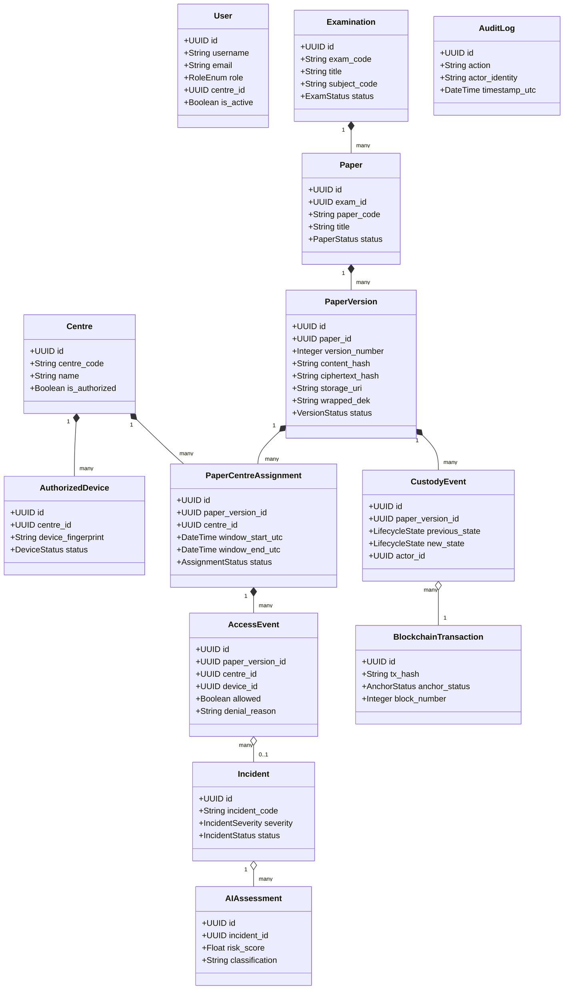
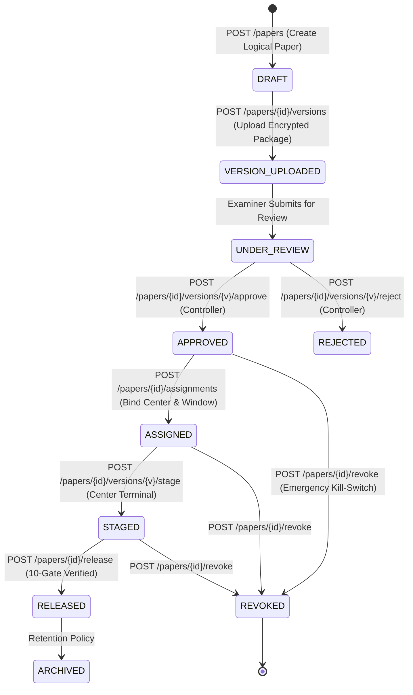
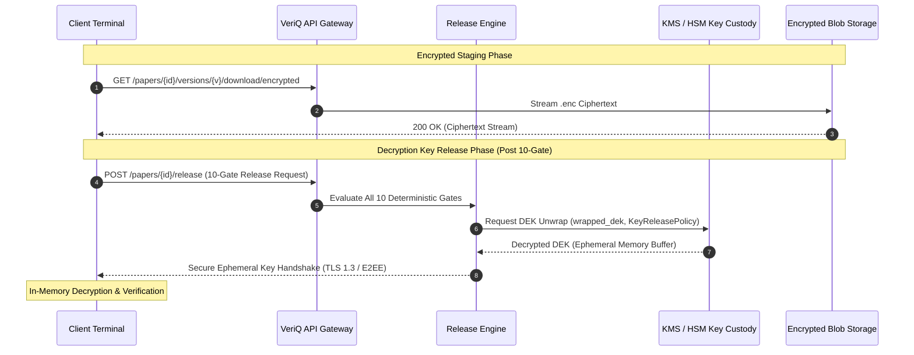
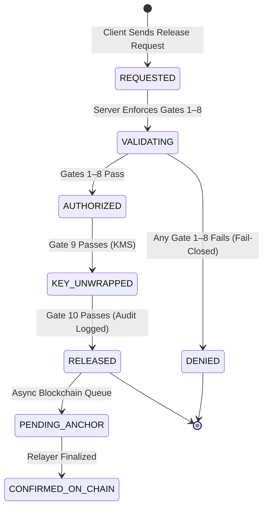

# VeriQ — API Architecture & Endpoint Specification
**Document ID:** `VERIQ-API-010`  
**Version:** `1.0.0`  
**Status:** `DRAFT / PENDING REVIEW`  
**Upstream Sources of Truth:** `01_REPOSITORY_AUDIT.md`, `02_PRODUCT_BLUEPRINT.md`, `03_PROBLEM_STATEMENT.md`, `04_MARKET_RESEARCH.md`, `05_PRODUCT_REQUIREMENTS.md`, `06_TECHNICAL_REQUIREMENTS.md`, `07_SYSTEM_ARCHITECTURE.md`, `08_AI_ARCHITECTURE.md`, `09_DATABASE_DESIGN.md`  
**Downstream Dependents:** `11_SECURITY_ARCHITECTURE.md`, `12_UI_UX_DESIGN.md`, `13_DEPLOYMENT.md`, `14_TESTING_STRATEGY.md`

---

## 1. Document Metadata & Control

| Attribute | Value |
| :--- | :--- |
| **Product Name** | VeriQ — Secure Examination Paper Distribution Using Blockchain |
| **Tagline** | Secure Every Question Paper. Verify Every Action. |
| **Problem Reference** | WB-03 — Secure Examination Paper Distribution Using Blockchain |
| **Document Classification** | API Specification & Contract Architecture Specification |
| **Document Owner** | Principal API Architect & Application Security Engineering Working Group |
| **Target Audience** | Backend Engineers, Frontend Engineers, Mobile/Terminal Developers, Security Architects, QA Automation Engineers |
| **Document Purpose** | Define the authoritative, implementation-ready REST API contract for VeriQ, translating product, technical, security, AI, and persistence requirements into typed, secure, and observable HTTP interfaces. |

---

## 2. API Architecture Executive Summary

VeriQ's API tier serves as the secure communication and policy enforcement interface between client interfaces (Admin Portal, Authoring Station, Center Terminals, Security Operations Center, Auditor Console) and backend services (FastAPI, Relational Database, KMS Key Custody, Encrypted Blob Storage, Blockchain Relayer, AI Telemetry Engine).

```mermaid
graph TD
    subgraph Clients["Client Presentation Tier"]
        AdminWeb["Admin & Authority Portal"]
        SetterApp["Paper Authoring Terminal"]
        CentreClient["Exam Centre Terminal"]
        AuditorApp["Auditor Console"]
        SOCDesk["Security Operations (SOC)"]
    end

    subgraph APIGateway["API Security & Gateway Boundary (TLS 1.3)"]
        WAF["WAF / Rate Limiter [TBD Policy]"]
        AuthN["JWT Authentication & Session Validator"]
        RBAC["Deterministic RBAC & Separation-of-Duties Engine"]
        Tracing["Correlation & Request ID Middleware"]
    end

    subgraph ServiceLayer["Application Service Tier (FastAPI v1)"]
        AuthSvc["Auth & Identity Service"]
        PaperSvc["Paper & Version Lifecycle Service"]
        AssignSvc["Centre Assignment & Staging Service"]
        ReleaseEngine["10-Gate Deterministic Release Engine"]
        AuditSvc["Append-Only Audit & Custody Service"]
        BCTxSvc["Blockchain Relayer & Anchor Service"]
        AISvc["Advisory AI & Anomaly Service"]
    end

    subgraph DataAndCrypto["Infrastructure & Persistence Tier"]
        DB[(PostgreSQL 15+ Operational DB)]
        BlobStore[(Encrypted S3 Object Store)]
        KMS[("KMS / Key Custody Boundary")]
        Ledger[("Blockchain Anchor Layer")]
    end

    Clients --> APIGateway
    APIGateway --> ServiceLayer
    ServiceLayer --> DataAndCrypto
```



The API layer enforces non-negotiable security boundaries:
1. **Server-Authoritative Enforcement:** Security evaluations (authorization, release time windows, device authorization, paper revocation, integrity verification) are strictly executed server-side. Client-supplied flags or timestamps are discarded.
2. **Cryptographic Key Isolation:** Plaintext Symmetric Data Encryption Keys (DEKs), Key Encryption Keys (KEKs), and private signing keys are **never** returned in API responses or persisted in relational database tables.
3. **Dual-Digest Integrity:** Plaintext canonical document identity (`content_hash`) and encrypted package integrity (`ciphertext_hash`) are explicitly separated across all endpoints.
4. **Asynchronous Blockchain Finality:** Blockchain anchoring is explicitly tracked as a multi-stage lifecycle (`PENDING_ANCHOR` $\rightarrow$ `SUBMITTED` $\rightarrow$ `PENDING_CONFIRMATION` $\rightarrow$ `CONFIRMED_ON_CHAIN`), preventing phantom finality.
5. **Advisory AI Boundary:** AI anomaly and threat telemetry endpoints provide strictly advisory risk scores. Automated policy actions are executed only through deterministic gate mechanisms.

---

## 3. API Design Principles & Conventions

1. **RESTful Resource-Oriented Architecture:** Standard HTTP methods (`GET`, `POST`, `PATCH`, `DELETE`) with plural noun resource collections (`/api/v1/papers`, `/api/v1/centres`, `/api/v1/examinations`).
2. **Explicit Versioning:** All endpoints are version-prefixed under `/api/v1/`.
3. **Structured JSON Payloads:** All request and response bodies utilize strict JSON formatting with UTF-8 encoding. Binary transfers are restricted to dedicated streaming endpoints.
4. **Typed Schema Contracts:** All schemas are validated through Pydantic v2 data models enforcing strict type checking, regex constraints, and bounds.
5. **Fail-Closed Security:** Unauthenticated, unauthorized, malformed, or unverified requests fail immediately with structured error envelopes.
6. **Least Privilege & Role Binding:** Every protected endpoint enforces explicit role permissions (`ADMINISTRATOR`, `EXAMINER`, `CONTROLLER`, `SUPERINTENDENT`, `AUDITOR`) and center/device scope checks.
7. **Control-Plane vs. Data-Plane Separation:** Administrative metadata mutations (control plane) are decoupled from high-throughput encrypted distribution and key release operations (data plane).
8. **Request Tracing & Audit Correlation:** All requests accept and return `X-Request-ID` and `X-Correlation-ID` headers to ensure end-to-end traceability across database logs, audit trails, and blockchain anchors.
9. **Idempotent Mutations:** Sensitive state transition endpoints support an optional `Idempotency-Key` header to prevent duplicate processing on network retries.

---

## 4. API Versioning Strategy

| Dimension | Specification |
| :--- | :--- |
| **URI Format** | `/api/v1/{resource}` |
| **Current Target Version** | `v1` |
| **Deprecation Policy** | Deprecated endpoints will include `Deprecation: true` and `Sunset: <HTTP-Date>` response headers with at least 90 days notice `[Target Policy / TBD]`. |
| **Breaking Changes** | Changes altering request/response schemas, removing fields, or modifying authorization semantics require a major version increment (`/api/v2/`). |
| **Backward Compatible Additions** | Adding new optional request fields or new response fields is permitted within the active major version. |

---

## 5. Current API Baseline & Repository Inventory

An inspection of `backend/app/api/v1/` and `backend/app/main.py` establishes the current prototype baseline:

| Endpoint ID | Method | Path | Current Purpose | Source File | Auth / Role | Current Implementation Status & Vulnerability Analysis |
| :--- | :--- | :--- | :--- | :--- | :--- | :--- |
| `CURR-AUTH-01` | `POST` | `/api/v1/auth/login` | User authentication & JWT generation | `auth.py:14` | Public | `[CURRENT]` Validates email/password against SQLite; returns access & refresh tokens. |
| `CURR-AUTH-02` | `POST` | `/api/v1/auth/refresh` | Access token refresh | `auth.py:50` | Public (Refresh Token) | `[CURRENT]` Issues new access token from refresh token. |
| `CURR-AUTH-03` | `GET` | `/api/v1/auth/me` | Current authenticated user profile | `auth.py:66` | `HTTPBearer` | `[CURRENT]` Returns user profile; falls back to default admin if header omitted (`deps.py:18`). |
| `CURR-AUTH-04` | `GET` | `/api/v1/auth/demo-users` | Demo user credentials list | `auth.py:78` | Public | `[MOCKED]` Returns mock demo passwords (`password123`) for hackathon presentation. |
| `CURR-EXAM-01` | `GET` | `/api/v1/exams` | List scheduled examinations | `exams.py:13` | Public / `get_current_user` | `[CURRENT]` Queries SQLite `examinations` table with search and filtering. |
| `CURR-EXAM-02` | `POST` | `/api/v1/exams` | Create examination container | `exams.py:70` | `require_roles(["SUPER_ADMIN", "EXAM_AUTHORITY"])` | `[CURRENT]` Creates exam record with auto-generated code and initial `SCHEDULED` status. |
| `CURR-EXAM-03` | `GET` | `/api/v1/exams/{id}` | Get examination details | `exams.py:113` | `get_current_user` | `[CURRENT]` Returns exam details, assigned centers count, and total paper count. |
| `CURR-PAPER-01` | `GET` | `/api/v1/papers` | List question papers | `papers.py:22` | Public / `get_current_user` | `[CURRENT]` Returns paper list with metadata, latest blockchain tx, and assigned centers. |
| `CURR-PAPER-02` | `POST` | `/api/v1/papers/upload` | Upload and encrypt question paper | `papers.py:89` | `require_roles(["SUPER_ADMIN", "EXAM_AUTHORITY", "PAPER_SETTER"])` | `[PARTIAL]` Hashes plaintext with SHA-256, encrypts with AES-256-GCM, stores `.enc` to disk, creates `PAPER_CREATED` tx. |
| `CURR-PAPER-03` | `GET` | `/api/v1/papers/{id}` | Get paper details | `papers.py:197` | `get_current_user` | `[CURRENT]` Returns paper metadata, center assignments, and blockchain history. |
| `CURR-PAPER-04` | `POST` | `/api/v1/papers/{id}/approve` | Approve question paper | `papers.py:271` | `require_roles(["SUPER_ADMIN", "EXAM_AUTHORITY"])` | `[PARTIAL]` Transitions status `DRAFT` $\rightarrow$ `APPROVED`; checks separation-of-duties; registers `PAPER_APPROVED` tx. |
| `CURR-PAPER-05` | `POST` | `/api/v1/papers/{id}/assign` | Assign paper to exam center | `papers.py:321` | `require_roles(["SUPER_ADMIN", "EXAM_AUTHORITY"])` | `[CURRENT]` Binds paper to center with start/end release window; registers `CENTRE_ASSIGNED` tx. |
| `CURR-PAPER-06` | `POST` | `/api/v1/papers/{id}/release` | Mark paper status as released | `papers.py:397` | `require_roles(["SUPER_ADMIN", "EXAM_AUTHORITY"])` | `[PARTIAL]` Transitions status to `RELEASED`; records `PAPER_RELEASED` tx. **Lacks client release request binding.** |
| `CURR-PAPER-07` | `POST` | `/api/v1/papers/{id}/verify` | Verify document cryptographic hash | `papers.py:435` | `get_current_user` | `[CURRENT]` Decrypts stored ciphertext, recalculates SHA-256, compares against anchored hash; logs incident on mismatch. |
| `CURR-PAPER-08` | `POST` | `/api/v1/papers/{id}/revoke` | Revoke question paper | `papers.py:520` | `require_roles(["SUPER_ADMIN", "EXAM_AUTHORITY"])` | `[CURRENT]` Sets status to `REVOKED`, records reason, anchors `PAPER_REVOKED` tx. |
| `CURR-PAPER-09` | `GET` | `/api/v1/papers/{id}/chain-of-custody` | Get blockchain custody timeline | `papers.py:561` | `get_current_user` | `[CURRENT]` Returns chronological list of blockchain transactions associated with paper. |
| `CURR-ACC-01` | `POST` | `/api/v1/access/request` | Center paper access evaluation | `access.py:18` | `get_current_user` | `[PARTIAL / UNSAFE]` Evaluates release gates; **accepts client `override_time` parameter**; records access event and incident. |
| `CURR-ACC-02` | `POST` | `/api/v1/access/evaluate` | Alias for access evaluation | `access.py:18` | `get_current_user` | `[PARTIAL]` Duplicate route for `/access/request`. |
| `CURR-ACC-03` | `GET` | `/api/v1/access/logs` | Query access evaluation logs | `access.py:126` | `get_current_user` | `[CURRENT]` Returns recent `access_events` with paper, center, and user joins. |
| `CURR-CENT-01` | `GET` | `/api/v1/centres` | List examination centers | `centres.py:13` | `get_current_user` | `[CURRENT]` Lists centers with device and exam counts. |
| `CURR-CENT-02` | `POST` | `/api/v1/centres` | Register examination center | `centres.py:58` | `require_roles(["SUPER_ADMIN", "EXAM_AUTHORITY"])` | `[CURRENT]` Creates center record. |
| `CURR-CENT-03` | `GET` | `/api/v1/centres/{id}` | Get center details | `centres.py:95` | `get_current_user` | `[CURRENT]` Returns center profile, authorized devices, and assigned papers. |
| `CURR-CENT-04` | `POST` | `/api/v1/centres/{id}/authorize` | Authorize examination center | `centres.py:128` | `require_roles(["SUPER_ADMIN", "EXAM_AUTHORITY"])` | `[CURRENT]` Sets `is_authorized = True`. |
| `CURR-CENT-05` | `POST` | `/api/v1/centres/{id}/revoke` | Revoke examination center | `centres.py:142` | `require_roles(["SUPER_ADMIN", "EXAM_AUTHORITY"])` | `[CURRENT]` Sets `is_authorized = False`. |
| `CURR-DEV-01` | `GET` | `/api/v1/devices` | List registered devices | `devices.py:14` | `get_current_user` | `[CURRENT]` Lists registered devices with center binding. |
| `CURR-DEV-02` | `POST` | `/api/v1/devices/register` | Register terminal device | `devices.py:34` | `require_roles(["SUPER_ADMIN", "EXAM_AUTHORITY", "CENTRE_SUPERINTENDENT"])` | `[CURRENT]` Registers device with browser/client fingerprint string. |
| `CURR-DEV-03` | `POST` | `/api/v1/devices/{id}/authorize` | Authorize terminal device | `devices.py:76` | `require_roles(["SUPER_ADMIN", "EXAM_AUTHORITY"])` | `[CURRENT]` Sets device status `AUTHORIZED`. |
| `CURR-DEV-04` | `POST` | `/api/v1/devices/{id}/revoke` | Revoke terminal device | `devices.py:89` | `require_roles(["SUPER_ADMIN", "EXAM_AUTHORITY"])` | `[CURRENT]` Sets device status `REVOKED`. |
| `CURR-BC-01` | `GET` | `/api/v1/blockchain/status` | Blockchain network status | `blockchain.py:13` | Public | `[CURRENT]` Returns network status, height, peer count, and contract address. |
| `CURR-BC-02` | `GET` | `/api/v1/blockchain/blocks` | List blockchain blocks | `blockchain.py:17` | Public | `[CURRENT]` Returns simulated block ledger from memory/service. |
| `CURR-BC-03` | `GET` | `/api/v1/blockchain/transactions` | List blockchain transactions | `blockchain.py:21` | Public | `[CURRENT]` Queries `blockchain_transactions` table with filtering by event and paper. |
| `CURR-BC-04` | `GET` | `/api/v1/blockchain/transactions/{tx_hash}` | Get transaction details | `blockchain.py:57` | Public | `[CURRENT]` Returns transaction details, actor, and payload hash. |
| `CURR-BC-05` | `GET` | `/api/v1/blockchain/papers/{paper_id}` | Get paper transaction history | `blockchain.py:81` | Public | `[CURRENT]` Returns all blockchain txs anchored for specific paper. |
| `CURR-SEC-01` | `GET` | `/api/v1/security/summary` | SOC executive security dashboard | `security.py:12` | Public / `get_current_user` | `[CURRENT]` Aggregates exam counts, access stats, active incidents, threat level, and time series. |
| `CURR-SEC-02` | `GET` | `/api/v1/security/heatmap` | Center risk heatmap | `security.py:61` | Public / `get_current_user` | `[CURRENT]` Computes center risk scores based on blocked attempts and open incidents. |
| `CURR-SEC-03` | `GET` | `/api/v1/security/threat-feed` | Live security incident feed | `security.py:83` | Public / `get_current_user` | `[CURRENT]` Returns recent security incidents joined with center names. |
| `CURR-INC-01` | `GET` | `/api/v1/incidents` | List security incidents | `incidents.py:18` | `get_current_user` | `[CURRENT]` Queries `incidents` table with filtering by severity, status, and paper. |
| `CURR-INC-02` | `GET` | `/api/v1/incidents/{id}` | Get incident details | `incidents.py:61` | `get_current_user` | `[CURRENT]` Returns detailed incident record. |
| `CURR-INC-03` | `POST` | `/api/v1/incidents/{id}/acknowledge` | Acknowledge incident | `incidents.py:91` | `require_roles(["SUPER_ADMIN", "EXAM_AUTHORITY", "AUDITOR"])` | `[CURRENT]` Sets status to `INVESTIGATING`. |
| `CURR-INC-04` | `POST` | `/api/v1/incidents/{id}/resolve` | Resolve security incident | `incidents.py:104` | `require_roles(["SUPER_ADMIN", "EXAM_AUTHORITY"])` | `[CURRENT]` Sets status to `RESOLVED` with resolution notes. |
| `CURR-AUD-01` | `GET` | `/api/v1/audit/report/{paper_id}` | Generate comprehensive audit report | `audit.py:12` | Public / `get_current_user` | `[CURRENT]` Compiles exam metadata, paper details, assignments, blockchain txs, access logs, and incidents. |
| `CURR-DEMO-01` | `POST` | `/api/v1/demo/simulate` | Simulate demo attack/security event | `demo.py:15` | Public | `[MOCKED]` Simulates `EARLY_ACCESS`, `UNAUTHORIZED_CENTRE`, `DEVICE_MISMATCH`, `DOCUMENT_TAMPERING`, `SUSPICIOUS_ACTIVITY`. |
| `CURR-SYS-01` | `GET` | `/api/v1/healthz` | System liveness health check | `main.py:73` | Public | `[CURRENT]` Returns basic service status and cryptographic pipeline string. |
| `CURR-SYS-02` | `GET` | `/` | API Root Metadata | `main.py:83` | Public | `[CURRENT]` Returns service title, tagline, and documentation link. |

**Current Baseline Metrics:**
- **Total Current Endpoints Identified:** 44
- **Security Vulnerabilities Identified in Baseline:**
  1. `deps.py:18` implements an unsafe fallback to a default authority user (`authority@veriq.local`) when `Authorization` headers are absent.
  2. `access.py:33` allows clients to supply an `override_time` parameter, violating server-authoritative time enforcement.
  3. `papers.py:89` combines logical paper creation and version upload into a single table without version immutability.
  4. Single `sha256_hash` column collapses `content_hash` and `ciphertext_hash`.
  5. `blockchain_transactions` simulates synchronous finality without tracking `PENDING_ANCHOR` vs. `CONFIRMED_ON_CHAIN`.

---

## 6. Canonical API Resource Model

The API resource hierarchy maps 1-to-1 with the persistence architecture established in `09_DATABASE_DESIGN.md`:



---

## 7. Authentication & Session APIs

### 7.1 Target Authentication Architecture
- **JWT Architecture:** Stateless, cryptographically signed bearer tokens (Ed25519 or HMAC-SHA256).
- **Access Token Lifetime:** Short-lived (15 minutes `[TBD]`).
- **Refresh Token Lifetime:** 7 days `[TBD]`, stored in secure HTTP-only cookies or encrypted client storage.
- **Fail-Closed Enforcement:** Missing or invalid tokens result in HTTP 401 Unauthorized. **Default identity fallbacks are strictly eliminated in the target API.**

### 7.2 Endpoint Specifications

#### `EP-AUTH-01`: User Login
- **Method / Path:** `POST /api/v1/auth/login`
- **Purpose:** Authenticate actor credentials, verify active account status, and issue token pair.
- **Authentication:** None (Public)
- **Authorization:** None
- **Request Headers:** `Content-Type: application/json`, `X-Request-ID: <UUID>`
- **Request Body:**
  ```json
  {
    "username_or_email": "controller@state-board.gov.in",
    "password": "SecurePassword123!",
    "device_fingerprint": "a4f8c9b2e1d03478..."
  }
  ```
- **Response Body (HTTP 200 OK):**
  ```json
  {
    "access_token": "eyJhbGciOiJSUzI1NiIsInR5cCI6IkpXVCJ9...",
    "refresh_token": "dGhpcy1pcy1hLXJlZnJlc2gtdG9rZW4...",
    "token_type": "Bearer",
    "expires_in_seconds": 900,
    "user": {
      "id": "7b8e5c1d-4f2a-4c91-9e23-8f0a1b2c3d4e",
      "username": "exam_controller_01",
      "email": "controller@state-board.gov.in",
      "role": "CONTROLLER",
      "centre_id": null,
      "is_active": true
    }
  }
  ```
- **Error Responses:**
  - `401 Unauthorized`: Invalid username or password (`AUTH_INVALID_CREDENTIALS`).
  - `403 Forbidden`: Account is suspended or revoked (`AUTH_ACCOUNT_SUSPENDED`).
  - `422 Unprocessable Entity`: Malformed request schema.
  - `429 Too Many Requests`: Rate limit exceeded `[TBD Policy]`.
- **Audit & Security Events:** Emits `USER_LOGIN_SUCCESS` on success; emits `USER_LOGIN_FAILED` and increments brute-force telemetry on failure.
- **Current Status:** `[CURRENT]` (Enhanced in target to eliminate plain passwords in logs and add device metadata).
- **Target Status:** `[TARGET]` Mandatory Argon2id verification and strict rate limiting.

#### `EP-AUTH-02`: Token Refresh
- **Method / Path:** `POST /api/v1/auth/refresh`
- **Purpose:** Issue a new access token using a valid, unrevoked refresh token.
- **Authentication:** Refresh Token
- **Request Body:**
  ```json
  {
    "refresh_token": "dGhpcy1pcy1hLXJlZnJlc2gtdG9rZW4..."
  }
  ```
- **Response Body (HTTP 200 OK):**
  ```json
  {
    "access_token": "eyJhbGciOiJSUzI1NiIsInR5cCI6IkpXVCJ9...",
    "token_type": "Bearer",
    "expires_in_seconds": 900
  }
  ```
- **Error Responses:** `401 Unauthorized` (`AUTH_REFRESH_TOKEN_EXPIRED`, `AUTH_REFRESH_TOKEN_INVALID`).
- **Target Status:** `[TARGET]` Single-use refresh token rotation with reuse detection.

#### `EP-AUTH-03`: User Logout / Session Revocation
- **Method / Path:** `POST /api/v1/auth/logout`
- **Purpose:** Revoke active refresh token and invalidate user session.
- **Authentication:** `Bearer <JWT>`
- **Response Body (HTTP 200 OK):**
  ```json
  {
    "message": "Session successfully terminated"
  }
  ```
- **Target Status:** `[TARGET]` Adds token JTI to fast revocation blacklist cache.

#### `EP-AUTH-04`: Get Current User Profile
- **Method / Path:** `GET /api/v1/auth/me`
- **Purpose:** Retrieve the profile of the currently authenticated actor.
- **Authentication:** `Bearer <JWT>`
- **Response Body (HTTP 200 OK):** Returns user profile object matching `EP-AUTH-01`.
- **Error Responses:** `401 Unauthorized` (Strictly enforced; no demo fallback).
- **Target Status:** `[TARGET]` Strict authorization enforcement.

---

## 8. Authorization Model & RBAC Matrix

VeriQ implements five standardized role principals established in `09_DATABASE_DESIGN.md`:

| Role Principal | System Responsibilities | Scope Restrictions |
| :--- | :--- | :--- |
| **`ADMINISTRATOR`** | User lifecycle, center registration, device authorization, global configuration. | Prohibited from creating or approving question papers (Separation of Duties). |
| **`EXAMINER`** | Question paper drafting, version creation, encrypted package upload. | Prohibited from self-approving question papers or authorizing center distribution. |
| **`CONTROLLER`** | Paper version approval, center assignment, emergency paper revocation. | Prohibited from authoring papers or initiating terminal decryption. |
| **`SUPERINTENDENT`** | Examination center supervision, local terminal staging, release request initiation. | Scoped strictly to assigned `centre_id` and registered `authorized_devices`. |
| **`AUDITOR`** | Read-only compliance inspection, custody lineage verification, audit export. | Prohibited from mutating any operational or configuration records. |

### 8.1 API Role Authorization Matrix

| Endpoint Group | `ADMINISTRATOR` | `EXAMINER` | `CONTROLLER` | `SUPERINTENDENT` | `AUDITOR` |
| :--- | :---: | :---: | :---: | :---: | :---: |
| **User & Device Admin** | **CRUD** | No Access | Read Only | Device Register Only | Read Only |
| **Exam Container Management** | **CRUD** | Read Only | **CRUD** | Read (Assigned) | Read Only |
| **Paper Creation & Versioning** | No Access | **Create / Update** | Read Only | Read (Assigned) | Read Only |
| **Paper Version Approval** | No Access | Prohibited | **Approve / Reject** | No Access | Read Only |
| **Center Assignment** | Manage | Read Only | **Assign / Revoke** | Read (Self) | Read Only |
| **Encrypted Package Staging** | No Access | No Access | Read Only | **Stage (Assigned)** | Read Only |
| **Release Request (10-Gate)** | No Access | No Access | Read Only | **Execute (Scoped)** | Read Only |
| **Paper Revocation** | No Access | No Access | **Revoke** | No Access | Read Only |
| **Incident Management** | Read / Resolve | Read Only | Read / Resolve | Report / View Self | Read / Ack |
| **Audit Logs & Export** | Read Only | No Access | Read Only | No Access | **Read / Export** |
| **Blockchain Explorer** | Read Only | Read Only | Read Only | Read Only | Read Only |

---

## 9. Examination APIs

#### `EP-EXAM-01`: List Examinations
- **Method / Path:** `GET /api/v1/examinations`
- **Purpose:** Query examination sessions with filtering, pagination, and sorting.
- **Authentication:** `Bearer <JWT>`
- **Authorization:** `ADMINISTRATOR`, `CONTROLLER`, `EXAMINER`, `SUPERINTENDENT`, `AUDITOR`
- **Query Parameters:** `search`, `department`, `status`, `page`, `page_size`
- **Response Body (HTTP 200 OK):**
  ```json
  {
    "items": [
      {
        "id": "3fa85f64-5717-4562-b3fc-2c963f66afa6",
        "exam_code": "EXAM-2026-CS-FINAL",
        "title": "Computer Science Final Examination 2026",
        "department": "Department of Higher Education",
        "subject_code": "CS-401",
        "status": "SCHEDULED",
        "total_papers_count": 2,
        "assigned_centres_count": 45,
        "created_at": "2026-09-01T10:00:00Z"
      }
    ],
    "pagination": { "page": 1, "page_size": 20, "total_items": 1, "total_pages": 1 }
  }
  ```
- **Target Status:** `[TARGET]` Replaces flat list with standardized pagination envelope.

#### `EP-EXAM-02`: Create Examination Container
- **Method / Path:** `POST /api/v1/examinations`
- **Purpose:** Create a new institutional examination container.
- **Authorization:** `ADMINISTRATOR`, `CONTROLLER`
- **Request Body:**
  ```json
  {
    "exam_code": "EXAM-2026-CS-FINAL",
    "title": "Computer Science Final Examination 2026",
    "department": "Department of Higher Education",
    "subject_code": "CS-401",
    "security_level": "TIER_1_CRITICAL"
  }
  ```
- **Response Body (HTTP 201 Created):** Returns created examination object.
- **Audit Event:** `EXAMINATION_CREATED`

---

## 10. Paper & Version Lifecycle APIs

### 10.1 Separation of Papers and Paper Versions
In accordance with `09_DATABASE_DESIGN.md`, logical papers (`papers`) and immutable release artifacts (`paper_versions`) are decoupled.



#### `EP-PAPER-01`: Create Logical Paper Container
- **Method / Path:** `POST /api/v1/papers`
- **Purpose:** Initialize a logical paper container under an examination.
- **Authorization:** `EXAMINER`, `CONTROLLER`
- **Request Body:**
  ```json
  {
    "exam_id": "3fa85f64-5717-4562-b3fc-2c963f66afa6",
    "paper_code": "PAP-CS401-2026",
    "title": "Advanced Operating Systems & Distributed Systems"
  }
  ```
- **Response Body (HTTP 201 Created):** Returns logical paper object (`status: "DRAFT"`).
- **Audit Event:** `PAPER_CONTAINER_CREATED`

#### `EP-PAPER-02`: Upload & Encrypt Paper Version
- **Method / Path:** `POST /api/v1/papers/{paper_id}/versions`
- **Purpose:** Ingest question paper PDF/binary, compute canonical `content_hash`, encrypt with AES-256-GCM, upload ciphertext to object store, and register cryptographic metadata.
- **Authorization:** `EXAMINER` (Author only)
- **Request Format:** `multipart/form-data`
  - `file`: Binary file stream (`.pdf`)
  - `version_notes`: String description
- **Processing Semantics:**
  1. Validate magic bytes (`%PDF-`).
  2. Compute SHA-256 `content_hash` on plaintext in memory.
  3. Generate ephemeral 256-bit AES DEK.
  4. Encrypt payload via AES-256-GCM producing ciphertext, 96-bit IV, and 128-bit authentication tag.
  5. Compute SHA-256 `ciphertext_hash` on encrypted output.
  6. Wrap DEK with Master KEK via KMS (`wrapped_dek`).
  7. Stream ciphertext to encrypted object store (`s3://veriq-vault/...`).
  8. Persist `paper_versions` record.
  9. Submit asynchronous blockchain anchor (`PAPER_CREATED` & `PAPER_HASHED`).
- **Response Body (HTTP 201 Created):**
  ```json
  {
    "version_id": "8f1a2b3c-4d5e-6f7a-8b9c-0d1e2f3a4b5c",
    "paper_id": "3fa85f64-5717-4562-b3fc-2c963f66afa6",
    "version_number": 1,
    "file_name": "CS401_Final_v1.pdf",
    "file_size_bytes": 1458290,
    "content_hash": "e3b0c44298fc1c149afbf4c8996fb92427ae41e4649b934ca495991b7852b855",
    "ciphertext_hash": "a1b2c3d4e5f67890123456789abcdef0123456789abcdef0123456789abcdef0",
    "encryption_algorithm": "AES-256-GCM",
    "status": "DRAFT",
    "blockchain_anchor": {
      "status": "PENDING_ANCHOR",
      "tx_hash": null
    },
    "created_at": "2026-09-02T14:30:00Z"
  }
  ```
- **Security Invariant:** **Plaintext DEK and plaintext examination binary are strictly excluded from response body.**
- **Target Status:** `[TARGET]` Replaces prototype `papers/upload` endpoint.

#### `EP-PAPER-03`: Approve Paper Version (Separation of Duties)
- **Method / Path:** `POST /api/v1/papers/{paper_id}/versions/{version_id}/approve`
- **Purpose:** Formal approval and cryptographic lock of a question paper version.
- **Authorization:** `CONTROLLER` (Strictly prohibited for paper author / `EXAMINER`).
- **Processing Semantics:**
  - Enforces `author_id != approver_id`.
  - Transitions version status `UNDER_REVIEW` $\rightarrow$ `APPROVED`.
  - Locks cryptographic metadata (immutable post-approval).
  - Triggers on-chain anchor `PAPER_APPROVED`.
- **Response Body (HTTP 200 OK):**
  ```json
  {
    "version_id": "8f1a2b3c-4d5e-6f7a-8b9c-0d1e2f3a4b5c",
    "status": "APPROVED",
    "approved_by": "controller@state-board.gov.in",
    "approved_at": "2026-09-03T09:15:00Z",
    "blockchain_anchor": {
      "status": "PENDING_ANCHOR",
      "event_type": "PAPER_APPROVED"
    }
  }
  ```
- **Error Responses:** `403 Forbidden` (`AUTH_SEPARATION_OF_DUTIES_VIOLATION` if approver equals author).
- **Target Status:** `[TARGET]`

#### `EP-PAPER-04`: Reject Paper Version
- **Method / Path:** `POST /api/v1/papers/{paper_id}/versions/{version_id}/reject`
- **Purpose:** Reject a submitted version with mandatory remediation notes.
- **Authorization:** `CONTROLLER`
- **Request Body:** `{ "rejection_reason": "Formatting issues in Section B questions." }`
- **Response Body (HTTP 200 OK):** Status updated to `REJECTED`.
- **Target Status:** `[TARGET]`

---

## 11. Cryptographic Metadata & Key Custody Boundary

The API acts as an orchestrator and never as a key repository:



### Cryptographic Boundary Rules:
1. **Dual Digest Separation:**
   - `content_hash`: SHA-256 digest of canonical plaintext document. Anchored to verify question paper authenticity.
   - `ciphertext_hash`: SHA-256 digest of encrypted distribution binary. Anchored to verify distribution file integrity before staging.
2. **Key Custody Separation:**
   - `wrapped_dek`: Encrypted DEK blob stored in database.
   - Master KEK: Stored exclusively in dedicated KMS / HSM.
   - Plaintext DEK: Held only in ephemeral volatile memory buffers during release execution; **never returned in plain JSON API fields**.

---

## 12. Centre Assignment & Release Window APIs

#### `EP-ASSIGN-01`: Assign Paper Version to Center
- **Method / Path:** `POST /api/v1/papers/{paper_id}/assignments`
- **Purpose:** Bind an approved paper version to an authorized examination center with a specific UTC release window.
- **Authorization:** `CONTROLLER`, `ADMINISTRATOR`
- **Request Body:**
  ```json
  {
    "paper_version_id": "8f1a2b3c-4d5e-6f7a-8b9c-0d1e2f3a4b5c",
    "centre_id": "4b9c0d1e-2f3a-4b5c-6d7e-8f9a0b1c2d3e",
    "window_start_utc": "2026-09-18T09:00:00Z",
    "window_end_utc": "2026-09-18T09:30:00Z",
    "grace_period_minutes": 5
  }
  ```
- **Validation Rules:**
  - `window_end_utc` must be strictly after `window_start_utc`.
  - Center must be in `is_authorized = True` status.
  - Paper version must be in `APPROVED` status.
- **Response Body (HTTP 201 Created):**
  ```json
  {
    "assignment_id": "1a2b3c4d-5e6f-7a8b-9c0d-1e2f3a4b5c6d",
    "paper_version_id": "8f1a2b3c-4d5e-6f7a-8b9c-0d1e2f3a4b5c",
    "centre_id": "4b9c0d1e-2f3a-4b5c-6d7e-8f9a0b1c2d3e",
    "window_start_utc": "2026-09-18T09:00:00Z",
    "window_end_utc": "2026-09-18T09:30:00Z",
    "status": "ASSIGNED",
    "blockchain_anchor": {
      "status": "PENDING_ANCHOR",
      "event_type": "CENTRE_ASSIGNED"
    }
  }
  ```
- **Target Status:** `[TARGET]` Explicitly binds version to center rather than unversioned paper.

#### `EP-ASSIGN-02`: List Center Assignments
- **Method / Path:** `GET /api/v1/papers/{paper_id}/assignments`
- **Purpose:** Query all distribution assignments for a paper.
- **Authorization:** `ADMINISTRATOR`, `CONTROLLER`, `AUDITOR`

---

## 13. Device Binding & Attestation APIs

#### `EP-DEV-01`: Register Terminal Device
- **Method / Path:** `POST /api/v1/devices/register`
- **Purpose:** Register an examination terminal hardware binding at an authorized center.
- **Authorization:** `ADMINISTRATOR`, `SUPERINTENDENT` (Scoped to self center)
- **Request Body:**
  ```json
  {
    "centre_id": "4b9c0d1e-2f3a-4b5c-6d7e-8f9a0b1c2d3e",
    "device_identifier": "TERM-DELHI-01-SEC",
    "device_fingerprint": "e3b0c44298fc1c149afbf4c8996fb92427ae41e4649b934ca495991b7852b855",
    "hardware_model": "Dell OptiPlex 7090 TPM 2.0",
    "os_version": "Ubuntu 22.04 LTS (Locked Kiosk)",
    "ip_address": "10.14.20.5"
  }
  ```
- **Response Body (HTTP 201 Created):** Returns device record with `status: "PENDING_AUTHORIZATION"`.
- **Target Status:** `[TARGET]` Replaces prototype auto-authorized device creation with two-stage approval.

#### `EP-DEV-02`: Authorize Terminal Device
- **Method / Path:** `POST /api/v1/devices/{device_id}/authorize`
- **Purpose:** Formally approve and activate terminal device for release execution.
- **Authorization:** `ADMINISTRATOR`, `CONTROLLER`
- **Response Body (HTTP 200 OK):** Status updated to `AUTHORIZED`.

#### `EP-DEV-03`: Revoke Terminal Device
- **Method / Path:** `POST /api/v1/devices/{device_id}/revoke`
- **Purpose:** Emergency revocation of compromised terminal device.
- **Authorization:** `ADMINISTRATOR`, `CONTROLLER`
- **Processing Semantics:** Subsequent release evaluations from this device will fail Gate 4.

---

## 14. Distribution & Encrypted Staging APIs

#### `EP-STAGE-01`: Prepare & Stage Encrypted Package
- **Method / Path:** `POST /api/v1/papers/{paper_id}/versions/{version_id}/stage`
- **Purpose:** Notify backend that local center terminal is staging the encrypted package.
- **Authorization:** `SUPERINTENDENT` (Bound to assigned center)
- **Response Body (HTTP 200 OK):** Returns staging authorization receipt.

#### `EP-STAGE-02`: Download Encrypted Package Stream
- **Method / Path:** `GET /api/v1/papers/{paper_id}/versions/{version_id}/download/encrypted`
- **Purpose:** Stream the encrypted ciphertext artifact (`.enc`) to the authorized center terminal.
- **Authorization:** `SUPERINTENDENT` (Bound to assigned center and authorized device)
- **Response Headers:** `Content-Type: application/octet-stream`, `X-Ciphertext-Hash: <SHA256>`
- **Response Body:** Raw encrypted binary stream.
- **Security Rule:** **Ciphertext download is permitted prior to the release window for offline staging; decryption keys are strictly held until Gate 1–10 validation during the active window.**

---

## 15. Release Authorization API & Ten-Gate Release Contract

The release endpoint represents the core data-plane operation in VeriQ:

#### `EP-REL-01`: Execute Ten-Gate Release Evaluation
- **Method / Path:** `POST /api/v1/papers/{paper_id}/versions/{version_id}/release`
- **Purpose:** Perform atomic, server-authoritative evaluation of all 10 release gates and deliver ephemeral decryption key material.
- **Authorization:** `SUPERINTENDENT`
- **Request Headers:** `Authorization: Bearer <JWT>`, `X-Device-Fingerprint: <HASH>`, `X-Request-ID: <UUID>`
- **Request Body:**
  ```json
  {
    "assignment_id": "1a2b3c4d-5e6f-7a8b-9c0d-1e2f3a4b5c6d",
    "centre_id": "4b9c0d1e-2f3a-4b5c-6d7e-8f9a0b1c2d3e",
    "device_id": "5c6d7e8f-9a0b-1c2d-3e4f-5a6b7c8d9e0f",
    "staged_ciphertext_hash": "a1b2c3d4e5f67890123456789abcdef0123456789abcdef0123456789abcdef0"
  }
  ```

### 16. Ten-Gate Deterministic Release Contract

| Gate # | Gate Name | Evaluated Input | Server-Side Security Check | Failure Code & Response | Failure Audit / Telemetry |
| :---: | :--- | :--- | :--- | :--- | :--- |
| **Gate 1** | **Authentication** | Bearer JWT Header | Cryptographic signature valid; token unexpired; user exists in DB and is active. | `401 Unauthorized`<br>`GATE_1_AUTH_INVALID` | Emits `ACCESS_DENIED`, logs auth failure. |
| **Gate 2** | **Authorization** | `user.role` | Actor holds `SUPERINTENDENT` role with center access scope. | `403 Forbidden`<br>`GATE_2_ROLE_UNAUTHORIZED` | Emits `ACCESS_DENIED`, alerts SOC. |
| **Gate 3** | **Center Binding** | `centre_id`, `assignment_id` | Center exists, `is_authorized = True`, and assignment matches `centre_id` and `version_id`. | `403 Forbidden`<br>`GATE_3_CENTRE_UNAUTHORIZED` | Emits `ACCESS_DENIED`, logs incident `UNAUTHORIZED_CENTRE`. |
| **Gate 4** | **Device Binding** | `device_id`, `X-Device-Fingerprint` | Device exists, is bound to `centre_id`, and has `status = AUTHORIZED`. | `403 Forbidden`<br>`GATE_4_DEVICE_MISMATCH` | Emits `ACCESS_DENIED`, logs incident `DEVICE_MISMATCH` (Severity: CRITICAL). |
| **Gate 5** | **Authoritative Time Window** | Server NTP Time vs. Assignment Window | `window_start_utc <= ServerUTC <= window_end_utc (+ grace)`. **Client timestamps discarded.** | `403 Forbidden`<br>`GATE_5_WINDOW_VIOLATION` | Emits `ACCESS_DENIED`, logs incident `EARLY_ACCESS` if early. |
| **Gate 6** | **Paper / Version State** | `version_id.status` | Paper version status is strictly `APPROVED` or `ASSIGNED`. | `409 Conflict`<br>`GATE_6_INVALID_VERSION_STATE` | Emits `ACCESS_DENIED`, logs state error. |
| **Gate 7** | **Revocation Check** | Revocation flags on Paper, Exam, Center, Device, User | None of the involved entities are marked `REVOKED` or `SUSPENDED`. | `403 Forbidden`<br>`GATE_7_RESOURCE_REVOKED` | Emits `ACCESS_DENIED`, alerts SOC immediately. |
| **Gate 8** | **Ciphertext Integrity** | `staged_ciphertext_hash` | Hash matches `paper_versions.ciphertext_hash` in database. | `422 Unprocessable Entity`<br>`GATE_8_INTEGRITY_MISMATCH` | Emits `ACCESS_DENIED`, logs incident `HASH_MISMATCH` (Severity: CRITICAL). |
| **Gate 9** | **Key Release Authorization** | KMS Policy Engine | KMS authorizes unwrapping of `wrapped_dek` under release context. | `502 Bad Gateway`<br>`GATE_9_KMS_UNWRAP_FAILED` | Emits `KMS_KEY_RELEASE_FAILURE`. |
| **Gate 10** | **Audit & Blockchain Anchoring** | DB & Blockchain Relayer | Append-only `access_events` and `custody_events` persisted; blockchain anchor queued (`PENDING_ANCHOR`). | `500 Internal Error`<br>`GATE_10_AUDIT_PERSIST_FAILED` | Fail-closed if audit write fails. |

- **Success Response (HTTP 200 OK):**
  ```json
  {
    "release_status": "RELEASED",
    "assignment_id": "1a2b3c4d-5e6f-7a8b-9c0d-1e2f3a4b5c6d",
    "paper_version_id": "8f1a2b3c-4d5e-6f7a-8b9c-0d1e2f3a4b5c",
    "content_hash": "e3b0c44298fc1c149afbf4c8996fb92427ae41e4649b934ca495991b7852b855",
    "encryption_iv": "d1c2b3a4567890abcdef1234",
    "encryption_tag": "f0e1d2c3b4a5968778695a4b3c2d1e0f",
    "key_envelope": {
      "ephemeral_key_token": "k_eph_9f8e7d6c5b4a3...",
      "key_expires_utc": "2026-09-18T10:00:00Z"
    },
    "blockchain_anchor": {
      "status": "PENDING_ANCHOR",
      "correlation_id": "rel_corr_7a8b9c0d1e"
    }
  }
  ```

---

## 17. Release Response Model & State Progression



### State Distinctions:
- `REQUESTED`: Request envelope received and parsed.
- `VALIDATING`: Deterministic gates 1 through 8 evaluating.
- `DENIED`: Request rejected; security incident logged.
- `AUTHORIZED`: Authorization and integrity checks satisfied.
- `RELEASED`: Key unwrap completed and audit event persisted.
- `PENDING_ANCHOR`: Blockchain transaction broadcast/queued.
- `CONFIRMED_ON_CHAIN`: Blockchain transaction mined with required block confirmation depth.

---

## 18. Secure Decrypted Delivery & Rendering Boundary

To prevent unauthorized file leakage and uncontrolled distribution:
1. **Volatile In-Memory Decryption:** Terminal software decrypts the `.enc` ciphertext strictly in ephemeral RAM. Plaintext files are never written to unencrypted disk storage.
2. **Kiosk Rendering Mode `[Target / TBD]`:** Decrypted exam PDF is rendered inside a secured, read-only display sandbox prohibiting copy, export, print-to-file, or external process inspection.
3. **Controlled Print Spooler `[Target / TBD]`:** In physical print scenarios, decrypted streams are piped directly to an authorized hardware spooler with watermarked barcodes and page count reconciliation.

---

## 19. Integrity Verification API

#### `EP-VER-01`: Cryptographic Hash Verification
- **Method / Path:** `POST /api/v1/papers/{paper_id}/versions/{version_id}/verify`
- **Purpose:** Allow terminals, administrators, and auditors to verify on-chain and off-chain digest alignment.
- **Authentication:** `Bearer <JWT>`
- **Request Body:**
  ```json
  {
    "target_digest_type": "CIPHERTEXT_HASH",
    "calculated_hash": "a1b2c3d4e5f67890123456789abcdef0123456789abcdef0123456789abcdef0"
  }
  ```
- **Processing Semantics:**
  - Compares `calculated_hash` against stored `paper_versions.ciphertext_hash` or `paper_versions.content_hash`.
  - On match: returns `status: "VERIFIED_VALID"`.
  - On mismatch: returns `status: "INTEGRITY_FAILURE"` and automatically creates a `CRITICAL` incident (`HASH_MISMATCH`).
- **Response Body (HTTP 200 OK):**
  ```json
  {
    "verified": true,
    "status": "VERIFIED_VALID",
    "expected_hash": "a1b2c3d4e5f67890123456789abcdef0123456789abcdef0123456789abcdef0",
    "calculated_hash": "a1b2c3d4e5f67890123456789abcdef0123456789abcdef0123456789abcdef0",
    "anchored_on_chain": true,
    "tx_hash": "0x4f8a9b2c1d0e3456789abcdef0123456789abcdef0123456789abcdef0123456"
  }
  ```

---

## 20. Revocation APIs

#### `EP-REV-01`: Revoke Question Paper
- **Method / Path:** `POST /api/v1/papers/{paper_id}/revoke`
- **Purpose:** Execute emergency revocation of a question paper across all centers.
- **Authorization:** `CONTROLLER`
- **Request Body:**
  ```json
  {
    "revocation_reason": "Suspected physical custody breach at Regional Center 104",
    "revocation_scope": "ALL_CENTRES"
  }
  ```
- **Processing Semantics:**
  - Transitions paper and all versions to `REVOKED`.
  - Cancels all active center release windows.
  - Subsequent authorization evaluations SHALL reject the revoked paper (Gate 7).
  - Broadcasts on-chain anchor `PAPER_REVOKED`.
- **Response Body (HTTP 200 OK):**
  ```json
  {
    "paper_id": "3fa85f64-5717-4562-b3fc-2c963f66afa6",
    "status": "REVOKED",
    "revoked_at": "2026-09-18T08:45:00Z",
    "blockchain_anchor": { "status": "PENDING_ANCHOR", "event_type": "PAPER_REVOKED" }
  }
  ```

#### `EP-REV-02`: Revoke Examination Center
- **Method / Path:** `POST /api/v1/centres/{centre_id}/revoke`
- **Purpose:** Immediately disqualify an examination center. Subsequent evaluations reject requests from this center.

#### `EP-REV-03`: Revoke Terminal Device
- **Method / Path:** `POST /api/v1/devices/{device_id}/revoke`
- **Purpose:** Immediately blacklist a terminal hardware device.

---

## 21. Incident Management APIs

#### `EP-INC-01`: List Security Incidents
- **Method / Path:** `GET /api/v1/incidents`
- **Purpose:** Query SOC incidents with severity, center, and status filters.
- **Authorization:** `ADMINISTRATOR`, `CONTROLLER`, `AUDITOR`
- **Query Parameters:** `severity`, `status`, `centre_id`, `paper_id`, `page`, `page_size`
- **Response Body (HTTP 200 OK):** Standardized paginated incident list.

#### `EP-INC-02`: Get Incident Details
- **Method / Path:** `GET /api/v1/incidents/{incident_id}`
- **Purpose:** Retrieve incident investigation details, related access events, and advisory AI assessments.
- **Response Body (HTTP 200 OK):**
  ```json
  {
    "id": "7c8d9e0f-1a2b-3c4d-5e6f-7a8b9c0d1e2f",
    "incident_code": "INC-2026-SEC-0042",
    "type": "DEVICE_MISMATCH",
    "severity": "CRITICAL",
    "paper_id": "3fa85f64-5717-4562-b3fc-2c963f66afa6",
    "centre_id": "4b9c0d1e-2f3a-4b5c-6d7e-8f9a0b1c2d3e",
    "device_id": "ROGUE-DEVICE-FINGERPRINT",
    "description": "Hardware fingerprint mismatch: Unknown terminal requested decrypt key",
    "status": "INVESTIGATING",
    "ai_assessment": {
      "risk_score": 92.5,
      "classification": "HIGH_RISK_ANOMALY",
      "contributing_signals": ["UNKNOWN_HARDWARE_FINGERPRINT", "OFF_HOURS_BURST"]
    },
    "created_at": "2026-09-18T08:31:00Z"
  }
  ```

#### `EP-INC-03`: Acknowledge Incident
- **Method / Path:** `POST /api/v1/incidents/{incident_id}/acknowledge`
- **Purpose:** Assign incident to active investigation (`status: "INVESTIGATING"`).
- **Authorization:** `ADMINISTRATOR`, `CONTROLLER`, `AUDITOR`

#### `EP-INC-04`: Resolve Incident
- **Method / Path:** `POST /api/v1/incidents/{incident_id}/resolve`
- **Purpose:** Close incident with formal root cause and resolution notes (`status: "RESOLVED"`).
- **Authorization:** `ADMINISTRATOR`, `CONTROLLER`

---

## 22. AI Advisory & Threat Telemetry APIs

In accordance with `08_AI_ARCHITECTURE.md`:
- AI is strictly **advisory**.
- AI models have **zero autonomous authority** to release keys, approve papers, modify RBAC, or alter blockchain transactions.

#### `EP-AI-01`: Get SOC Executive Summary
- **Method / Path:** `GET /api/v1/security/summary`
- **Purpose:** Aggregate live security posture metrics for SOC dashboards.
- **Authorization:** `ADMINISTRATOR`, `CONTROLLER`, `AUDITOR`
- **Response Body (HTTP 200 OK):**
  ```json
  {
    "active_examinations_count": 3,
    "secured_papers_count": 12,
    "authorized_centres_count": 120,
    "successful_releases_count": 118,
    "blocked_attempts_count": 4,
    "open_incidents_count": 2,
    "critical_violations_count": 0,
    "overall_threat_level": "ELEVATED",
    "ai_telemetry_status": "ONLINE_ADVISORY"
  }
  ```

#### `EP-AI-02`: Get Center Threat Heatmap
- **Method / Path:** `GET /api/v1/security/heatmap`
- **Purpose:** Provide geographical risk scores calculated from blocked access attempts and incident density.
- **Authorization:** `ADMINISTRATOR`, `CONTROLLER`, `AUDITOR`

#### `EP-AI-03`: Evaluate Telemetry Anomaly (Advisory)
- **Method / Path:** `POST /api/v1/security/ai/evaluate`
- **Purpose:** Ingest sanitized operational telemetry to generate an advisory anomaly score.
- **Authorization:** Internal Service / `ADMINISTRATOR`
- **Request Body:**
  ```json
  {
    "centre_id": "4b9c0d1e-2f3a-4b5c-6d7e-8f9a0b1c2d3e",
    "event_type": "ACCESS_ATTEMPT",
    "frequency_last_5min": 14,
    "is_off_hours": true
  }
  ```
- **Response Body (HTTP 200 OK):**
  ```json
  {
    "advisory_risk_score": 78.4,
    "risk_classification": "MEDIUM_ANOMALY",
    "contributing_signals": ["RAPID_RETRY_BURST", "OFF_HOURS_REQUEST"],
    "model_version": "v1.2.0-rf",
    "enforcement_policy": "NO_AUTONOMOUS_ACTION_ADVISORY_ONLY"
  }
  ```

---

## 23. Audit & Compliance APIs

#### `EP-AUD-01`: Generate Paper Audit Report
- **Method / Path:** `GET /api/v1/audit/reports/{paper_id}`
- **Purpose:** Compile a complete compliance dossier covering exam metadata, version history, center distribution, blockchain transactions, access attempts, and incidents.
- **Authorization:** `AUDITOR`, `CONTROLLER`, `ADMINISTRATOR`
- **Response Body (HTTP 200 OK):** Detailed audit dossier matching Section 5 baseline structure with sanitized fields.

#### `EP-AUD-02`: Query System Audit Logs
- **Method / Path:** `GET /api/v1/audit/events`
- **Purpose:** Query append-only audit trail with time range, actor, and action filters.
- **Authorization:** `AUDITOR`, `ADMINISTRATOR`
- **Query Parameters:** `start_time_utc`, `end_time_utc`, `actor_id`, `action`, `resource_type`, `page`, `page_size`
- **Security Rule:** **Audit query results exclude credential hashes, tokens, and raw question text.**

#### `EP-AUD-03`: Export Tamper-Evident Audit Dossier
- **Method / Path:** `GET /api/v1/audit/export/{paper_id}`
- **Purpose:** Export a signed JSON/PDF compliance package with attached blockchain transaction receipts.
- **Authorization:** `AUDITOR`

---

## 24. Blockchain Anchor & Lineage Explorer APIs

The blockchain is an immutable lineage anchor, not an operational database:

#### `EP-BC-01`: Get Blockchain Network Status
- **Method / Path:** `GET /api/v1/blockchain/status`
- **Purpose:** Return connection state, block height, and smart contract addresses.
- **Authentication:** `Bearer <JWT>`
- **Response Body (HTTP 200 OK):**
  ```json
  {
    "network": "VeriQ-ProofOfAuthority-PrivateLedger",
    "block_height": 14208,
    "contract_address": "0x742d35Cc6634C0532925a3b844Bc454e4438f44e",
    "relayer_status": "HEALTHY",
    "pending_anchor_queue_depth": 0
  }
  ```

#### `EP-BC-02`: List Blockchain Transactions
- **Method / Path:** `GET /api/v1/blockchain/transactions`
- **Purpose:** Query anchored transactions by event type or paper ID.
- **Query Parameters:** `event_type`, `paper_id`, `page`, `page_size`

#### `EP-BC-03`: Get Transaction Details
- **Method / Path:** `GET /api/v1/blockchain/transactions/{tx_hash}`
- **Purpose:** Retrieve full on-chain transaction receipt including payload hash, signer, block number, and confirmation status.

#### `EP-BC-04`: Get Paper Custody Lineage
- **Method / Path:** `GET /api/v1/blockchain/papers/{paper_id}/lineage`
- **Purpose:** Retrieve chronological blockchain custody trail (`PAPER_CREATED` $\rightarrow$ `PAPER_APPROVED` $\rightarrow$ `CENTRE_ASSIGNED` $\rightarrow$ `PAPER_RELEASED`).

---

## 25. Health, Readiness & Dependency Diagnostics APIs

#### `EP-HLTH-01`: System Liveness Check
- **Method / Path:** `GET /api/v1/healthz`
- **Purpose:** Fast container liveness probe (Kubernetes / ECS).
- **Authentication:** None (Public)
- **Response Body (HTTP 200 OK):** `{ "status": "ok", "service": "VeriQ-Core-API" }`

#### `EP-HLTH-02`: System Readiness & Dependency Check
- **Method / Path:** `GET /api/v1/readyz`
- **Purpose:** Deep readiness probe verifying downstream dependencies.
- **Authentication:** None (Protected internal network / gateway)
- **Response Body (HTTP 200 OK / HTTP 503 Unavailable):**
  ```json
  {
    "status": "READY",
    "dependencies": {
      "database_postgresql": "HEALTHY",
      "kms_key_custody": "HEALTHY",
      "object_storage_s3": "HEALTHY",
      "blockchain_relayer": "HEALTHY",
      "time_authority_ntp": "HEALTHY",
      "ai_telemetry_service": "HEALTHY"
    },
    "checked_at": "2026-09-17T00:00:00Z"
  }
  ```

---

## 26. Standardized Error & Exception Model

All API endpoints return a standardized, machine-readable error envelope:

```json
{
  "error": {
    "code": "GATE_5_WINDOW_VIOLATION",
    "message": "Access denied: Current server time is outside the scheduled release window.",
    "request_id": "req-9f8e7d6c-5b4a-3210",
    "timestamp": "2026-09-18T08:35:00Z",
    "details": [
      {
        "field": "server_time_utc",
        "issue": "Current time 2026-09-18T08:35:00Z is prior to window_start 2026-09-18T09:00:00Z."
      }
    ]
  }
}
```

### HTTP Status Code Semantics

| HTTP Status | Semantic Purpose in VeriQ | Example Error Code | Information Disclosure Protection |
| :--- | :--- | :--- | :--- |
| **`400 Bad Request`** | Malformed JSON, missing headers, invalid syntax. | `INVALID_REQUEST_SYNTAX` | Generic error message; no stack trace. |
| **`401 Unauthorized`** | Missing, expired, or cryptographically invalid token. | `AUTH_TOKEN_EXPIRED` | Does not reveal whether user exists. |
| **`403 Forbidden`** | Insufficient role, center mismatch, gate failure, revoked state. | `GATE_4_DEVICE_MISMATCH` | Details explain failure reason without exposing secret data. |
| **`404 Not Found`** | Resource does not exist or caller lacks permission to view it. | `RESOURCE_NOT_FOUND` | Returned instead of 403 where resource existence is sensitive. |
| **`409 Conflict`** | Optimistic lock collision, invalid state transition. | `CONCURRENCY_LOCK_FAILURE` | Prompts client to fetch fresh state. |
| **`422 Unprocessable`**| Pydantic schema validation failure or hash mismatch. | `SCHEMA_VALIDATION_ERROR` | Detailed validation errors on input fields. |
| **`429 Rate Limited`**| Request threshold exceeded on sensitive route. | `RATE_LIMIT_EXCEEDED` | Includes `Retry-After` header. |
| **`500 Internal Error`**| Unhandled backend exception or failed audit write. | `INTERNAL_SYSTEM_ERROR` | Sanitized error message; internal details logged server-side. |
| **`502 Bad Gateway`** | Critical downstream service failure (KMS / HSM). | `KMS_DEPENDENCY_FAILURE` | Fail-closed indicator. |
| **`503 Unavailable`** | System undergoing maintenance or dependency outage. | `SERVICE_UNAVAILABLE` | Health check failure indicator. |

---

## 27. Request Tracing, Correlation & Idempotency

### 27.1 Correlation Headers
- `X-Request-ID`: Client- or gateway-generated unique UUIDv4 identifying the single HTTP transaction.
- `X-Correlation-ID`: End-to-end trace identifier linking an entire workflow (e.g., Paper Upload $\rightarrow$ Approval $\rightarrow$ Assignment $\rightarrow$ Release Request $\rightarrow$ Blockchain Anchor).

### 27.2 Idempotency Contract
- **Supported Endpoints:** `POST /papers`, `POST /papers/{id}/versions`, `POST /papers/{id}/versions/{v}/approve`, `POST /papers/{id}/assignments`, `POST /papers/{id}/versions/{v}/release`, `POST /papers/{id}/revoke`.
- **Header:** `Idempotency-Key: <UUIDv4>`
- **Processing Logic:**
  1. If `Idempotency-Key` is seen within the active TTL window (24 hours `[TBD]`), return the cached response without re-executing business logic or creating duplicate audit events.
  2. If an identical request is currently in-flight, return `409 Conflict` (`REQUEST_IN_PROGRESS`).

---

## 28. File Upload & Ingestion Security

For `POST /papers/{paper_id}/versions`:
1. **File Type Enforcement:** Only `application/pdf` is accepted. Magic bytes (`%PDF-`, `0x25 0x50 0x44 0x46 0x2D`) are strictly verified server-side.
2. **Maximum File Size:** 25MB `[Target Limit / TBD]`. Requests exceeding limit are rejected with `413 Payload Too Large`.
3. **Off-Chain Encryption Timing:** Plaintext file is streamed into volatile memory, hashed, encrypted via AES-256-GCM, and written to S3.
4. **Temporary File Semantics:** Temporary artifacts created during processing are removed/unlinked immediately after successful encryption, subject to operating-system/runtime storage semantics.

---

## 29. HTTP & Transport Security

1. **Mandatory TLS 1.3:** All API traffic requires TLS 1.3 with forward secrecy ciphers (`TLS_AES_256_GCM_SHA384`, `TLS_CHACHA20_POLY1305_SHA256`).
2. **Security Headers:**
   - `Strict-Transport-Security: max-age=63072000; includeSubDomains; preload`
   - `X-Content-Type-Options: nosniff`
   - `X-Frame-Options: DENY`
   - `Content-Security-Policy: default-src 'none'; frame-ancestors 'none'`
3. **CORS Policy:** Restricted to approved institutional management domains; wildcard `*` allowed only in isolated development mode.

---

## 30. Concurrency & Optimistic Locking Semantics

To prevent race conditions during simultaneous release requests from multiple terminals:
1. **Optimistic Concurrency Control:** State-mutating tables (`paper_centre_assignments`, `paper_versions`) utilize an integer `lock_version` column.
2. **Atomic SQL Updates:**
   ```sql
   UPDATE paper_centre_assignments
   SET status = 'RELEASED', lock_version = lock_version + 1
   WHERE id = :assignment_id AND lock_version = :expected_version;
   ```
3. **Collision Response:** If zero rows are updated, the API aborts the transaction and returns `409 Conflict` (`CONCURRENCY_VERSION_MISMATCH`).

---

## 31. API Security Anti-Patterns Register

The following implementation anti-patterns are **strictly prohibited**:

| Anti-Pattern | Security Risk | Enforced Architecture Policy |
| :--- | :--- | :--- |
| **Default Privileged Fallback** | Unauthenticated privilege escalation (`deps.py:18` flaw). | Missing auth headers return `401 Unauthorized`. |
| **Client-Controlled Time** | Bypassing release windows via modified client clocks. | Server-authoritative UTC time is solely authoritative. |
| **Plaintext Key in API Response** | Compromise of master key custody. | Plaintext DEKs/KEKs never returned in JSON. |
| **Plaintext Paper in Database** | Relational DB breach leaks examination content. | Encrypted ciphertext stored in object store; DB stores only hashes. |
| **Blockchain as Authorization** | Latency stalls and gas dependency for gate logic. | Local deterministic engine evaluates gates; ledger anchors state. |
| **Dual Digest Collapse** | Inability to verify encrypted package vs document. | `content_hash` and `ciphertext_hash` explicitly separated. |
| **Browser Fingerprint as Proof** | Spoofing terminal identity via modified headers. | Two-stage device authorization + TLS client certs `[Target]`. |
| **Uncontrolled PDF Download** | Offline leak of decrypted examination paper. | Decrypted streaming / kiosk sandboxing boundary. |
| **Self-Approval by Author** | Single-point-of-compromise insider threat. | Enforce `author_id != approver_id` separation of duties. |

---

## 32. Dependency Failure Semantics Matrix

| Failing Dependency | Impact on API Operations | Fail-Closed / Fail-Open Behavior | Client Error Code |
| :--- | :--- | :--- | :--- |
| **PostgreSQL Database** | All state queries and mutations halt. | **Fail-Closed:** All requests rejected. | `503 Service Unavailable` |
| **KMS / HSM Custody** | Key unwrapping and encryption operations fail. | **Fail-Closed:** Paper upload and release fail. | `502 Bad Gateway` |
| **S3 Object Storage** | Encrypted package upload and download fail. | **Fail-Closed:** Staging and upload fail. | `502 Bad Gateway` |
| **Blockchain RPC / Relayer**| Anchor transactions cannot be submitted. | **Degraded Mode:** Release proceeds; anchor queued as `PENDING_ANCHOR`. | `200 OK` (Degraded status) |
| **AI Telemetry Engine** | Anomaly scores and risk heatmap unavailable. | **Fail-Safe:** Deterministic 10-gate release engine operates unimpeded. | `200 OK` (AI unavailable) |

---

## 33. Observability, Logging & Sensitive Data Redaction

### 33.1 Redaction Rules
Logs and distributed traces **SHALL NEVER** contain:
- Plaintext examination question text or excerpts.
- Plaintext symmetric keys (DEK), master keys (KEK), or private keys.
- User password strings or Argon2id password hash strings.
- JWT bearer tokens or refresh tokens.

### 33.2 Structured Security Log Format
```json
{
  "timestamp": "2026-09-18T09:02:15.124Z",
  "level": "INFO",
  "event": "RELEASE_GATE_EVALUATION",
  "request_id": "req-9f8e7d6c-5b4a-3210",
  "correlation_id": "corr-1a2b3c4d-5e6f",
  "actor_id": "superintendent@delhi-centre.gov.in",
  "centre_id": "4b9c0d1e-2f3a-4b5c-6d7e-8f9a0b1c2d3e",
  "device_id": "5c6d7e8f-9a0b-1c2d-3e4f-5a6b7c8d9e0f",
  "paper_version_id": "8f1a2b3c-4d5e-6f7a-8b9c-0d1e2f3a4b5c",
  "gate_results": { "G1": true, "G2": true, "G3": true, "G4": true, "G5": true, "G6": true, "G7": true, "G8": true, "G9": true, "G10": true },
  "overall_outcome": "RELEASED",
  "blockchain_anchor_status": "PENDING_ANCHOR"
}
```

---

## 34. Current vs. Target API Gap Register

| Gap ID | Current Prototype Baseline (`01`) | Target Production API (`10`) | Risk / Vulnerability | Target Resolution Phase |
| :--- | :--- | :--- | :--- | :--- |
| **API-GAP-01** | `deps.py` fallback to demo admin user when header missing. | Strict `401 Unauthorized` on missing or invalid JWT. | Total authentication bypass. | Phase 1 (Core Security) |
| **API-GAP-02** | `access.py` allows client `override_time` parameter. | Server NTP authoritative time solely evaluated. | Early release window bypass. | Phase 1 (Core Security) |
| **API-GAP-03** | Paper creation and version upload combined in single table. | Decoupled `POST /papers` and `POST /papers/{id}/versions`. | Version immutability violation. | Phase 1 (Schema Refactor) |
| **API-GAP-04** | Single `sha256_hash` column in API responses. | Explicit `content_hash` and `ciphertext_hash` fields. | Ambiguity between raw and encrypted digests. | Phase 1 (Schema Refactor) |
| **API-GAP-05** | Direct decrypted paper verification endpoint in `papers.py`. | Ephemeral memory decryption / secure streaming boundary. | Uncontrolled plaintext leakage. | Phase 2 (Crypto Boundary) |
| **API-GAP-06** | Simulated synchronous blockchain confirmation. | Explicit `PENDING_ANCHOR` vs. `CONFIRMED_ON_CHAIN` status. | Phantom finality assumption. | Phase 3 (Ledger Integration) |
| **API-GAP-07** | Flat list responses without pagination envelopes. | Universal `items` + `pagination` metadata envelope. | Memory exhaustion on large lists. | Phase 1 (API Standards) |
| **API-GAP-08** | Client browser fingerprint accepted without device state. | Two-stage device registration + authorization. | Terminal spoofing risk. | Phase 2 (Device Security) |

---

## 35. API Security Event Matrix

| API Operation | Emitted Security Event | Audit Log Required | SOC Incident Generated on Failure | Blockchain Anchor Submitted |
| :--- | :--- | :---: | :---: | :---: |
| `POST /auth/login` | `USER_LOGIN_SUCCESS` / `FAILED` | Yes | On repeated failures | No |
| `POST /papers` | `PAPER_CONTAINER_CREATED` | Yes | No | No |
| `POST /papers/{id}/versions` | `PAPER_VERSION_UPLOADED` | Yes | On validation failure | Yes (`PAPER_CREATED`) |
| `POST /papers/{id}/versions/{v}/approve` | `PAPER_VERSION_APPROVED` | Yes | On SOD violation | Yes (`PAPER_APPROVED`) |
| `POST /papers/{id}/assignments` | `CENTRE_ASSIGNED` | Yes | No | Yes (`CENTRE_ASSIGNED`) |
| `POST /devices/register` | `DEVICE_REGISTERED` | Yes | No | No |
| `POST /papers/{id}/versions/{v}/release` | `RELEASE_EVALUATED` | Yes | Yes (On Gates 3, 4, 5, 7, 8) | Yes (`PAPER_RELEASED`) |
| `POST /papers/{id}/versions/{v}/verify` | `INTEGRITY_VERIFIED` | Yes | Yes (On mismatch) | Yes (`PAPER_VERIFIED`) |
| `POST /papers/{id}/revoke` | `PAPER_REVOKED` | Yes | Yes (Always alerts SOC) | Yes (`PAPER_REVOKED`) |
| `POST /incidents/{id}/resolve` | `INCIDENT_RESOLVED` | Yes | No | No |

---

## 36. API Traceability Matrix

All identified relevant requirements from `05_PRODUCT_REQUIREMENTS.md`, `06_TECHNICAL_REQUIREMENTS.md`, `07_SYSTEM_ARCHITECTURE.md`, `08_AI_ARCHITECTURE.md`, and `09_DATABASE_DESIGN.md` are mapped:

| Upstream Requirement / Flow | Target API Endpoint(s) | Primary Security Control | Status |
| :--- | :--- | :--- | :---: |
| **FR-01: Identity & Role Management** | `EP-AUTH-01` to `04` | Argon2id, JWT, Role checks | `[TARGET]` |
| **FR-02: Exam & Paper Creation** | `EP-EXAM-01` to `02`, `EP-PAPER-01` to `02` | File validation, AES-256-GCM | `[TARGET]` |
| **FR-03: Separation of Duties Approval** | `EP-PAPER-03` to `04` | `author_id != approver_id` | `[TARGET]` |
| **FR-04: Center & Device Binding** | `EP-ASSIGN-01` to `02`, `EP-DEV-01` to `03` | Center auth, Device binding | `[TARGET]` |
| **FR-05: 10-Gate Release Engine** | `EP-REL-01` | Full 10-Gate Deterministic Evaluation | `[TARGET]` |
| **FR-06: Cryptographic Hash Verification** | `EP-VER-01` | Dual digest comparison | `[TARGET]` |
| **FR-07: Emergency Revocation Kill-Switch** | `EP-REV-01` to `03` | Instant state mutation, Gate 7 check | `[TARGET]` |
| **FR-08: SOC Incident Management** | `EP-INC-01` to `04` | Automated incident triggers | `[TARGET]` |
| **FR-09: Advisory AI Telemetry** | `EP-AI-01` to `03` | Advisory-only, zero bypass authority | `[TARGET]` |
| **FR-10: Audit Dossier & Export** | `EP-AUD-01` to `03` | Append-only query, field redaction | `[TARGET]` |
| **FR-11: Blockchain Lineage Tracking** | `EP-BC-01` to `04` | Multi-stage anchor lifecycle | `[TARGET]` |
| **TR-01: Encryption Standards** | `EP-PAPER-02`, `EP-REL-01` | AES-256-GCM + KMS Key Wrapping | `[TARGET]` |
| **TR-02: Time Synchronization** | `EP-REL-01` (Gate 5) | Server NTP authoritative time | `[TARGET]` |
| **TR-03: Optimistic Concurrency** | All mutating endpoints | `lock_version` / `409 Conflict` | `[TARGET]` |

**Traceability Summary:**
- **Product Requirements Covered:** 11/11 Functional Areas mapped
- **Technical Constraints Covered:** 3/3 Core Architectural Constraints
- **Upstream Flows Covered:** 13/13 System Architecture Flows

---

## 37. Open Decisions & TBD Register

| Decision ID | Area | Description & Current Working Assumption | Impacted Endpoints | Resolution Milestone |
| :--- | :--- | :--- | :--- | :--- |
| **TBD-API-01** | Secure Rendering | Exact mechanism for client-side decrypted rendering (Kiosk sandboxing vs. Local print spooler). Working assumption: in-memory decrypt buffer. | `EP-REL-01` | Phase 2 (Terminal Client) |
| **TBD-API-02** | Rate Limiting | Specific rate limits per role/endpoint. Working assumption: 100 req/min general, 10 req/min auth/release. | `EP-AUTH-01`, `EP-REL-01` | Phase 2 (Gateway Config) |
| **TBD-API-03** | Token Lifetimes | Final production token expiration periods. Working assumption: 15m access token, 7d refresh token. | `EP-AUTH-01`, `EP-AUTH-02` | Phase 2 (Security Hardening) |
| **TBD-API-04** | Idempotency Window | Cache retention duration for idempotency keys. Working assumption: 24 hours in Redis. | All mutating `POST` routes | Phase 2 (Infra Setup) |
| **TBD-API-05** | Upload Size Limits | Final maximum question paper payload size. Working assumption: 25MB. | `EP-PAPER-02` | Phase 1 (Ingestion Hardening) |

---

## 38. Architecture Decision Records (ADRs)

### ADR-API-001: Versioned REST Architecture over GraphQL/gRPC
- **Status:** APPROVED
- **Context:** VeriQ requires a standardized, interoperable, and easily auditable API layer across heterogeneous web portals and kiosk terminals.
- **Decision:** Adopt versioned RESTful JSON APIs (`/api/v1/`) with strict Pydantic schema validation.
- **Consequences:** Predictable caching, clear HTTP status semantics, standard OpenAPI generation.

### ADR-API-002: Server-Authoritative 10-Gate Release Evaluation
- **Status:** APPROVED
- **Context:** Security evaluations must not be vulnerable to client-side timing manipulation or forged identity headers.
- **Decision:** Consolidate all 10 release gates into a single atomic, server-authoritative evaluation endpoint (`POST /papers/{id}/versions/{v}/release`).
- **Consequences:** Client clocks and parameters are strictly ignored. All failures produce centralized audit and incident telemetry.

### ADR-API-003: Decoupling Logical Papers and Immutable Versions
- **Status:** APPROVED
- **Context:** Question papers undergo drafting, revisions, and approvals before freezing for distribution.
- **Decision:** Separate `/papers` (logical container) from `/papers/{id}/versions` (immutable cryptographic artifact).
- **Consequences:** Eliminates mutable cryptographic metadata and enforces clear separation-of-duties approval.

### ADR-API-004: Asynchronous Blockchain Anchoring Model
- **Status:** APPROVED
- **Context:** Blockchain transaction confirmation latency (10–30s) must not block high-throughput operational distribution or create phantom finality.
- **Decision:** Decouple operational API success from on-chain confirmation using a four-stage anchor lifecycle (`PENDING_ANCHOR` $\rightarrow$ `SUBMITTED` $\rightarrow$ `PENDING_CONFIRMATION` $\rightarrow$ `CONFIRMED_ON_CHAIN`).
- **Consequences:** Resilient to temporary blockchain RPC latency; prevents false finality assumptions.

### ADR-API-005: Strictly Advisory AI & Anomaly Boundary
- **Status:** APPROVED
- **Context:** AI/ML telemetry models must enhance operational visibility without creating non-deterministic security failure modes.
- **Decision:** AI endpoints return advisory risk scores only. AI models have zero authority to bypass RBAC or release cryptographic keys.
- **Consequences:** Release engine remains deterministic, testable, and subject to defined audit controls.

### ADR-API-006: Standardized JSON Error Envelope
- **Status:** APPROVED
- **Context:** Client applications and automated test suites require consistent error structures across all failure scenarios.
- **Decision:** Enforce a universal error response structure containing `code`, `message`, `request_id`, `timestamp`, and field-level `details`.
- **Consequences:** Simplifies client error handling and eliminates internal stack trace leaks.

---

## 39. API QA / Verification Checklist

- [x] Document follows authoritative hierarchy (downstream of `01` through `09`).
- [x] All 44 current prototype endpoints cataloged with source files and vulnerability analysis.
- [x] Target API contract defines 35 discrete, implementation-ready endpoint specifications.
- [x] 10-Gate deterministic release engine fully documented with inputs, server checks, failure codes, and telemetry.
- [x] Client-controlled release time (`override_time`) and default auth fallbacks strictly eliminated.
- [x] Plaintext keys and plaintext paper binaries prohibited from JSON API responses.
- [x] Dual-digest architecture (`content_hash` vs. `ciphertext_hash`) strictly separated across all schemas.
- [x] Blockchain anchoring lifecycle distinguishes `PENDING_ANCHOR` from `CONFIRMED_ON_CHAIN`.
- [x] AI boundary specified as strictly advisory with zero autonomous bypass authority.
- [x] Separation of duties enforced server-side (`author_id != approver_id`).
- [x] Revocation behavior specified: subsequent authorization evaluations fail closed.
- [x] Standardized error model and HTTP status code semantics defined.
- [x] Idempotency, request correlation (`X-Request-ID`, `X-Correlation-ID`), and pagination envelopes defined.
- [x] Zero unsupported absolute claims ("100%", "guaranteed", "instantaneous").
- [x] Complete traceability matrix mapping upstream requirements to target endpoints.
- [x] TBD register tracks 5 explicit operational policy parameters.

---

## 40. Document Control & Sign-Off

| Review Role | Reviewer Status | Sign-Off Date |
| :--- | :--- | :--- |
| **Principal API Architect** | `DRAFT / PENDING REVIEW` | September 2026 |
| **Application Security Architect** | `DRAFT / PENDING REVIEW` | September 2026 |
| **Backend Engineering Lead** | `DRAFT / PENDING REVIEW` | September 2026 |
| **Cryptographic Systems Engineer** | `DRAFT / PENDING REVIEW` | September 2026 |
