# VeriQ — Security Architecture & Threat Model Specification
**Document ID:** `VERIQ-SEC-011`  
**Version:** `1.0.0`  
**Status:** `DRAFT / PENDING REVIEW`  
**Upstream Sources of Truth:** `01_REPOSITORY_AUDIT.md`, `02_PRODUCT_BLUEPRINT.md`, `03_PROBLEM_STATEMENT.md`, `04_MARKET_RESEARCH.md`, `05_PRODUCT_REQUIREMENTS.md`, `06_TECHNICAL_REQUIREMENTS.md`, `07_SYSTEM_ARCHITECTURE.md`, `08_AI_ARCHITECTURE.md`, `09_DATABASE_DESIGN.md`, `10_API_SPECIFICATION.md`  
**Downstream Dependents:** `12_UI_UX_DESIGN.md`, `13_DEPLOYMENT.md`, `14_TESTING_STRATEGY.md`

---

## 1. Document Metadata & Control

| Attribute | Value |
| :--- | :--- |
| **Product Name** | VeriQ — Secure Examination Paper Distribution Using Blockchain |
| **Tagline** | Secure Every Question Paper. Verify Every Action. |
| **Problem Reference** | WB-03 — Secure Examination Paper Distribution Using Blockchain |
| **Document Classification** | System Security Architecture, Threat Model & Cryptographic Specification |
| **Document Owner** | Principal Application Security Architect & Cryptographic Security Working Group |
| **Target Audience** | Security Engineers, Cryptographers, Backend Developers, SOC Analysts, Penetration Testers, Compliance Auditors |
| **Document Purpose** | Establish the authoritative security architecture, zero-trust trust boundaries, threat models, cryptographic key custody boundaries, deterministic release gates, and incident containment policies for VeriQ. |

---

## 2. Security Architecture Executive Model

VeriQ enforces defense-in-depth across six distinct architectural tiers:

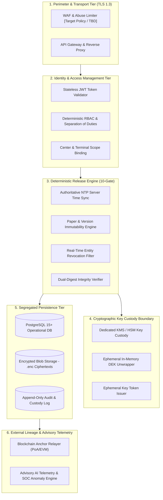

### Core Security Mandates:
1. **Server-Authoritative Enforcement:** All access evaluations, release window validations, and cryptographic verifications execute strictly server-side. Client-supplied flags or timestamps are discarded.
2. **Cryptographic Key Segregation:** Symmetric Data Encryption Keys (DEKs) are stored in the database exclusively as `wrapped_dek` blobs encrypted by a master Key Encryption Key (KEK). Plaintext DEKs/KEKs are **never returned in API responses or written to persistent disk tables**.
3. **Dual-Digest Integrity:** Canonical plaintext document integrity (`content_hash`) is decoupled from encrypted distribution artifact integrity (`ciphertext_hash`).
4. **Asynchronous Ledger Finality:** Blockchain transactions serve as external, tamper-evident lineage anchors and **never act as the operational database or authorization gateway**.
5. **Advisory AI Boundary:** Machine learning models provide risk scores and threat telemetry. AI **cannot authorize release, bypass RBAC, approve papers, or unwrap keys**.

---

## 3. Security Properties vs. Mechanisms Matrix

| Security Property | Architectural Mechanism | What It Protects | What It Does NOT Protect |
| :--- | :--- | :--- | :--- |
| **Confidentiality** | AES-256-GCM + KMS Key Wrapping | Encrypted question paper binary packages (`.enc`) at rest and in transit. | Does not authenticate user identity or authorize release timing. |
| **Integrity** | SHA-256 Dual Digests + GCM Auth Tag | Detects tampering in plaintext document (`content_hash`) and ciphertext package (`ciphertext_hash`). | Does not provide confidentiality or user identity non-repudiation. |
| **Authentication** | Argon2id + Cryptographic JWTs | Verifies the claimed identity of human actors and service clients. | Does not grant permissions to specific examination resources. |
| **Authorization** | Strict RBAC + Center/Device Binding | Enforces least-privilege operations and geographic terminal scoping. | Does not encrypt data payloads or prevent physical screen capture. |
| **Time Control** | Server-Authoritative NTP Clock | Restricts paper decryption strictly to scheduled release windows. | Does not authenticate client hardware identity. |
| **Tamper Evidence** | Blockchain Transaction Anchoring | Provides cryptographically verifiable external lineage receipts. | Does not keep data confidential or operate as the primary access gate. |
| **Advisory Risk** | Telemetry Pattern Anomaly Scoring | Alerts SOC operators to abnormal request bursts or off-hours access. | Does not execute autonomous gate bypass or replace deterministic RBAC. |

---

## 4. Security Non-Goals

VeriQ's threat model explicitly recognizes physical and operating-system boundaries:
1. **Compromised OS Kernel / Physical Hardware:** VeriQ does not claim to prevent data exfiltration if the host OS kernel running the terminal is compromised by rootkits or physical memory bus taps.
2. **Physical Visual Capture:** VeriQ cannot prevent an authorized human superintendent from photographing an unlocked terminal display with an external camera.
3. **Total Insider Collusion:** VeriQ cannot prevent leakage if the Paper Author, Paper Approver, System Administrator, and KMS Custodian actively collude to bypass institutional protocols.
4. **Blockchain as Primary Storage:** VeriQ does not use the blockchain for operational state queries, plaintext question storage, or low-latency authorization.

---

## 5. Protected Asset Inventory

| Asset ID | Protected Asset | Sensitivity Tier | Authorized Storage Locations | Prohibited Locations (Violation of Policy) |
| :--- | :--- | :--- | :--- | :--- |
| **A-01** | Plaintext Question Paper Binary | Tier 6 (Top Secret) | Ephemeral Volatile Memory (RAM buffers during authoring/rendering). | Relational DB, Object Storage, Blockchain, Logs, API JSON. |
| **A-02** | Encrypted Paper Artifact (`.enc`) | Tier 2 (Encrypted) | S3-compatible Object Storage, Local Staging Buffer. | Plaintext file systems, Public web directories. |
| **A-03** | Paper Content Hash (`content_hash`) | Tier 3 (Crypto Meta) | PostgreSQL `paper_versions`, Blockchain Payload, Audit Logs. | None (Public integrity digest). |
| **A-04** | Ciphertext Hash (`ciphertext_hash`) | Tier 3 (Crypto Meta) | PostgreSQL `paper_versions`, Blockchain Payload, Headers. | None (Public distribution digest). |
| **A-05** | Wrapped DEK (`wrapped_dek`) | Tier 3 (Crypto Meta) | PostgreSQL `paper_versions.wrapped_dek` column. | API responses, Client terminals, Public logs. |
| **A-06** | Master KEK / Private Keys | Tier 6 (Top Secret) | Hardware Security Module (HSM) / Dedicated KMS. | Relational DB, Source code, Config files, API JSON. |
| **A-07** | Signing Private Keys (Relayer) | Tier 5 (Secrets) | KMS / Secure Enclave / Relayer Vault. | Relational DB, Git repositories, Client terminals. |
| **A-08** | JWT & Session Credentials | Tier 5 (Secrets) | Client memory / Secure HTTP-Only Cookie. | URLs, Server logs, Persistent client disk. |
| **A-09** | User Credential Verification Data | Tier 5 (Secrets) | PostgreSQL `users.hashed_password` (Argon2id). | Logs, Backups in plaintext, API responses. |
| **A-10** | Center Authorization State | Tier 2 (Operational) | PostgreSQL `centres.is_authorized`. | Client-side local storage overrides. |
| **A-11** | Device Authorization State | Tier 2 (Operational) | PostgreSQL `authorized_devices.status`. | Unverified client HTTP headers. |
| **A-12** | Release Window Schedule | Tier 2 (Operational) | PostgreSQL `paper_centre_assignments`. | Client-supplied timestamps. |
| **A-13** | Paper Version Approval State | Tier 2 (Operational) | PostgreSQL `paper_versions.status`. | In-place mutable record modifications. |
| **A-14** | Access Event Telemetry | Tier 4 (Audit) | PostgreSQL `access_events` (Append-Only). | Overwritable operational tables. |
| **A-15** | Custody Transition History | Tier 4 (Audit) | PostgreSQL `custody_events`, Blockchain Transactions. | Mutable database rows. |
| **A-16** | System Audit Trail | Tier 4 (Audit) | PostgreSQL `audit_logs` (Insert-Only Role). | Application runtime writeable tables. |
| **A-17** | Security Incidents | Tier 4 (Security) | PostgreSQL `incidents`, SOC Dashboards. | Unauthenticated API endpoints. |
| **A-18** | Blockchain Anchor Metadata | Tier 3 (Crypto Meta) | PostgreSQL `blockchain_transactions`, Public Ledger. | None (Cryptographic evidence). |
| **A-19** | AI Advisory Risk Telemetry | Tier 4 (Security) | PostgreSQL `ai_assessments`, Ephemeral Feature Cache. | Primary access authorization engines. |

---

## 6. Threat Actor Taxonomy

| Actor ID | Threat Actor Classification | Motivation / Profile | Capabilities & Attack Surface |
| :--- | :--- | :--- | :--- |
| **TA-01** | **Unauthorized External Attacker** | Financial gain, public disruption, paper leaking. | Internet-facing API attacks, brute-force, credential stuffing, SQL injection, MITM. |
| **TA-02** | **Compromised Authenticated User** | Stolen credentials, phishing victim. | Valid session tokens; attempts horizontal privilege escalation or unauthorized paper access. |
| **TA-03** | **Malicious Examination Insider** | Bribery, paper sale, exam sabotage. | Author or controller attempting unauthorized self-approval, early decryption, or key exfiltration. |
| **TA-04** | **Compromised Examination Center** | Center administrator colluding with local candidates. | Manipulating local clocks, registering rogue devices, attempting early paper release. |
| **TA-05** | **Compromised Terminal Device** | Malware, physical terminal tampering, rogue laptops. | Spoofing device fingerprints, sniffing local RAM buffers, exporting decrypted PDF files. |
| **TA-06** | **Network Adversary (Man-in-the-Middle)**| Eavesdropping, packet tampering, DNS spoofing. | Intercepting distribution traffic, manipulating ciphertext streams, replaying release requests. |
| **TA-07** | **Compromised Operational Database** | Stolen DB dump, rogue DBA, SQLi breach. | Reading relational tables, modifying approval flags, tampering with audit logs. |
| **TA-08** | **Compromised Object Store** | S3 bucket misconfiguration, compromised bucket keys.| Reading `.enc` files, substituting modified ciphertext, deleting stored packages. |
| **TA-09** | **Compromised Key Custody (KMS)** | Insider threat at KMS provider, leaked IAM role. | Requesting unauthorized DEK unwrapping. |
| **TA-10** | **Blockchain Node / RPC Disruptor** | Denial of service, network partition, reorg attacks. | Stalling transaction confirmation, spoofing anchor confirmation status. |
| **TA-11** | **Telemetry Poisoning Attacker** | Evading SOC detection, skewing AI baselines. | Flooding system with false telemetry to mask unauthorized access attempts. |
| **TA-12** | **Supply Chain / Dependency Attacker** | Compromised PyPI/NPM packages, malicious CI/CD. | Injecting backdoors, exfiltrating memory buffers during encryption/decryption. |
| **TA-13** | **Physical Custody Attacker** | Physical intrusion into server room or exam center. | Hard drive theft, hardware keyloggers, display photography. |

---

## 7. Comprehensive Threat Model & STRIDE Mapping

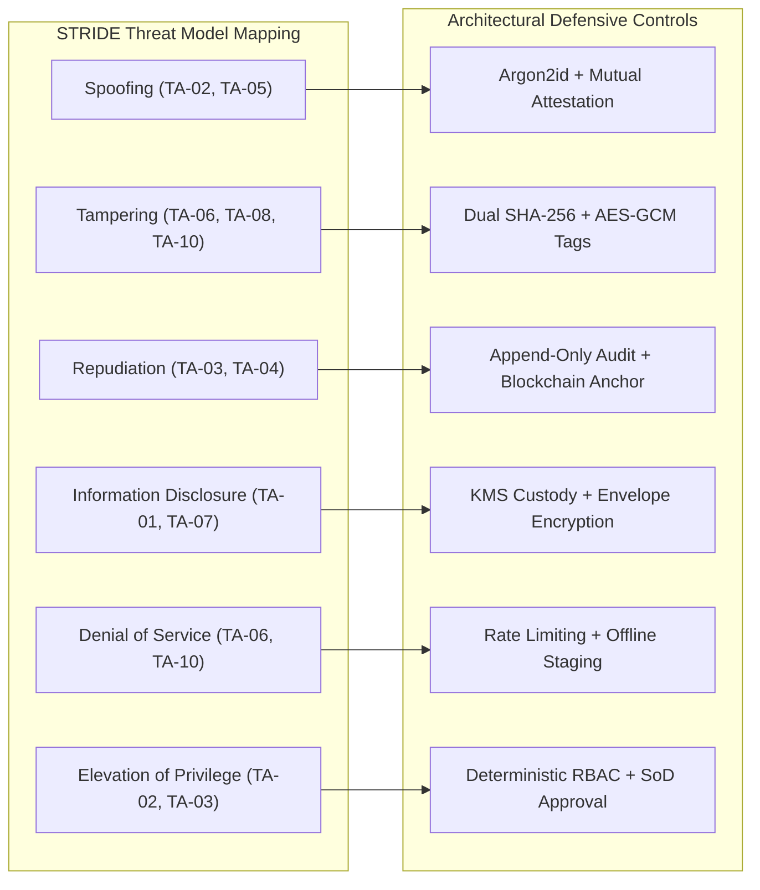

### 7.1 Threat Register

| Threat ID | STRIDE Category | Threat Description | Threat Actor | Impacted Asset | Primary Control | Target Verification Method |
| :--- | :--- | :--- | :---: | :---: | :--- | :--- |
| **THREAT-01** | Spoofing | Client attempts authentication with forged JWT or default credentials. | TA-01, TA-02 | A-08, A-09 | Cryptographic signature validation; zero default identity fallback (`deps.py:18` fix). | Automated Negative Auth Test |
| **THREAT-02** | Spoofing | Rogue hardware terminal attempts to claim authorized center device identity. | TA-05 | A-11 | Two-stage device authorization + TLS client certificate binding `[Target]`. | Device Attestation Test |
| **THREAT-03** | Tampering | Network adversary alters encrypted `.enc` binary during staging download. | TA-06, TA-08 | A-02 | Gate 8 `ciphertext_hash` verification before key release. | Ciphertext Corrupt Test |
| **THREAT-04** | Tampering | Malicious author attempts to alter question paper content after approval. | TA-03 | A-01, A-03 | Immutable `paper_versions` record; DB trigger preventing update of approved versions. | In-Place Mutation Test |
| **THREAT-05** | Repudiation | Center superintendent denies requesting paper decryption. | TA-04 | A-14, A-15 | Mandatory `access_events` write + on-chain `PAPER_RELEASED` transaction. | Audit Lineage Query Test |
| **THREAT-06** | Information Disclosure | Database attacker extracts relational dump to leak exam questions. | TA-07 | A-01, A-05 | Zero plaintext in DB; all DEKs stored as `wrapped_dek` encrypted by external KMS. | DB Dump Exfiltration Test |
| **THREAT-07** | Information Disclosure | Terminal software leaks plaintext PDF to persistent disk cache. | TA-05 | A-01 | Ephemeral in-memory decryption; secure rendering sandbox / spooler boundary. | Disk Artifact Audit Test |
| **THREAT-08** | Denial of Service | External attacker floods release endpoint during active exam window. | TA-01, TA-06 | System Availability | Offline encrypted staging prior to window; cached gateway rate limiting. | Load & Throttling Test |
| **THREAT-09** | Denial of Service | Blockchain RPC outage prevents transaction confirmation. | TA-10 | A-18 | Asynchronous anchoring queue (`PENDING_ANCHOR`); operational release not blocked. | RPC Fault Injection Test |
| **THREAT-10** | Elevation of Privilege | Author attempts to self-approve authored paper version. | TA-03 | A-13 | Server-enforced Separation of Duties (`author_id != approver_id`). | Self-Approval Rejection Test |
| **THREAT-11** | Elevation of Privilege | Client supplies `override_time` parameter to release paper early. | TA-04 | A-12 | Server-authoritative NTP time solely evaluated; client timestamp parameters discarded. | Time Override Exploit Test |

---

## 8. System Trust Boundaries

VeriQ defines eight authoritative trust boundaries established in `07_SYSTEM_ARCHITECTURE.md`:

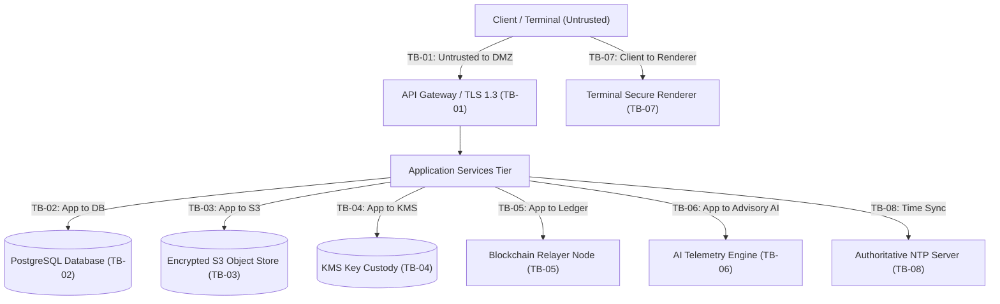

| Boundary ID | Trust Boundary Name | Data Crossing Boundary | Security Controls Enforced | Failure Policy |
| :--- | :--- | :--- | :--- | :--- |
| **TB-01** | Client to API Gateway | HTTP Requests, JSON, Credentials | TLS 1.3, WAF, JWT validation, schema validation, request tracing. | Fail-closed (`401`/`403`/`422`). |
| **TB-02** | Application to Database | SQL Queries, Entity Mutations | Parameterized queries, least-privilege DB roles, TLS connection encryption. | Fail-closed (`503`). |
| **TB-03** | Application to Object Store | Encrypted `.enc` binary streams | TLS 1.3, IAM role credentials, ciphertext hash validation. | Fail-closed (`502`). |
| **TB-04** | Release Engine to KMS | `wrapped_dek`, Key release context | Dedicated IAM policy, TLS 1.3, KMS audit logging, zero plaintext retention. | Fail-closed (`502`). |
| **TB-05** | Application to Blockchain | Transaction payload digests, signatures | Private relayer key custody, nonce tracking, asynchronous anchor queue. | Degraded (`PENDING_ANCHOR`). |
| **TB-06** | Application to AI Telemetry | Sanitized access metadata, timestamps | Redaction of secrets/PII, advisory-only output boundary, rate limiting. | Fail-safe (Release unimpeded). |
| **TB-07** | Terminal to Secure Renderer | Ephemeral decrypted memory buffer | Kiosk mode / read-only display sandbox, clipboard/export blocking. | Fail-closed (Wipe RAM). |
| **TB-08** | Release Engine to NTP Server | NTP time synchronization packets | Stratum-1 time source, drift validation, UTC normalization. | Fail-closed (Reject release). |

---

## 9. Zero-Trust Architecture Principles

VeriQ operates on strict Zero-Trust Architecture (ZTA) principles:
1. **Never Trust Client Claims:** Client-asserted identities, roles, center locations, hardware fingerprints, and timestamps are treated as untrusted inputs until cryptographically validated server-side.
2. **Continuous State Evaluation:** Access is evaluated at request time, session time, resource time, and release time. Prior authorization does not grant future release if paper/center state is subsequently revoked.
3. **Explicit Context Binding:** Release authorization requires cryptographic proof binding `Actor + Role + Center + Device + Active Release Window + Ciphertext Integrity`.
4. **Least Privilege by Default:** Database roles, IAM policies, and application roles possess only the minimum permissions necessary to perform their defined function.

---

## 10. Identity & Access Management (IAM) and Authentication

```mermaid
sequenceDiagram
    autonumber
    participant Actor as User / Client
    participant AuthAPI as Auth Service
    participant DB as PostgreSQL DB
    participant Audit as Audit Service

    Actor->>AuthAPI: POST /api/v1/auth/login (username, password, device_meta)
    AuthAPI->>DB: Query user by username/email
    DB-->>AuthAPI: User record (hashed_password, is_active, role)
    
    alt Account Inactive or Suspended
        AuthAPI->>Audit: Log USER_LOGIN_BLOCKED
        AuthAPI-->>Actor: 403 Forbidden (AUTH_ACCOUNT_SUSPENDED)
    else Password Verification Fails
        AuthAPI->>Audit: Log USER_LOGIN_FAILED
        AuthAPI-->>Actor: 401 Unauthorized (AUTH_INVALID_CREDENTIALS)
    else Password Valid (Argon2id Match)
        AuthAPI->>AuthAPI: Generate Access JWT (15m) + Refresh Token (7d)
        AuthAPI->>Audit: Log USER_LOGIN_SUCCESS
        AuthAPI-->>Actor: 200 OK (access_token, refresh_token, user_profile)
    end
```

### 10.1 Authentication Specifications
- **Password Hashing:** Argon2id is required; cost parameters SHALL be selected and validated during implementation/security benchmarking `[TBD]`. Prototype bcrypt implementation is migrated in Phase 1.
- **JWT Token Architecture:** Cryptographically signed asymmetric JWTs are required; algorithm and token lifetime remain `[TBD]` subject to security review.
- **Access Token Lifetime:** Bounded short lifetime `[TBD — Candidate: 15 minutes]`.
- **Refresh Token Architecture:** Rotating refresh tokens stored in secure HTTP-only cookies `[TBD]`.
- **Elimination of Prototype Fallback:** The prototype vulnerability in `deps.py:18` (falling back to `authority@veriq.local` when authorization headers are missing) is **categorically eliminated** in the target architecture.

---

## 11. Role-Based Access Control (RBAC) & Authorization Matrix

VeriQ enforces five standardized role principals established in `09_DATABASE_DESIGN.md` and `10_API_SPECIFICATION.md`:

| Role Principal | System Capabilities | Mandatory Scope Restrictions |
| :--- | :--- | :--- |
| **`ADMINISTRATOR`** | User management, Center management, Device authorization, Global configuration. | Strictly prohibited from authoring or approving question papers. |
| **`EXAMINER`** | Question paper drafting, Version creation, Encrypted package upload. | Prohibited from self-approving authored papers or assigning centers. |
| **`CONTROLLER`** | Paper version approval, Center assignment, Emergency revocation. | Prohibited from authoring papers or initiating terminal decryption. |
| **`SUPERINTENDENT`** | Terminal package staging, 10-Gate release request execution. | Scoped strictly to assigned `centre_id` and registered `authorized_devices`. |
| **`AUDITOR`** | Read-only compliance dossier inspection, Custody lineage verification, Audit export. | Prohibited from mutating any operational or configuration records. |

### 11.1 RBAC Enforcement Engine
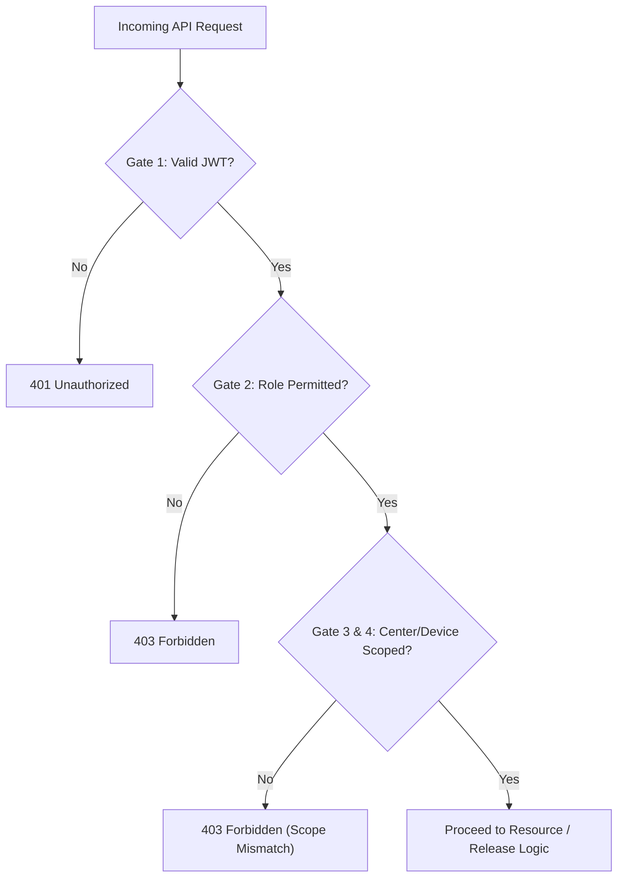

---

## 12. Separation of Duties (SoD) Architecture

To mitigate malicious insider threats (TA-03):
1. **Paper Author $\neq$ Paper Approver:**
   - The user who creates a paper version (`created_by`) **cannot approve that version**.
   - Attempted self-approval returns `403 Forbidden` (`AUTH_SEPARATION_OF_DUTIES_VIOLATION`) and alerts the SOC.
2. **Controller $\neq$ Terminal Decryptor:**
   - The exam controller who approves distribution cannot initiate local terminal decryption.
3. **Database Administrator $\neq$ Application Custodian:**
   - DBA credentials with DDL migration privileges cannot access KMS key unwrapping APIs.

---

## 13. Paper Confidentiality & Lifecycle Protection Architecture

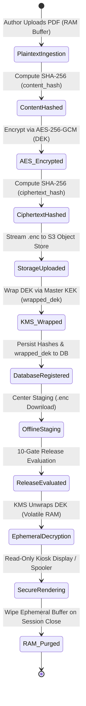

### Confidentiality Invariants:
- **Plaintext examination content is NEVER written to relational database tables or persistent server disks.**
- **Plaintext examination content is NEVER stored on the blockchain ledger.**
- **Plaintext symmetric keys (DEK) are NEVER returned in JSON API responses.**

---

## 14. Cryptographic Primitives & Specification

| **Primitive** | **Standard / Algorithm** | **Key Length / Digest Size** | **Architectural Purpose** |
| :--- | :--- | :---: | :--- |
| **Payload Encryption** | AES-256-GCM (NIST SP 800-38D) | 256-bit Key, 96-bit IV, 128-bit Tag | Authenticated encryption of question paper binary packages (`.enc`). |
| **Document Identity Digest** | SHA-256 (FIPS 180-4) | 256-bit (64 hex chars) | Canonical plaintext question paper fingerprint (`content_hash`). |
| **Package Integrity Digest** | SHA-256 (FIPS 180-4) | 256-bit (64 hex chars) | Encrypted distribution artifact fingerprint (`ciphertext_hash`). |
| **Key Wrapping** | Dedicated KMS / HSM Key Wrapping (Candidate: AES-KeyWrap / RSA-OAEP `[TBD]`) | Implementation-defined `[TBD]` | KMS encryption of ephemeral DEKs (`wrapped_dek`). |
| **User Password Hashing** | Argon2id (RFC 9106) | Cost parameters benchmarked `[TBD]` | One-way hashing of user authentication credentials. |
| **API Transport Security** | TLS 1.3 (RFC 8446) | Forward Secrecy ciphers `[TBD]` | Encryption of all HTTP traffic between clients, gateways, and services. |
| **Blockchain Signatures** | Asymmetric signature standard (Candidate: ECDSA secp256k1 / Ed25519 `[TBD]`) | 256-bit Private Key | Relayer signing of on-chain state anchoring transactions. |

---

## 15. Key Management & Custody Architecture

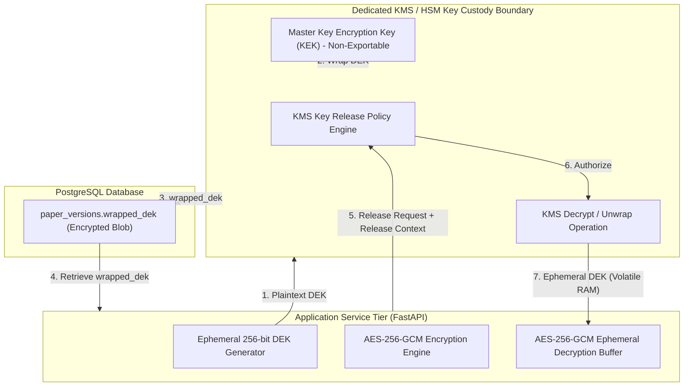

### Key Custody Rules:
1. **DEK Lifecycle:** Data Encryption Keys are generated ephemerally during paper upload, used to encrypt the payload, wrapped immediately via KMS, and then dereferenced from application memory.
2. **KEK Isolation:** Master Key Encryption Keys remain permanently within the dedicated KMS / HSM boundary and cannot be exported by administrators.
3. **Memory Hygiene:** Because Python/managed runtimes cannot guarantee deterministic physical zeroization of memory blocks, VeriQ minimizes key lifetime by restricting DEK existence strictly to localized function scopes, avoiding static caches, and omitting key material from all logging subsystems.

---

## 16. Ephemeral Key Token & Capability Boundary

In `10_API_SPECIFICATION.md`, the release response returns an `ephemeral_key_token`. This section formally establishes its cryptographic boundary:

### Formal Definition:
An `ephemeral_key_token` is a **short-lived, single-use authorization/capability handle** issued by the release engine after successful 10-gate validation. It represents an authorized key-release context and **is NEVER the plaintext DEK, master KEK, or private signing key**. The public API never returns plaintext DEKs. The concrete token-to-decryption-handle exchange protocol remains `[TBD / implementation-defined]` and must preserve assignment, center, device, and session binding as well as revocation and expiry semantics.

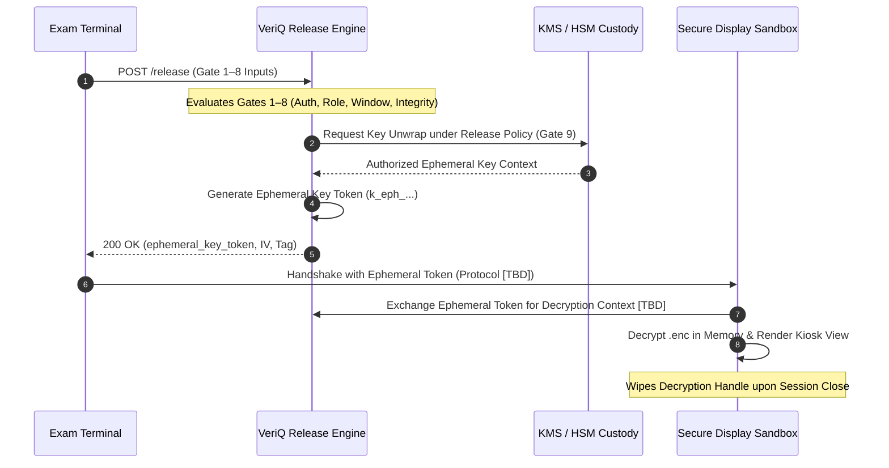

### Ephemeral Token Invariants:
1. **Lifetime:** Strictly bounded and short-lived `[TBD — Candidate: 15 minutes]`.
2. **Non-Transferability:** Cryptographically bound to the requesting `assignment_id`, `centre_id`, `device_id`, and client session context.
3. **Single-Use:** Token reference is consumed upon decryption session initialization where technically supported.
4. **Zero Plaintext Key Exposure:** The public API never exposes plaintext key material; possession of the token reference alone without the authorized release context does not yield plaintext question paper content.
5. **Concrete Exchange Protocol:** The exact protocol between the terminal and secure rendering environment remains `[TBD / implementation-defined]`.

---

## 17. Ten-Gate Deterministic Release Security Architecture

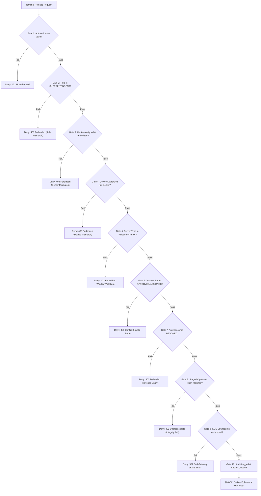

| Gate # | Gate Name | Security Objective | Input Evaluated | Trusted Source | Attack Mitigated | Failure Response |
| :---: | :--- | :--- | :--- | :--- | :--- | :--- |
| **Gate 1** | **Authentication** | Establish verified caller identity. | Bearer JWT | Server JWT Validator | Token forgery, credential stuffing. | `401 Unauthorized` |
| **Gate 2** | **Authorization** | Enforce least-privilege role. | `user.role` | Database `users` table | Privilege escalation. | `403 Forbidden` |
| **Gate 3** | **Center Binding** | Ensure paper is assigned to center. | `centre_id`, `assignment_id` | Database `paper_centre_assignments` | Cross-center paper access. | `403 Forbidden` |
| **Gate 4** | **Device Binding** | Validate terminal hardware authorization.| `device_id`, Client Cert | Database `authorized_devices` | Rogue terminal access. | `403 Forbidden` |
| **Gate 5** | **Authoritative Time**| Enforce scheduled release window. | Server NTP UTC Time | Server NTP Daemon | Premature exam leak (Client clock tampering). | `403 Forbidden` |
| **Gate 6** | **Version State** | Ensure paper is approved and locked. | `version_id.status` | Database `paper_versions` | Unapproved draft leak. | `409 Conflict` |
| **Gate 7** | **Revocation Check**| Enforce emergency security blocks. | Revocation flags | Database status columns | Compromised center/paper access. | `403 Forbidden` |
| **Gate 8** | **Ciphertext Integrity**| Ensure staged binary is unmodified. | `staged_ciphertext_hash` | Database `ciphertext_hash` | Ciphertext tampering / corruption. | `422 Unprocessable` |
| **Gate 9** | **Key Release Auth**| Verify KMS policy for DEK unwrap. | `wrapped_dek`, Context | KMS Policy Engine | Unauthorized key unwrapping. | `502 Bad Gateway` |
| **Gate 10**| **Audit & Anchor** | Record immutable evidence of release. | Audit Event Payload | Append-Only DB & Relayer | Repudiation, unrecorded release. | `500 Internal Error` |

---

## 18. Release Attack Scenarios & Defensive Containment

| Attack Scenario ID | Threat Description | Attacking Actor | Primary Defensive Gate | Containment & Telemetry Action |
| :--- | :--- | :---: | :---: | :--- |
| **ATTACK-REL-01** | Premature access attempt 30 minutes prior to exam window. | TA-04 | **Gate 5 (Time)** | Request rejected; `EARLY_ACCESS` security incident logged; SOC alerted. |
| **ATTACK-REL-02** | Center B attempts to access paper assigned exclusively to Center A. | TA-04 | **Gate 3 (Center)** | Request rejected; `UNAUTHORIZED_CENTRE` incident logged. |
| **ATTACK-REL-03** | Unauthorized rogue laptop attempts decryption at Center A. | TA-05 | **Gate 4 (Device)** | Request rejected; `DEVICE_MISMATCH` incident logged (Severity: CRITICAL). |
| **ATTACK-REL-04** | Revoked superintendent attempts to initiate paper release. | TA-02 | **Gate 1 & Gate 7** | Request rejected; session invalidated; SOC notified. |
| **ATTACK-REL-05** | Network attacker modifies `.enc` package bytes during download. | TA-06 | **Gate 8 (Integrity)**| Request rejected; `HASH_MISMATCH` incident logged; paper quarantined. |
| **ATTACK-REL-06** | Replay of previous release request payload from previous session. | TA-01 | **Gate 1 & Gate 10**| JWT replay rejected / duplicate `Idempotency-Key` returns cached state. |
| **ATTACK-REL-07** | Simultaneous release requests from multiple terminals at same center. | TA-04 | **OCC / lock_version**| First request succeeds; second request collides and returns `409 Conflict`. |
| **ATTACK-REL-08** | Client terminal modifies local OS clock to bypass release window. | TA-04 | **Gate 5 (Server Time)**| Client timestamp ignored; server NTP time enforced; attempt blocked. |
| **ATTACK-REL-09** | Compromised superintendent attempts release outside exam date. | TA-02 | **Gate 5 (Time)** | Blocked by server release window boundaries. |
| **ATTACK-REL-10** | KMS service outage during active release window. | TA-09 | **Gate 9 (KMS)** | Fail-closed (`502 Bad Gateway`); encrypted payload remains protected. |
| **ATTACK-REL-11** | Blockchain RPC node offline during release request. | TA-10 | **Gate 10 (Relayer)** | Release completes; transaction queued as `PENDING_ANCHOR` (Degraded Mode). |

---

## 19. Terminal Device Security & Attestation Boundary

### 19.1 Current Baseline vs. Target Device Model
- **Current Prototype Baseline (`01`):** Relies on browser-supplied string fingerprints (`navigator.userAgent`, screen resolution, canvas hash). **Vulnerable to header spoofing (TA-05).**
- **Target Device Architecture (`[TARGET]`):**
  1. Two-stage device lifecycle: `REGISTERED` $\rightarrow$ `PENDING_AUTHORIZATION` $\rightarrow$ `AUTHORIZED` $\rightarrow$ `REVOKED`.
  2. Cryptographic hardware binding via Client TLS Certificates (mTLS) or TPM 2.0 attestation `[Target / TBD]`.
  3. Kiosk browser lock-down preventing multi-tab inspection or developer tools execution.

---

## 20. Authoritative Time & Synchronization Architecture

- **Authoritative Time Source:** All security evaluations rely strictly on the backend API server's synchronized UTC clock (Stratum-1 NTP sources).
- **Client Timestamp Policy:** **Client-provided timestamps, timezone offsets, or local clock readings are strictly ignored and discarded by the release engine.**
- **Clock Drift Mitigation:** Server NTP daemons enforce maximum allowable drift $\le 1000\text{ ms}$ `[TBD]`. If NTP synchronization fails, the release engine fails closed.

---

## 21. Data Security & Classification Architecture

| Classification Tier | Data Description | Relational DB Column / Storage | Encryption Standard | Access Policy |
| :--- | :--- | :--- | :--- | :--- |
| **Tier 1: Public** | Subject names, exam codes, city names. | Plaintext columns | Standard DB Storage | Read: Authenticated / Public |
| **Tier 2: Operational** | Schedules, version numbers, status flags. | Plaintext columns | Standard DB Storage | Read/Write: Scoped RBAC |
| **Tier 3: Cryptographic** | `content_hash`, `ciphertext_hash`, `wrapped_dek`, IV. | Dedicated hex/binary columns | Immutable post-approval | Read: Scoped; Write: System |
| **Tier 4: Telemetry / Audit**| `access_events`, `custody_events`, `audit_logs`. | Append-only tables | DB Encryption at Rest | Insert-Only; Select: Auditor |
| **Tier 5: Credentials** | Password hashes (`hashed_password`). | Argon2id string column | One-Way Salted Hash | Internal Auth Engine Only |
| **Tier 6: Confidential** | Plaintext examination questions, master KEK. | **PROHIBITED FROM DB STORAGE** | Ephemeral RAM Buffers | Volatile Memory Only |

---

## 22. Database Security Architecture

```mermaid
graph TD
    subgraph DBPrivileges["PostgreSQL Principle of Least Privilege"]
        AppRole["veriQ_app_role (Runtime)"]
        AuditRole["veriQ_audit_role (Writer)"]
        MigrateRole["veriQ_migrator_role (DDL)"]
        ReadRole["veriQ_readonly_role (BI/Audit)"]
    end

    AppRole -->|SELECT, INSERT, UPDATE| OpTables["Operational Tables (papers, users, centres)"]
    AuditRole -->|INSERT, SELECT (NO UPDATE/DELETE)| AuditTables["Audit Tables (audit_logs, access_events)"]
    MigrateRole -->|ALL DDL| Schema["Database Schema Management"]
    ReadRole -->|SELECT ONLY| AllTables["All Database Tables"]
```

### Database Security Controls:
1. **Separation of Database Roles:** Application runtime credentials cannot execute DDL migrations or delete records from audit tables.
2. **Parameterized Access:** All queries execute via SQLAlchemy ORM parameterized statements; raw SQL string concatenation is prohibited.
3. **Encryption at Rest:** PostgreSQL data volumes encrypted using AES-256.

---

## 23. Object Storage Security Architecture

1. **Encrypted Blob Storage:** Stores exclusively encrypted question paper binaries (`.enc`).
2. **Access Control:** Direct public access disabled (`BlockPublicAccess: true`). Access granted solely via IAM service roles.
3. **Object Naming:** UUIDv4-based storage paths (`s3://veriq-vault/artifacts/{UUID}.enc`) preventing examination metadata leakage via filenames.

---

## 24. API & Transport Layer Security

1. **Mandatory TLS 1.3:** Enforces forward secrecy ciphers (`TLS_AES_256_GCM_SHA384`, `TLS_CHACHA20_POLY1305_SHA256`).
2. **Strict Security Headers:**
   ```http
   Strict-Transport-Security: max-age=63072000; includeSubDomains; preload
   X-Content-Type-Options: nosniff
   X-Frame-Options: DENY
   Content-Security-Policy: default-src 'none'; frame-ancestors 'none'
   ```
3. **Idempotency & Replay Protection:** State-mutating routes support `Idempotency-Key` headers with a 24-hour cache window.

---

## 25. Blockchain Security & Evidence Lineage Architecture

The blockchain smart contract layer serves strictly as an **external, tamper-evident lineage anchor**:

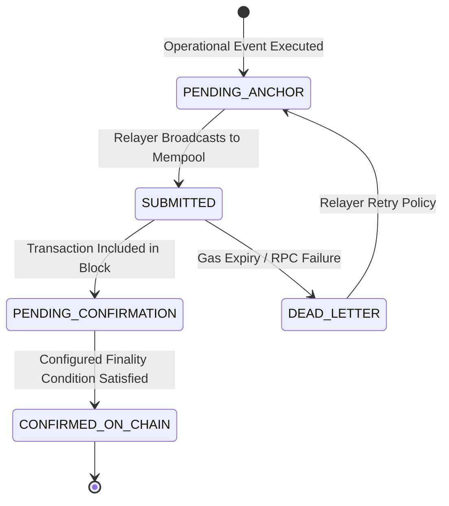

### Blockchain Security Rules:
1. **Zero Plaintext on Ledger:** Only cryptographic hashes (`content_hash`, `ciphertext_hash`), event codes, and entity UUIDs are anchored.
2. **No Phantom Finality:** `PENDING_ANCHOR` is distinct from `CONFIRMED_ON_CHAIN`. Operational success does not falsely report blockchain finality until confirmed by block depth.
3. **Not an Authorization Gateway:** The release engine does not query blockchain RPC synchronously to decide gate pass/fail.

---

## 26. Audit & Chain-of-Custody Security Architecture

| Evidence Stream | Table Entity | Security Function | Immutability Mechanism |
| :--- | :--- | :--- | :--- |
| **Access Telemetry** | `access_events` | Logs every evaluation attempt, success, or denial reason. | Database append-only role permissions (`NO UPDATE/DELETE`). |
| **Custody Transitions**| `custody_events` | Tracks physical and logical state transitions (`CREATED` $\rightarrow$ `RELEASED`). | Referenced in on-chain transaction receipts. |
| **System Audit Logs** | `audit_logs` | Administrative and configuration change records. | Cryptographic hashing + sequential chaining `[Target]`. |
| **External Anchors** | `blockchain_transactions`| Verifiable on-chain proofs for third-party compliance inspection.| Distributed consensus / Proof-of-Authority ledger. |

---

## 27. AI Advisory Security Boundary & Adversarial Robustness

In accordance with `08_AI_ARCHITECTURE.md`:
- **Advisory Authority Only:** AI models have **zero authority** to release encryption keys, approve papers, or alter access rules.
- **Threat Mitigations:**
  - *Telemetry Poisoning (TA-11):* Feature snapshots are sanitized and bounded; statistical baselines resist burst anomalies.
  - *Model Evasion:* Deterministic release gates operate independently of AI risk scores. Even an AI score of `0.0` cannot bypass Gate 5 (Time) or Gate 4 (Device).

---

## 28. Security Incident Response Lifecycle & Playbooks

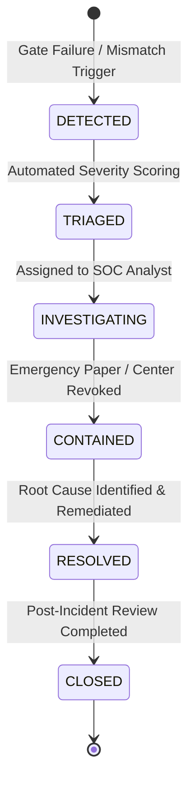

### Incident Severity & Playbook Mapping:
- **`CRITICAL` (`HASH_MISMATCH`, `DEVICE_MISMATCH`):** Automatically halts release; invokes the configured revocation workflow for the affected paper; generates the configured SOC alert `[SLA policy-defined / TBD]`.
- **`HIGH` (`EARLY_ACCESS`, `UNAUTHORIZED_CENTRE`):** Blocks request; records access event; alerts center supervisor.
- **`MEDIUM` (`RATE_LIMIT_EXCEEDED`, `SUSPICIOUS_BURST`):** Throttles client; flags center on SOC threat heatmap.

---

## 29. Security Failure Modes & Fail-Closed Matrix

| Dependency Failure | Impact on Security System | Fail-Closed / Degraded Policy | Resulting System Behavior |
| :--- | :--- | :--- | :--- |
| **PostgreSQL DB Outage** | Operational state unreadable. | **Fail-Closed:** All requests rejected. | HTTP 503; zero paper releases allowed. |
| **KMS / HSM Outage** | Key unwrapping unavailable. | **Fail-Closed:** Release halted. | HTTP 502; encrypted packages remain locked. |
| **Object Store Outage** | Ciphertext packages unreachable. | **Fail-Closed:** Staging halted. | HTTP 502; staging fails safely. |
| **NTP Time Sync Outage** | Authoritative time uncertain. | **Fail-Closed:** Gate 5 fails. | HTTP 403; release blocked until clock sync. |
| **Blockchain RPC Outage** | Anchor transactions cannot be sent. | **Degraded Mode:** Release proceeds. | HTTP 200; anchors queued as `PENDING_ANCHOR`. |
| **AI Telemetry Outage** | Risk scoring unavailable. | **Fail-Safe:** Deterministic gates operate.| HTTP 200; release engine operates normally. |

---

## 30. Security Logging Standards & Sensitive Data Redaction

### Redaction Rules:
The following data elements **MUST NEVER** appear in application logs, distributed traces, or exception messages:
- Plaintext examination question text, titles, or question excerpts.
- Plaintext Symmetric Keys (DEK), Master Keys (KEK), or Private Signing Keys.
- Plaintext passwords, password reset tokens, or Argon2id password hash strings.
- Raw JWT Bearer tokens or refresh token strings.

---

## 31. Secrets Management & Key Custody Configuration

1. **Zero Committed Secrets:** Source code repositories and container images must contain zero static API keys, database passwords, or private keys.
2. **Runtime Secret Injection:** Secrets supplied exclusively via environment variables or secret management services `[Target / TBD]` during container initialization.

---

## 32. Supply Chain Security & Dependency Governance

1. **Dependency Pinning:** All Python (`pyproject.toml` / `requirements.txt`) and Node.js (`package-lock.json`) dependencies are strictly version-pinned.
2. **Vulnerability Scanning:** Automated CI/CD scanning via SAST and dependency vulnerability checkers before production staging.

---

## 33. Secure Development Lifecycle (SDLC) & Security Gates

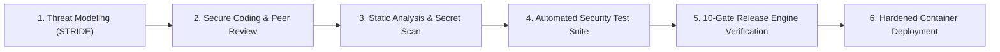

---

## 34. Security Verification & Testing Architecture

Downstream implementation must verify all security controls in `14_TESTING_STRATEGY.md`:
1. **Negative Authentication Tests:** Verify `401 Unauthorized` on missing, expired, and forged JWTs (testing removal of `deps.py:18` flaw).
2. **Negative Release Gate Tests:** Verify rejection for all 10 gate failure modes (early access, center mismatch, device mismatch, hash corruption).
3. **Concurrency Race Tests:** Simulate concurrent release requests to verify optimistic locking (`409 Conflict` on collision).

---

## 35. Security Control Matrix

| Control ID | Security Control Name | Protected Asset | Target Implementation Layer | Current Status | Target Status |
| :--- | :--- | :---: | :--- | :---: | :---: |
| **SEC-CTRL-01** | Argon2id Password Hashing | A-09 | Auth Service (`auth.py`) | `[PARTIAL]` | `[TARGET]` |
| **SEC-CTRL-02** | Zero Default Identity Fallback | A-08, A-09 | Auth Dependency (`deps.py`) | `[CURRENT VULN]` | `[TARGET]` |
| **SEC-CTRL-03** | Deterministic RBAC Enforcement | A-08, A-10 | API Gateway / Dependency | `[CURRENT]` | `[TARGET]` |
| **SEC-CTRL-04** | Separation of Duties Engine | A-13 | Paper Approval Route (`papers.py`) | `[PARTIAL]` | `[TARGET]` |
| **SEC-CTRL-05** | AES-256-GCM Payload Encryption | A-01, A-02 | Encryption Service (`crypto.py`) | `[CURRENT]` | `[TARGET]` |
| **SEC-CTRL-06** | Dual SHA-256 Digest Verification | A-03, A-04 | Hashing Service (`hashing.py`) | `[PARTIAL]` | `[TARGET]` |
| **SEC-CTRL-07** | KMS Envelope Key Custody | A-05, A-06 | KMS Integration Service | `[PARTIAL]` | `[TARGET]` |
| **SEC-CTRL-08** | Ephemeral Key Token Issuer | A-01, A-05 | Release Engine | `[PROPOSED]` | `[TARGET]` |
| **SEC-CTRL-09** | 10-Gate Release Policy Engine | A-01, A-12 | Access Engine (`access.py`) | `[PARTIAL]` | `[TARGET]` |
| **SEC-CTRL-10** | Server NTP Time Authority | A-12 | Release Engine | `[PARTIAL]` | `[TARGET]` |
| **SEC-CTRL-11** | Emergency Revocation Filter | A-10, A-11 | Release Engine / DB Filter | `[CURRENT]` | `[TARGET]` |
| **SEC-CTRL-12** | Append-Only Audit Logging | A-14, A-16 | PostgreSQL Database Permissions | `[PARTIAL]` | `[TARGET]` |
| **SEC-CTRL-13** | Asynchronous Blockchain Anchoring | A-15, A-18 | Blockchain Relayer Service | `[MOCKED]` | `[TARGET]` |
| **SEC-CTRL-14** | Advisory AI Telemetry Isolation | A-19 | Anomaly Service (`security.py`) | `[CURRENT]` | `[TARGET]` |
| **SEC-CTRL-15** | Optimistic Concurrency Control | A-12, A-13 | Database Schema (`lock_version`) | `[PROPOSED]` | `[TARGET]` |
| **SEC-CTRL-16** | Fail-Closed Exception Handling | All Assets | Central Exception Middleware | `[CURRENT]` | `[TARGET]` |

---

## 36. Security Requirement Traceability Matrix

| Upstream Requirement | Primary Threat | Architecture Component | Enforced Security Control | Target Endpoint | Verification Method |
| :--- | :--- | :--- | :--- | :--- | :--- |
| **FR-01: IAM & Auth** | THREAT-01 (Spoofing) | Auth Service | SEC-CTRL-01, SEC-CTRL-02 | `POST /auth/login` | Negative Auth Tests |
| **FR-02: Paper Creation** | THREAT-06 (Disclosure) | Paper Service | SEC-CTRL-05, SEC-CTRL-06 | `POST /papers/{id}/versions` | Crypto Payload Tests |
| **FR-03: SoD Approval** | THREAT-10 (Privilege) | Paper Service | SEC-CTRL-04 | `POST /papers/{id}/versions/{v}/approve` | SoD Rejection Tests |
| **FR-04: Center/Device Binding**| THREAT-02 (Spoofing) | Device Service | SEC-CTRL-03 | `POST /devices/register` | Device Binding Tests |
| **FR-05: 10-Gate Release Engine**| THREAT-11 (Time Override)| Release Engine | SEC-CTRL-08, SEC-CTRL-09, SEC-CTRL-10 | `POST /papers/{id}/versions/{v}/release` | 10-Gate Matrix Tests |
| **FR-06: Digest Verification** | THREAT-03 (Tampering) | Hashing Service | SEC-CTRL-06 | `POST /papers/{id}/versions/{v}/verify` | Tamper Detection Tests |
| **FR-07: Revocation Kill-Switch**| THREAT-01 (Compromise) | Policy Engine | SEC-CTRL-11 | `POST /papers/{id}/revoke` | Revocation Filter Tests |
| **FR-08: Incident Management** | THREAT-05 (Repudiation)| Incident Service | SEC-CTRL-16 | `GET /incidents` | Incident Trigger Tests |
| **FR-09: Advisory AI Telemetry**| THREAT-11 (Poisoning) | Anomaly Service | SEC-CTRL-14 | `GET /security/summary` | Advisory Boundary Tests |
| **FR-10: Audit Dossier** | THREAT-05 (Repudiation)| Audit Service | SEC-CTRL-12 | `GET /audit/reports/{id}` | Audit Trail Query Tests |
| **FR-11: Blockchain Lineage** | THREAT-09 (Ledger Stall)| Relayer Service | SEC-CTRL-13 | `GET /blockchain/status` | Relayer Queue Tests |
| **TR-01: AES-GCM + KMS** | THREAT-06 (Disclosure) | KMS Engine | SEC-CTRL-05, SEC-CTRL-07 | `POST /papers/{id}/versions` | Envelope Crypto Tests |
| **TR-02: Time Synchronization** | THREAT-11 (Time Override)| Release Engine | SEC-CTRL-10 | `POST /papers/{id}/versions/{v}/release` | NTP Override Tests |
| **TR-03: Optimistic Locking** | THREAT-08 (Concurrency)| Database Engine | SEC-CTRL-15 | Mutating Endpoints | Concurrency Race Tests |

**Traceability Summary:**
- **Product Requirements Covered:** 11/11 Functional Areas mapped
- **Technical Requirements Covered:** 3/3 Core Constraints mapped
- **System Trust Boundaries Covered:** 8/8 Boundaries mapped

---

## 37. Security Gap Register

| Gap ID | Current Prototype Baseline (`01`) | Target Production Security (`11`) | Risk Level | Target Remediation Phase |
| :--- | :--- | :--- | :---: | :--- |
| **SEC-GAP-01** | `deps.py:18` falls back to default admin user if auth header missing. | Strict `401 Unauthorized` on missing/invalid credentials. | **CRITICAL** | Phase 1 (Core Security) |
| **SEC-GAP-02** | `access.py:33` allows client-supplied `override_time` parameter. | Server NTP authoritative time solely evaluated. | **CRITICAL** | Phase 1 (Core Security) |
| **SEC-GAP-03** | Lack of controlled kiosk display sandbox / local spooler boundary. | Ephemeral memory decryption / secure display boundary. | **HIGH** | Phase 2 (Terminal Client) |
| **SEC-GAP-04** | In-memory mock blockchain service without real consensus relayer. | Asynchronous blockchain relayer tracking `PENDING_ANCHOR`. | **MEDIUM** | Phase 3 (Ledger Integration) |
| **SEC-GAP-05** | Tracked local database file (`veriq.db`) in repository. | Production database credentials via secret manager; DB untracked. | **HIGH** | Phase 1 (Repo Hygiene) |
| **SEC-GAP-06** | Single hash column in prototype combining content and ciphertext digests.| Discrete `content_hash` and `ciphertext_hash` columns. | **HIGH** | Phase 1 (Schema Refactor) |
| **SEC-GAP-07** | SQLite single-file write locking under concurrent access evaluations. | PostgreSQL 15+ with optimistic concurrency (`lock_version`). | **HIGH** | Phase 2 (DB Hardening) |
| **SEC-GAP-08** | Incomplete separation of duties (Paper setter can approve own paper). | Server-enforced `author_id != approver_id` constraint. | **HIGH** | Phase 1 (Core Security) |
| **SEC-GAP-09** | Browser user-agent / canvas fingerprinting used for device identity. | Two-stage device authorization + client TLS certificate binding. | **HIGH** | Phase 2 (Device Security) |
| **SEC-GAP-10** | Unrestricted `audit_logs` update permissions in prototype database. | Database role permissions enforcing `REVOKE UPDATE, DELETE`. | **HIGH** | Phase 2 (DB Hardening) |

---

## 38. Security Architecture Decision Records (ADRs)

### ADR-SEC-001: Zero-Trust Server-Side Enforcement
- **Status:** APPROVED
- **Context:** Client environments (exam center PCs, web browsers) cannot be trusted to self-enforce security constraints.
- **Decision:** Consolidate all security, time, and authorization evaluations exclusively on backend server components.
- **Consequences:** Client-side timing, flags, or local storage values are strictly ignored.

### ADR-SEC-002: AES-256-GCM for Question Paper Confidentiality
- **Status:** APPROVED
- **Context:** Examination papers require authenticated symmetric encryption protecting both payload privacy and integrity.
- **Decision:** Standardize on AES-256-GCM with unique 96-bit IVs and 128-bit authentication tags per version.
- **Consequences:** Cryptographically robust, hardware-accelerated, detects unauthorized ciphertext modification through authenticated encryption.

### ADR-SEC-003: Dual-Digest Cryptographic Architecture
- **Status:** APPROVED
- **Context:** System must distinguish between approved question content identity and encrypted distribution package integrity.
- **Decision:** Decouple `content_hash` (plaintext SHA-256) from `ciphertext_hash` (encrypted package SHA-256).
- **Consequences:** Enables pre-release ciphertext staging verification without exposing plaintext content.

### ADR-SEC-004: KMS Envelope Key Custody Separation
- **Status:** APPROVED
- **Context:** Relational database breaches must not compromise examination question encryption keys.
- **Decision:** Store DEKs exclusively as `wrapped_dek` encrypted by master KEKs residing inside dedicated KMS/HSM hardware.
- **Consequences:** Database dumps contain zero plaintext keys; key release requires explicit KMS policy evaluation.

### ADR-SEC-005: Ephemeral Capability Token Decryption Boundary
- **Status:** APPROVED
- **Context:** Plaintext DEKs must not be transmitted over public JSON API envelopes.
- **Decision:** Issue short-lived `ephemeral_key_token` handles for localized terminal decryption handshakes.
- **Consequences:** Prevents key leakage in API logs and network proxies.

### ADR-SEC-006: Ten-Gate Deterministic Release Policy Engine
- **Status:** APPROVED
- **Context:** Paper release requires multi-dimensional validation across identity, role, location, hardware, time, state, and integrity.
- **Decision:** Consolidate release checks into an atomic 10-gate deterministic evaluation sequence.
- **Consequences:** Fail-closed posture; any single gate failure halts release and logs security telemetry.

### ADR-SEC-007: Blockchain as External Evidence Anchor
- **Status:** APPROVED
- **Context:** Blockchain latency and throughput limitations must not bottleneck operational distribution or create phantom finality.
- **Decision:** Use blockchain as an asynchronous evidence relayer, tracking multi-stage anchor states (`PENDING_ANCHOR` $\rightarrow$ `CONFIRMED_ON_CHAIN`).
- **Consequences:** Prevents operational stalls; provides immutable post-event audit receipts.

### ADR-SEC-008: Advisory AI Telemetry Boundary
- **Status:** APPROVED
- **Context:** Machine learning models are probabilistic and vulnerable to adversarial manipulation.
- **Decision:** Isolate AI telemetry to an advisory plane with zero autonomous key release or authorization power.
- **Consequences:** Preserves strictly deterministic security guarantees while enhancing SOC observability.

### ADR-SEC-009: Fail-Closed Security Posture
- **Status:** APPROVED
- **Context:** Unexpected system crashes, missing parameters, or dependency outages must never degrade to open access.
- **Decision:** All exceptions, schema errors, and dependency failures abort operations and reject release requests.
- **Consequences:** Maximizes confidentiality protection during infrastructure disruptions.

### ADR-SEC-010: Strict Separation of Duties for Approval
- **Status:** APPROVED
- **Context:** Single-author compromise represents a critical risk for question paper leaks.
- **Decision:** Programmatically enforce `author_id != approver_id` for all version approvals.
- **Consequences:** Mitigates rogue author threats; requires at least two distinct authenticated institutional principals.

---

## 39. Open Security Decisions & TBD Register

| Decision ID | Area | Working Assumption | Resolution Milestone |
| :--- | :--- | :--- | :--- |
| **TBD-SEC-01** | Production KMS Provider | AWS KMS / Cloud KMS / Hardware HSM. | Phase 3 (Cloud Infra) |
| **TBD-SEC-02** | Hardware Attestation Tech | TPM 2.0 vs. Client TLS Certificates (mTLS). | Phase 2 (Terminal Security) |
| **TBD-SEC-03** | Terminal Sandbox Mode | Custom locked Electron Kiosk vs. Secure OS Spooler. | Phase 2 (Terminal Client) |
| **TBD-SEC-04** | Master KEK Rotation Policy | Policy-defined automated rotation in KMS `[TBD]`. | Phase 3 (Security Policy) |
| **TBD-SEC-05** | On-Chain Confirmation / Finality Policy | Configured confirmation depth or consensus finality condition `[TBD]`. | Phase 3 (Ledger Deployment) |

---

## 40. Security Assumptions & Operating Prerequisites

1. **Perimeter TLS Termination:** The reverse proxy / load balancer terminating TLS 1.3 is securely configured with valid CA certificates.
2. **KMS Provider Security:** The underlying cloud KMS or physical HSM operates with certified hardware isolation `[FIPS 140-2 level TBD]`.
3. **NTP Infrastructure:** Server instances are synchronized against trusted Stratum-1 NTP sources.
4. **Physical Terminal Custody:** Examination center administration provides physical supervision preventing unauthorized hardware extraction.

---

## 41. Residual Risk Register

| Residual Risk Description | Inherent Severity | Applied Mitigation Controls | Residual Likelihood | Residual Impact | Operational Contingency |
| :--- | :---: | :--- | :---: | :---: | :--- |
| **Physical Display Screen Capture** | CRITICAL | Read-only kiosk mode; dynamic candidate/session watermarking `[Target]`. | MEDIUM | HIGH | Human invigilator monitoring. |
| **KMS Provider Outage** | HIGH | Fail-closed policy; multi-region KMS replication `[Target]`. | LOW | HIGH | Exam rescheduling protocol. |
| **Zero-Day OS Kernel Compromise**| CRITICAL | Locked-down Linux kiosk OS; minimal attack surface. | LOW | HIGH | Terminal isolation & revocation. |
| **Collusion of Multiple Principals**| CRITICAL| Four-eyes SoD approval; tamper-evident blockchain audit trail. | LOW | CRITICAL | Forensic/investigative evidence supporting incident review. |

---

## 42. Downstream Security Contract

This document provides binding architectural contracts for downstream specifications:
- **`12_UI_UX_DESIGN.md`:** Must reflect all 10 release gate states, clear security failure notices, and role-based interface visibility.
- **`13_DEPLOYMENT.md`:** Must enforce TLS 1.3, segregated database roles, object store access controls, and environment secret injection.
- **`14_TESTING_STRATEGY.md`:** Must implement test suites for all 11 release attack scenarios, negative auth cases, SoD rejection, and concurrency locks.

---

## 43. Final Security QA & Document Control

- [x] Document follows authoritative hierarchy (downstream of `01` through `10`).
- [x] Comprehensive threat model defines 13 threat actors and STRIDE mapping.
- [x] Asset inventory categorizes 19 discrete assets across Tiers 1 through 6.
- [x] All 8 system trust boundaries (TB-01 to TB-08) detailed with failure policies.
- [x] 10-Gate deterministic release engine fully specified with defensive attack mappings.
- [x] Plaintext keys and plaintext question papers strictly prohibited from DB and blockchain storage.
- [x] Dual-digest architecture (`content_hash` vs. `ciphertext_hash`) strictly maintained.
- [x] Ephemeral key token explicitly defined as capability handle, NOT plaintext DEK.
- [x] Prototype vulnerabilities (`deps.py:18` default auth, `override_time`) cataloged in Gap Register.
- [x] AI boundary specified as strictly advisory with zero key release or bypass authority.
- [x] Blockchain finality states (`PENDING_ANCHOR` vs. `CONFIRMED_ON_CHAIN`) separated.
- [x] Zero unsupported absolute claims ("100%", "guaranteed", "instantaneous", "unbreakable").
- [x] Traceability matrix maps 11 functional requirements, 3 constraints, and 8 trust boundaries.

---

## 44. Document Sign-Off

| Review Role | Reviewer Status | Sign-Off Date |
| :--- | :--- | :--- |
| **Principal Application Security Architect** | `DRAFT / PENDING REVIEW` | September 2026 |
| **Cryptographic Security Engineer** | `DRAFT / PENDING REVIEW` | September 2026 |
| **Zero-Trust Systems Architect** | `DRAFT / PENDING REVIEW` | September 2026 |
| **Product Security Lead** | `DRAFT / PENDING REVIEW` | September 2026 |
