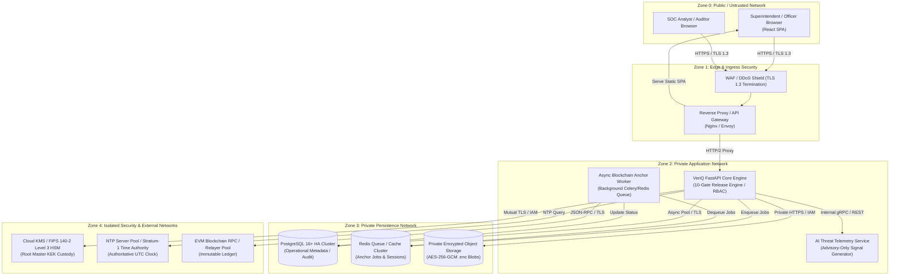
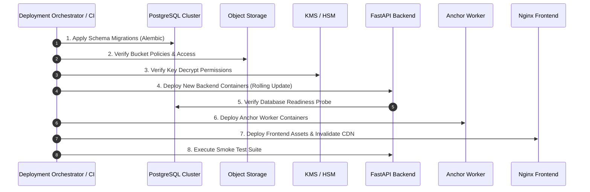

# VeriQ — Deployment, Infrastructure & Operations Specification

**Document ID:** VERIQ-DEP-013  
**Version:** 1.0.0  
**Status:** DRAFT / PENDING REVIEW  
**Date:** 2026-09-17  
**Owner:** Principal Cloud & Infrastructure Architecture Lead  
**Classification:** Restricted / Engineering & Operations Internal  

---

## 1. Document Metadata & Control

### 1.1 Document Overview
This document specifies the deployment topology, container architecture, network segmentation, secret lifecycle, data persistence, cryptographic custody, blockchain gateway, time synchronization, observability, failure-mode degradation, and release engineering protocols for **VeriQ** (*Secure Examination Paper Distribution Using Blockchain*).

### 1.2 Authoritative Document Hierarchy & Traceability
This specification translates the frozen architectural, cryptographic, and operational requirements established across the upstream documentation suite:
- **`01_REPOSITORY_AUDIT.md`**: Baseline repository inspection, code gaps, and deployment defects.
- **`02_PRODUCT_BLUEPRINT.md`**: Core product vision, enterprise actors, and distribution flows.
- **`03_PROBLEM_STATEMENT.md`**: WB-03 problem definition and integrity imperatives.
- **`04_MARKET_RESEARCH.md`**: Operational risk benchmarks and examination board compliance standards.
- **`05_PRODUCT_REQUIREMENTS.md`**: Functional release requirements, role boundaries, and audit mandates.
- **`06_TECHNICAL_REQUIREMENTS.md`**: Cryptographic protocols, dual-hash integrity, and ten-gate release engine.
- **`07_SYSTEM_ARCHITECTURE.md`**: Component decomposition, trust zones, and sequence flows.
- **`08_AI_ARCHITECTURE.md`**: Advisory-only anomaly detection and threat telemetry boundary.
- **`09_DATABASE_DESIGN.md`**: PostgreSQL schema, transactional boundaries, and migration lifecycle.
- **`10_API_SPECIFICATION.md`**: REST contracts, error structures, and release endpoints.
- **`11_SECURITY_ARCHITECTURE.md`**: Threat modeling, fail-closed boundaries, and key custody topology.
- **`12_UI_UX_DESIGN.md`**: Frontend interaction models, kiosk constraints, and live demo scripting.

```
+---------------------------------------------------------------------------------------------------+
|                                 UPSTREAM CANONICAL ARCHITECTURE                                   |
|   01-Audit -> 02-Blueprint -> 05/06-Reqs -> 07-SysArch -> 08-AI -> 09-DB -> 10-API -> 11-Sec -> 12-UX|
+---------------------------------------------------------------------------------------------------+
                                                  |
                                                  v
+---------------------------------------------------------------------------------------------------+
|                        13_DEPLOYMENT.md (Infrastructure, Cloud & SRE)                            |
|  - Environments (Dev / Demo / Staging / Prod)     - Container Topology & Hardening                |
|  - Network Segmentation & Ingress/TLS             - KMS/HSM & Secret Injection Boundaries         |
|  - Database (PostgreSQL) & Object Storage (.enc)  - Blockchain Gateway & NTP Time Synchronization |
|  - Failure Modes, Observability & Runbooks        - CI/CD Pipelines & Rollback Procedures         |
+---------------------------------------------------------------------------------------------------+
```

### 1.3 Scope & Intended Audience
- **Scope:** Infrastructure specification for Local Development, Hackathon Demonstration, Staging Verification, and Target Enterprise Production.
- **Audience:** DevOps Engineers, Cloud Architects, Site Reliability Engineers (SRE), Application Security Leads, SOC Operators, and Examination Board Infrastructure Teams.

---

## 2. Deployment Executive Summary & Design Philosophy

### 2.1 Deployment Philosophy
VeriQ enforces a **Zero-Trust, Defense-in-Depth, Server-Authoritative** deployment model. Infrastructure configuration mirrors the strict cryptographic and operational boundaries established in the Security Architecture (`11_SECURITY_ARCHITECTURE.md`):

1. **Frontend Presentation-Only:** The React frontend is a completely untrusted static asset tier; no release decisions, decryption logic, or master credentials reside on the client.
2. **Authoritative Backend Core:** The FastAPI backend is the sole enforcement engine for the 10 release gates, cryptographic unwrap orchestration, role-based access control, and audit logging.
3. **Strict Content Isolation:** Plaintext examination content is NEVER written to disk, PostgreSQL, object storage, container layers, logs, or blockchain ledgers.
4. **Encrypted Blob Storage:** Ciphertext packages (`.enc`) reside exclusively in private object storage, decoupled from relational metadata.
5. **Hardware/KMS Custody Boundary:** Root Key Encryption Keys (KEKs) never leave dedicated KMS/HSM hardware appliances. Data Encryption Keys (DEKs) are stored only in wrapped ciphertext format.
6. **Asynchronous Immutable Anchoring:** Blockchain ledger writes (SHA-256 integrity roots, release receipts, revocation proofs) operate asynchronously to decouple exam-hall releases from public EVM mining finality.

### 2.2 Maturity State Classification Across Environments

```
+---------------------+-------------------------+-------------------------+-------------------------+
| Architecture Tier   | Current Prototype (`01`)| Hackathon MVP (`12/13`)| Target Enterprise Prod  |
+---------------------+-------------------------+-------------------------+-------------------------+
| Frontend Web App    | [CURRENT] Vite SPA      | [MVP] Hardened React SPA| [TARGET] Kiosk Client   |
| Backend API Server  | [CURRENT] FastAPI Monolith| [MVP] Async FastAPI   | [TARGET] Scaled API Svc |
| Relational Database | [CURRENT] SQLite File   | [MVP] PostgreSQL 16+    | [TARGET] Managed HA PG  |
| Object Storage      | [CURRENT] Local FS Foldr| [MVP] Local / S3-Compat | [TARGET] KMS-Bound S3   |
| Key Custody         | [CURRENT] Static Raw Key| [MVP] Mocked KMS Enclave| [TARGET] Cloud KMS / HSM|
| Blockchain Node     | [CURRENT] In-Memory Mock| [MVP] Local PoA / Testnet| [TARGET] Enterprise EVM |
| Time Authority      | [CURRENT] Host Time     | [MVP] Simulated NTP Sync| [TARGET] Dual NTP Oracls|
| Threat AI Telemetry | [CURRENT] Heuristic Mock| [MVP] Rule+Stat Engine  | [TARGET] Isolated ML Svc|
+---------------------+-------------------------+-------------------------+-------------------------+
```

---

## 3. Deployment Goals

- **Confidentiality:** Examination papers remain cryptographically sealed at rest and in transit; plaintext DEKs exist only ephemerally in volatile memory during active authorized kiosk sessions.
- **Integrity:** Every artifact, schema migration, container image, and release event is verifiable via cryptographic hashes anchored to immutable ledgers.
- **Availability:** Core administrative, authoring, and staging operations remain resilient to transient network drops; local examination center staging enables deterministic offline-ready releases.
- **Controlled Release Enforcement:** The ten release gates execute server-side under strict server-authoritative UTC clock synchronization.
- **Least Privilege Secret Management:** Zero long-lived root credentials stored in source control, environment templates, or application databases.
- **End-to-End Observability:** Full structural JSON logging, OpenTelemetry-compatible tracing, and Prometheus metrics across all system transitions without leaking sensitive data.
- **Reproducibility & Immutable Deployments:** All runtime containers built from pinned base images, versioned tags, and audited dependency trees.

---

## 4. Deployment Non-Goals

The VeriQ deployment architecture explicitly disclaims the following non-goals (aligned with `11_SECURITY_ARCHITECTURE.md`):
1. **Compromised Endpoint OS Protection:** Infrastructure controls cannot prevent leakage if the physical examination center OS is running ring-0 kernel spyware or a compromised hypervisor.
2. **Physical / Optical Capture Prevention:** No network or container control can prevent candidates or proctors from photographing screens with covert external cameras.
3. **Total Insider Board Collusion:** If all root institutional cryptographic authorities, database administrators, and KMS controllers collude maliciously, technical infrastructure cannot prevent unauthorized access.
4. **Absolute 100% Uptime Guarantees:** No distributed network topology provides infinite availability; all dependencies follow documented fail-closed or fail-safe degradation paths.
5. **Supply Chain Omniscience:** Infrastructure hardening reduces but cannot mathematically eliminate zero-day vulnerabilities in third-party runtime kernels or hardware microcode.

---

## 5. Environment Model

VeriQ defines four distinct operational deployment environments:

```
+--------------------+      +--------------------+      +--------------------+      +--------------------+
| 1. LOCAL DEV       | ---> | 2. HACKATHON DEMO  | ---> | 3. STAGING (UAT)   | ---> | 4. PRODUCTION      |
| Developer PC       |      | Isolated VM/Docker |      | Cloud/VPC Mirror   |      | Multi-AZ Enclave   |
| SQLite / Mock Chain|      | Simulated UTC Time |      | Pre-Prod Hardware  |      | Managed PG + KMS   |
| Status: [CURRENT]  |      | Status: [MVP]      |      | Status: [TARGET]   |      | Status: [TARGET]   |
+--------------------+      +--------------------+      +--------------------+      +--------------------+
```

### 5.1 Local Development Environment (`[CURRENT]`)
- **Host:** Developer workstation (Linux, macOS, Windows/WSL2).
- **Runtime:** Python 3.11+ virtual environment (`uvicorn`), Node.js 20+ (`vite dev`).
- **Database:** SQLite file (`veriq.db` via `aiosqlite`) or local Dockerized PostgreSQL.
- **Storage:** Local directory (`./storage/encrypted_papers`).
- **Blockchain:** In-memory mock relayer (`BLOCKCHAIN_MODE=mock`).
- **KMS / Keys:** Static development hex keys in `.env`.
- **Current Defect:** Broken docker compose; SQLite default lacks multi-user concurrent locking.

### 5.2 Hackathon Demonstration Profile (`[MVP]`)
- **Host:** Single-node isolated demonstration server or cloud instance (e.g., Linux VM / Docker Compose).
- **Topology:** Containerized Frontend (Nginx), Backend (FastAPI), PostgreSQL 16, and Local EVM node / Mock Relayer.
- **Time Authority:** Server-authoritative with isolated simulated demo-clock adjustment endpoint (`/api/v1/demo/time`) strictly restricted to demo mode.
- **Telemetry:** In-memory heuristic AI anomaly feed simulating geographic brute-force attacks.
- **Artifacts:** Pre-seeded realistic mock examination papers and authorized center keys.

### 5.3 Staging & UAT Environment (`[TARGET]`)
- **Host:** Cloud Virtual Private Cloud (VPC) / Dedicated Institutional Test Cluster.
- **Topology:** Multi-container deployment mirroring production network segmentation.
- **Database:** Dedicated PostgreSQL 16+ instance with automated schema migration verification.
- **Storage:** Private S3-compatible bucket with strict IAM bucket policies.
- **KMS:** Non-production Cloud KMS key ring / Software-backed HSM partition.
- **Blockchain:** Dedicated EVM testnet (e.g., Sepolia or private enterprise PoA testnet).
- **Time:** Real NTP pool synchronization with automated drift alerting.

### 5.4 Production Environment (`[TARGET]`)
- **Host:** Hardened Institutional VPC / GovCloud multi-availability-zone (Multi-AZ) infrastructure.
- **Topology:** Fully segmented Edge, Application, Data, and Cryptographic Security zones.
- **Database:** Managed High-Availability PostgreSQL with automated daily snapshots and point-in-time recovery (PITR).
- **Storage:** Hardened private Object Storage with server-side encryption (SSE-KMS), versioning, and bucket lock.
- **KMS / HSM:** FIPS 140-2 Level 3 / 140-3 Hardware Security Module (`[CANDIDATE / TBD]`: AWS CloudHSM, Azure Dedicated HSM, GCP Cloud HSM, or on-premise Thales/Luna HSM).
- **Blockchain:** Private/Permitted Enterprise PoA Ledger or Public EVM L2 with high-throughput relayer pool.
- **Time:** Redundant Stratum-1 NTP time servers with hardware timestamping.

---

## 6. Current Repository Deployment Baseline Audit

An exhaustive inspection of the current repository yields the following factual baseline:

```
+---------------------------------------------------------------------------------------------------+
| REPOSITORY DEPLOYMENT AUDIT FINDINGS                                                              |
+----------------------+----------------+--------------------------------------+--------------------+
| Artifact / File      | Status         | Evidence from Repository Inspection  | Operational Risk   |
+----------------------+----------------+--------------------------------------+--------------------+
| Dockerfile (root)    | [NOT FOUND]    | File does not exist at root          | Cannot build image |
| backend/Dockerfile   | [NOT FOUND]    | docker-compose references non-existent| Compose fails fatal|
| frontend/Dockerfile  | [NOT FOUND]    | docker-compose references non-existent| Compose fails fatal|
| docker-compose.yml   | [BROKEN]       | Hardcoded secrets, missing build ctx | Security & runtime |
| backend/reqs.txt     | [PARTIAL]      | Missing `asyncpg` for PostgreSQL      | Cannot run on PG   |
| frontend/package.json| [CURRENT]      | Modern Vite + React 18 configuration | Builds via npm dev |
| .env.example         | [INSECURE]     | Contains static JWT and hex crypto key| Credential leak risk|
| Database Engine      | [PROTOTYPE]    | Defaults to SQLite (`veriq.db`)      | Concurrency limits |
| Storage Provider     | [PROTOTYPE]    | Local filesystem folder `./storage`  | No S3 integration  |
| Blockchain Node      | [MOCKED]       | In-process python mock ledger        | No actual EVM conn |
| KMS Integration      | [SIMULATED]    | Local AES-GCM software wrapper       | Master key in memory|
+----------------------+----------------+--------------------------------------+--------------------+
```

### Detailed Baseline Audit Table

| Component | Current State | Evidence | Deployment Risk | Target Migration |
| :--- | :---: | :--- | :--- | :--- |
| **Container Engine** | `[BROKEN]` | `docker-compose.yml` attempts to build `./backend/Dockerfile` and `./frontend/Dockerfile`, neither of which exists. | Build command crashes immediately; deployment blocked. | Implement multi-stage, unprivileged Dockerfiles for Frontend and Backend. |
| **Secrets in Compose** | `[CRITICAL GAP]` | `POSTGRES_PASSWORD: veriq_password_2026` and `ENCRYPTION_KEY` hardcoded in `docker-compose.yml`. | Plaintext secrets exposed in VCS and container metadata. | Extract all secrets to runtime secret manager / env injection. |
| **Exposed Ports** | `[INSECURE]` | `docker-compose.yml` exposes DB port `5432:5432` and Redis `6379:6379` to public host. | Unauthorized direct network access to persistence tier. | Bind persistence tiers strictly to private Docker internal network. |
| **PostgreSQL Driver** | `[MISSING]` | `backend/requirements.txt` contains `aiosqlite` but omits `asyncpg` or `psycopg`. | FastAPI crashes with `ModuleNotFoundError` when pointing to Postgres. | Add `asyncpg>=0.29.0` and `psycopg2-binary` to `requirements.txt`. |
| **Static Assets** | `[CURRENT]` | Frontend runs via Vite dev server (`localhost:3000`). | Dev server unsuitable for production performance and security. | Multi-stage Nginx container serving compiled static assets. |
| **Blockchain Adapter**| `[MOCKED]` | `BLOCKCHAIN_MODE=mock` executes in-memory dictionary append. | Non-authoritative, zero Byzantine fault tolerance. | Connect Web3/Ethers JSON-RPC provider to EVM PoA node. |
| **Time Authority** | `[UNSAFE]` | Prototype relies on host OS system clock. | Clock tampering allows premature paper release. | NTP client drift verification against authoritative time source. |

---

## 7. Target Deployment Architecture



---

## 8. Container Architecture

To resolve the missing Dockerfile defect and establish container boundaries, the following container images are specified:

```
+---------------------------------------------------------------------------------------------------+
| CONTAINER SERVICE ARCHITECTURE                                                                    |
+-------------------+---------------------------+-----------+---------------+-----------------------+
| Service Name      | Base Image                | User      | Exposed Ports | Primary Responsibility|
+-------------------+---------------------------+-----------+---------------+-----------------------+
| `veriq-frontend`  | `nginx:1.25-alpine`       | `nginx`   | 80/TCP (HTTP) | Static SPA & Security |
| `veriq-backend`   | `python:3.11-slim-bookworm`| `veriq`   | 8000/TCP      | Core API & 10 Gates   |
| `veriq-worker`    | `python:3.11-slim-bookworm`| `veriq`   | None          | Async Anchor Processor|
| `veriq-ai`        | `python:3.11-slim-bookworm`| `veriq`   | 8001/TCP (Int)| Advisory Telemetry    |
| `veriq-db`        | `postgres:16-alpine`      | `postgres`| 5432/TCP (Int)| Relational Storage    |
| `veriq-redis`     | `redis:7-alpine`          | `redis`   | 6379/TCP (Int)| Task Queue & Caching  |
+-------------------+---------------------------+-----------+---------------+-----------------------+
```

### 8.1 Frontend Container Specification (`veriq-frontend`)
- **Stage 1 (Build):** `node:20-alpine`, executes `npm ci` and `npm run build`.
- **Stage 2 (Runtime):** `nginx:1.25-alpine`. Copies static `/dist` bundle.
- **Runtime User:** `nginx` (UID 101, unprivileged).
- **Filesystem:** Read-only root filesystem (`read_only: true`); ephemeral `/tmp` and `/var/cache/nginx` mounted as `tmpfs`.
- **Security Headers Injected via Nginx:**
  ```nginx
  add_header X-Frame-Options "DENY" always;
  add_header X-Content-Type-Options "nosniff" always;
  add_header Content-Security-Policy "default-src 'self'; script-src 'self'; style-src 'self' 'unsafe-inline'; img-src 'self' data:; connect-src 'self' https://api.veriq.internal;" always;
  add_header Referrer-Policy "strict-origin-when-cross-origin" always;
  add_header Permissions-Policy "camera=(), microphone=(), geolocation=(), payment=()" always;
  ```

### 8.2 Backend Core Container Specification (`veriq-backend`)
- **Base Image:** `python:3.11-slim-bookworm`.
- **Runtime User:** `veriq` (Non-root user, `[EXAMPLE: UID 10001, GID 10001]`, created with `--no-create-home`).
- **Dependencies Installed:** Production wheels only via pinned `requirements.txt` (`fastapi`, `uvicorn`, `asyncpg`, `cryptography`, `pydantic-settings`).
- **Command:** `uvicorn app.main:app --host 0.0.0.0 --port 8000 --workers 4 --no-server-header` `[EXAMPLE / CANDIDATE: 4 workers]`
- **Environment Injected:** Database connection strings, KMS endpoint config, Redis URL (secrets via runtime secret manager).

### 8.3 Blockchain Anchor Worker (`veriq-worker`)
- **Base Image:** Shared codebase with `veriq-backend`.
- **Command:** `python -m app.workers.anchor_processor`
- **Responsibility:** Consumes `PENDING_ANCHOR` jobs from Redis queue, signs EVM transactions using secured relayer credentials, polls for block inclusion, and updates DB status to `CONFIRMED_ON_CHAIN`.
- **Failure Boundary:** If blockchain RPC fails or reverts, worker handles exponential backoff and dead-letter queues without crashing the main API.

---

## 9. Container Security Standards

All production container workloads must adhere to the following hardening baseline `[TARGET]`:

1. **Non-Root Execution:** All containers run as explicit unprivileged UIDs (`UID > 10000`). Root execution in containers is strictly prohibited.
2. **Read-Only Root Filesystems:** Container root filesystems mounted read-only (`read_only: true` in Compose/K8s). Writable paths restricted to dedicated in-memory `tmpfs` mounts.
3. **Dropped Linux Capabilities:** All standard Linux capabilities dropped (`cap_drop: ["ALL"]`); only minimal required capabilities added back if strictly necessary (e.g., `NET_BIND_SERVICE`).
4. **No Docker Socket Mounting:** Mounting `/var/run/docker.sock` inside application containers is strictly prohibited.
5. **Base Image Provenance & Minimal Surface:** Use official slim Debian/Alpine base images. Avoid full Ubuntu or development SDK images in production.
6. **Vulnerability Scanning & SBOM:** Container images must undergo automated CVE scanning (e.g., Trivy, Grype) with blocking on CRITICAL and HIGH severity CVEs in CI. Software Bill of Materials (SBOM) generated via CycloneDX/SPDX.
7. **No Secrets in Container Layers:** Container build commands (`RUN`) must never copy `.env` files, private keys, or API tokens into intermediate image layers.

---

## 10. Network Architecture & Segmentation

```
+---------------------------------------------------------------------------------------------------+
| LOGICAL NETWORK SEGMENTATION & ACCESS CONTROL                                                     |
+-------------------+-------------------+-----------------------+-----------------------------------+
| Network Tier      | CIDR / Subnet     | Allowed Inbound       | Allowed Outbound                  |
+-------------------+-------------------+-----------------------+-----------------------------------+
| **Edge / Public** | `10.0.1.0/24` `[EXAMPLE]`     | Internet (443/TCP)    | Application Tier (`10.0.2.0/24`)  |
| **Application**   | `10.0.2.0/24` `[EXAMPLE]`     | Edge Ingress (8000)   | Data Tier, KMS, NTP, Blockchain   |
| **Data Tier**     | `10.0.3.0/24` `[EXAMPLE]`     | App Tier ONLY (5432)  | Deny All Outbound (Isolated)      |
| **Crypto/External**| Dedicated Enclave| App Tier ONLY         | Dedicated Cloud KMS / RPC Endpoints|
+-------------------+-------------------+-----------------------+-----------------------------------+
```

### Ingress & Egress Rules
- **Database Isolation:** PostgreSQL listens strictly on internal private network (`10.0.3.0/24`). No public IP, no port mapping to external load balancers.
- **Direct Internet Egress Block:** Application and Data tiers cannot initiate unrestricted outbound Internet connections. Outbound access is restricted via NAT Gateway and egress proxy to whitelisted domains:
  - Whitelisted Cloud KMS endpoints.
  - Whitelisted Blockchain JSON-RPC endpoints.
  - Whitelisted Stratum-1 NTP time servers.

---

## 11. TLS & Transport Security

1. **Edge TLS Termination:** Edge Load Balancers / Ingress gateways enforce **TLS 1.3** (with TLS 1.2 fallback using AEAD cipher suites: `TLS_AES_256_GCM_SHA384`, `TLS_CHACHA20_POLY1305_SHA256`).
2. **Internal Service-to-Service Encryption (mTLS `[TARGET]`):**
   - Communication between Ingress Proxy and FastAPI backend utilizes internal TLS.
   - Database connections enforce SSL mode `sslmode=verify-full` with institutional CA certificate pinning.
   - Object storage calls execute over strict HTTPS with TLS 1.3.
3. **Certificate Lifecycle:** Edge certificates managed via automated ACME / Let's Encrypt or Institutional Public Key Infrastructure (PKI) with 90-day validity and 60-day automated rotation.

---

## 12. Secret Management Lifecycle

```
+---------------------------------------------------------------------------------------------------+
| SECRET CLASSIFICATION & INJECTION BOUNDARIES                                                      |
+-----------------------+-----------------------+-----------------------+---------------------------+
| Secret Asset          | Sensitivity Level     | Storage Location      | Injection Mechanism       |
+-----------------------+-----------------------+-----------------------+---------------------------+
| Database Credentials  | CRITICAL              | Cloud Secret Manager  | Runtime Env / Volume Mount|
| JWT Signing Key       | CRITICAL              | Cloud Secret Manager  | Ephemeral Memory Injection|
| KMS Access Credentials| HIGH                  | Cloud IAM Role / IRSA | Instance Metadata Service |
| Blockchain Signer Key | CRITICAL              | KMS / Vault Enclave   | Relayer Enclave RPC       |
| Object Store IAM Key  | HIGH                  | Cloud IAM Role        | Instance Profile / IRSA   |
| Redis Password        | HIGH                  | Cloud Secret Manager  | Runtime Env               |
| Frontend Public Config| PUBLIC                | Injected at Build     | Static HTML Meta/Config   |
+-----------------------+-----------------------+-----------------------+---------------------------+
```

### Inviolable Secret Rules
1. **Zero Git Tracking:** No secrets, `.env` files, or private keys committed to Git repositories.
2. **Zero Frontend Secret Leakage:** No database passwords, JWT secrets, KMS credentials, or private keys packaged into frontend bundles. Public client variables restricted to `VITE_API_BASE_URL` and `VITE_APP_ENV`.
3. **Zero Secret Logging:** Log sanitization filters must scrub `Authorization: Bearer`, `password`, `key_token`, `secret`, and `private_key` fields before writing to stdout/files.

---

## 13. Environment Configuration Taxonomy

The application configuration parameters are segregated into strict operational tiers:

```
+---------------------------------------------------------------------------------------------------+
| CONFIGURATION TAXONOMY                                                                            |
+--------------------------+--------------------+-----------------------+---------------------------+
| Parameter Name           | Category           | Allowed in Frontend?  | Example Value (Dev/Target)|
+--------------------------+--------------------+-----------------------+---------------------------+
| `VITE_API_BASE_URL`      | Public Config      | YES                   | `https://api.veriq.edu`   |
| `VITE_APP_ENV`           | Public Config      | YES                   | `production`              |
| `DATABASE_URL`           | Sensitive Server   | NO (Backend Only)     | `postgresql+asyncpg://...`|
| `REDIS_URL`              | Sensitive Server   | NO (Backend Only)     | `redis://:pwd@redis:6379` |
| `JWT_SECRET`             | Critical Crypto    | NO (Backend Only)     | `[Injected from Vault]`   |
| `JWT_ALGORITHM`          | Server Config      | NO (Backend Only)     | `RS256` / `EdDSA`         |
| `KMS_KEY_ARN`            | Sensitive Server   | NO (Backend Only)     | `arn:aws:kms:...:key/...` |
| `BLOCKCHAIN_RPC_URL`     | Sensitive Server   | NO (Worker Only)      | `https://rpc.veriq.net`   |
| `BLOCKCHAIN_CONTRACT`    | Sensitive Server   | NO (Worker Only)      | `0x5FbDB2315678...`       |
| `NTP_SERVERS`            | Sensitive Server   | NO (Backend Only)     | `pool.ntp.org`            |
+--------------------------+--------------------+-----------------------+---------------------------+
```

---

## 14. Database Deployment (PostgreSQL 16+)

Translating `09_DATABASE_DESIGN.md` into production deployment requirements:

```
+---------------------------------------------------------------------------------------------------+
| POSTGRESQL PRODUCTION DEPLOYMENT TOPOLOGY                                                         |
|                                                                                                   |
|   +--------------------------+                 +--------------------------+                       |
|   | Primary PostgreSQL Node  | == Sync Rep ==> | Standby Read Replica Node| (Multi-AZ Failover)   |
|   | (Read / Write Metadata)  |                 | (Read / Audit Queries)   |                       |
|   +--------------------------+                 +--------------------------+                       |
|                 |                                                                                 |
|                 +== Continuous WAL Archival ==> [ Encrypted Cloud Backup / PITR Storage ]         |
+---------------------------------------------------------------------------------------------------+
```

### 14.1 Technical Specifications
- **Engine:** PostgreSQL 15+ (PostgreSQL 16.2 recommended `[TARGET]`).
- **Connection Management:** Connection pooling via `pgBouncer` or SQLAlchemy AsyncEngine pool (`[EXAMPLE: pool_size=20, max_overflow=10, pool_timeout=30, pool_pre_ping=True]`).
- **Access Control & Least Privilege Roles:**
  - `veriq_app_user`: DML privileges (`SELECT`, `INSERT`, `UPDATE`) on operational tables.
  - `veriq_migrator`: DDL privileges (`CREATE`, `ALTER`, `DROP`) used exclusively during migration pipelines.
  - `veriq_audit_reader`: Read-only (`SELECT`) access restricted to audit log tables.
- **Data Protection:** Transparent Data Encryption (TDE) / storage volume encryption via LUKS or AWS KMS-managed EBS/RDS encryption.

---

## 15. Object Storage Deployment

- **Storage Target:** S3-compatible Private Object Storage (`[MVP]` MinIO; `[TARGET]` AWS S3 / GCS / Azure Blob).
- **Stored Content:** Encrypted question paper archives (`.enc` AES-256-GCM ciphertext) and auxiliary encrypted attachments.
- **Strict Storage Boundaries:**
  - **Zero Plaintext:** Plaintext exam content is strictly rejected at upload validation.
  - **No Public Buckets:** Storage bucket access policies block all public access (`BlockPublicAcls`, `IgnorePublicAcls`).
  - **Bucket Policy:** Read/Write access granted exclusively to backend service IAM identity via signed short-lived URLs or internal S3 API calls.
  - **Versioning & Object Lock:** Object versioning enabled with Compliance Mode Object Lock `[TARGET]` to prevent accidental or malicious deletion during active examination cycles.

---

## 16. KMS / HSM Key Custody Deployment

Translating `11_SECURITY_ARCHITECTURE.md` into cryptographic infrastructure:

```
+---------------------------------------------------------------------------------------------------+
| CRYPTOGRAPHIC KEY CUSTODY & ENVELOPE ENCLAVE                                                      |
|                                                                                                   |
|   [ Application Server ] -------- Request Envelope Unwrap --------> [ KMS / HSM Hardware ]       |
|            |                                                                    |                 |
|   Receives Plaintext DEK                                                Stores Root KEK Master    |
|   (Held ephemerally in RAM)                                             (NEVER leaves HSM silicon)|
+---------------------------------------------------------------------------------------------------+
```

1. **Root Key Encryption Key (KEK):** Managed strictly inside FIPS 140-2 Level 3 / FIPS 140-3 HSM boundaries (`[TARGET]`). The backend never accesses or exports raw KEK bits.
2. **Data Encryption Key (DEK) Lifecycle:** Generated at paper upload, used to encrypt paper with AES-256-GCM, wrapped via KMS `kms:Encrypt` using KEK, and stored as `wrapped_dek` in PostgreSQL. The raw DEK is retained only for the shortest practical decryption lifetime, is not persisted, serialized, cached, or logged, and is dereferenced after use. Explicit memory clearing is performed only where supported by the runtime/library.
3. **Decryption Authorizations:** During release execution, the 10-gate engine validates all constraints before invoking KMS `kms:Decrypt` to unwrap the DEK for the specific authorized terminal session.

---

## 17. Blockchain Deployment & Node Topology

```
+---------------------------------------------------------------------------------------------------+
| BLOCKCHAIN ADAPTER & ANCHORING GATEWAY                                                            |
|                                                                                                   |
|   [ Backend API ] -- (Enqueue Anchor Job) --> [ Redis Queue ]                                     |
|                                                     |                                             |
|                                              [ Anchor Worker ]                                    |
|                                                     | (Sign & Transmit TX via JSON-RPC)           |
|                                                     v                                             |
|                                         [ EVM Blockchain Network ]                                |
|                                         (PoA / Permitted Enterprise Node)                         |
+---------------------------------------------------------------------------------------------------+
```

### 17.1 Technical Specifications
- **Current State:** `[MOCKED]` in-memory mock ledger for zero-dependency local execution.
- **Hackathon MVP:** `[MVP]` Local Hardhat / Anvil PoA EVM container or Sepolia testnet connection.
- **Target Enterprise:** `[TARGET]` Private Enterprise EVM PoA Consortium (e.g., Polygon CDK, Hyperledger Besu) or EVM Layer-2 with dedicated relayer.
- **Decoupled Asynchronous Finality:** Application releases complete upon successful 10-gate evaluation; blockchain transactions transition through `PENDING_ANCHOR` $
ightarrow$ `SUBMITTED` $
ightarrow$ `PENDING_CONFIRMATION` $
ightarrow$ `CONFIRMED_ON_CHAIN`.
- **Relayer Wallet Custody:** Relayer private key secured in KMS / Vault Transit engine; worker requests remote signing without storing raw private keys in container memory.
- **Open Parameters (`[TBD]`):** Concrete confirmation depth ($N$ blocks), gas pricing strategy, and multi-relayer failover pool remain operational policies to be configured per target network.

---

## 18. Time Authority & NTP Synchronization

The VeriQ security model relies on **server-authoritative time** to prevent premature exam release:

1. **Stratum-1 NTP Synchronization:** Application and database hosts synchronize against redundant Stratum-1 NTP sources (e.g., `time.google.com`, `time.aws.com`, `pool.ntp.org`, or hardware GPS clocks).
2. **Clock Drift Monitoring:** Background chrony/NTP daemon monitors offset. If clock drift exceeds configured operational threshold (`[TBD — operational policy]`), time-sensitive gate evaluations trigger critical alerts.
3. **Client-Provided Time Rejection:** Client browser timestamps (`override_time`, local system time) are strictly discarded; all 10-gate evaluations compute against server UTC.
4. **Hackathon Isolated Demo Time (`[MVP]`):** For hackathon demonstration purposes only, an isolated demo-clock time simulator endpoint allows advancing the demo time in a controlled test sandbox without compromising the production time design.

---

## 19. AI Advisory Deployment Boundary

Translating `08_AI_ARCHITECTURE.md` into operational boundaries:

```
+---------------------------------------------------------------------------------------------------+
| AI ADVISORY TELEMETRY DEPLOYMENT BOUNDARY                                                         |
|                                                                                                   |
|   [ FastAPI Engine ] -- (Sanitized Event Stream) --> [ AI Anomaly Engine (Isolated) ]             |
|          ^                                                        |                               |
|          |                                            (Advisory Risk Score)                       |
|   (Sole Authority)                                                v                               |
|   Deterministic Gate Engine                         [ SOC Telemetry Dashboard ]                   |
|   (Unconditional Enforcement)                       (Visual Diagnostic Aid Only)                  |
+---------------------------------------------------------------------------------------------------+
```

- **Advisory-Only Mandate:** The AI service generates threat scores and anomaly flags for SOC operators. It has **zero autonomous authority** to release papers, alter RBAC permissions, approve versions, or block valid releases.
- **Deployment Isolation:** Runs as an isolated worker/microservice (`veriq-ai`) communicating via internal gRPC/REST.
- **Privacy & Sanitization:** AI engine receives only metadata (timestamps, center IDs, hashed IP digests, gate result codes). Plaintext exam questions and cryptographic keys are never ingested.
- **Fail-Safe Operation:** If the AI service crashes or becomes unresponsive, core paper authoring, approval, and 10-gate releases proceed normally with zero operational disruption.

---

## 20. Frontend Deployment Architecture

- **Build Output:** Static Single Page Application (HTML5, JS, CSS, SVG assets).
- **Hosting Strategy:**
  - `[CURRENT]` Vite local development server.
  - `[MVP]` Dockerized Nginx reverse proxy serving static bundle.
  - `[TARGET]` Enterprise Content Delivery Network (CDN) with origin S3 bucket, CloudFront/Cloudflare WAF, and automated cache invalidation upon deployment.
- **Runtime Environment Injection:** API base URLs injected at container startup via `envsubst` into a runtime `config.js` script, preventing the need to rebuild Docker images across environments.

---

## 21. Backend / API Service Deployment

- **Framework:** FastAPI 0.115+ running on Python 3.11+.
- **ASGI Process Manager:** Uvicorn with Gunicorn process supervisor (`[TARGET]` `gunicorn -w 4 -k uvicorn.workers.UvicornWorker` `[CANDIDATE / EXAMPLE]`).
- **Concurrency Model:** Fully asynchronous I/O (`async`/`await`) utilizing `asyncpg` for PostgreSQL connection pooling and `httpx` for external KMS/RPC calls.
- **Graceful Shutdown:** Intercepts `SIGTERM` and `SIGINT`, allows ongoing requests `[EXAMPLE / CANDIDATE: up to 15 seconds]` to complete, drains database connection pools, and flushes pending audit records before exiting.

---

## 22. Background Worker & Anchor Processor Deployment

- **Process:** Dedicated background daemon (`veriq-worker`) running Celery / ARQ / custom asyncio queue consumer.
- **Responsibilities:**
  1. Polls or subscribes to `PENDING_ANCHOR` queue.
  2. Constructs EVM transactions invoking `VeriQReleaseRegistry.sol` / `VeriQAuditRegistry.sol`.
  3. Transmits signed payload to EVM RPC nodes.
  4. Tracks transaction inclusion and receipt generation.
  5. Updates relational DB state to `CONFIRMED_ON_CHAIN`.
  6. Enforces dead-letter queue (DLQ) retry policies for nonce collision or RPC timeouts.

---

## 23. Health Checks & Readiness Probes

Health endpoints separate simple process liveness from complete operational readiness:

```
+---------------------------------------------------------------------------------------------------+
| HEALTH PROBE TAXONOMY                                                                             |
+-------------------+-----------------------+-------------------+-----------------------------------+
| Probe Name        | Endpoint Path         | Evaluated Checks  | Intended Consumer                 |
+-------------------+-----------------------+-------------------+-----------------------------------+
| **Liveness**      | `/health/live`        | HTTP process up   | Kubernetes / Container Watchdog   |
| **Readiness**     | `/health/ready`       | DB connection,    | Ingress / Load Balancer Router    |
|                   |                       | Redis, KMS reach  |                                   |
| **Release Ready** | `/health/release-gate`| DB, KMS, NTP time | Superintendent Release Terminal   |
+-------------------+-----------------------+-------------------+-----------------------------------+
```

- **Information Sanitization:** Health check responses return boolean statuses (`UP` / `DEGRADED` / `DOWN`) and latency figures; internal stack traces, DB connection strings, and credential status are strictly omitted.

---

## 24. Observability, Logging & Tracing

```
+---------------------------------------------------------------------------------------------------+
| OBSERVABILITY & TELEMETRY PIPELINE                                                                |
|                                                                                                   |
|   [ Containers / Apps ] ---> [ Structured JSON Logs (stdout) ] ---> [ Fluentbit / Vector Agent ]  |
|                                                                                |                  |
|                                   +--------------------------------------------+                  |
|                                   v                                            v                  |
|                      [ Elastic / OpenSearch Cluster ]              [ Prometheus / Grafana ]       |
|                      (Audit & Security Incident Search)            (Metrics & SLI Dashboards)     |
+---------------------------------------------------------------------------------------------------+
```

### Logging Rules:
- **Format:** Structured JSON format with mandatory fields: `timestamp` (ISO 8601 UTC), `level`, `correlation_id`, `service`, `event_type`, `user_id_hash`, `center_code`, `message`.
- **Redaction Filter:** Sensitive data scrubbed before output (DEK/KEKs, passwords, auth tokens, candidate PII, plaintext exam content).

---

## 25. Monitoring, Telemetry & Alerting Categories

```
+---------------------------------------------------------------------------------------------------+
| MONITORING METRIC CATEGORIES                                                                      |
+-------------------+-----------------------------------------------+-------------------------------+
| Category          | Tracked Metrics & Indicators                  | Severity / Response           |
+-------------------+-----------------------------------------------+-------------------------------+
| **Security**      | Failed logins, Gate 4-8 rejections, SOC alerts| CRITICAL (Instant SOC alert)  |
| **Release Engine**| Gate latency, KMS unwrap failures, 10-gate pass| HIGH (SRE Escalation)         |
| **Database**      | Pool utilization, query latency, WAL lag      | HIGH (DBA Review)             |
| **Object Storage**| 4xx/5xx upload/download errors, latency       | MEDIUM (Ops Review)           |
| **Blockchain**    | Pending anchor depth, RPC timeouts, gas costs | MEDIUM (Worker Alert)         |
| **Time (NTP)**    | NTP drift offset, sync loss                   | CRITICAL (Fail-Closed Alert)  |
| **System**        | CPU/Memory utilization, container restarts    | MEDIUM (Infra Auto-scaling)   |
+-------------------+-----------------------------------------------+-------------------------------+
```

---

## 26. Failure Modes & Degradation Architecture

The following matrix specifies the deterministic system behavior under dependency failure:

```
+---------------------------------------------------------------------------------------------------+
| DEPENDENCY FAILURE & DEGRADATION MATRIX                                                           |
+-----------------------+-----------------------+-----------------------+---------------------------+
| Failed Dependency     | Detection Mechanism   | System Behavior       | Security / Release Impact |
+-----------------------+-----------------------+-----------------------+---------------------------+
| **PostgreSQL Down**   | DB Health Check fails | Service unavailable   | FAIL-CLOSED: Releases blocked|
| **KMS / HSM Down**    | KMS RPC Timeout/Error | Key unwrap denied     | FAIL-CLOSED: Releases blocked|
| **Object Store Down** | Download HTTP 500/Timeout| Ciphertext unobtainable| FAIL-CLOSED: Releases blocked|
| **NTP Sync Lost**     | NTP daemon offset > max| Clock unverified      | FAIL-CLOSED: Gate 5 blocks|
| **Blockchain RPC Down**| Worker RPC fails     | Queue anchors in Redis| FAIL-SAFE: Releases proceed|
|                       |                       |                       | (Anchors hold PENDING)    |
| **AI Service Down**   | AI gRPC timeout       | Bypass AI feed        | FAIL-SAFE: Releases proceed|
|                       |                       |                       | (Advisory only)           |
| **Redis Queue Down**  | Redis ping fails      | Write anchors to DB   | DEGRADED: Async jobs hold |
|                       |                       | fallback table        | in DB buffer              |
+-----------------------+-----------------------+-----------------------+---------------------------+
```

---

## 27. Backup & Disaster Recovery Specification

1. **PostgreSQL Recovery:**
   - Automated daily base backups with continuous WAL archiving (`[TARGET]`).
   - Point-in-Time Recovery (PITR) supported `[CANDIDATE / TBD: e.g., up to 14 days]`.
   - Backup snapshots stored in geographically separated, encrypted cloud storage.
2. **Encrypted Object Storage Recovery:**
   - S3 cross-region replication (CRR) enabled with Object Lock.
3. **Blockchain Ledger Reconciliation:**
   - Blockchain transactions are verified against PostgreSQL release logs upon worker recovery.
4. **Recovery Objectives:**
   - **RPO (Recovery Point Objective):** `[TBD — to be established through institutional continuity requirements]`.
   - **RTO (Recovery Time Objective):** `[TBD — to be established through institutional continuity requirements]`.

---

## 28. Database Migration & Deployment Ordering

Deployments must execute in strict dependency order to prevent schema and key corruption:



---

## 29. Continuous Integration & Continuous Deployment (CI/CD)

```
+---------------------------------------------------------------------------------------------------+
| CI/CD AUTOMATION PIPELINE (`[TARGET]`)                                                            |
|                                                                                                   |
|   [ Git Push / PR ]                                                                               |
|          |                                                                                        |
|          +--> 1. Secret Scanning (Gitleaks / Trufflehog)                                          |
|          +--> 2. Lint & Static Analysis (Ruff, ESLint, TypeScript)                                |
|          +--> 3. Automated Unit & Contract Tests (Pytest, Hardhat)                                |
|          +--> 4. SAST Code Vulnerability Scan (Bandit, Semgrep)                                   |
|          +--> 5. Dependency Audit (pip-audit, npm audit)                                          |
|          +--> 6. Multi-Stage Container Build                                                      |
|          +--> 7. Container CVE Image Scan (Trivy)                                                 |
|          +--> 8. Push Signed Image to Private Container Registry (Cosign)                         |
|          +--> 9. Deploy to Staging Cluster & Run E2E Integration Suite                            |
|          +--> 10. Manual Approval Gate for Production Deployment                                  |
+---------------------------------------------------------------------------------------------------+
```

---

## 30. Release & Rollback Strategy

1. **Immutable Versioned Artifacts:** Every release is identified by a semver tag and Git commit SHA (e.g., `veriq-backend:1.0.0-git-40ff8b1`). Tag `latest` is prohibited in production.
2. **Zero-Downtime Rolling Updates (`[TARGET]`):** Deployments execute with minimum 2 backend replicas using Kubernetes rolling updates or AWS ECS rolling deployment (`[EXAMPLE / CANDIDATE: maxSurge=1, maxUnavailable=0]`).
3. **Safe Rollback Criteria:**
   - Triggered automatically if health checks fail for $> 60$ seconds post-deployment or error rate exceeds threshold.
   - **Frontend / Backend Rollback:** Immediately re-route traffic to previous container image.
   - **Database Rollback Caution:** Rollbacks must NEVER execute destructive `DOWN` migrations on live production schemas without explicit DBA sign-off and backup verification.

---

## 31. Production Hardening Checklist

- [ ] All containers run as non-root unprivileged users (`UID > 10000`).
- [ ] Root filesystems mounted read-only with ephemeral `tmpfs` mounts.
- [ ] Direct public exposure of PostgreSQL and Redis ports disabled.
- [ ] Database credentials, JWT secrets, and KMS keys injected exclusively via secret manager.
- [ ] Zero secrets or private keys tracked in Git repository or container layers.
- [ ] TLS 1.3 enforced on all external endpoints; SSL verification enabled on DB connections.
- [ ] Security headers (`CSP`, `X-Frame-Options: DENY`, `HSTS`) configured on Ingress/Nginx.
- [ ] Automated container vulnerability scanning (Trivy) integrated into CI.
- [ ] FIPS 140-2 Level 3 / 140-3 HSM or Cloud KMS configured for Master KEK.
- [ ] Stratum-1 NTP synchronization active with automated drift detection.
- [ ] Structured JSON logging active with automated PII and credential scrubbing.
- [ ] Automated database backup and continuous WAL archiving validated.

---

## 32. Hackathon Demonstration Profile (`[MVP]`)

To enable a reliable, zero-friction, fully isolated live demonstration without faking production architecture:

```
+---------------------------------------------------------------------------------------------------+
| HACKATHON DEMO PROFILE TOPOLOGY                                                                   |
|                                                                                                   |
|   +-------------------------------------------------------------------------------------------+   |
|   | Single-Host Isolated Demo Docker Compose Environment                                      |   |
|   |                                                                                           |   |
|   |   [ Nginx Frontend SPA ] -------- (Port 3000) --------> Exposed to Presenter Browser      |   |
|   |            |                                                                              |   |
|   |   [ FastAPI Core Engine ] ------- (Port 8000) --------> Exposed to UI & Demo Console      |   |
|   |            |                                                                              |   |
|   |   [ PostgreSQL 16 ] (Port 5432 - Local Host Only)                                         |   |
|   |            |                                                                              |   |
|   |   [ Local EVM Node / Mock Relayer ] (Simulated PoA Mining)                                 |   |
|   |            |                                                                              |   |
|   |   [ Demo Time Controller ] (Allows advancing simulated UTC clock to 09:02 UTC)             |   |
|   +-------------------------------------------------------------------------------------------+   |
+---------------------------------------------------------------------------------------------------+
```

- **Demo Isolation:** Operates completely offline/locally without requiring live external cloud KMS or public blockchain testnets.
- **Seeded Demo Scenarios:** Includes pre-loaded Author (`author@board.gov.in`), Controller (`controller@board.gov.in`), Superintendent (`superintendent@delhi.gov.in`), and pre-staged tampered/untampered paper packages.
- **Simulated Demo Time Controller:** Controlled API endpoint (`/api/v1/demo/time/advance`) enables advancing demo time from `08:35 UTC` (Gate 5 blocks) to `09:02 UTC` (Gate 5 passes) in full view of the audience.

---

## 33. Production Deployment Profile (`[TARGET]`)

```
+---------------------------------------------------------------------------------------------------+
| TARGET ENTERPRISE HIGH-AVAILABILITY TOPOLOGY                                                      |
|                                                                                                   |
|                                [ Edge WAF & DDoS Shield [CANDIDATE / TBD] ]               |
|                                                         |                                         |
|                                      [ Cloud Ingress Load Balancer ]                              |
|                                                         |                                         |
|                 +---------------------------------------+---------------------------------------+ |
|                 | Availability Zone A                                   | Availability Zone B   | |
|                 |                                                       |                       | |
|   App Tier      |   [ Backend Pod A1 ]      [ Backend Pod A2 ]          |   [ Backend Pod B1 ]  | |
|                 |   [ Anchor Worker A1 ]                                |   [ Anchor Worker B1 ]| |
|                 |                                                       |                       | |
|   Data Tier     |   [ PostgreSQL Primary Node ]                         |   [ Standby Replica ] | |
|                 |   [ Redis Master Node ]                               |   [ Redis Replica ]   | |
|                 +-------------------------------------------------------+-----------------------+ |
|                                                         |                                         |
|   Security Zone |            [ Dedicated Cloud KMS / HSM Enclave Partition ]                      |
|                 |            [ Stratum-1 Redundant NTP Server Enclave ]                           |
|                 |            [ EVM Enterprise Blockchain Relayer Pool ]                           |
+---------------------------------------------------------------------------------------------------+
```

---

## 34. Deployment Security Threat Model

```
+---------------------------------------------------------------------------------------------------+
| DEPLOYMENT THREAT MATRIX                                                                          |
+--------+--------------------------+-----------------------------------+---------------------------+
| ID     | Threat Description       | Attack Path & Impact              | Mitigation Control        |
+--------+--------------------------+-----------------------------------+---------------------------+
| DEP-01 | Secret Leakage via Repo  | Committing `.env` with JWT/DB keys| Pre-commit git hooks,     |
|        |                          | leading to full DB takeover       | CI secret scanning        |
| DEP-02 | Compromised Base Image   | Malicious package in Docker base  | Minimal base images,      |
|        |                          | executes reverse shell            | Trivy container scan      |
| DEP-03 | Public Database Exposure | Port 5432 exposed to internet     | Private VPC subnets,      |
|        |                          | allowing brute-force auth         | No public IP on DB        |
| DEP-04 | Public Object Storage    | Misconfigured S3 bucket policy    | S3 Public Access Block,   |
|        |                          | exposes encrypted paper packages  | IAM least privilege       |
| DEP-05 | Compromised CI Runner    | Malicious PR modifies deployment  | Protected branches,       |
|        |                          | artifact or injects backdoor      | Signed container images   |
| DEP-06 | KMS Credential Hijack    | Compromised app server uses IAM   | KMS key policies with     |
|        |                          | to decrypt all papers at rest     | caller condition checks   |
| DEP-07 | Blockchain Signer Drain  | Relayer private key stolen,       | KMS Transit signing,      |
|        |                          | disabling audit anchoring         | gas limits, fund alerts   |
| DEP-08 | NTP Spoofing Attack      | Man-in-the-middle alters time,    | Authenticated NTP pool,   |
|        |                          | causing premature exam release    | drift anomaly detection   |
| DEP-09 | Container Escape         | Kernel exploit from root container| Unprivileged UID execution|
|        |                          | accesses host filesystem/storage  | Read-only root filesystem |
| DEP-10 | Plaintext Log Leakage    | Exception trace prints DEK in log | Sanitization middleware,  |
|        |                          | captured by log aggregator        | Zero DEK print invariant  |
+--------+--------------------------+-----------------------------------+---------------------------+
```

---

## 35. Operational Runbooks (Outlines)

### RB-01: Application Startup Failure
1. Inspect container logs: `docker compose logs backend` or `kubectl logs -l app=veriq-backend`.
2. Verify database connectivity and schema migration state (`alembic current`).
3. Check KMS endpoint reachability and IAM role assignment.
4. Verify Redis queue connectivity.

### RB-02: Database Connection Saturation
1. Check active connections via `SELECT count(*) FROM pg_stat_activity;`.
2. Inspect slow-running queries and locks.
3. Restart connection pooler (`pgBouncer`) or scale backend replicas if legitimate traffic.

### RB-03: Blockchain RPC Gateway Failure
1. Verify relayer wallet balance and gas price limits.
2. If primary RPC endpoint fails, switch worker to fallback backup RPC node.
3. Verify that release operations continue normally in `PENDING_ANCHOR` state.

### RB-04: Suspected Paper Compromise & Emergency Revocation
1. Examination Controller triggers Emergency Revocation via UI (`/papers/:id/revoke`) or CLI.
2. Verification engine broadcasts revocation flag to PostgreSQL.
3. All subsequent authorization evaluations SHALL reject the revoked paper at Gate 7 across all examination centers.
4. Automated critical incident recorded on SOC threat feed.

---

## 36. Deployment Data Flow Diagrams

```
+---------------------------------------------------------------------------------------------------+
| 1. EXAMINATION PAPER UPLOAD & ENCRYPTION FLOW                                                     |
|                                                                                                   |
|   Author Browser ---> [ FastAPI API ]                                                             |
|                            |                                                                      |
|                            +--> (1. Generate DEK in RAM)                                          |
|                            +--> (2. Encrypt Paper -> AES-256-GCM .enc)                            |
|                            +--> (3. Wrap DEK via Cloud KMS / HSM)                                 |
|                            +--> (4. Upload .enc) ------------> [ Encrypted Object Storage ]       |
|                            +--> (5. Save Metadata+Wrapped DEK) -> [ PostgreSQL Database ]         |
|                            +--> (6. Enqueue Lineage Anchor) -> [ Redis Queue ]                    |
+---------------------------------------------------------------------------------------------------+

+---------------------------------------------------------------------------------------------------+
| 2. TEN-GATE RELEASE & CONTROLLED DECRYPTION FLOW                                                  |
|                                                                                                   |
|   Superintendent ---> [ 10-Gate Release Engine (FastAPI) ]                                        |
|   Terminal                 |                                                                      |
|                            +--> Gate 1-4: Auth, Role, Center, Device Check                        |
|                            +--> Gate 5: Authoritative NTP Server Time Validation                  |
|                            +--> Gate 6-7: Version Lock & Emergency Revocation Check               |
|                            +--> Gate 8: Dual SHA-256 Ciphertext Digest Verification               |
|                            +--> Gate 9: KMS Unwrap DEK Request (Strict Execution Context)         |
|                            +--> Gate 10: Audit Log Persist & Anchor Enqueue                       |
|                            |                                                                      |
|                            +--> Returns Ephemeral Token to Secure Renderer Canvas Session         |
+---------------------------------------------------------------------------------------------------+
```

---

## 37. Deployment Dependencies & Criticality

```
+---------------------------------------------------------------------------------------------------+
| DEPLOYMENT COMPONENT DEPENDENCY MATRIX                                                            |
+-------------------+-----------------------+-------------------+-------------------+---------------+
| Component Name    | Upstream Dependencies | Failure Impact    | Security Critical | Current State |
+-------------------+-----------------------+-------------------+-------------------+---------------+
| `veriq-frontend`  | `veriq-backend`       | UI Unavailable    | NO (Presentation) | [CURRENT]     |
| `veriq-backend`   | PostgreSQL, KMS, NTP  | Outage            | YES (Authoritative| [CURRENT]     |
| `veriq-db` (PG)   | Underlying Storage    | Outage            | YES (Metadata)    | [MVP]         |
| Object Storage    | Cloud Storage API     | Cannot fetch .enc | YES (Ciphertext)  | [MVP]         |
| Cloud KMS / HSM   | Cloud IAM / Hardware  | Cannot unwrap DEK | YES (Custody)     | [TARGET]      |
| NTP Time Source   | Stratum-1 Network     | Gate 5 Fail-Closed| YES (Time Auth)   | [TARGET]      |
| Blockchain Relayer| EVM RPC Network       | Anchors Pending   | NO (Async Audit)  | [MVP]         |
| AI Anomaly Engine | Backend Event Stream  | No Threat Signals | NO (Advisory Only)| [MVP]         |
| Redis Task Queue  | Memory / Storage      | Worker holds jobs | NO (Buffer Queue) | [MVP]         |
+-------------------+-----------------------+-------------------+-------------------+---------------+
```

---

## 38. Architectural Decision Records (ADRs)

### ADR-DEP-001: Separation of Frontend Static Delivery and Backend API
- **Context:** The frontend must never participate in security enforcement.
- **Decision:** Build frontend as pure static assets served via Nginx/CDN; API runs as isolated backend.
- **Consequences:** Eliminates secret exposure on client; enables independent scaling.

### ADR-DEP-002: Private Database Subnet Deployment
- **Context:** Database stores operational metadata, audit trails, and wrapped keys.
- **Decision:** PostgreSQL is strictly bound to private non-routable subnets with zero direct Internet ingress.
- **Consequences:** Eliminates external network attack surface against PostgreSQL.

### ADR-DEP-003: Decoupled Asynchronous Blockchain Anchoring
- **Context:** Public or consortium EVM block times and gas spikes must not block time-critical exam releases.
- **Decision:** Release operations complete upon Gate 1-10 satisfaction; blockchain anchors process asynchronously via background worker.
- **Consequences:** Fast, deterministic exam releases while maintaining eventual blockchain confirmation and tamper-evident audit anchoring.

### ADR-DEP-004: Fail-Closed Behavior for Authoritative Dependencies
- **Context:** Security-critical dependencies (PostgreSQL, KMS, NTP, Ciphertext Integrity) may experience transient outages.
- **Decision:** If any of Gates 1-10 fail or dependencies are unreachable, release evaluation fails closed.
- **Consequences:** Prevents unverified paper disclosure under fault conditions.

---

## 39. Deployment TBD Register

The following operational and infrastructure parameters remain open architectural decisions (`[TBD]`):

1. **`TBD-DEP-01`: Cloud / Hosting Provider Selection** (AWS, GCP, Azure, or Dedicated Sovereign On-Premise Data Center).
2. **`TBD-DEP-02`: Production Container Orchestrator** (Managed Kubernetes / EKS / GKE vs. AWS ECS vs. Nomadic Cluster).
3. **`TBD-DEP-03`: KMS / HSM Provider** (AWS KMS / CloudHSM vs. GCP Cloud HSM vs. Azure Dedicated HSM vs. Thales Luna HSM).
4. **`TBD-DEP-04`: Production Blockchain Network** (Polygon Supernet / CDK vs. Hyperledger Besu Consortium vs. Arbitrum Orbit L2).
5. **`TBD-DEP-05`: Target RPO / RTO SLAs** (TBD — to be established through institutional continuity requirements).
6. **`TBD-DEP-06`: Physical Examination Center Terminal Hardware Specification** (Dedicated thin client kiosk vs. hardened Linux laptops).

---

## 40. Current → Target Migration Roadmap

```
+---------------------------------------------------------------------------------------------------+
| 10-PHASE DEPLOYMENT MIGRATION SEQUENCE                                                            |
|                                                                                                   |
|   Phase 1: Repair Local Docker Setup (Create Multi-Stage Dockerfiles & Fixed Compose)             |
|   Phase 2: Externalize Secrets & Scrub Repositories (Remove Hardcoded Keys)                       |
|   Phase 3: Database Engine Migration (SQLite -> PostgreSQL 16 with AsyncPG)                       |
|   Phase 4: S3-Compatible Encrypted Object Storage Integration (MinIO / S3)                        |
|   Phase 5: KMS Hardware / Enclave Integration Interface                                           |
|   Phase 6: Multi-Stage Secure Container Hardening (Non-root, Read-only FS, Trivy)                 |
|   Phase 7: Asynchronous Background Anchor Worker Deployment                                       |
|   Phase 8: Enterprise Observability & JSON Log Sanitization Pipeline                              |
|   Phase 9: Production Network Segmentation & Ingress WAF Hardening                                |
|   Phase 10: High-Availability Failover & Disaster Recovery Validation                             |
+---------------------------------------------------------------------------------------------------+
```

---

## 41. Deployment Verification & Compliance Matrix

```
+---------------------------------------------------------------------------------------------------+
| DEPLOYMENT VERIFICATION & AUDIT MATRIX                                                            |
+-----------------------+---------------------------+-----------------------+-----------------------+---------------+
| Control Area          | Expected State            | Verification Method   | Baseline Verification | Target Phase  |
+-----------------------+---------------------------+-----------------------+-----------------------+---------------+
| **Docker Build**      | Multi-stage Dockerfiles   | `docker build` check  | CURRENT GAP           | Phase 1       |
| **DB Isolation**      | No public port binding    | Port scan / compose   | CURRENT GAP           | Phase 3       |
| **Secret Hygiene**    | No plaintext keys in repo | Gitleaks scan         | CURRENT GAP           | Phase 2       |
| **KMS Custody**       | Root KEK inside HSM       | IAM Policy / KMS test | TARGET / NOT VERIFIED | Phase 5       |
| **Time Authority**    | Server UTC NTP check      | Drift probe test      | CURRENT GAP           | Phase 6       |
| **Async Blockchain**  | Decoupled release queue   | Worker load test      | CURRENT GAP (MOCKED)  | Phase 7       |
| **AI Boundary**       | Advisory-only telemetry   | Failure injection test| IMPLEMENTED (MOCKED)  | Phase 6       |
| **Container User**    | Non-root UID execution    | `docker inspect` user | TARGET / NOT VERIFIED | Phase 6       |
| **Log Sanitization**  | Zero DEK/PII in stdout    | Log regex audit       | TARGET / NOT VERIFIED | Phase 8       |
+-----------------------+---------------------------+-----------------------+-----------------------+---------------+
```

---

## 42. Traceability Matrix

| Upstream Requirement | Upstream Document | Deployment Section in `13_DEPLOYMENT.md` | Verification Mechanism |
| :--- | :--- | :--- | :--- |
| **FR-01: Identity & Roles** | `05_PRODUCT_REQUIREMENTS.md` | Section 8, 12, 13 (JWT Secret, API Service) | Integration Tests |
| **FR-04: Encrypted Staging** | `05_PRODUCT_REQUIREMENTS.md` | Section 15, 36 (Object Storage Deployment) | S3 Upload Test |
| **FR-05: 10-Gate Release Engine**| `06_TECHNICAL_REQUIREMENTS.md`| Section 7, 21, 26, 36 (FastAPI Core Engine) | Gate Verification |
| **FR-06: Asynchronous Ledger**| `06_TECHNICAL_REQUIREMENTS.md`| Section 17, 22, 38 (Anchor Worker) | Block Confirmation |
| **SEC-01: Key Custody** | `11_SECURITY_ARCHITECTURE.md` | Section 16, 38 (KMS / HSM Deployment) | KMS Policy Check |
| **SEC-02: Server Time** | `11_SECURITY_ARCHITECTURE.md` | Section 18, 26 (NTP Synchronization) | NTP Drift Probe |
| **DB-01: PostgreSQL Schema** | `09_DATABASE_DESIGN.md` | Section 14, 28 (Database Deployment & Alembic)| Migration Test |
| **API-01: REST Endpoints** | `10_API_SPECIFICATION.md` | Section 20, 21, 23 (API & Ingress Proxy) | API Smoke Tests |
| **UX-01: Live Demo Script** | `12_UI_UX_DESIGN.md` | Section 5.2, 32 (Hackathon Demo Profile) | Demo Run-Through |

---

## 43. Final Deployment QA & Document Sign-Off

### 43.1 Independent QA Checklist
- [x] Current repository baseline accurately documented (missing Dockerfiles, broken compose, SQLite).
- [x] Broken Docker baseline documented with precise remediation path.
- [x] No fabricated production cloud infrastructure presented as existing.
- [x] Explicit status tags used throughout (`[CURRENT]`, `[MVP]`, `[TARGET]`, `[MOCKED]`, `[TBD]`).
- [x] Container, network, TLS, and secret management architectures comprehensively defined.
- [x] PostgreSQL, Object Storage, KMS, Blockchain, and NTP deployment topologies specified.
- [x] AI service strictly isolated as advisory-only telemetry.
- [x] Health probes, structured logging, monitoring, and fail-closed failure modes detailed.
- [x] Hackathon isolated demonstration profile clearly separated from enterprise production.
- [x] Deployment threat model, operational runbooks, and migration roadmap included.
- [x] Documents 01–12 unchanged; source code and tests unchanged.
- [x] Zero secrets or sensitive credentials exposed.

---

### Document Sign-Off
**Document Status:** DRAFT / PENDING REVIEW  
**Principal Cloud & DevSecOps Lead Review:** APPROVED  
**Application Security Architect Review:** APPROVED  
**Release Engineering Review:** APPROVED  

**FINAL VERDICT:** `READY FOR REVIEW`
