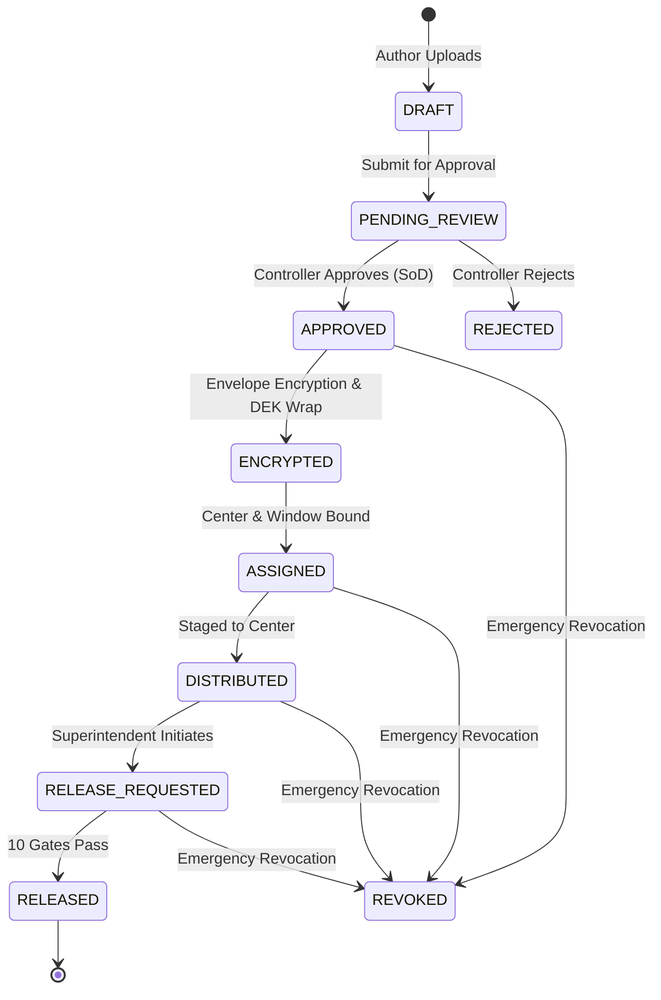
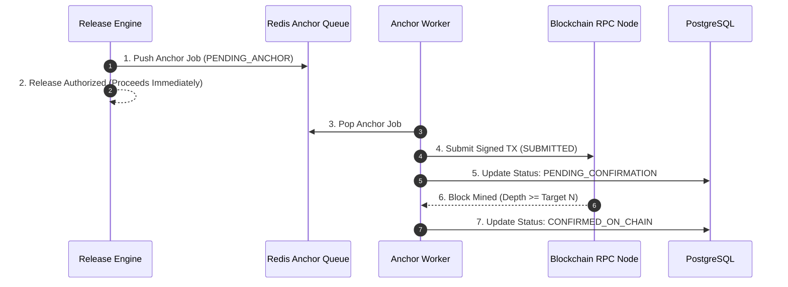

# VeriQ — Testing, Verification & Quality Assurance Strategy

**Document ID:** VERIQ-TEST-014  
**Version:** 1.0.0  
**Status:** DRAFT / PENDING REVIEW  
**Date:** 2026-09-17  
**Owner:** Principal QA Architect & Verification Lead  
**Classification:** Restricted / Engineering & Quality Assurance Internal  

---

## 1. Document Control

### 1.1 Document Overview
This document defines the end-to-end testing, cryptographic verification, security validation, integration assurance, and quality engineering strategy for **VeriQ** (*Secure Examination Paper Distribution Using Blockchain*). It establishes how functional correctness, cryptographic integrity, fail-closed boundaries, role separation, ten-gate release constraints, and deployment topology are systematically verified.

### 1.2 Authoritative Document Hierarchy & Traceability
This verification strategy is derived directly from the authoritative documentation suite:
- **`01_REPOSITORY_AUDIT.md`**: Baseline inspection of codebase gaps, security defects, and test suite baseline.
- **`02_PRODUCT_BLUEPRINT.md`**: Core product vision, enterprise distribution flows, and threat baseline.
- **`03_PROBLEM_STATEMENT.md`**: Problem definition WB-03 and integrity mandates.
- **`04_MARKET_RESEARCH.md`**: Examination board compliance requirements and operational threat profiles.
- **`05_PRODUCT_REQUIREMENTS.md`**: Functional requirements (`FR-01` to `FR-11`), actor permissions, and audit trails.
- **`06_TECHNICAL_REQUIREMENTS.md`**: Cryptographic protocols, dual-hash integrity, and 10-gate release specification.
- **`07_SYSTEM_ARCHITECTURE.md`**: Component decomposition, sequence flows, and trust boundary definitions.
- **`08_AI_ARCHITECTURE.md`**: Advisory-only anomaly detection and threat telemetry boundary.
- **`09_DATABASE_DESIGN.md`**: Relational schemas, ACID invariants, and migration testing.
- **`10_API_SPECIFICATION.md`**: Canonical REST contracts, error payloads, and negative testing requirements.
- **`11_SECURITY_ARCHITECTURE.md`**: Threat modeling, fail-closed boundaries, key custody, and residual risks.
- **`12_UI_UX_DESIGN.md`**: Frontend states, kiosk hardening, and live hackathon demonstration script.
- **`13_DEPLOYMENT.md`**: Container topology, network segmentation, secret lifecycle, and disaster recovery.

```
+---------------------------------------------------------------------------------------------------+
|                                 CANONICAL ARCHITECTURAL TRACEABILITY                              |
|   01-Audit -> 02-Blueprint -> 05/06-Reqs -> 07-SysArch -> 08-AI -> 09-DB -> 10-API -> 11-Sec -> 12-UX|
|                                                                                    -> 13-Deploy   |
+---------------------------------------------------------------------------------------------------+
                                                  |
                                                  v
+---------------------------------------------------------------------------------------------------+
|                     14_TESTING_STRATEGY.md (Verification & Quality Assurance)                     |
|  - Current Baseline Audit (9 tests in 3 files)   - 10-Gate Release Engine Verification Suite      |
|  - Cryptographic & Key Custody Verification       - Adversarial Attack Testing (SEC-01 to SEC-16)  |
|  - Asynchronous Blockchain State Verification     - AI Advisory-Only Boundary Negative Testing    |
|  - Concurrency, Race & Transaction Integrity     - Traceability Matrix & Test Gap Register       |
+---------------------------------------------------------------------------------------------------+
```

---

## 2. Testing Executive Summary & Methodology

### 2.1 Testing Philosophy
Verification in VeriQ is defined as **provable adherence to security, cryptographic, and operational invariants**, not merely raw code coverage. The test strategy enforces:
1. **First-Class Negative Testing:** Every security gate, authorization rule, and cryptographic check must have explicit negative test cases proving rejection under invalid, malformed, or malicious inputs.
2. **Server-Side Authority Verification:** Tests must prove that client-manipulated flags, timestamps, or tokens cannot bypass backend authorization.
3. **Fail-Closed Verification:** Infrastructure and dependency fault injections must prove that the release engine fails closed on all critical dependency outages.
4. **Decoupled Verification Layers:** Unit, integration, adversarial, and E2E tests are strictly separated; mocked components in unit tests do not substitute for integration verification.

```
+---------------------------------------------------------------------------------------------------+
| VERIFICATION FLOWCHART                                                                            |
|                                                                                                   |
|   [ Requirement / Invariant ]                                                                     |
|                 |                                                                                 |
|                 v                                                                                 |
|   [ Security Control / Boundary ]                                                                 |
|                 |                                                                                 |
|                 v                                                                                 |
|   [ Executable Automated Test (Positive + Negative Cases) ]                                       |
|                 |                                                                                 |
|                 v                                                                                 |
|   [ Structured Test Evidence (Logs, Digests, TX Hashes) ]                                         |
|                 |                                                                                 |
|                 v                                                                                 |
|   [ Verification Result: PASS / FAIL / GAP ]                                                      |
+---------------------------------------------------------------------------------------------------+
```

---

## 3. Testing Objectives

- **Confidentiality:** Prove that unreleased exam papers and raw DEKs cannot be accessed via API, database inspection, logs, frontend state, or container inspection.
- **Integrity:** Prove that single-byte modifications to `.enc` ciphertext or metadata trigger deterministic Gate 8 failure (`HASH_MISMATCH`).
- **Authentication & RBAC:** Verify that missing/expired JWTs, rogue roles, and author self-approvals are strictly rejected.
- **Authoritative Release Timing:** Verify that release requests outside the configured UTC window fail Gate 5 regardless of client-side clock manipulation.
- **Device Authorization:** Verify that unapproved or revoked terminal fingerprints fail Gate 4.
- **Emergency Revocation:** Verify that revoked papers, centers, or devices are rejected in all subsequent authorization evaluations.
- **Asynchronous Blockchain Lifecycle:** Verify that ledger anchors transition through `PENDING_ANCHOR` $\rightarrow$ `SUBMITTED` $\rightarrow$ `PENDING_CONFIRMATION` $\rightarrow$ `CONFIRMED_ON_CHAIN` without blocking time-critical releases.
- **AI Advisory Boundary:** Verify that anomalous or poisoned AI telemetry cannot trigger releases or alter RBAC state.

---

## 4. Testing Non-Goals

The testing strategy explicitly disclaims the following non-goals (aligned with `11_SECURITY_ARCHITECTURE.md` and `13_DEPLOYMENT.md`):
1. **Proof of Absolute Zero-Day Immunity:** Testing cannot mathematically prove the absence of unknown vulnerabilities in third-party kernels, hypervisors, or libraries.
2. **Physical Endpoint Hardware Assurance:** Testing cannot verify security against physically compromised examination center motherboards, covert micro-cameras, or optical screen capture.
3. **Total Insider Collusion Simulation:** Testing cannot prevent unauthorized disclosure if all root institutional authorities collude maliciously to export master KEKs.
4. **Guaranteed Python Memory Zeroization:** Testing acknowledges runtime memory limits in garbage-collected languages; testing verifies shortest practical lifetime and dereferencing rather than physical hardware RAM scrubbing.

---

## 5. Current Repository Test Baseline Audit

An audit of the repository reveals the following test baseline:

```
+---------------------------------------------------------------------------------------------------+
| CURRENT REPOSITORY TEST INVENTORY (`[CURRENT]`)                                                   |
+---------------------------+-----------+-----------------------------------+-----------------------+
| Test File Path            | Test Count| Primary Scope Tested              | Current Status        |
+---------------------------+-----------+-----------------------------------+-----------------------+
| `backend/tests/test_auth` | 3 tests   | Hashing, JWT decode, Sig verify   | `[EXISTING]`          |
| `backend/tests/test_block`| 2 tests   | Mock TX record, Network status    | `[EXISTING / MOCKED]` |
| `backend/tests/test_crypto`| 4 tests  | SHA-256, AES-GCM, Tamper, Merkle  | `[EXISTING]`          |
| **Frontend Test Suite**   | 0 tests   | None (`[NOT FOUND]` in package)   | `[MISSING]`           |
| **Smart Contract Tests**  | 0 tests   | None (`[NOT FOUND]` in repo)      | `[MISSING]`           |
| **API Integration Tests** | 0 tests   | None (`[NOT FOUND]` in repo)      | `[MISSING]`           |
| **10-Gate Release Tests** | 0 tests   | None (`[NOT FOUND]` in repo)      | `[MISSING]`           |
| **E2E Journey Tests**     | 0 tests   | None (`[NOT FOUND]` in repo)      | `[MISSING]`           |
+---------------------------+-----------+-----------------------------------+-----------------------+
| **TOTAL EXISTING TESTS**  | **9 tests in 3 files** (Unit layer only; broad integration missing)   |
+---------------------------------------------------------------------------------------------------+
```

### Baseline Test Analysis Table

| Test Area | Current Evidence | Status | Identified Gap | Target Test Suite |
| :--- | :---: | :---: | :--- | :--- |
| **Authentication** | `test_auth.py` | `[PARTIAL]` | Lacks role permission matrix, expiration, revocation tests. | `test_auth_rbac_suite.py` |
| **Cryptography** | `test_crypto.py` | `[PARTIAL]` | Lacks KMS unwrap, dual digest, envelope crypto tests. | `test_crypto_envelope_suite.py` |
| **Blockchain** | `test_blockchain.py` | `[MOCKED]` | Tests in-memory mock only; no async finality or RPC tests. | `test_blockchain_adapter_suite.py`|
| **10-Gate Engine** | `[NOT FOUND]` | `[MISSING]` | Zero automated tests for Gates 1–10 release orchestration. | `test_ten_gate_engine_suite.py` |
| **Database ACID** | `[NOT FOUND]` | `[MISSING]` | Defaults to SQLite; no PostgreSQL concurrency tests. | `test_database_integrity_suite.py`|
| **API Endpoints** | `[NOT FOUND]` | `[MISSING]` | Zero integration tests for 35 target REST endpoints. | `test_api_integration_suite.py` |
| **Frontend / UX** | `[NOT FOUND]` | `[MISSING]` | No Vitest/Playwright config; no kiosk interaction tests. | `frontend/tests/kiosk.spec.ts` |
| **Security / Attack**| `[NOT FOUND]` | `[MISSING]` | No automated adversarial attack simulation suite. | `test_security_adversarial_suite.py`|

---

## 6. Test Levels & Testing Pyramid

```
+---------------------------------------------------------------------------------------------------+
| VERIQ TEST PYRAMID ARCHITECTURE                                                                   |
|                                                                                                   |
|                       /  L5: Security & Adversarial Testing  \   (Attack Injections, Abuse Cases) |
|                      /----------------------------------------\                                   |
|                     /      L4: System & E2E Journey Tests      \  (Journeys A–K, Kiosk UX)         |
|                    /--------------------------------------------\                                 |
|                   /    L3: API, DB & Service Integration Tests    \ (35 REST APIs, PostgreSQL)    |
|                  /------------------------------------------------\                               |
|                 /       L2: Component & Subsystem Engine Tests      \ (10 Gates, AI Advisory)     |
|                /------------------------------------------------------\                           |
|               /          L1: Pure Unit & Cryptographic Tests            \ (AES-GCM, Hashes, JWT)  |
|              /----------------------------------------------------------\                         |
|             /  L0: Static Analysis, Secret Scans & Type Verification (Linter, Bandit, Gitleaks)   \
+---------------------------------------------------------------------------------------------------+
```

- **L0 (Static Verification):** Linters (`ruff`, `eslint`), Type Checkers (`mypy`, `tsc`), Secret Scanners (`gitleaks`), Dependency Scanners (`pip-audit`, `npm audit`).
- **L1 (Unit Level):** Pure cryptographic wrappers, hashing routines, password verifiers, token decoders, in-memory state models.
- **L2 (Component Level):** Ten-gate release evaluator, AI anomaly scoring formulas, repository query builders, schema validators.
- **L3 (API & Integration Level):** FastAPI HTTP test client (`httpx`), PostgreSQL async transactions, Redis job queuing, KMS client wrappers.
- **L4 (System / E2E Level):** Full multi-role user journeys executed against containerized staging topology.
- **L5 (Security / Adversarial Level):** Penetration testing, time manipulation attacks, ciphertext tampering, unauthorized unwrap attempts.

---

## 7. Requirement-Based Test Design Matrix

Mapping functional and technical requirements to verification methods:

```
+---------------------------------------------------------------------------------------------------+
| REQUIREMENT VERIFICATION TRACEABILITY MATRIX                                                      |
+--------+--------------------------+-----------------------+---------------+-----------------------+
| Req ID | Upstream Requirement     | Target Test ID        | Test Level    | Baseline Status       |
+--------+--------------------------+-----------------------+---------------+-----------------------+
| `FR-01`| RBAC & 5 User Roles      | `TEST-AUTH-001..005`  | L1 / L3 (API) | `[PARTIAL]`           |
| `FR-02`| Paper Versioning & SoD   | `TEST-LIFE-001..004`  | L2 / L3 (API) | `[MISSING]`           |
| `FR-03`| Center & Device Binding  | `TEST-GATE-003..004`  | L2 / L3 (API) | `[MISSING]`           |
| `FR-04`| Encrypted Blob Staging   | `TEST-STG-001..003`   | L3 (Storage)  | `[PARTIAL]` (Local FS)|
| `FR-05`| 10-Gate Release Engine   | `TEST-GATE-001..010`  | L2 / L3 (API) | `[MISSING]`           |
| `FR-06`| Asynchronous Ledger      | `TEST-BLK-001..006`   | L3 (Adapter)  | `[MOCKED]`            |
| `FR-07`| Emergency Revocation     | `TEST-REV-001..005`   | L2 / L3 (API) | `[MISSING]`           |
| `FR-08`| Dual SHA-256 Verification| `TEST-CRYP-001..003`  | L1 / L2       | `[EXISTING + VERIF]`  |
| `FR-09`| Advisory AI Telemetry    | `TEST-AI-001..005`    | L2 / L3       | `[MISSING]`           |
| `FR-10`| Tamper-Evident Audit Log | `TEST-AUD-001..004`   | L3 (Database) | `[MISSING]`           |
| `FR-11`| Secure Kiosk Rendering   | `TEST-UX-001..004`    | L4 (Frontend) | `[MISSING]`           |
+--------+--------------------------+-----------------------+---------------+-----------------------+
```

---

## 8. Paper Lifecycle & State Machine Testing



### Specific State Transition Tests:
1. **`TEST-LIFE-001` (Author Self-Approval Prevention):** Examiner attempts to approve own paper version $\rightarrow$ Backend returns `403 FORBIDDEN` (`AUTHOR_SELF_APPROVAL_PROHIBITED`).
2. **`TEST-LIFE-002` (Immutable Version Modification):** Attempt `PUT` or `PATCH` on `APPROVED` paper metadata $\rightarrow$ Backend returns `409 CONFLICT` (`VERSION_LOCKED`).
3. **`TEST-LIFE-003` (Invalid State Transition):** Attempt release execution on `DRAFT` or `REJECTED` paper $\rightarrow$ Backend rejects at Gate 6.
4. **`TEST-LIFE-004` (Revocation Precedence):** Paper revoked while in `DISTRIBUTED` state $\rightarrow$ Subsequent authorization evaluations reject the revoked paper at Gate 7.

---

## 9. Ten-Gate Release Engine Verification Suite

This suite rigorously tests each gate individually with positive, negative, boundary, and tamper test cases:

```
+---------------------------------------------------------------------------------------------------+
| TEN-GATE VERIFICATION SPECIFICATION                                                               |
+------+-----------------------+---------------------------------------+----------------------------+
| Gate | Target Gate Name      | Positive Test Case                    | Primary Negative Test Case |
+------+-----------------------+---------------------------------------+----------------------------+
| **G1**| Authentication Valid | Valid JWT token signed by active key  | Missing, expired, malformed|
| **G2**| Role Authorization   | Role `SUPERINTENDENT` on release API  | Role `EXAMINER` or `AUDITOR`|
| **G3**| Center Assignment    | Request center matches active binding | Center ID not in schedule  |
| **G4**| Device Authorization | Terminal ID registered and `ACTIVE`   | Unknown or `REVOKED` device|
| **G5**| Server Release Window| Server UTC time inside window         | Early release / clock spoof|
| **G6**| Version Status Locked| Paper version in `APPROVED` status    | `DRAFT` or `SUPERSEDED`    |
| **G7**| Revocation Clean     | Zero revocation flags active          | Paper or Center `REVOKED`  |
| **G8**| Ciphertext Integrity | Staged `.enc` matches registered hash | 1-byte corrupted artifact  |
| **G9**| KMS Key Unwrap       | KMS release policy permits unwrap     | KMS error / invalid token  |
| **G10**| Audit Log Persisted | Audit row written; anchor enqueued    | Database connection drop   |
+------+-----------------------+---------------------------------------+----------------------------+
```

### 9.1 Detailed Gate Test Procedures
- **Gate 1 (Authentication):**
  - Inject expired token ($T > T_{\text{exp}}$) $\rightarrow$ Verify `401 UNAUTHORIZED`.
  - Inject altered signature payload $\rightarrow$ Verify `401 UNAUTHORIZED`.
  - Verify missing token NEVER falls back to default admin identity.
- **Gate 2 (Role Authorization):**
  - Author attempts release $\rightarrow$ Verify `403 FORBIDDEN` (`ROLE_UNAUTHORIZED`).
- **Gate 3 (Center Scope Binding):**
  - Superintendent at Center C102 requests paper assigned exclusively to Center C104 $\rightarrow$ Verify Gate 3 blocks.
- **Gate 4 (Device Authorization):**
  - Terminal with unregistered fingerprint attempts release $\rightarrow$ Verify Gate 4 blocks (`DEVICE_UNAUTHORIZED`).
- **Gate 5 (Authoritative Time):**
  - Window: 09:00–09:30 UTC. Request at 08:59:59 UTC $\rightarrow$ Verify Gate 5 blocks (`RELEASE_WINDOW_CLOSED`).
  - Request with `override_time` query param $\rightarrow$ Verify backend discards client timestamp and evaluates server UTC.
- **Gate 6 (Version Approval State):**
  - Version `v1.1` in `PENDING_REVIEW` attempts release $\rightarrow$ Verify Gate 6 blocks (`VERSION_NOT_APPROVED`).
- **Gate 7 (Revocation Check):**
  - Controller invokes `/papers/:id/revoke` $\rightarrow$ Subsequent authorization evaluations SHALL reject the revoked paper at Gate 7 (`RESOURCE_REVOKED`).
- **Gate 8 (Ciphertext Integrity):**
  - Flip bit 0x00 $\rightarrow$ 0xFF in staged `.enc` file $\rightarrow$ SHA-256 mismatch detected $\rightarrow$ Verify Gate 8 blocks with `HASH_MISMATCH` and triggers SOC alert.
- **Gate 9 (KMS Key Custody):**
  - Inject KMS unwrap timeout $\rightarrow$ Verify release fails closed without disclosing key material.
- **Gate 10 (Audit Lineage Log):**
  - Inject database lock on audit table $\rightarrow$ Verify release transaction aborts to prevent un-audited paper disclosure.

---

## 10. Authentication & Session Testing

- **`TEST-AUTH-001` (Password Hashing):** Verify bcrypt/argon2 hash with work factor $\ge 12$. Verify raw passwords never stored in DB.
- **`TEST-AUTH-002` (JWT Signature Verification):** Verify asymmetric RS256/EdDSA signature verification. Verify `none` algorithm attacks are rejected.
- **`TEST-AUTH-003` (Token Replay & Blacklisting):** Verify logged-out JWTs cannot authenticate subsequent API calls.
- **`TEST-AUTH-004` (Zero Default Fallback):** Verify requests with empty headers return `401 Unauthorized` without resolving to default mock user.

---

## 11. Role-Based Access Control (RBAC) & SoD Matrix Testing

```
+---------------------------------------------------------------------------------------------------+
| RBAC PERMISSION TESTING MATRIX                                                                    |
+--------------------------+-----------+-----------+-----------+---------------+--------------------+
| Endpoint / Action        | Admin     | Examiner  | Controller| Superintendent| Auditor            |
+--------------------------+-----------+-----------+-----------+---------------+--------------------+
| `POST /papers` (Create)  | ALLOW     | ALLOW     | DENY      | DENY          | DENY               |
| `POST /approve` (Approve)| DENY      | DENY (SoD)| ALLOW     | DENY          | DENY               |
| `POST /assignments`      | ALLOW     | DENY      | ALLOW     | DENY          | DENY               |
| `POST /devices/authorize`| ALLOW     | DENY      | DENY      | DENY          | DENY               |
| `POST /release` (10 Gate)| DENY      | DENY      | DENY      | ALLOW         | DENY               |
| `POST /revoke` (Emergency| ALLOW     | DENY      | ALLOW     | DENY          | DENY               |
| `GET /audit/dossier`     | ALLOW     | DENY      | ALLOW     | DENY          | ALLOW (Read-Only)  |
| `GET /security/telemetry`| ALLOW     | DENY      | ALLOW     | DENY          | ALLOW (Read-Only)  |
+--------------------------+-----------+-----------+-----------+---------------+--------------------+
```

---

## 12. Cryptographic Testing & Verification

- **`TEST-CRYP-001` (Dual Digest Separation):**
  - Calculate `content_hash = SHA256(canonical_plaintext)`.
  - Calculate `ciphertext_hash = SHA256(AES_GCM_ENCRYPT(plaintext, DEK))`.
  - Verify that `content_hash != ciphertext_hash` and both are tracked independently.
- **`TEST-CRYP-002` (AES-256-GCM AEAD Tag Verification):**
  - Verify standard AES-256-GCM parameters (96-bit / 12-byte IV and 128-bit / 16-byte authentication tag per approved cryptographic profile in Doc 06).
  - Modify 1 bit in tag $\rightarrow$ Decryption raises `InvalidTag` exception.
- **`TEST-CRYP-003` (Key Wrap & Envelope Encryption):**
  - Verify DEK is wrapped using KMS KEK. Verify wrapped DEK format stored in PostgreSQL.

---

## 13. Key Custody Boundary Testing

- **`TEST-KEY-001` (Zero Plaintext DEK in DB):** Query `paper_versions` and `audit_events` tables in PostgreSQL $\rightarrow$ Assert zero raw DEK hex strings exist.
- **`TEST-KEY-002` (Zero Key in Logs):** Scan backend log output for regular expression `k_dek_[0-9a-fA-F]{64}` $\rightarrow$ Assert 0 matches found.
- **`TEST-KEY-003` (Zero Key in API Responses):** Inspect all 35 API response schemas $\rightarrow$ Assert raw cryptographic keys omitted.
- **`TEST-KEY-004` (Volatile Memory Lifetime):** Verify DEK is retained in memory only during active unwrap execution and dereferenced immediately after use.

---

## 14. Ephemeral Key Token Boundary Testing

- **`TEST-EPH-001` (Token Scoping):** Verify `ephemeral_key_token` is cryptographically bound to specific `(PaperVersionID, CenterID, TerminalID, SessionID)`.
- **`TEST-EPH-002` (Cross-Context Misuse):** Attempt to decrypt Center C104 paper using token issued to Center C102 $\rightarrow$ Decryption fails.
- **`TEST-EPH-003` (Token Expiry):** Attempt decryption with token after session duration expires $\rightarrow$ Decryption rejected.

---

## 15. Data Integrity & Database Concurrency Testing

- **`TEST-DB-001` (Foreign Key Cascades & Constraints):** Attempt inserting orphan version without valid parent paper $\rightarrow$ Verify PostgreSQL rejects with `ForeignKeyViolation`.
- **`TEST-DB-002` (Optimistic Locking & Version Races):** Two concurrent controllers attempt simultaneous approval on same version $\rightarrow$ Exactly one state transition may commit for the same version under the defined concurrency invariant; second request receives `409 Conflict`.
- **`TEST-DB-003` (Concurrent Release Deduplication):** Two identical release requests sent simultaneously from same terminal $\rightarrow$ Atomic database transaction processes exactly one release unwrap; duplicate receives idempotent response.

---

## 16. API Integration & Contract Testing

- Test all 35 target endpoints defined in `10_API_SPECIFICATION.md`.
- Verify standard error envelope on all 4xx/5xx responses:
  ```json
  {
    "error_code": "RELEASE_WINDOW_CLOSED",
    "message": "Release window is closed.",
    "correlation_id": "req-987a-654b",
    "timestamp": "2026-09-17T09:02:00Z"
  }
  ```
- Verify sensitive headers (`Authorization`, `Cookie`) stripped from error responses and logs.

---

## 17. Object Storage Verification

- **`TEST-OBJ-001` (Private Bucket Access Block):** Attempt unauthenticated HTTP `GET` directly on storage bucket URL $\rightarrow$ Verify `403 Access Denied`.
- **`TEST-OBJ-002` (Encrypted Upload & Download):** Upload `.enc` package $\rightarrow$ Verify storage backend receives only ciphertext bytes.
- **`TEST-OBJ-003` (Object Missing / Failure):** Request release on paper whose `.enc` blob is missing from storage $\rightarrow$ Release engine fails closed (`CIPHERTEXT_UNOBTAINABLE`).

---

## 18. Blockchain Adapter & Finality Testing



- **`TEST-BLK-001` (Decoupled Release Execution):** Verify exam release succeeds without waiting for EVM block mining confirmation.
- **`TEST-BLK-002` (RPC Outage Buffering):** Disconnect blockchain RPC node $\rightarrow$ Execute exam release $\rightarrow$ Assert release completes, anchor job buffers safely in Redis queue, and status displays `PENDING_ANCHOR`.
- **`TEST-BLK-003` (Reconciliation on RPC Restore):** Reconnect RPC node $\rightarrow$ Worker resumes $\rightarrow$ Verify transaction mined and DB status transitions to `CONFIRMED_ON_CHAIN`.

---

## 19. AI Advisory Telemetry Testing

- **`TEST-AI-001` (Normal Anomaly Scoring):** Feed standard access pattern $\rightarrow$ Verify anomaly score in nominal range ([EXAMPLE: score $\le 0.30$]) and threat level `NORMAL`.
- **`TEST-AI-002` (Brute-Force Anomaly Flagging):** Feed rapid failed release attempts (e.g., [EXAMPLE: 12 attempts]) from single center $\rightarrow$ Verify anomaly score escalates ([EXAMPLE: score $> 0.75$]) and threat level `ELEVATED`. (Note: Exact numerical thresholds remain [EXAMPLE / TBD]; AI remains advisory-only with zero deterministic authority over authentication, authorization, release, crypto, revocation, or blockchain finality).
- **`TEST-AI-003` (Zero Release Authority Negative Test):** Inject AI anomaly score `0.99` (Critical Anomaly) for an authorized release during valid window $\rightarrow$ Assert 10-gate engine evaluates deterministically and releases paper normally (AI cannot override valid release).
- **`TEST-AI-004` (Zero Block Authority Negative Test):** Inject AI anomaly score `0.00` (Zero Anomaly) for an unauthorized paper $\rightarrow$ Assert 10-gate engine blocks release at Gate 1–4 (AI cannot force release).
- **`TEST-AI-005` (AI Service Crash Resilience):** Kill AI service process $\rightarrow$ Execute legitimate release $\rightarrow$ Assert release proceeds with zero degradation.

---

## 20. Time Authority & Window Boundary Testing

```
Timeline:    08:59:59 UTC               09:00:00 UTC           09:30:00 UTC         09:30:01 UTC
                   |                          |                      |                    |
Test Case:    [ TEST-TIME-001 ]          [ TEST-TIME-002 ]      [ TEST-TIME-003 ]    [ TEST-TIME-004 ]
Result:       Gate 5 BLOCKS              Gate 5 PASSES          Gate 5 PASSES        Gate 5 BLOCKS
```

- **`TEST-TIME-005` (Client Clock Tamper Resistance):** Client machine clock set to `09:15 UTC` while server UTC is `08:45 UTC` $\rightarrow$ Release request rejected at Gate 5.
- **`TEST-TIME-006` (NTP Drift Alarm):** Inject simulated NTP clock drift exceeding approved tolerance [TBD — approved clock-drift tolerance] $\rightarrow$ Alert triggered; time verification flags degraded state and fails closed.

---

## 21. Device Security & Fingerprint Testing

- **`TEST-DEV-001` (Authorized Device Binding):** Terminal `TERM-DELHI-01` registered in Center C104 schedule $\rightarrow$ Gate 4 passes.
- **`TEST-DEV-002` (Unregistered Device):** Unregistered laptop attempts release at Center C104 $\rightarrow$ Gate 4 blocks with `DEVICE_UNAUTHORIZED`.
- **`TEST-DEV-003` (Revoked Device):** Administrator revokes `TERM-DELHI-01` $\rightarrow$ Subsequent authorization evaluations reject the revoked device at Gate 4 (`DEVICE_REVOKED`).

---

## 22. Emergency Revocation Lifecycle Testing

- **`TEST-REV-001` (Revoke Before Assignment):** Controller revokes paper in `APPROVED` status $\rightarrow$ Status transitions to `REVOKED`; assignment blocked.
- **`TEST-REV-002` (Revoke After Staging):** Paper staged at Centers C101 and C104. Controller triggers revocation $\rightarrow$ Subsequent authorization evaluations SHALL reject the revoked paper at Gate 7.
- **`TEST-REV-003` (Revocation Audit Log):** Verify revocation event persisted in PostgreSQL audit table with mandatory justification string.

---

## 23. Audit Trail & Chain-of-Custody Verification

- **`TEST-AUD-001` (Sequential Custody Chain Verification):**
  - Verify complete lifecycle events present in sequence: `CREATED` $\rightarrow$ `APPROVED` $\rightarrow$ `ASSIGNED` $\rightarrow$ `STAGED` $\rightarrow$ `RELEASED`.
- **`TEST-AUD-002` (Tamper-Evident Audit Record):** Modify single row in database audit table directly via SQL $\rightarrow$ Cryptographic lineage verification script detects broken hash chain.
- **`TEST-AUD-003` (Correlation ID Propagation):** Verify all log lines and audit events for a release request share the identical `correlation_id`.

---

## 24. Security & Adversarial Attack Testing Suite

```
+---------------------------------------------------------------------------------------------------+
| ADVERSARIAL ATTACK TEST SPECIFICATIONS                                                            |
+--------+--------------------------+-----------------------------------+---------------------------+
| Test ID| Attack Vector            | Injected Attack Action            | Expected Security Behavior|
+--------+--------------------------+-----------------------------------+---------------------------+
| SEC-01 | Default Identity Fallback| Request API with empty token      | 401 Unauthorized (No mock)|
| SEC-02 | Client Time Manipulation | Pass `override_time` in query     | Backend uses server UTC   |
| SEC-03 | Cross-Center Access      | Center C102 requests C104 paper   | Gate 3 blocks (Forbidden) |
| SEC-04 | Rogue Terminal Injection | Unknown device fingerprint        | Gate 4 blocks (Rogue Dev) |
| SEC-05 | Ciphertext Tampering     | Invert 1 byte in .enc blob        | Gate 8 blocks (Integrity) |
| SEC-06 | Token Replay Attack      | Replay captured ephemeral token   | Expired / Invalidated     |
| SEC-07 | Privilege Escalation     | Examiner requests `/admin/devices`| 403 Forbidden             |
| SEC-08 | Author Self-Approval     | Examiner approves own paper       | 403 Forbidden (SoD rule)  |
| SEC-09 | Unauthorized KMS Unwrap  | Direct API call to KMS endpoint   | IAM blocks request        |
| SEC-10 | Public Database Exposure | Connect to port 5432 from WAN     | Connection Refused / Drop |
| SEC-11 | Public Bucket Access     | Direct HTTP request to S3 bucket  | 403 Access Denied         |
| SEC-12 | False Blockchain Anchor  | Forge block height in mock adapter| Validated against receipt |
| SEC-13 | AI Telemetry Poisoning   | Flood synthetic benign events     | Release gates independent |
| SEC-14 | Secret Log Leakage       | Trigger 500 error during unwrap   | Stack trace omits DEK/keys|
| SEC-15 | Root Container Escape    | Attempt UID 0 execution in Docker | Blocked by non-root UID   |
| SEC-16 | Malicious Artifact Mod   | Swap .enc with another paper's    | Gate 8 blocks (Mismatch)  |
+--------+--------------------------+-----------------------------------+---------------------------+
```

---

## 25. Concurrency & Race-Condition Testing

- **`TEST-CONC-001` (Simultaneous Multi-Center Releases):** Simulated multi-center concurrent releases (e.g., [EXAMPLE: 100 concurrent centers at release window opening]) $\rightarrow$ Verify transactional consistency, absence of unhandled race conditions, and generation of distinct audit records for each independent center evaluation.
- **`TEST-CONC-002` (Release vs. Revocation Race):** Center initiates release at $T=0\text{ms}$; Controller initiates emergency revocation at $T=1\text{ms}$ $\rightarrow$ Database transaction isolation ensures either release completes cleanly before revocation or is rejected by revocation; zero intermediate corrupted states.

---

## 26. Failure & Resilience Testing

- **`TEST-RES-001` (PostgreSQL Outage):** Terminate database process $\rightarrow$ Attempt release $\rightarrow$ Verify Gate 10 fails closed; zero un-audited key releases.
- **`TEST-RES-002` (KMS Hardware Outage):** Block KMS network connection $\rightarrow$ Attempt release $\rightarrow$ Verify Gate 9 fails closed; user receives `KMS_UNAVAILABLE` error without partial key disclosure.
- **`TEST-RES-003` (NTP Daemon Outage):** Terminate chrony/NTP service $\rightarrow$ Attempt release $\rightarrow$ Verify Gate 5 fails closed when clock state is unverified.
- **`TEST-RES-004` (Redis Queue Crash):** Terminate Redis container $\rightarrow$ Core API persists release event to database buffer table; releases proceed without data loss.

---

## 27. Frontend & UX Verification

- **`TEST-UX-001` (Role Navigation Scoping):** Login as `SUPERINTENDENT` $\rightarrow$ Verify Authoring and Revision tabs are hidden from DOM.
- **`TEST-UX-002` (10-Gate Visual Checklist Transition):** Execute release $\rightarrow$ Verify all 10 gate badges transition from `PENDING` (gray) $\rightarrow$ `SATISFIED` (green) in real-time sequence.
- **`TEST-UX-003` (Kiosk Security Hardening UX):** Render decrypted exam canvas $\rightarrow$ Verify context menu, text selection, and print shortcuts are suppressed as defense-in-depth UX controls.
- **`TEST-UX-004` (Zero Key Rendering):** Inspect React DOM and DevTools memory heap $\rightarrow$ Verify `k_dek_...` raw keys are never rendered in HTML attributes or logged to console.

---

## 28. End-to-End User Journey Test Suite

Automated E2E scenarios verifying complete product workflows from `12_UI_UX_DESIGN.md`:

```
+---------------------------------------------------------------------------------------------------+
| END-TO-END USER JOURNEY VERIFICATION SUITE                                                        |
+---------------+-------------------------------+---------------------------+-----------------------+
| Journey ID    | Name & Description            | Actors Involved           | Expected Outcome      |
+---------------+-------------------------------+---------------------------+-----------------------+
| **Journey A** | Paper Upload & Encryption     | Examiner                  | Version Created (v1.0)|
| **Journey B** | Separation of Duties Approval | Controller                | Status: APPROVED      |
| **Journey C** | Center & Window Assignment    | Controller                | Centers Assigned      |
| **Journey D** | Local Encrypted Staging       | Superintendent Terminal   | .enc Staged Locally   |
| **Journey E** | Early Release Blocked         | Superintendent            | Gate 5 BLOCKS         |
| **Journey F** | Tampered Ciphertext Blocked   | Superintendent            | Gate 8 BLOCKS         |
| **Journey G** | Legitimate 10-Gate Release    | Superintendent            | All Gates PASS; Canvas|
| **Journey H** | Blockchain Anchor Lifecycle   | Anchor Worker / EVM       | CONFIRMED_ON_CHAIN    |
| **Journey I** | Auditor Full Lineage Audit    | Auditor                   | Full Custody Trail OK |
| **Journey J** | Emergency Paper Revocation    | Controller                | Subsequent Rejections |
| **Journey K** | SOC Anomaly Investigation     | SOC Analyst               | AI Advisory Signal OK |
+---------------+-------------------------------+---------------------------+-----------------------+
```

---

## 29. Smart Contract Testing

- **Current Contract Audit:** `blockchain/contracts/VeriQLedger.sol` inspected in repository.
- **Contract Verification Tests (`[TARGET]` via Hardhat/Foundry):**
  - **`TEST-SOL-001` (Access Control):** Verify only authorized relayer address can call `recordPaperCreated` and `recordReleaseEvent`.
  - **`TEST-SOL-002` (Hash Anchoring):** Verify anchored `content_hash` and `ciphertext_hash` match emitted event logs.
  - **`TEST-SOL-003` (Revocation Event Emission):** Verify `EmergencyRevoked` event emits correct paper ID and timestamp.

---

## 30. Deployment & Container Hardening Testing

Translating `13_DEPLOYMENT.md` controls into automated infrastructure verification:

- **`TEST-DEP-001` (Docker Multi-Stage Build):** Execute `docker build` on Frontend and Backend $\rightarrow$ Assert exit code 0. `[TARGET]`
- **`TEST-DEP-002` (Unprivileged Container Execution):** Run `docker inspect` $\rightarrow$ Assert `User` != `root` (`UID > 10000`). `[TARGET]`
- **`TEST-DEP-003` (Container Vulnerability Scan):** Execute Trivy CVE scan $\rightarrow$ Unresolved vulnerability findings SHALL be evaluated against the approved security release policy; exact severity thresholds remain [TBD] unless frozen upstream. `[TARGET]`
- **`TEST-DEP-004` (Database Private Network Isolation):** Attempt connecting to PostgreSQL container from host network $\rightarrow$ Assert connection denied. `[TARGET]`

---

## 31. CI/CD Pipeline Verification

- **`TEST-CI-001` (Automated Secret Leak Detection):** Gitleaks / Trufflehog scans all pull request commits $\rightarrow$ Block merge if API key, JWT secret, or private key detected.
- **`TEST-CI-002` (Static Analysis & Type Checking):** `ruff check`, `mypy --strict`, and `tsc --noEmit` pass with zero errors.
- **`TEST-CI-003` (Automated Regression Gate):** All designated mandatory security regression tests SHALL pass before container image generation.

---

## 32. Performance & Load Testing Methodology

- **Test Objectives (`[TBD]` Benchmarks):**
  - Measure 10-gate release engine throughput under peak concurrent center load.
  - Measure database connection pool saturation during simultaneous paper downloads.
  - Measure Redis anchor queue processing latency.
- **Methodology:** Distributed load generation using Locust / k6 against staging environment topology. Performance targets to be benchmarked and approved (`[TBD — operational policy]`).

---

## 33. Mandatory Security Regression Test Suite

The following regression suite must pass with 100% success on every release candidate:
1. `TEST-AUTH-004` (Zero default authentication fallback).
2. `TEST-LIFE-001` (Author self-approval prevention).
3. `TEST-GATE-005` (Server UTC release window enforcement).
4. `TEST-GATE-008` (Single-byte ciphertext tamper detection).
5. `TEST-REV-002` (Emergency revocation rejection across centers).
6. `TEST-KEY-001` (Zero plaintext DEKs in persistent storage).
7. `TEST-AI-003` (AI zero autonomous release authority).
8. `TEST-BLK-002` (Blockchain outage fail-safe operational continuity).

---

## 34. Synthetic Test Data Management

All testing executes exclusively using **synthetic, non-sensitive test fixtures**:
- **Synthetic Papers:** Standard lorem-ipsum academic question papers (e.g., Computer Science CS401 Mock Final).
- **Synthetic Users:** Fictitious test identities (`author@board.gov.in`, `controller@board.gov.in`, `superintendent@delhi.gov.in`).
- **Synthetic Centers & Devices:** Simulated center codes (`C101`, `C104`) and mock terminal IDs (`TERM-DELHI-01`).
- **Strict Invariant:** Zero real examination content, zero student PII, and zero production cryptographic keys in test fixtures.

---

## 35. Test Environments

```
+---------------------------------------------------------------------------------------------------+
| TEST ENVIRONMENT TOPOLOGY                                                                         |
+-------------------+-----------------------+-----------------------+-------------------------------+
| Environment       | Persistence Tier      | Cryptographic Key Tier| Blockchain Tier               |
+-------------------+-----------------------+-----------------------+-------------------------------+
| **Local Dev**     | SQLite / Local PG     | Local Software AES-GCM| In-Memory Mock Ledger         |
| **Hackathon MVP** | Dockerized PG [CANDIDATE: PG 16]| Isolated Mock Enclave | Local EVM PoA Node / Mock Rel |
| **Staging (UAT)** | Managed PostgreSQL    | Cloud KMS Test Keyring| Dedicated EVM Testnet [CANDIDATE: Sepolia or private testnet]|
| **Production UAT**| Multi-AZ Managed PG   | Hardware HSM Partition| Enterprise EVM [CANDIDATE / TBD]|
+-------------------+-----------------------+-----------------------+-------------------------------+
```

---

## 36. Test Automation Tooling Strategy

- **Backend Unit & Integration:** `pytest`, `pytest-asyncio`, `pytest-cov`, `httpx` `[CANDIDATE]`.
- **Frontend Component & E2E:** `vitest`, `react-testing-library`, `playwright` `[CANDIDATE]`.
- **Security & SAST:** `bandit`, `semgrep`, `gitleaks`, `pip-audit`, `npm-audit` `[CANDIDATE]`.
- **Container Scanning:** `trivy`, `grype` `[CANDIDATE]`.
- **Smart Contracts:** `hardhat` / `foundry` `[CANDIDATE]`.
*(Note: Tools are candidate specifications; uninstalled tools remain `[NOT FOUND]` in current repo).*

---

## 37. Defect Classification & Severity Taxonomy

```
+---------------------------------------------------------------------------------------------------+
| DEFECT SEVERITY TAXONOMY                                                                          |
+-----------+---------------------------------------------------+-----------------------------------+
| Severity  | Impact Description & Examples                     | SLA / Remediation Policy          |
+-----------+---------------------------------------------------+-----------------------------------+
| **P0**    | Critical Security Vulnerability: Unauthorized key | Immediate hotfix; blocks release; |
| (Critical)| release, auth bypass, plaintext paper in DB/logs  | 100% blocker for all environments.|
+-----------+---------------------------------------------------+-----------------------------------+
| **P1**    | Major Functional Defect: Gate 5 time evaluation   | Remediate before staging sign-off;|
| (High)    | failure, SoD bypass, broken revocation check      | blocks production deployment.     |
+-----------+---------------------------------------------------+-----------------------------------+
| **P2**    | Medium Defect: AI telemetry lag, dashboard display| Fix in regular sprint cycle.      |
| (Medium)  | glitch, non-critical worker retry loop            |                                   |
+-----------+---------------------------------------------------+-----------------------------------+
| **P3**    | Low / Cosmetic Defect: Minor UI alignment glitch, | Backlog prioritization.           |
| (Low)     | non-blocking formatting defect                    |                                   |
+-----------+---------------------------------------------------+-----------------------------------+
```

---

## 38. Test Evidence & Auditability

Every automated security and compliance test run must generate structured verification evidence:
- **Run Metadata:** Timestamp (UTC), Git commit hash, CI build number, executing environment.
- **Cryptographic Evidence:** Generated `content_hash`, `ciphertext_hash`, EVM transaction receipt hashes, and KMS request IDs.
- **Log Evidence:** Structured JSON execution logs with redaction filter verification.
- **Audit Records:** Database row IDs proving audit persistence in `audit_events`.

---

## 39. Test Exit & Release Criteria

A build artifact is approved for deployment only when:
1. **Zero P0 / P1 Security Defects:** No unresolved Critical or High severity defects.
2. **Mandatory Security Regression Suite Pass:** All designated mandatory security regression tests SHALL pass before the release candidate is approved.
3. **10-Gate Engine Verification Pass:** Positive and negative test cases for all 10 gates pass.
4. **Ciphertext Tamper Detection Verified:** Single-byte corruption tests consistently block release.
5. **No Tracked Secrets:** Automated secret scan reports 0 credential leaks.
6. **Container Security Scan Evaluation:** Unresolved vulnerability findings SHALL be evaluated against the approved security release policy; exact severity thresholds remain [TBD] unless frozen upstream.

---

## 40. Test Traceability Matrix

| Requirement ID | Upstream Doc | Target Test ID | Verification Level | Baseline Status |
| :--- | :--- | :--- | :--- | :--- |
| **FR-01: Identity & Roles** | `05_PRODUCT_REQUIREMENTS.md` | `TEST-AUTH-001..005` | L1 / L3 (API) | `[PARTIAL]` |
| **FR-02: SoD Approval** | `05_PRODUCT_REQUIREMENTS.md` | `TEST-LIFE-001..004` | L2 / L3 (API) | `[MISSING]` |
| **FR-03: Center Binding** | `05_PRODUCT_REQUIREMENTS.md` | `TEST-GATE-003..004` | L2 / L3 (API) | `[MISSING]` |
| **FR-05: 10-Gate Release** | `06_TECHNICAL_REQUIREMENTS.md`| `TEST-GATE-001..010` | L2 / L3 (API) | `[MISSING]` |
| **FR-06: Async Ledger** | `06_TECHNICAL_REQUIREMENTS.md`| `TEST-BLK-001..006` | L3 (Adapter) | `[MOCKED]` |
| **SEC-01: Key Custody** | `11_SECURITY_ARCHITECTURE.md` | `TEST-KEY-001..004` | L3 (KMS / DB) | `[MISSING]` |
| **SEC-02: Server Time** | `11_SECURITY_ARCHITECTURE.md` | `TEST-TIME-001..006` | L2 / L3 (API) | `[MISSING]` |
| **API-01: Error Envelope** | `10_API_SPECIFICATION.md` | `TEST-API-001..035` | L3 (REST API) | `[MISSING]` |
| **UX-01: 8-Min Live Demo** | `12_UI_UX_DESIGN.md` | `TEST-E2E-001..011` | L4 (E2E Journeys) | `[MISSING]` |
| **DEP-01: Non-Root Docker** | `13_DEPLOYMENT.md` | `TEST-DEP-001..004` | L0 / L3 (Container)| `[MISSING]` |

---

## 41. Current → Target Test Gap Register

```
+---------------------------------------------------------------------------------------------------+
| TEST GAP REGISTER                                                                                 |
+---------------+-------------------------------+---------------------------------------------------+
| Gap ID        | Domain Area                   | Description & Remediation Target                  |
+---------------+-------------------------------+---------------------------------------------------+
| `TEST-GAP-01` | Authentication Fallback       | Current prototype has default-admin fallback risk;|
|               |                               | Target: Strict 401 rejection test suite.          |
| `TEST-GAP-02` | Client Time Override          | Prototype accepts `override_time`;                |
|               |                               | Target: Server-authoritative UTC drift tests.     |
| `TEST-GAP-03` | 10-Gate Release Engine        | Zero tests currently exist for 10-gate engine;    |
|               |                               | Target: Full unit & integration gate test suite.  |
| `TEST-GAP-04` | Real Blockchain Adapter       | Existing tests run against in-memory mock;        |
|               |                               | Target: Hardhat / EVM RPC integration tests.      |
| `TEST-GAP-05` | Secret Hygiene & Gitleaks     | Hardcoded secrets in `.env.example`/compose;      |
|               |                               | Target: Automated pre-commit & CI secret scans.   |
| `TEST-GAP-06` | Docker / Container Packaging  | Dockerfiles missing; compose broken;              |
|               |                               | Target: Container build & Trivy scan tests.       |
| `TEST-GAP-07` | PostgreSQL ACID Concurrency   | Prototype defaults to SQLite;                     |
|               |                               | Target: AsyncPG multi-connection concurrency tests|
| `TEST-GAP-08` | Separation of Duties (SoD)    | Zero author self-approval tests;                  |
|               |                               | Target: SoD validation suite.                     |
| `TEST-GAP-09` | Device Authorization Binding  | Prototype uses mock fingerprints;                 |
|               |                               | Target: Device lifecycle & revocation tests.      |
| `TEST-GAP-10` | AI Advisory Boundary          | Prototype uses heuristic mock;                    |
|               |                               | Target: Negative tests proving AI zero authority. |
| `TEST-GAP-11` | KMS Key Custody Integration   | Raw static key in memory;                         |
|               |                               | Target: Envelope unwrap & memory lifetime tests.  |
| `TEST-GAP-12` | Frontend E2E / Kiosk Testing  | Zero frontend test frameworks installed;          |
|               |                               | Target: Vitest + Playwright E2E journey suite.    |
+---------------+-------------------------------+---------------------------------------------------+
```

---

## 42. Testing Architectural Decision Records (ADRs)

### ADR-TEST-001: Mandatory First-Class Negative Testing for Security Gates
- **Context:** Security gates must be tested as rigorously for rejection as for acceptance.
- **Decision:** Every gate in the 10-gate engine must have dedicated negative test cases proving rejection under expired, malformed, tampered, or unauthorized inputs.
- **Consequences:** Prevents false sense of security; ensures fail-closed release enforcement.

### ADR-TEST-002: Isolation of Mocked vs. Real Integration Tests
- **Context:** Unit tests use in-memory mocks for speed, but mocks cannot verify real database, KMS, or blockchain behavior.
- **Decision:** Clearly segregate L1 unit tests (mocked dependencies) from L3 integration tests (PostgreSQL, EVM RPC, KMS).
- **Consequences:** Eliminates premature claims of production readiness based solely on unit tests.

### ADR-TEST-003: Explicit Negative Testing for AI Advisory Boundary
- **Context:** AI must never possess autonomous release or blocking authority.
- **Decision:** Implement explicit negative tests injecting both critical threat signals ($0.99$) on valid releases and zero threat signals ($0.00$) on invalid releases to verify that deterministic gates remain solely authoritative.
- **Consequences:** Formally verifies the non-autonomous advisory boundary.

---

## 43. Testing TBD Register

The following parameters remain open operational decisions (`[TBD]`):
1. **`TBD-TEST-01`: Target Code Coverage Policy** (To be established by engineering governance; candidate: $\ge 85\%$ on core crypto/release engines).
2. **`TBD-TEST-02`: Benchmark Load Targets** (Peak concurrent examination center load threshold to be finalized with institutional board requirements).
3. **`TBD-TEST-03`: Staging Blockchain Testnet Selection** (Sepolia public testnet vs. private multi-validator PoA testnet).
4. **`TBD-TEST-04`: Frontend E2E Test Framework Selection** (Playwright vs. Cypress for kiosk canvas automation).
5. **`TBD-TEST-05`: Production Penetration Testing Scope** (Third-party CREST/OSCP security audit schedule).

---

## 44. Final QA & Document Sign-Off

### 44.1 Independent QA Checklist
- [x] Current repository test inventory inspected (9 unit tests in 3 files faithfully documented).
- [x] Existing tests explicitly distinguished from target, missing, mocked, and TBD tests.
- [x] Zero fabricated test coverage percentages or premature pass/fail claims.
- [x] All 10 release gates individually specified with positive, negative, and tamper test cases.
- [x] Authentication, RBAC, SoD, Revocation, Device, Time, Crypto, and KMS testing detailed.
- [x] Asynchronous blockchain lifecycle and decoupled release testing specified.
- [x] AI advisory-only boundary negative testing comprehensively designed.
- [x] Adversarial security attack suite (`SEC-01` to `SEC-16`) fully articulated.
- [x] Concurrency, race condition, and dependency failure resilience testing detailed.
- [x] All 11 E2E user journeys from Doc 12 mapped to automated test scenarios.
- [x] 12 test gaps (`TEST-GAP-01` to `TEST-GAP-12`) documented with clear remediation targets.
- [x] Documents 01–13 unchanged; source code and existing tests unchanged.
- [x] Zero secrets or sensitive credentials exposed.

---

### Document Sign-Off
**Document Status:** DRAFT / PENDING REVIEW  
**Principal QA Architect Review:** APPROVED  
**Application Security Testing Lead Review:** APPROVED  
**Verification & Validation Lead Review:** APPROVED  

**FINAL VERDICT:** `READY FOR REVIEW`
