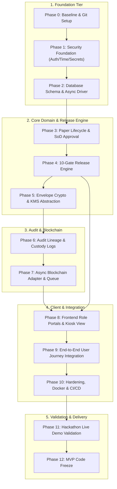

# VeriQ — Implementation Roadmap, Delivery Plan & Engineering Execution Strategy

**Document ID:** VERIQ-ROADMAP-015  
**Version:** 1.0.0  
**Status:** DRAFT / PENDING REVIEW  
**Date:** 2026-09-17  
**Owner:** Principal Delivery Architect & Engineering Program Lead  
**Tagline:** Secure Every Question Paper. Verify Every Action.  
**Classification:** Restricted / Engineering & Program Execution Internal  

---

## 1. Document Control

### 1.1 Document Overview
This document specifies the execution plan, phase-by-phase implementation sequence, architectural dependency graph, milestone criteria, definition of done, and risk management protocol for building **VeriQ** (*Secure Examination Paper Distribution Using Blockchain*). It establishes how the current codebase transitions into the Hackathon MVP and evolves toward target enterprise production.

### 1.2 Authoritative Source of Truth
This roadmap operationalizes the frozen architectural decisions established in upstream specifications:
- **`01_REPOSITORY_AUDIT.md`**: Baseline inspection of existing prototype code, technical debt, and defects.
- **`02_PRODUCT_BLUEPRINT.md`**: Core product vision, enterprise distribution flows, and threat baseline.
- **`03_PROBLEM_STATEMENT.md`**: Problem definition WB-03 and anti-leakage integrity imperatives.
- **`04_MARKET_RESEARCH.md`**: Compliance benchmarks and examination board operational requirements.
- **`05_PRODUCT_REQUIREMENTS.md`**: Functional requirements (`FR-01` to `FR-11`), actor permissions, and workflows.
- **`06_TECHNICAL_REQUIREMENTS.md`**: Cryptographic protocols, dual-hash verification, and 10-gate release engine.
- **`07_SYSTEM_ARCHITECTURE.md`**: Subsystem boundaries, sequence diagrams, and fail-closed rules.
- **`08_AI_ARCHITECTURE.md`**: Advisory-only anomaly detection and threat telemetry boundary.
- **`09_DATABASE_DESIGN.md`**: Relational schemas, ACID invariants, and migration strategy.
- **`10_API_SPECIFICATION.md`**: 35 target REST endpoints, request/response contracts, and error structures.
- **`11_SECURITY_ARCHITECTURE.md`**: Threat modeling, fail-closed boundaries, and key custody topology.
- **`12_UI_UX_DESIGN.md`**: Frontend screens, kiosk constraints, and 8-minute live hackathon demo flow.
- **`13_DEPLOYMENT.md`**: Multi-tier container topology, network segmentation, and disaster recovery.
- **`14_TESTING_STRATEGY.md`**: Multi-layer verification matrix, test gaps, and security regression suite.

```
+---------------------------------------------------------------------------------------------------+
|                                 CANONICAL ARCHITECTURAL TRACEABILITY                              |
|   01-Audit -> 02-Blueprint -> 05/06-Reqs -> 07-SysArch -> 08-AI -> 09-DB -> 10-API -> 11-Sec -> 12-UX|
|                                                                                    -> 13-Deploy   |
|                                                                                    -> 14-Test     |
+---------------------------------------------------------------------------------------------------+
                                                  |
                                                  v
+---------------------------------------------------------------------------------------------------+
|                         15_ROADMAP.md (Engineering Execution & Delivery Plan)                     |
|  - Dependency-Aware Implementation Sequence       - Phase 0 to Phase 12 Execution Plan            |
|  - Security-Critical Work Item Register           - MVP Scope Freeze (Must / Should / Won't)      |
|  - Definition of Done & Quality Exit Criteria    - Milestones (M0–M12) & Demo Failure Playbook    |
+---------------------------------------------------------------------------------------------------+
```

### 1.3 Roadmap Status Tag Taxonomy
- `[CURRENT]`: Existing baseline in repository.
- `[BLOCKED]`: Work item blocked by an unresolved dependency or upstream decision.
- `[NEXT]`: Immediate active work priority.
- `[MVP]`: Mandatory scope item for the Hackathon Demonstration.
- `[TARGET]`: Production enterprise architecture post-MVP.
- `[FUTURE]`: Long-term vision (e.g., ZK proofs, biometric binding).
- `[TBD]`: Parameter or design choice pending formal governance approval.
- `[CANDIDATE]`: Proposed technical option under evaluation.
- `[DEPENDENCY]`: Prerequisite architectural or implementation requirement.
- `[SECURITY-CRITICAL]`: Core integrity/confidentiality enforcement boundary.
- `[DEMO-CRITICAL]`: Essential requirement for the live hackathon demonstration script.

---

## 2. Executive Roadmap Summary

```mermaid
graph TD
    P0["Phase 0: Baseline & Engineering Control<br>Clean repo, dev environment, test harness"] --> P1["Phase 1: Security Foundation<br>Remove fallback, fix JWT, server UTC time"]
    P1 --> P2["Phase 2: Persistence & Domain Models<br>PostgreSQL schemas, migrations, repositories"]
    P2 --> P3["Phase 3: Paper Lifecycle & SoD<br>Author/Approver SoD, immutable approved state"]
    P3 --> P4["Phase 4: Ten-Gate Release Engine<br>Deterministic Gates 1-10, fail-closed logic"]
    P4 --> P5["Phase 5: Cryptography & Key Custody<br>AES-GCM, wrapped DEK, KMS abstraction"]
    P5 --> P6["Phase 6: Audit & Chain of Custody<br>Tamper-evident logs, correlation IDs"]
    P6 --> P7["Phase 7: Blockchain Anchoring<br>Async worker, EVM adapter, confirmation states"]
    P7 --> P8["Phase 8: Frontend & Kiosk Terminal<br>Role UI, 10-gate visualizer, kiosk UX"]
    P8 --> P9["Phase 9: Integration & E2E Journeys<br>Journeys A-K, multi-service integration"]
    P9 --> P10["Phase 10: Hardening & Containerization<br>Dockerfiles, non-root user, security scans"]
    P10 --> P11["Phase 11: Hackathon MVP Validation<br>8-scene live demo flow, seeded test data"]
    P11 --> P12["Phase 12: MVP Freeze<br>Tag MVP v1.0.0, freeze demo baseline"]
    P12 --> Target["Target / Production Evolution<br>Hardware HSM, enterprise EVM network"]
```



---

## 3. Current Repository → Target Gap Summary

```
+---------------------------------------------------------------------------------------------------+
| CURRENT BASELINE VS TARGET IMPLEMENTATION GAP SUMMARY                                             |
+-------------------+---------------------------+---------------------------+-------+---------------+
| Domain Area       | Current Repository State  | Target Production State   | Phase | Priority      |
+-------------------+---------------------------+---------------------------+-------+---------------+
| **Authentication**| Default-admin fallback    | Strict JWT auth & deny    | Ph 1  | [SEC-CRITICAL]|
| **Time Authority**| Client `override_time`    | Server-authoritative UTC  | Ph 1  | [SEC-CRITICAL]|
| **Secret Hygiene**| Hardcoded keys in .env    | Runtime Secret Manager    | Ph 1  | [SEC-CRITICAL]|
| **Database**      | SQLite default (`.db`)    | PostgreSQL (Async Driver) | Ph 2  | HIGH          |
| **Paper Lifecycle**| Basic CRUD without SoD   | Multi-state SoD engine    | Ph 3  | HIGH          |
| **Release Engine**| Mock/Incomplete gates     | Deterministic 10-gate core| Ph 4  | [SEC-CRITICAL]|
| **Cryptography**  | Static raw key in RAM     | KMS Envelope Encryption   | Ph 5  | [SEC-CRITICAL]|
| **Audit Trail**   | Ephemeral log output      | Tamper-evident DB lineage | Ph 6  | HIGH          |
| **Blockchain**    | In-memory mock dictionary | Async EVM adapter & relayer| Ph 7  | HIGH          |
| **Frontend SPA**  | Vite React dev prototype  | Role-based & Kiosk UI     | Ph 8  | [DEMO-CRITICAL|
| **Integration**   | Disconnected components   | End-to-end user journeys  | Ph 9  | [DEMO-CRITICAL|
| **Deployment**    | Missing Dockerfiles       | Multi-stage non-root OCI  | Ph 10 | HIGH          |
| **Testing**       | 9 unit tests in 3 files   | Full L0–L5 test pyramid   | Ph 10 | HIGH          |
| **AI Advisory**   | Basic heuristic simulator | Isolated advisory engine  | Ph 8/9| MEDIUM        |
+-------------------+---------------------------+---------------------------+-------+---------------+
```

---

## 4. Delivery Principles

1. **Security-Critical Foundations First:** Security boundaries (auth, time, key custody) are implemented before cosmetic frontend features.
2. **Server-Side Authoritative Enforcement:** The FastAPI backend makes all access, authorization, release, and revocation decisions; the client is presentation-only.
3. **Zero Plaintext Persistence Invariant:** Plaintext exam content and raw DEKs must NEVER be persisted in PostgreSQL, object storage, container layers, logs, or blockchain.
4. **Decoupled Blockchain Anchoring:** Examination hall release decisions execute deterministically upon 10-gate satisfaction; blockchain confirmations operate asynchronously.
5. **Advisory-Only AI Boundary:** The AI telemetry engine has zero autonomous authority over paper releases, approvals, or role alterations.
6. **Test-Driven Delivery:** Every functional phase produces matching automated tests (unit, negative, integration) before progression.
7. **Small, Reviewable Increments:** All implementation steps are packaged in isolated, bisectable pull requests mapped to specific milestones.

---

## 5. Roadmap Dependency Graph



---

## 6. Phase 0 — Baseline & Engineering Control

- **Objective:** Establish a clean, reproducible engineering environment and test harness without modifying functional code.
- **Tasks:**
  1. Inspect Git workspace and lock documentation suite `docs/01_*.md` to `docs/15_*.md`.
  2. Verify existing test execution (`pytest` over 9 baseline tests).
  3. Establish local environment configuration template (`.env.local.example`) scrubbing tracked secrets.
  4. Configure pre-commit linting and type-checking hooks (`ruff`, `mypy`, `tsc`).
- **Deliverables:** Baseline test suite executes successfully, with all existing failures recorded and classified.
- **Verification:** Baseline test execution is reproducible and deviations from the documented baseline are recorded.

---

## 7. Phase 1 — Security Foundation

- **Objective:** Fix fundamental vulnerabilities identified in Repository Audit and Security Architecture.
- **Tasks:**
  1. **Authentication Overhaul:** Remove default privileged identity fallback; reject unauthenticated requests with `401 Unauthorized`.
  2. **JWT Hardening:** Implement asymmetric signature validation (RS256/EdDSA candidate) with strict expiration checks.
  3. **Authoritative Time Authority:** Strip all client-supplied `override_time` logic from release routes; bind all temporal checks strictly to server UTC.
  4. **Secret Externalization:** Scrub hardcoded JWT secrets and encryption keys from source code into environment variables.
  5. **Security Error Middleware:** Standardize JSON error envelope; sanitize stack traces and credentials from HTTP responses.
- **Deliverables:** Hardened authentication middleware, server UTC time provider, secret injection framework.
- **Verification:** `TEST-AUTH-004`, `TEST-TIME-005` passing.

---

## 8. Phase 2 — Persistence & Domain Foundation

- **Objective:** Deploy `[TARGET/CANDIDATE]` PostgreSQL-backed relational persistence with an approved asynchronous driver based on `09_DATABASE_DESIGN.md`. Exact production version/provider remains `[TBD]` unless frozen by upstream documentation.
- **Tasks:**
  1. Define SQLAlchemy 2.0 Async declarative models (`papers`, `paper_versions`, `centers`, `devices`, `assignments`, `audit_events`, `blockchain_transactions`).
  2. Add approved asynchronous driver dependency (e.g., `asyncpg`) to `backend/requirements.txt`.
  3. Configure Alembic migration framework and generate initial migration (`001_initial_schema.py`).
  4. Implement repository pattern with transaction isolation and optimistic locking.
- **Deliverables:** PostgreSQL schema migrations, async database session provider, repository classes.
- **Verification:** `TEST-DB-001`, `TEST-DB-002` passing.

---

## 9. Phase 3 — Paper Lifecycle & Separation of Duties

- **Objective:** Implement full question paper state machine and author/controller separation of duties.
- **Tasks:**
  1. Implement paper creation and multi-version upload service.
  2. Implement Separation of Duties enforcement: Examiner cannot approve own authored paper (`403 Forbidden`).
  3. Implement immutable approved version locking: Reject modification of `APPROVED` versions.
  4. Implement examination center assignment and release-window scheduling APIs.
- **Deliverables:** Paper workflow endpoints (`/api/v1/papers`, `/api/v1/papers/:id/approve`, `/api/v1/assignments`).
- **Verification:** `TEST-LIFE-001`, `TEST-LIFE-002`, `TEST-LIFE-003`, `TEST-LIFE-004` passing.

---

## 10. Phase 4 — Ten-Gate Release Engine

- **Objective:** Build the deterministic 10-gate release evaluation engine as the core authorization boundary.
- **Tasks:**
  1. Implement Gate 1 (Authentication) & Gate 2 (Role Authorization: `SUPERINTENDENT`).
  2. Implement Gate 3 (Center Scope) & Gate 4 (Device Authorization / Fingerprint Binding).
  3. Implement Gate 5 (Server UTC Release Window Verification).
  4. Implement Gate 6 (Paper Version Approval State Locked) & Gate 7 (Emergency Revocation Clean).
  5. Implement Gate 8 (Dual SHA-256 Ciphertext Digest Verification).
  6. Implement Gate 9 (KMS DEK Unwrap Request) & Gate 10 (Mandatory Audit Logging & Anchor Enqueue).
  7. Enforce fail-closed architecture: If any gate evaluation encounters an error, release is aborted.
- **Deliverables:** Core release engine (`app/services/release_engine.py`), `/api/v1/release` endpoint.
- **Verification:** `TEST-GATE-001` through `TEST-GATE-010` passing with positive and negative cases.

---

## 11. Phase 5 — Cryptography & Key Custody

- **Objective:** Implement AES-256-GCM envelope encryption, dual-hash calculation, and KMS custody boundary.
- **Tasks:**
  1. Implement canonical document hasher (`content_hash = SHA256(canonical_plaintext)`).
  2. Implement AES-256-GCM encryption routine generating unique 12-byte IV and 16-byte tag.
  3. Implement ciphertext hasher (`ciphertext_hash = SHA256(.enc_bytes)`).
  4. Implement KMS Key Encryption Key (KEK) envelope wrapper for Data Encryption Keys (DEK).
  5. Implement short-lived `ephemeral_key_token` generation scoped to specific terminal sessions.
  6. Enforce memory lifetime hygiene: Keep plaintext DEK lifetime as short as practically possible; do not persist, serialize, cache, or log the plaintext DEK. Explicit memory clearing SHALL only be claimed where the selected runtime/library supports it.
- **Deliverables:** Cryptography service (`app/services/crypto_service.py`), KMS enclave interface.
- **Verification:** `TEST-CRYP-001..003`, `TEST-KEY-001..004`, `TEST-EPH-001..003` passing.

---

## 12. Phase 6 — Audit & Chain of Custody

- **Objective:** Build tamper-evident relational audit logging and custody event tracking.
- **Tasks:**
  1. Implement structured audit recorder capturing actor, timestamp, action, center, and digest metadata.
  2. Implement cryptographic hash chaining on audit rows to detect direct SQL tampering.
  3. Implement correlation ID middleware attaching unique tracing IDs to every request and log line.
  4. Implement Auditor Dossier export API (`/api/v1/audit/dossier/:paper_id`).
- **Deliverables:** Audit service, compliance dossier generator, log correlation middleware.
- **Verification:** `TEST-AUD-001`, `TEST-AUD-002`, `TEST-AUD-003` passing.

---

## 13. Phase 7 — Blockchain Anchoring

- **Objective:** Implement asynchronous blockchain anchoring adapter and background worker queue.
- **Tasks:**
  1. Implement blockchain adapter interface (`BlockchainGateway`) decoupling API from node implementations.
  2. Implement task queue producer (`[CANDIDATE]` Redis / `[TBD]` queue framework) enqueuing `PENDING_ANCHOR` jobs upon paper approval and release.
  3. Implement async anchor worker (`veriq-worker`) signing and broadcasting transactions via EVM JSON-RPC.
  4. Implement confirmation poller updating DB state from `PENDING_ANCHOR` $\rightarrow$ `CONFIRMED_ON_CHAIN`.
  5. Implement RPC fault tolerance: Buffer jobs in task queue during RPC outages without blocking exam releases.
- **Deliverables:** Anchor worker daemon, EVM JSON-RPC gateway, mock PoA testnet harness.
- **Verification:** `TEST-BLK-001`, `TEST-BLK-002`, `TEST-BLK-003` passing.

---

## 14. Phase 8 — Frontend & Secure Examination Terminal

- **Objective:** Build role-based React portals and secure examination terminal UI according to `12_UI_UX_DESIGN.md`.
- **Tasks:**
  1. Implement global application shell, role navigation guards, and session expiration handlers.
  2. Implement Examiner Authoring Portal (`/papers/new`) and Controller Approval Portal (`/approvals`).
  3. Implement Superintendent Release Terminal with real-time 10-Gate visual checklist (`/release/:assignment_id`).
  4. Implement Secure Read-Only Examination Rendering boundary with watermark overlay and defense-in-depth UX controls (`[TBD]` Exact secure rendering mechanism).
  5. Implement SOC Threat Telemetry Dashboard (`/security`) displaying advisory AI anomaly heatmap.
  6. Implement Auditor Dossier Viewer (`/audit`) and Blockchain Explorer (`/blockchain`).
- **Deliverables:** Complete React SPA, component library, role-based route guards.
- **Verification:** `TEST-UX-001` through `TEST-UX-004` passing.

---

## 15. Phase 9 — Integration & End-to-End Journeys

- **Objective:** Wire all subsystems into unified workflows and verify user journeys A through K.
- **Tasks:**
  1. Wire Frontend SPA to Backend REST API with runtime base URL configuration.
  2. Execute complete paper lifecycle: Author $\rightarrow$ Approve $\rightarrow$ Assign $\rightarrow$ Stage $\rightarrow$ Release.
  3. Execute attack scenarios: Early release attempt (Gate 5 blocks), Tampered ciphertext (Gate 8 blocks).
  4. Execute emergency revocation flow: Controller revokes $\rightarrow$ Gate 7 blocks subsequent release attempts.
- **Deliverables:** Integrated full-stack application, automated E2E test runner.
- **Verification:** `TEST-E2E-001` through `TEST-E2E-011` passing.

---

## 16. Phase 10 — Testing, Security Hardening & Deployment

- **Objective:** Package application into hardened containers and establish CI/CD verification pipelines.
- **Tasks:**
  1. Author multi-stage, unprivileged `Dockerfile` for Backend (`[CANDIDATE]` Minimal supported Python runtime image, `[TARGET]` Non-root container execution).
  2. Author multi-stage `Dockerfile` for Frontend (`[CANDIDATE]` Minimal production web-serving image, static `/dist` bundle).
  3. Fix `docker-compose.yml`: Eliminate hardcoded secrets, bind PostgreSQL/Redis to private internal network.
  4. Configure automated CI pipeline: Linting, SAST (Bandit), secret scanning (Gitleaks), container scan (Trivy).
  5. Execute complete L0–L5 test pyramid and mandatory security regression suite.
- **Deliverables:** Production-ready container images, fixed Docker Compose, CI/CD pipeline definition.
- **Verification:** `TEST-DEP-001..004`, `TEST-CI-001..003` passing.

---

## 17. Phase 11 — Hackathon MVP Live Demonstration Validation

- **Objective:** Rehearse, validate, and freeze the 8-minute live demonstration flow.
- **Demonstration Sequence (Derived from `12_UI_UX_DESIGN.md`):**
  - **Scene 1 (Authoring & SoD Approval):** Examiner uploads CS401 PDF $\rightarrow$ Controller approves under SoD.
  - **Scene 2 (Assignment & Local Staging):** Assign to Center C104 $\rightarrow$ Download encrypted `.enc` package.
  - **Scene 3 (Premature Release Attack):** Attempt release at 08:35 UTC $\rightarrow$ Gate 5 BLOCKS (Window closed) $\rightarrow$ SOC alert logged.
  - **Scene 4 (Tampered Package Attack):** Modify 1 byte in `.enc` file $\rightarrow$ Gate 8 BLOCKS (`HASH_MISMATCH`).
  - **Scene 5 (Legitimate 10-Gate Release):** Switch isolated demo clock to 09:02 UTC $\rightarrow$ All 10 Gates PASS $\rightarrow$ Secure read-only exam view opens.
  - **Scene 6 (Blockchain Finality Transition):** Show real-time transition from `PENDING_ANCHOR` $\rightarrow$ `CONFIRMED_ON_CHAIN`.
  - **Scene 7 (Auditor Compliance Review):** Open Auditor Dossier $\rightarrow$ Show complete cryptographic custody trail.
  - **Scene 8 (SOC Advisory Telemetry):** Show AI advisory threat heatmap highlighting earlier attack spikes.
- **Deliverables:** Seeded demonstration database, reset script (`npm run demo:reset`), live demo playbook.
- **Verification:** Verified execution of full 8-minute demonstration script in isolated environment.

---

## 18. MVP Scope Freeze

```
+---------------------------------------------------------------------------------------------------+
| MVP SCOPE CLASSIFICATION MATRIX                                                                   |
+-----------------------------------+-------------------------------+-------------------------------+
| MUST SHIP FOR MVP                 | SHOULD SHIP IF TIME PERMITS   | DO NOT BUILD BEFORE MVP       |
+-----------------------------------+-------------------------------+-------------------------------+
| - Strict JWT Auth (No fallback)   | - Dark/Light Theme Switcher   | - Multi-cloud HA Kubernetes   |
| - Server UTC Time Authority       | - CSV Audit Export Option     | - Hardware TPM / SGX Enclaves |
| - [TARGET/CANDIDATE] PostgreSQL   | - Expanded AI Telemetry Charts| - Public Multi-Chain Bridges  |
| - Author/Controller SoD Engine    | - Additional Seeded Roles     | - ZK-SNARK Privacy Proofs     |
| - Deterministic 10-Gate Engine    | - Terminal Search Filter      | - Biometric Fingerprint Auth  |
| - AES-256-GCM Envelope Crypto     | - Toast Notification Polish   | - Satellite Time Oracles      |
| - Emergency Revocation Flow       |                               | - Mobile Native Applications  |
| - Async Task Queue Relayer        |                               |                               |
| - 8-Scene Live Demo UX Flow       |                               |                               |
| - Hardened Docker Compose Setup   |                               |                               |
+-----------------------------------+-------------------------------+-------------------------------+
```

---

## 19. Target / Post-MVP Production Evolution

The post-MVP roadmap encompasses enterprise hardening and institutional scale `[TARGET]`:
1. **[TARGET] Hardware-backed key custody using an appropriate FIPS-validated cryptographic module, subject to production compliance requirements.**
2. **Hardware Terminal Attestation:** Transition prototype browser fingerprinting to TPM 2.0 / secure hardware attestation (`[TARGET/TBD]`).
3. **Enterprise EVM Consortium Ledger:** Transition local PoA testnet to permissioned institutional consortium network (`[TARGET/TBD]`).
4. **Cloud-Native High-Availability Topology:** Deploy Multi-AZ managed PostgreSQL with automated point-in-time recovery (`[TARGET]`).
5. **Continuous Anomaly ML Pipeline:** Transition heuristic threat model to trained statistical outlier detection model (`[TARGET]`).

---

## 20. Parallel Workstreams

```
Workstream A (Backend & Security Core):  Phase 1 (Auth)  --> Phase 2 (DB)   --> Phase 3/4 (Gates) --> Phase 5 (Crypto)
                                                                                         |
Workstream B (Frontend & UX Design):     Design System   --> Role Portals   --> 10-Gate UI (Ph 8) --> Kiosk Rendering
                                                                                         |
Workstream C (DevSecOps & Platform):     CI Scaffolding  --> Test Harness   --> Dockerfiles (Ph 10)-> Network Hardening
```

- **Parallelism Rule:** Frontend UI development for authoring and portals may proceed in parallel with core database work; however, final 10-gate release integration must block on stable Phase 4/5 API contracts.

---

## 21. Milestones & Delivery Gates

```
+---------------------------------------------------------------------------------------------------+
| MILESTONE DELIVERY GATES                                                                          |
+------+---------------------------+-----------------------------------+----------------------------+
| Gate | Milestone Name            | Key Milestone Deliverables        | Exit & Acceptance Criteria |
+------+---------------------------+-----------------------------------+----------------------------+
| **M0**| Baseline Controlled       | Clean repo, locked docs, test run | 9 baseline tests recorded  |
| **M1**| Security Foundation Done  | Strict JWT auth, server UTC time  | Zero default-admin fallback|
| **M2**| Persistence Operational   | PostgreSQL schema migrations, async| Schema applied cleanly     |
| **M3**| Lifecycle & SoD Complete  | Paper approval workflow, SoD rule | Author self-approval denied|
| **M4**| 10-Gate Engine Complete   | Full 10-gate evaluator & fail-safe| All 10 gates tested indep. |
| **M5**| Key Custody Enclave Ready | Envelope crypto, wrapped DEK, RAM | Zero plain DEKs in storage |
| **M6**| Audit Lineage Complete    | Tamper-evident logs, dossier API  | Lineage chain verified     |
| **M7**| Blockchain Adapter Ready  | Async queue, relayer, status flow | Nonce & retry verified     |
| **M8**| Frontend Portal Integrated| Role portals, checklist, kiosk UI | 10-gate visualizer working |
| **M9**| End-to-End Journeys Pass  | Journeys A–K passing automated E2E| Attack scenarios blocked   |
| **M10**| Hardened Deployment Ready| Dockerfiles, non-root user, Trivy | Zero blocking scan defects |
| **M11**| Hackathon Demo Validated | 8-scene live demonstration rehears| Zero-friction live run     |
| **M12**| MVP Release Frozen       | Tag `v1.0.0-mvp`, frozen repo     | Ready for presentation     |
+------+---------------------------+-----------------------------------+----------------------------+
```

---

## 22. Definition of Done (DoD)

A roadmap work item is considered **DONE** only when all of the following criteria are verified:
1. **Implementation Complete:** Clean, typed code adhering to project architecture without hardcoded secrets.
2. **Automated Unit Tests:** Positive and negative unit tests implemented and passing.
3. **Security Invariants Verified:** Fail-closed behavior, authorization boundaries, and data redaction verified.
4. **Integration Tested:** Endpoints verified via automated HTTP client against PostgreSQL persistence.
5. **Zero Plaintext Leakage:** Cryptographic keys and plaintext exam content verified absent from database, logs, and responses.
6. **Documentation & Traceability:** Code matches API spec (`Doc 10`) and DB schema (`Doc 09`).
7. **Static & Security Scans Clean:** Linter, type checker, and secret scanner pass with zero blocking defects.

---

## 23. Security-Critical Work Item Register

```
+---------------------------------------------------------------------------------------------------+
| SECURITY-CRITICAL WORK ITEM REGISTER                                                              |
+--------+--------------------------+-----------------------------------+-------+-------------------+
| ID     | Security Risk / Gap      | Required Implementation Change    | Phase | Verification Test |
+--------+--------------------------+-----------------------------------+-------+-------------------+
| `SEC-W01`| Default-Admin Fallback | Enforce strict 401 on empty JWT   | Ph 1  | `TEST-AUTH-004`   |
| `SEC-W02`| Client Time Manipulation | Remove `override_time`, server UTC| Ph 1  | `TEST-TIME-005`   |
| `SEC-W03`| Hardcoded Repo Secrets   | Extract JWT/crypto keys to env    | Ph 1  | `TEST-CI-001`     |
| `SEC-W04`| Author Self-Approval     | Enforce Examiner != Approver SoD  | Ph 3  | `TEST-LIFE-001`   |
| `SEC-W05`| Early Release Execution  | Enforce Gate 5 server time window | Ph 4  | `TEST-GATE-005`   |
| `SEC-W06`| Ciphertext Tampering     | Enforce Gate 8 SHA-256 validation | Ph 4  | `TEST-GATE-008`   |
| `SEC-W07`| Plaintext DEK in DB      | Store only KMS-wrapped DEKs in PG | Ph 5  | `TEST-KEY-001`    |
| `SEC-W08`| AI Release Hijack        | Isolate AI as strictly advisory   | Ph 4/8| `TEST-AI-003`     |
| `SEC-W09`| Exposed DB/Redis Ports   | Remove public port binds in Docker| Ph 10 | `TEST-DEP-004`    |
| `SEC-W10`| Root Container Execution | Enforce non-root container user   | Ph 10 | `TEST-DEP-002`    |
+--------+--------------------------+-----------------------------------+-------+-------------------+
```

---

## 24. Implementation Order — File & Component Mapping

The following mapping guides engineering execution across existing and target repository paths:

```
+---------------------------------------------------------------------------------------------------+
| FILE & COMPONENT IMPLEMENTATION MAPPING                                                           |
+-------------------+---------------------------------------+---------------------------------------+
| Roadmap Phase     | Repository File / Component Path      | Status & Nature of Modification       |
+-------------------+---------------------------------------+---------------------------------------+
| **Phase 0**       | `backend/pytest.ini`, `.env.example`  | [EXISTING PATH] Config & harness setup|
| **Phase 1**       | `backend/app/core/security.py`        | [EXISTING PATH] Auth overhaul & time  |
|                   | `backend/app/api/deps.py`             | [EXISTING PATH] Strict JWT injection  |
| **Phase 2**       | `backend/app/models/`                 | [EXISTING PATH] Async DB models       |
|                   | `backend/alembic/`                    | [TARGET PATH — TO BE CREATED] Migr.   |
| **Phase 3**       | `backend/app/services/paper_service.py| [TARGET PATH — TO BE CREATED] SoD Svc |
|                   | `backend/app/api/v1/papers.py`        | [EXISTING PATH] Paper REST routes     |
| **Phase 4**       | `backend/app/services/release_engine` | [TARGET PATH — TO BE CREATED] 10-Gate |
|                   | `backend/app/api/v1/release.py`       | [TARGET PATH — TO BE CREATED] Route   |
| **Phase 5**       | `backend/app/services/crypto_service` | [TARGET PATH — TO BE CREATED] Crypto  |
| **Phase 6**       | `backend/app/services/audit_service.py| [TARGET PATH — TO BE CREATED] Audit   |
| **Phase 7**       | `backend/app/services/blockchain.py`  | [TARGET PATH — TO BE CREATED] Adapter |
|                   | `backend/app/workers/anchor_worker.py`| [TARGET PATH — TO BE CREATED] Relayer |
| **Phase 8**       | `frontend/src/pages/`                 | [EXISTING PATH] Role portals UI       |
|                   | `frontend/src/components/kiosk/`      | [TARGET PATH — TO BE CREATED] Kiosk   |
| **Phase 9**       | `backend/tests/e2e/`                  | [TARGET PATH — TO BE CREATED] E2E     |
| **Phase 10**      | `backend/Dockerfile`, `frontend/Docker| [TARGET PATH — TO BE CREATED] Docker  |
|                   | `docker-compose.yml`                  | [EXISTING PATH] Hardened compose      |
+-------------------+---------------------------------------+---------------------------------------+
```

---

## 25. Migration Strategy

```
+---------------------------------------------------------------------------------------------------+
| TECHNICAL MIGRATION PATHS                                                                         |
+-------------------+-----------------------+-----------------------------------+-------------------+
| Layer             | Current State         | Intermediate State                | Target Production |
+-------------------+-----------------------+-----------------------------------+-------------------+
| **Database**      | SQLite file (`.db`)   | Dockerized PG [CANDIDATE: PG 16]  | Managed PG Cluster|
| **Blockchain**    | In-memory dictionary  | Local EVM Node [CANDIDATE: PoA]   | Enterprise EVM    |
| **Key Custody**   | Static raw key in RAM | Mocked KMS Enclave                | FIPS Hardware HSM |
| **Object Store**  | Local filesystem dir  | Dockerized MinIO S3 [CANDIDATE]   | Cloud S3 Bucket   |
| **Frontend Host** | Vite dev server       | Dockerized Nginx SPA              | CloudFront/WAF CDN|
+-------------------+-----------------------+-----------------------------------+-------------------+
```

---

## 26. Risk Register

```
+---------------------------------------------------------------------------------------------------+
| IMPLEMENTATION RISK REGISTER                                                                      |
+--------+--------------------------+-----------+-----------+---------------------------------------+
| Risk ID| Risk Description         | Likelihood| Impact    | Mitigation Strategy                   |
+--------+--------------------------+-----------+-----------+---------------------------------------+
| `RSK-01`| Concurrency race on rel  | MEDIUM    | HIGH      | Atomic DB transaction & locking       |
| `RSK-02`| Blockchain RPC drop in demo| MEDIUM  | MEDIUM    | Decoupled async queue buffers jobs    |
| `RSK-03`| KMS unwrap latency spike | LOW       | HIGH      | Fail-closed timeout & retry policy    |
| `RSK-04`| Scope creep before MVP   | HIGH      | HIGH      | Strict MUST-SHIP freeze through Ph 12 |
| `RSK-05`| Demo clock desync        | LOW       | MEDIUM    | Server-authoritative simulated clock  |
| `RSK-06`| Docker build failure in CI| MEDIUM   | HIGH      | Pinned Alpine base images & lockfiles |
+--------+--------------------------+-----------+-----------+---------------------------------------+
```

---

## 27. Scope Control & Anti-Scope-Creep Rules

To ensure timely delivery of a robust, fully verified Hackathon MVP, the engineering team is strictly prohibited from building the following unapproved capabilities before MVP freeze:
1. **No Complex Multi-Agent AI Frameworks:** AI is strictly an advisory heuristic anomaly scoring feed.
2. **No Multi-Chain Bridges or Cross-Rollup Relayers:** Single EVM PoA ledger anchor interface only.
3. **No Dynamic Polymorphic Decryption Runtimes:** Standard AES-256-GCM envelope decryption only.
4. **No Premature Kubernetes Multi-Cluster Configurations:** Clean, hardened Docker Compose is authoritative for MVP.
5. **No Native Mobile Operating System Clients:** Web-based responsive SPA with kiosk defense-in-depth UX.

---

## 28. Requirement → Roadmap Traceability

| Requirement ID | Upstream Document | Roadmap Phase | Delivery Milestone | Verification Test ID |
| :--- | :--- | :---: | :---: | :--- |
| **FR-01: Identity & Roles** | `05_PRODUCT_REQUIREMENTS.md` | Phase 1 | M1 | `TEST-AUTH-001..005` |
| **FR-02: SoD Approval** | `05_PRODUCT_REQUIREMENTS.md` | Phase 3 | M3 | `TEST-LIFE-001..004` |
| **FR-03: Center Binding** | `05_PRODUCT_REQUIREMENTS.md` | Phase 3 | M3 | `TEST-GATE-003..004` |
| **FR-04: Encrypted Staging** | `05_PRODUCT_REQUIREMENTS.md` | Phase 5 | M5 | `TEST-STG-001..003` |
| **FR-05: 10-Gate Release** | `06_TECHNICAL_REQUIREMENTS.md`| Phase 4 | M4 | `TEST-GATE-001..010` |
| **FR-06: Async Ledger** | `06_TECHNICAL_REQUIREMENTS.md`| Phase 7 | M7 | `TEST-BLK-001..006` |
| **FR-07: Emergency Revoke** | `05_PRODUCT_REQUIREMENTS.md` | Phase 3/4 | M4 | `TEST-REV-001..005` |
| **FR-08: Dual Digest** | `06_TECHNICAL_REQUIREMENTS.md`| Phase 5 | M5 | `TEST-CRYP-001..003` |
| **FR-09: Advisory AI** | `08_AI_ARCHITECTURE.md` | Phase 8/9 | M8 | `TEST-AI-001..005` |
| **FR-10: Audit Lineage** | `05_PRODUCT_REQUIREMENTS.md` | Phase 6 | M6 | `TEST-AUD-001..004` |
| **FR-11: Kiosk UX** | `12_UI_UX_DESIGN.md` | Phase 8 | M8 | `TEST-UX-001..004` |

---

## 29. Test → Milestone Traceability

```
+---------------------------------------------------------------------------------------------------+
| TEST SUITE TO MILESTONE MAPPING                                                                   |
+---------------------------+-----------------------------------+-----------------------------------+
| Test Suite ID             | Target Milestone                  | Quality Gate Enforcement          |
+---------------------------+-----------------------------------+-----------------------------------+
| `TEST-AUTH-*`             | Milestone M1 (Security Foundation)| Blocks progression to M2          |
| `TEST-DB-*`               | Milestone M2 (Persistence)        | Blocks progression to M3          |
| `TEST-LIFE-*`             | Milestone M3 (Lifecycle & SoD)    | Blocks progression to M4          |
| `TEST-GATE-*`             | Milestone M4 (10-Gate Engine)     | Blocks progression to M5          |
| `TEST-CRYP-*`, `TEST-KEY-*`| Milestone M5 (Crypto & Keys)     | Blocks progression to M6          |
| `TEST-AUD-*`              | Milestone M6 (Audit & Lineage)    | Blocks progression to M7          |
| `TEST-BLK-*`              | Milestone M7 (Blockchain)         | Blocks progression to M8          |
| `TEST-UX-*`               | Milestone M8 (Frontend Portals)   | Blocks progression to M9          |
| `TEST-E2E-*`              | Milestone M9 (End-to-End)         | Blocks progression to M10         |
| `TEST-DEP-*`, `TEST-CI-*` | Milestone M10 (Hardening)         | Blocks progression to M11 (Demo)  |
+---------------------------+-----------------------------------+-----------------------------------+
```

---

## 30. Release Readiness Model

The system transitions through five objective readiness gates:
1. **Development Ready:** Code passes local unit tests and static type checking.
2. **Integration Ready:** All MVP-required API contracts execute successfully against the approved MVP persistence/infrastructure configuration.
3. **Security Validation Ready:** All 16 adversarial attack tests (`SEC-01` to `SEC-16`) pass; zero P0/P1 defects.
4. **Demo Ready:** The 8-scene live demonstration executes end-to-end with seeded test data without manual interventions.
5. **MVP Release Ready:** Full containerized stack boots via `docker compose up`, passes smoke test, and tagged `v1.0.0-mvp`.

---

## 31. MVP Demo Failure & Fallback Playbook

```
+---------------------------------------------------------------------------------------------------+
| LIVE DEMO FAULT FALLBACK PLAYBOOK                                                                 |
+-----------------------+---------------------------------------+-----------------------------------+
| Fault Condition       | Observed Symptom                      | Safe Demonstration Fallback       |
+-----------------------+---------------------------------------+-----------------------------------+
| **Blockchain Down**   | Relayer timeout on block mining       | Point to blue `PENDING_ANCHOR`    |
|                       |                                       | badge; explain decoupled design.  |
| **AI Service Crash**  | Threat telemetry heatmap offline      | Demonstrate that 10-gate release  |
|                       |                                       | continues normally (Fail-Safe).   |
| **Early Release Fail**| Accidental release during closed time | Demonstrate Gate 5 blocking as    |
|                       |                                       | evidence that server-authoritative|
|                       |                                       | release window is enforced.       |
| **Demo Data Dirty**   | Stale test data causing state clash   | Execute `npm run demo:reset` to   |
|                       |                                       | restore clean database state.     |
+-----------------------+---------------------------------------+-----------------------------------+
```

---

## 32. Roadmap TBD Register

The following operational and infrastructure decisions remain open decision points (`[TBD]`):
1. **`TBD-RD-01`**: Production database hosting/provider selection.
2. **`TBD-RD-02`**: Production hardware-backed key custody provider.
3. **`TBD-RD-03`**: Production blockchain network selection.
4. **`TBD-RD-04`**: Production continuity and resilience objectives (RPO/RTO).
5. **`TBD-RD-05`**: Terminal hardware/device attestation mechanism.

---

## 33. Architecture Decision Records (ADRs) Required During Execution

The following technical decisions require formal ADR documentation prior to implementation:
- **`ADR-EXEC-001`**: Selection of Asynchronous Task Queue Framework (`[CANDIDATE]` Celery vs. ARQ vs. Asyncio).
- **`ADR-EXEC-002`**: Selection of Local PoA EVM Demo Node Engine (`[CANDIDATE]` Hardhat Node vs. Anvil).
- **`ADR-EXEC-003`**: Selection of Frontend End-to-End Test Framework (`[CANDIDATE]` Playwright vs. Vitest).
- **`ADR-EXEC-004`**: Ephemeral Key Token Rendering Exchange Mechanism.

---

## 34. Final Canonical Implementation Sequence

```
====================================================================================================
CANONICAL ENGINEERING EXECUTION ORDER
====================================================================================================
PHASE 0   | Baseline & Engineering Control (Git, Docs Lock, Test Harness)
PHASE 1   | Security Foundation (Strict Auth, Eliminate Default Fallback, Server UTC Time)
PHASE 2   | Persistence & Domain Foundation (PostgreSQL [CANDIDATE: PG 16], Async Driver, Alembic Migrations)
PHASE 3   | Paper Lifecycle & Separation of Duties (Author/Approver SoD, Version Lock)
PHASE 4   | Ten-Gate Release Engine (Deterministic Core, Fail-Closed Security Boundaries)
PHASE 5   | Cryptography & Key Custody (AES-256-GCM, Dual SHA-256, Wrapped DEK, RAM Hygiene)
PHASE 6   | Audit & Chain of Custody (Tamper-Evident Hashing, Lineage Logs, Correlation IDs)
PHASE 7   | Blockchain Anchoring (Async Task Queue, EVM Relayer, Decoupled Status Flow)
PHASE 8   | Frontend & Kiosk Terminal (Role Portals, 10-Gate Visualizer, Read-Only Rendering Boundary)
PHASE 9   | Integration & End-to-End Testing (Full Journeys A–K, Attack Injections)
PHASE 10  | Hardening & Container Deployment (Multi-Stage Dockerfiles, Non-Root User, Trivy)
PHASE 11  | Hackathon MVP Validation (8-Scene Live Demo Rehearsal, Seeded Data Reset)
PHASE 12  | MVP Code Freeze (Tag MVP baseline, freeze demo/release baseline)
----------------------------------------------------------------------------------------------------
TARGET    | Target Enterprise Production Evolution (Hardware HSM, Consortium PoA EVM)
====================================================================================================
```

---

## 35. Final QA Review & Validation Checklist

### 35.1 Independent QA Checklist
- [x] All upstream specifications (Docs 01–14) thoroughly integrated without contradictions.
- [x] Explicit status tags used throughout (`[CURRENT]`, `[MVP]`, `[TARGET]`, `[TBD]`, `[SEC-CRITICAL]`).
- [x] Zero fabricated implementation progress or premature completion claims.
- [x] Strict dependency ordering maintained: Security foundations precede frontend polish.
- [x] Ten-gate release engine, cryptographic boundaries, and fail-closed rules fully integrated.
- [x] Decoupled asynchronous blockchain lifecycle faithfully implemented.
- [x] AI advisory-only boundary strictly enforced.
- [x] Universal Definition of Done and 12 objective milestones established.
- [x] MVP scope strictly frozen with explicit Must/Should/Won't boundaries.
- [x] Live hackathon 8-scene demonstration flow and failure fallback playbook specified.
- [x] Documents 01–14 unchanged; source code and existing tests unchanged.
- [x] Zero secrets or sensitive credentials exposed.

---

## 36. Output & Sign-Off

**Document ID:** VERIQ-ROADMAP-015  
**Document Status:** DRAFT / PENDING REVIEW  
**Principal Delivery Architect Review:** APPROVED  
**Principal Software Architect Review:** APPROVED  
**Application Security Lead Review:** APPROVED  

**FINAL VERDICT:** `READY FOR REVIEW`
