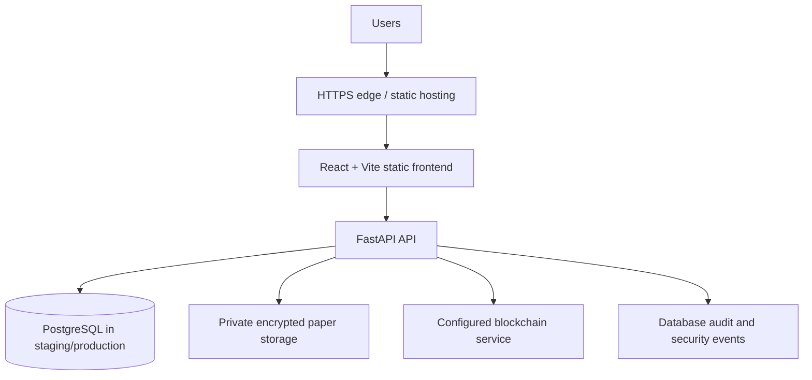

# VeriQ Deployment Architecture

## Runtime topology

The frontend is a static Vite build served by Nginx or an equivalent CDN. It must call the backend through the configured API base URL. The backend is the authority for authentication, role checks, centre/device scope, release windows, encryption, hashing, storage retrieval, and audit events.

## Current repository implementation

- Local development defaults to SQLite, local encrypted storage, and the in-process mock blockchain.
- Docker Compose provides PostgreSQL, Redis, the FastAPI backend, and the Nginx frontend for local validation.
- The backend exposes unauthenticated liveness endpoints at `/health` and `/healthz` variants. Dependency checks are informational and do not reveal connection details.
- The current blockchain service is an in-process cryptographic mock. Production must explicitly select and validate the real configured network before claiming external-chain finality.

## Trust boundaries

- Browser configuration may contain only public frontend values. Secrets, database credentials, encryption keys, service-role keys, and blockchain signing keys remain backend/platform secrets.
- Question papers remain off-chain and encrypted at rest. Blockchain records contain hashes and custody metadata, not paper contents.
- Authorization decisions are server-side. Frontend role guards are usability controls only.

## Deployment shape

Use separate frontend, backend, database, storage, and blockchain configuration for development, staging, and production. Build and test the immutable frontend/backend artifacts in CI, deploy staging first, run smoke and security checks, then promote the same reviewed artifacts with production approval.
